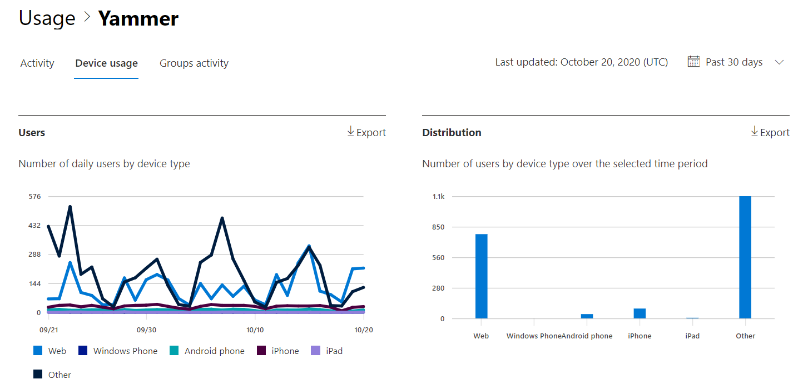
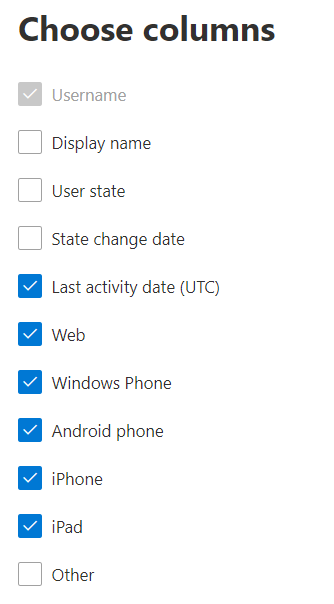

# Microsoft 365 Reports in the admin center - Yammer device usage report

The Microsoft 365 **Reports** dashboard shows you the activity overview across the products in your organization. It enables you to drill in to individual product level reports to give you more granular insight about the activities within each product. Check out [the Reports overview topic](activity-reports.md).
  
The Yammer device usage reports give you information about which devices your users are using Yammer on. You can view the number of daily users by device type, and number of users by device type. You can view both over a selected time period. You can also view details per user.
  
> [!NOTE]
> You must be a global administrator, global reader or reports reader in Microsoft 365 or an Exchange, SharePoint, Teams Service, Teams Communications, or Skype for Business administrator to see reports.  
 
## How do I get to the Yammer device usage report?

1. In the admin center, go to the **Reports** \> <a href="https://go.microsoft.com/fwlink/p/?linkid=2074756" target="_blank">Usage</a> page. 
2. From the dashboard homepage, click on the **View more** button on the Yammer card.
  
## Interpret the Yammer device usage report

You can view the usage in the OneDrive report by choosing the **Device usage** tab. 

Select **Choose columns** to add or remove columns from the report.    

You can also export the report data into an Excel .csv file by selecting the **Export** link. This exports data of all users and enables you to do simple sorting and filtering for further analysis. If you have less than 2000 users, you can sort and filter within the table in the report itself. If you have more than 2000 users, in order to filter and sort, you will need to export the data. 
  
|Item|Description|
|:-----|:-----|
|**Metric**|**Definition**|
|Username    |The email address of the user. You can display the actual email address or make this field anonymous. This grid shows users who logged into Yammer using the Microsoft 365 account or who logged into the network using single sign-on.   |
|Display name    |The full name of the user. You can display the actual email address or make this field anonymous.    |
|User state    |One of three values: Active, Deleted, or Suspended. These reports show data for active, suspended, and deleted users. They do not reflect pending users, because pending users cannot post, read, or like a message.     |
|State change date (UTC)    |The date on which the user's state was changed in Yammer.    |
|Last activity date (UTC)    |The last date (UTC) that the user participated in an Yammer activity.    |
|Web    |Indicates if the user has used Yammer on the web.    |
|Windows phone    | Indicates if the user has used Yammer on a Windows phone.    |
|Android phone    |Indicates if the user has used Yammer on an Android phone.  |
|iphone   | Indicates if the user has used Yammer on an iPhone.    |
|ipad    |Indicates if the user has used Yammer on an iPad.  |
|other    |Indicates if the user has used Yammer on another device, not listed previously.  |
|||