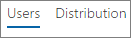
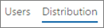
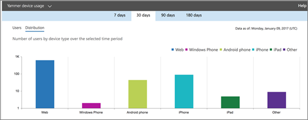

# Microsoft 365 Reports in the admin center - Yammer device usage report

The Microsoft 365 **Reports** dashboard shows you the activity overview across the products in your organization. It enables you to drill in to individual product level reports to give you more granular insight about the activities within each product. Check out [the Reports overview topic](activity-reports.md).
  
The Yammer device usage reports give you information about which devices your users are using Yammer on. You can view the number of daily users by device type, and number of users by device type. You can view both over a selected time period. You can also view details per user.
  
> [!NOTE]
> You must be a global administrator, global reader or reports reader in Microsoft 365 or an Exchange, SharePoint, or Skype for Business administrator to see reports. 
  
## How do I get to the Yammer device usage report?

1. In the admin center, go to the **Reports** \> <a href="https://go.microsoft.com/fwlink/p/?linkid=2074756" target="_blank">Usage</a> page.

    
2. From the **Select a report** drop-down, select **Yammer** \> **Device usage**.
  
## Interpret the Yammer activity report

You can get a view into your users' Yammer device usage by looking at the **Users** and **Distribution** charts. 
  
The device usage report contains the following information.
  
- Use the day tabs to view the **Yammer device usage** activity report trends over the last 7 days, 30 days, 90 days, or 180 days. However, if you select a particular day in the report, the table will show data for up to 28 days from the current date (not the date the report was generated). 
    
- Each report has a date for when the report was generated. The reports usually reflect a 24 to 48 hour latency from time of activity.
    
- You can view the **Users** chart to see the number of daily users by device type.  
  
- You can view the **Distribution** chart to see the number of users by device type.  
  
- The **Details** table under the graph shows you a breakdown of the Yammer device usage at the per-user level. 
    
    You can also add and remove columns. The available columns are:
    
  - **Username** is the email address of the user. You can display the actual email address or make this field anonymous. 
    
    This grid shows users who logged into Yammer using the Microsoft 365 account or who logged into the network using single sign-on.
    
  - **Display name** is the full name of the user. You can display the actual email address or make this field anonymous. 
    
  - **User state** is one of three values: Active, Deleted, or Suspended. 
    
    These reports show data for active, suspended, and deleted users. They do not reflect pending users, because pending users cannot post, read, or like a message.
    
  - **Web** indicates if the user has used Yammer on the web. 
    
  - **Windows phone** indicates if the user has used Yammer on a Windows phone 
    
  - **Android phone** indicates if the user has used Yammer on an Android phone. 
    
  - **iPhone** indicates if the user has used Yammer on an iPhone. 
    
  - **iPad** indicates if the user has used Yammer on an iPad. 
    
  - **Other** indicates if the user has used Yammer on another device, not listed previously. 
    
    If your organization's policies prevents you from viewing reports where user information is identifiable, you can change the privacy setting for all these reports. Check out the **How do I hide user level details?** section in the [Activity Reports in the Microsoft 365 admin center](activity-reports.md).
    
- You can also export the report data into an Excel .csv file, by selecting the **Export** link. This exports data of all users and enables you to do simple sorting and filtering for further analysis. If you have less than 2000 users, you can sort and filter within the table in the report itself. If you have more than 2000 users, in order to filter and sort, you will need to export the data. 
    

