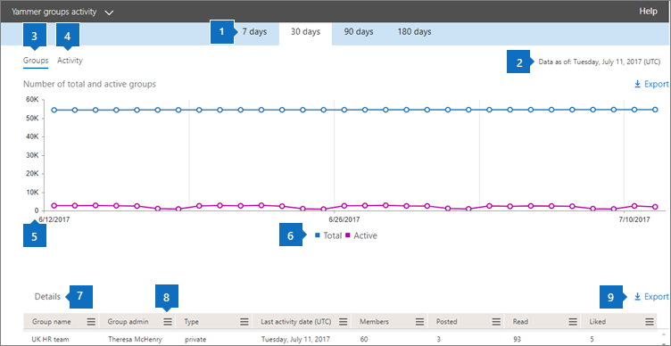
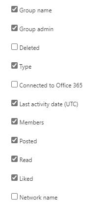

# Microsoft 365 Reports in the admin center - Yammer groups activity report

The Microsoft 365 **Reports** dashboard shows you the activity overview across the products in your organization. It enables you to drill in to individual product level reports to give you more granular insight about the activities within each product. Check out [the Reports overview topic](activity-reports.md). In the Yammer groups activity report, you can gain insights into the activity of Yammer groups in your organization and see how many Yammer groups are being created and used.
  
> [!NOTE]
> You must be a global administrator, global reader or reports reader in Microsoft 365 or an Exchange, SharePoint, Teams Service, Teams Communications, or Skype for Business administrator to see reports.  

## How to get to the Yammer groups activity report

1. In the admin center, go to the **Reports** \> <a href="https://go.microsoft.com/fwlink/p/?linkid=2074756" target="_blank">Usage</a> page.

    
2. From the **Select a report** drop-down, select **Yammer** \> **Groups activity**.
  
## Interpret the Yammer groups activity report

You can get a view into Yammer groups activity by looking at the **Groups** and **Activity** charts. 
  
|Item|Description|
|:-----|:-----|
|1.    |The **Yammer groups activity** report can be viewed for trends over the last 7 days, 30 days, 90 days, or 180 days. However, if you select a particular day in the report, the table (7) will show data for up to 28 days from the current date (not the date the report was generated).    |
|2.    |The data in each report usually covers up to the last 24 to 48 hours.   |
|3.    |The **Groups** view shows a total number of groups that existed , and how many performed group conversation activity.    |
|4.    |The **Activity** view shows you the number Yammer messages posted, read, and liked in groups.    |
|5.    | On the **Groups** chart, the Y axis is the count of total or active groups.     On the **Activity** chart, the Y axis is the count of specified activity for Yammer groups.     The X axis on all three charts is the selected date range for the specific report.    |
|6.    |You can filter the series you see on the chart by selecting an item in the legend. For example, on the **Groups** chart, select **Total** or **Active**   to see only the info related to each one. Changing this selection doesn't change the info in the grid table.    |
|7.    | The list of groups to show is determined by the set of all groups that existed (weren't deleted) across the widest (180-day) reporting time frame. The activity count (messages received) will vary according to the date selection.    NOTE: You might not see all the items in the list below in the columns until you add them. **Group name** is the name of the group.    **Group admin** is the name of the group administrator, or owner.    **Deleted** is the number of deleted Yammer groups. If the group is deleted, but had activity in the reporting period it will show up in the grid with this flag set to true.    **Type** is the type of group, public or private.    **Connected to Office 365** indicates whether the Yammer group is also an Microsoft 365 group.    **Last activity date** is the latest date a message was read, posted or liked by the group.    **Members** is the number of members in the group.    **Posted** is the number of messages posted in the Yammer group over the reporting period.    **Read** is the number of conversations read in the Yammer group over the reporting period.    **Liked** is the number of messages liked in the Yammer group over the reporting period.   **Network name** is the full name of the network that the group belongs to.    If your organization's policies prevents you from viewing reports where user information is identifiable, you can change the privacy setting for all these reports. Check out the **How do I hide user level details?** section in [Activity reports in the Microsoft 365 admin center](activity-reports.md).    |
|8.    |Select **Columns** to add or remove columns from the report.    |
|9.    |You can also export the report data into an Excel .csv file, by selecting the **Export** link. This exports data of all users and enables you to do simple sorting and filtering for further analysis. If you have less than 2000 users, you can sort and filter within the table in the report itself. If you have more than 2000 users, in order to filter and sort, you will need to export the data.    |
|||
   

