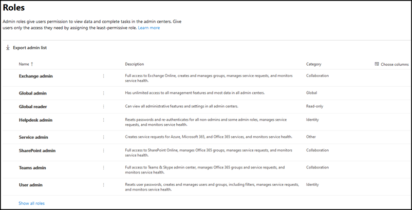
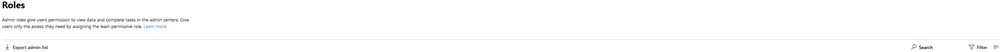
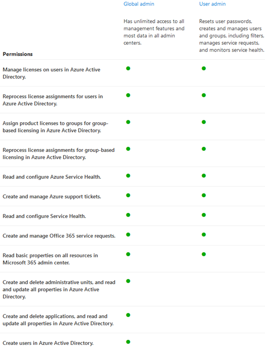

# Get started with the Microsoft 365 admin roles page

On the Roles page, you can give users permissions to do tasks in the admin centers. This helps your organization spread tasks to the appropriate people and helps keep your data secure.

> [!TIP]
> Looking for the detailed role descriptions? Check out [Azure AD built-in roles](/azure/active-directory/roles/permissions-reference) and [About admin roles](/microsoft-365/admin/add-users/about-admin-roles).

## About the admin roles page

You can export the admin list as well as search and filter by role.

- Use Export admin list to get a full list of all the admin users in your organization. The list is stored in an Excel .csv file.

- Use Search to search for an admin role and see your users who are assigned to that role.

- Use Filter to change your view of displayed admin roles.

## Get the most out of the roles

Read the content below to learn about the different admin roles and what tasks the roles can perform in your organization.

> [!NOTE]
This isn't an exhaustive list of all the permissions that these roles have. Select the **Learn more** link for more information about each role.

### Exchange admin

Assign the Exchange admin role to users who need to view and manage your user's email mailboxes, Microsoft 365 groups and Exchange Online. They can also open and manage support requests to Microsoft support. [Learn more](/microsoft-365/admin/add-users/about-exchange-online-admin-role)

### Global admin

Assign the global admin role to users who need global access to most management features and data across Microsoft online services. Giving too many users global access is a security risk and we recommend that you have between 2 and 4 Global admins. Only global admins can reset passwords for all user and add and manage domains. They can also open and manage support requests to Microsoft support. The person who signed up for Microsoft online services automatically becomes a global admin. [Learn more](/microsoft-365/admin/add-users/about-admin-roles#roles-available-in-the-microsoft-365-admin-center)

### Global reader

Assign the global reader admin role to user's who need to view admin features and settings in all admin centers that the global admin can view. The global reader admin role can't edit any settings. [Learn more](/microsoft-365/admin/add-users/about-admin-roles#roles-available-in-the-microsoft-365-admin-center)

### Helpdesk admin

Assign the Helpdesk admin role to users who want to reset passwords, force users to sign out for any security issues. They can also open and manage support requests to Microsoft support. The Helpdesk admin can only help non-admin users and users assigned these roles: Directory reader, Guest inviter, Helpdesk admin, Message center reader, and Reports reader. [Learn more](/microsoft-365/admin/add-users/about-admin-roles#roles-available-in-the-microsoft-365-admin-center)

### Service admin

Assign the service admin role to users who need to create support requests for Azure, Microsoft 365, and Office 365 services. [Learn more](/microsoft-365/admin/add-users/about-admin-roles#roles-available-in-the-microsoft-365-admin-center)

### SharePoint admin

When you purchase a Microsoft 365 subscription, a team site is automatically created, and the global admin is set as the primary site collection administrator. Assign the SharePoint admin role to users who you want to access to the <a href="https://go.microsoft.com/fwlink/?linkid=2185219" target="_blank">SharePoint admin center</a>. Users with the SharePoint admin role can create and manage site collections, designate site collection administrators and manage user profiles. Users with the SharePoint admin role can also manage Microsoft 365 groups and open support requests through Microsoft support. [Learn more](/sharepoint/sharepoint-admin-role)

### Teams service admin

Assign the Teams admin role to users who you want to access and manage the Teams & Skype admin center. Users with the Teams admin role can also manage Microsoft 365 groups and open support requests through Microsoft support. [Learn more](/MicrosoftTeams/using-admin-roles)

### User admin

Assign the user admin role to users who you want to access and manage user password resets and manage users and groups. They can also open and manage support requests to Microsoft support. [Learn more](/microsoft-365/admin/add-users/about-admin-roles#roles-available-in-the-microsoft-365-admin-center)

## Compare roles

You can now compare permissions for up to 3 roles at a time so you can find the least permissive role to assign.

In the admin center:

- Select up to 3 roles and choose **Compare roles** to see the permissions each role has.

## Related content

[About Microsoft 365 admin roles](about-admin-roles.md) (article)\
[Assign admin roles](assign-admin-roles.md) (article)
