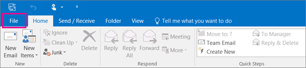
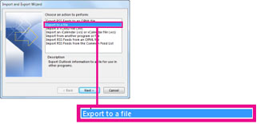
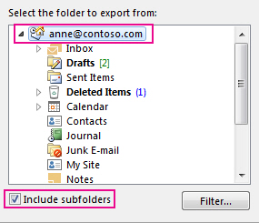
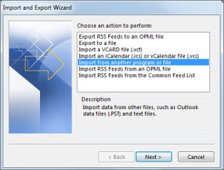

# Step 5 - Give another employee access to OneDrive and Outlook data

When an employee leaves your organization, you'll want to access their OneDrive and Outlook data, back it up, and choose whether to give it to another employee.
  
## Access a former user's OneDrive documents

If you remove a user's license but don't delete the account, you can give yourself access to the content in the user's OneDrive. If you delete the user's account, you have 30 days by default to access the former user's OneDrive data. [Learn how to set the OneDrive retention for deleted users](/onedrive/set-retention). If you don't [restore a user account](/office365/admin/add-users/restore-user) within this time, their OneDrive content is deleted.

To preserve a former user's OneDrive files, first give yourself access to their OneDrive, and then move the files you want to keep.

1. In the admin center, go to the **Users** \> <a href="https://go.microsoft.com/fwlink/p/?linkid=834822" target="_blank">Active users</a> page.  

2. Select a user.

3. On the user properties page, select **OneDrive**. Under **Get access to files**, select **Create link to files**.

4. Select the link to open the file location. Download the files to your computer, or select **Move to** or **Copy to** to move or copy them to your own OneDrive or to a shared library.

> [!NOTE]
> - You can move or copy up to 500 MB of files and folders at a time. 
> - When you move or copy documents that have version history, only the latest version is moved.
> - Administrative options for an active user under the OneDrive tab in the Microsoft 365 admin center are currently not supported for multi-geo tenants. 

You can also grant access to another user to access a former employee's OneDrive.

1. Sign in to the <a href="https://go.microsoft.com/fwlink/p/?linkid=2024339" target="_blank">admin center</a> as a global admin or SharePoint admin.

    If you get a message that you don't have permission to access the admin center, then you don't have administrator permissions in your organization.

2. In the left pane, select **Admin centers** \> **SharePoint**. (You might need to select **Show all** to see the list of admin centers.)

3. If the classic SharePoint admin center appears, select **Open it now** at the top of the page to open the SharePoint admin center.

4. In the left pane, select **More features**.

5. Under **User profiles**, select **Open**.

6. Under **People**, select **Manage User Profiles**.

7. Enter the former employee's name and select **Find**.

8. Right-click the user, and then choose **Manage site collection owners**.

9. Add the user to **Site collection administrators** and select **OK**.

10. The user will now be able to access the former employee's OneDrive using the OneDrive URL. 

### Revoke admin access to a user's OneDrive

You can give yourself access to the content in a user's OneDrive, but you may want to remove your access when you no longer need it.

1. Sign in to the <a href="https://go.microsoft.com/fwlink/p/?linkid=2024339" target="_blank">admin center</a> as a global admin or SharePoint admin.

    If you get a message that you don't have permission to access the admin center, then you don't have administrator permissions in your organization.

2. In the left pane, select **Admin centers** \> **SharePoint**. (You might need to select **Show all** to see the list of admin centers.)

3. If the classic SharePoint admin center appears, select **Open it now** at the top of the page to open the SharePoint admin center.

4. In the left pane, select **More features**.

5. Under **User profiles**, select **Open**.

6. Under **People**, select **Manage User Profiles**.

7. Enter the user's name and select **Find**.

8. Right-click the user, and then choose **Manage site collection owners**.

9. Remove the person who no longer needs access to the user's data, and then select **OK**.

## Access the Outlook data of a former user

To save the email messages, calendar, tasks, and contacts of the former employee, export the information to an Outlook Data File (.pst).
  
1. [Add the former employee's email](https://support.microsoft.com/office/6e27792a-9267-4aa4-8bb6-c84ef146101b) to your Outlook. (If you [reset the user's password](reset-passwords.md), you can set it to something only you know.)

2. In Outlook, select **File**.

    
  
3. Select **Open &amp; Export** \> **Import/Export**.

    
  
4. Select **Export to a file**, and then select **Next**.

    
  
5. Select **Outlook Data File (.pst)**, and then select **Next**.

6. Select the account you want to export by selecting the name or email address, such as Mailbox - Anne Weiler or anne@contoso.com. If you want to export everything in your account, including mail, calendar, contacts, tasks, and notes, make sure the **Include subfolders** check box is selected.

    > [!NOTE]
    > You can export one account at a time. If you want to export multiple accounts, after one account is exported, repeat these steps.
  
    
  
7. Select **Next**.

8. Select **Browse** to select where to save the Outlook Data File (.pst). Type a  *file name*, and then select **OK** to continue.

    > [!NOTE]
    > If you've used export before, the previous folder location and file name appear. Type a *different file name* before selecting **OK**.
  
9. If you are exporting to an existing Outlook Data File (.pst), under **Options**, specify what to do when exporting items that already exist in the file.

10. Select **Finish**.

Outlook begins the export immediately unless a new Outlook Data File (.pst) is created or a password-protected file is used.
  
- If you're creating an Outlook Data File (.pst), an optional password can help protect the file. When the **Create Outlook Data File** dialog box appears, type the *password* in the **Password** and **Verify Password** boxes, and then select **OK**. In the **Outlook Data File Password** dialog box, type the *password*, and then select **OK**.

- If you're exporting to an existing Outlook Data File (.pst) that is password protected, in the **Outlook Data File Password** dialog box, type the *password*, and then select **OK**.

See how to [Export or backup email, contacts, and calendar to an Outlook .pst file](https://support.microsoft.com/office/14252b52-3075-4e9b-be4e-ff9ef1068f91) in Outlook 2010.

  > [!NOTE]
  > By default, your email is available offline for a period of 12 months. If required, see how to [increase the data available offline](/outlook/troubleshoot/mailboxes/only-subset-items-synchronized).

### Give another user access to a former user's email

To give access to the email messages, calendar, tasks, and contacts of the former employee to another employee, import the information to another employee's Outlook inbox.

> [!NOTE]
> You can also [convert the former user's mailbox to a shared mailbox](/office365/admin/email/convert-user-mailbox-to-shared-mailbox) or [forward a former employee's email to another employee](/office365/admin/add-users/remove-former-employee#forward-a-former-employees-email-to-another-employee-or-convert-to-a-shared-mailbox).

1. In Outlook, go to **File** \> **Open &amp; Export** \> **Import/Export**.

    This starts the Import and Export Wizard.

2. Select **Import from another program or file**, and then select **Next**.

    
  
3. Select **Outlook Data File (.pst)**, and select **Next**.

4. Browse to the .pst file you want to import.

5. Under **Options**, choose how you want to deal with duplicates.

6. Select **Next**.

7. If a password was assigned to the Outlook Data File (.pst), enter the password, and then select **OK**.

8. Set the options for importing items. The default settings usually don't need to be changed.

9. Select **Finish**.

> [!NOTE]
> The steps remain the same for accessing an existing user's OneDrive and email data.

> [!TIP]
> If you want to import or restore only a few items from an Outlook Data File (.pst), you can open the Outlook Data File. Then, in the navigation pane, drag the items from Outlook Data File folders to your existing Outlook folders.

## Related content

[Add and remove admins on a OneDrive account](/sharepoint/manage-user-profiles#add-and-remove-admins-for-a-users-onedrive) (article)

[Restore a deleted OneDrive](/onedrive/restore-deleted-onedrive) (article)

[OneDrive retention and deletion](/onedrive/retention-and-deletion) (article)

[Share OneDrive files and folders](https://support.microsoft.com/office/share-onedrive-files-and-folders-9fcc2f7d-de0c-4cec-93b0-a82024800c07)
