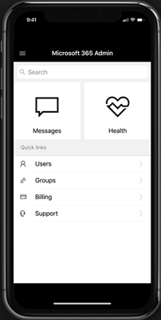

# About the Microsoft 365 admin mobile app

Are you an admin who's usually on the go? Then check out the [Microsoft 365 Admin app](https://go.microsoft.com/fwlink/?LinkID=627216). You can use the app to manage your online organization from your phone or tablet. You can get the app from the Apple Store, and from Google Play.   

The admin app is a feature-rich app that has over 80 features to help you manage your org when you can't get to a computer. Here's a list of just a few of the tasks you can do from the app:

- Get service health and change notifications
- Create a service request
- Reset a user's password
- Assign licenses
- Add or remove group memberships
- Add users 

And if you're someone who is responsible for more than one online organization, you sign in to multiple orgs and quickly switch between them. 
  
> [!IMPORTANT]
> If you're having trouble using the Admin mobile app on iOS or Android, email us at [feedback365@microsoft.com](mailto:feedback365@microsoft.com) to let us know. 
  
## Download the admin mobile app

[Microsoft 365 Admin mobile app](https://go.microsoft.com/fwlink/?LinkID=627216).
  
Watch a short video about installing the admin mobile app.  

> [!VIDEO https://www.microsoft.com/videoplayer/embed/05c1d439-9ec2-415f-9178-250f64dec64c] 

If you found this video helpful, check out the [complete training series for small businesses and those new to Microsoft 365](https://support.microsoft.com/office/6ab4bbcd-79cf-4000-a0bd-d42ce4d12816).

 
## Frequently asked questions

Below are answers to some frequently asked questions people ask about the app.
  
### What do I need to do to be able to use the app?

You need to have a valid Microsoft 365 Apps for business or Microsoft 365 Business Premium subscription with admin privileges to sign in and use the app. The Admin mobile app isn't an email client. It's a rich administrative app with over 80 features to help you support your org while your on the go.
  
### Can I use the app with my Microsoft 365 Family subscription?

No, the app only works with Microsoft 365 Apps for business and Microsoft 365 Business Premium subscriptions. 
  
### Will the app work if my organization has directory synchronization enabled?

Yes, but with reduced functionality. You'll be able to sign in and view service information, but most of the user management functions will be read-only. You won't be able to add, edit, or delete users. However, you'll be able to assign licenses to users in your organization, and get notifications.
  
### What languages are supported by the app?

The app supports all 39 languages that the web-based Microsoft 365 admin center supports. To change the language, select the app launch icon in the upper bar and choose **Settings** > **Language**.
  
### Why does the Messages tile on the Home screen show numbers even after I've read the new messages?

The numbers are the total messages from the last week, not unread messages.
  
### How can I share the Service Incidents and Messages with the rest of my organization?

If you select a specific service incident or a message, the share option will be in the top right corner. We currently support email sharing.
  
### Can I use this app with multiple accounts or tenants?

Yes, you can setup multiple accounts or tenants.
  
### My app is acting funny. What can I do to troubleshoot weird app behavior?

You can try some common mobile app troubleshooting steps:
  
1. Close and reopen the app.
    
2. Uninstall and reinstall the app.

3. If that doesn't work, you can email us at [feedback365@microsoft.com](mailto:feedback365@microsoft.com) to let us know.
    
### What do I do if my question isn't answered?

Email [feedback365@microsoft.com](mailto:feedback365@microsoft.com) to report an issue with the app. Or you can give feedback at the bottom of this article. 
  
## See also

[Microsoft 365 for business training videos](https://support.microsoft.com/office/6ab4bbcd-79cf-4000-a0bd-d42ce4d12816)
