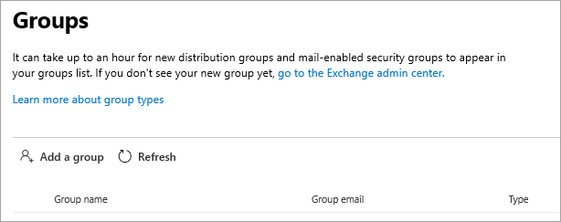

<!-- The following is just placeholder text from Madhura's mail. We need to add images/examples of each -->

# How to get help in the Microsoft 365 admin center

If you're an admin, [admin.microsoft.com](https://admin.microsoft.com) is your go-to place to manage and make the most of your Microsoft 365 subscription. Sometimes you might not find the right task, need more context before embarking on a task flow, or simply might not be sure of the scope and impact of your actions as an admin. To cover those situations, we provide modern help and intelligent assistance throughout the Microsoft 365 admin center in these ways:

* **Integrated help** - help in the admin center

* **Intelligent assistance** - self-help powered by AI

* **Guides and articles** - comprehensive content on the web

## Integrated help

Help is integrated throughout the admin center, so it's right there when you need it. At the top of many pages, you'll find inline help text that provides an informational overview of the task at hand, as well as links to articles that let you quickly find official documentation for more in-depth learning.

## Modern self-help powered by AI

To open our modern self-help experience that’s powered by artificial intelligence, select the **Need Help** button in the Microsoft 365 admin center. For example, if you search for "verify my domain", you'll get the steps plus a few articles that we think will help you. We use machine learning to surface the closest solution that has helped other admins who have entered similar queries.

Or, for those times when you don't quite know how to get something done in your specific situation, use the Support Assistant. Currently, this experience is available only in English. To turn on Support Assistant, just use the toggle at the top of the **Need Help** pane. The Support Assistant provides a conversational interface to help you. After you enter your query, the chatbot asks clarifying questions to get you to the right answer for your specific situation. Think of it as your virtual helper to discover solutions and complete tasks.

Of course, sometimes questions are best answered by humans. If our modern self-help doesn't have the answer, you always have the option to contact our support agents.

## Guides and articles

Additionally, if you're looking for comprehensive deployment guides, quick step-by-step procedures, or PowerShell cmdlets, look us up on the web. We update content frequently and try to provide you with the latest information. Check out our articles and guides on the [Microsoft 365 Documentation](../../index.yml) site.