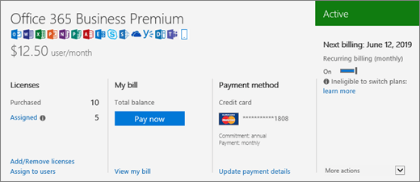

# What subscription do I have?

If you're an admin, you can verify which subscriptions your organization has by going to the admin center.
  
 **Not an admin?** See [What Office 365 business product or license do I have?](https://support.office.com/article/f8ab5e25-bf3f-4a47-b264-174b1ee925fd.aspx)

::: moniker range="o365-worldwide"

> [!NOTE]
> If you're not using the new Microsoft 365 admin center, you can turn it on by selecting the **Try the new admin center** toggle located at the top of the Home page.

1. In the admin center, go to the **Billing** \> <a href="https://go.microsoft.com/fwlink/p/?linkid=842054" target="_blank">Products & services</a> page.

2. Your subscriptions are displayed on the **Products & services** page, together with the subscription name, information about the subscription, and its status. To see a condensed view, select **Table view**.

::: moniker-end
  

::: moniker range="o365-germany"

1. In the admin center, go to the **Billing** \>  <a href="https://go.microsoft.com/fwlink/p/?linkid=847745" target="_blank">Subscriptions</a> page.

2. If you have only one subscription, it will be displayed on the **Subscriptions** page, along with the subscription name, information about the subscription, and its status. In the following screenshot, you can see that I have an Office 365 Business subscription.

    
  
3. If you have multiple subscriptions, you'll see a column next to the detailed subscription information that lists the subscriptions that have been purchased, as well as any trial subscriptions. By default, the subscription at the top of the list is automatically selected, and the detailed information for that subscription is shown.

    If you have multiple subscriptions, choose the one for which you want to see detailed information. The subscription card will update with information about that subscription.

    
  
    > [!NOTE]
    > If you have subscriptions that have expired or have been disabled, they'll be listed based on their current state.

::: moniker-end

::: moniker range="o365-21vianet"

1. In the admin center, go to the **Billing** \>  <a href="https://go.microsoft.com/fwlink/p/?linkid=850626" target="_blank">Subscriptions</a> page.

2. If you have only one subscription, it will be displayed on the **Subscriptions** page, along with the subscription name, information about the subscription, and its status. In the following screenshot, you can see that I have an Office 365 Business subscription.

    
  
3. If you have multiple subscriptions, you'll see a column next to the detailed subscription information that lists the subscriptions that have been purchased, as well as any trial subscriptions. By default, the subscription at the top of the list is automatically selected, and the detailed information for that subscription is shown.

    If you have multiple subscriptions, choose the one for which you want to see detailed information. The subscription card will update with information about that subscription.

    
  
    > [!NOTE]
    > If you have subscriptions that have expired or have been disabled, they'll be listed based on their current state.

::: moniker-end

## Related articles
  
[Subscriptions and billing](../subscriptions-and-billing/subscriptions-and-billing.md)