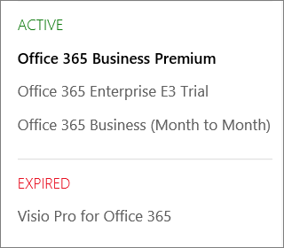

# What subscription do I have?

If you're an admin, you can verify which subscriptions your organization has by going to the admin center.
  
 **Not an admin?** See [What Microsoft 365 for business product or license do I have?](https://support.microsoft.com/office/f8ab5e25-bf3f-4a47-b264-174b1ee925fd)

::: moniker range="o365-worldwide"

1. In the admin center, go to the **Billing** \> <a href="https://go.microsoft.com/fwlink/p/?linkid=842054" target="_blank">Your products</a> page.
2. On the **Products** tab, you see all your subscriptions. Each subscription line includes information about licenses, subscription status, and billing.
3. If you want to change the columns that appear in the list, select **Choose columns**. Change the selection of columns, then select **Save**.
4. To see more details for a single subscription, select that subscription.

::: moniker-end
  
::: moniker range="o365-germany"

1. In the admin center, go to the **Billing** \>  <a href="https://go.microsoft.com/fwlink/p/?linkid=847745" target="_blank">Subscriptions</a> page.

2. If you have only one subscription, it will be displayed on the **Subscriptions** page, along with the subscription name, information about the subscription, and its status. In the following screenshot, you can see that I have an Microsoft 365 Apps for business subscription.

    
  
3. If you have multiple subscriptions, you'll see a column next to the detailed subscription information that lists the subscriptions that have been purchased, as well as any trial subscriptions. By default, the subscription at the top of the list is automatically selected, and the detailed information for that subscription is shown.

    If you have multiple subscriptions, choose the one for which you want to see detailed information. The subscription card will update with information about that subscription.

    
  
    > [!NOTE]
    > If you have subscriptions that have expired or have been disabled, they'll be listed based on their current state.

::: moniker-end

::: moniker range="o365-21vianet"

1. In the admin center, go to the **Billing** \>  <a href="https://go.microsoft.com/fwlink/p/?linkid=850626" target="_blank">Subscriptions</a> page.

2. If you have only one subscription, it will be displayed on the **Subscriptions** page, along with the subscription name, information about the subscription, and its status. In the following screenshot, you can see that I have an Microsoft 365 Apps for business subscription.

    
  
3. If you have multiple subscriptions, you'll see a column next to the detailed subscription information that lists the subscriptions that have been purchased, as well as any trial subscriptions. By default, the subscription at the top of the list is automatically selected, and the detailed information for that subscription is shown.

    If you have multiple subscriptions, choose the one for which you want to see detailed information. The subscription card will update with information about that subscription.

    
  
    > [!NOTE]
    > If you have subscriptions that have expired or have been disabled, they'll be listed based on their current state.

::: moniker-end

## Related articles
  
[Subscriptions and billing](../../commerce/index.yml)