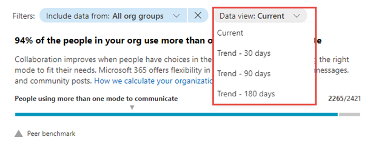

# Mobility insights score – People experiences

Adoption Score provides insights into your organization's digital transformation journey through its use of Microsoft 365 and the technology experiences that support it. Your organization's score reflects people and technology experience measurements and can be compared to benchmarks from organizations similar to yours. The mobility category is part of the people experiences measures. To learn more, check out the [Adoption Score overview](adoption-score.md) and read [Microsoft's Privacy Statement](https://privacy.microsoft.com/privacystatement).

## Prerequisites

To get started with Mobility insights, people in your organization need to be licensed for:

- Microsoft Teams
- Exchange Online
- Word
- Excel
- PowerPoint
- OneNote

For more information, see [assign licenses to users](../manage/assign-licenses-to-users.md).

After people have been active in the above products at least once in the last 28 days, you will start to see the insights.

## Why your organization&#39;s mobility score matters

A fundamental pillar of organizational productivity is how well people are able to work flexibly from wherever they are. With Microsoft 365, people can stay connected with Outlook, Microsoft Teams, and Viva Engage. People can also seamlessly collaborate on content by using Word, Excel, PowerPoint, and OneNote from any location, and platforms.

## How we calculate the score

We provide a primary insight in the experience that contains the key metrics for this category. Then, a scoring framework detailed below is used for these metrics to calculate your organization's score.

### Primary insight

Microsoft 365 lets people work flexibly across apps, including Microsoft Outlook, Word, Excel, PowerPoint, OneNote, Microsoft Teams, Viva Engage, and Skype for Business. People can also work from anywhere by using a seamless experience across desktop, web, and mobile platforms. The primary insight looks at the products that are enabled for people in your organization – and how many of these people are active on at least two platforms.

:::image type="content" source="../../media/primary-mobility.png" alt-text="Chart showing primary insight for Mobility - people experiences Adoption Score.":::

1. **Header:** Shows the percentage of people in your org who have access to any of Microsoft 365 Apps, and who are active on at least one of these applications on more than one platform.
2. **Body:** Provides more information on how the use of these applications on multiple platforms can promote efficiency and satisfaction.
3. **Visualization (current state):** Shows how many people use more than one platform across desktop, mobile, and web for at least one Microsoft 365 (list below) as follows:
    - **Horizontal bar** where the blue (colored) portion represents the percentage expressed in the header.
    - **The fraction** on the bar highlights the (numerator/denominator) used for calculating the percentage in the header.
        - Numerator: The number of people in your org using any application within Microsoft Outlook, Word, Excel, PowerPoint, OneNote and Microsoft Teams, Viva Engage, and Skype on more than one platform from desktop, web, and mobile in the last 28 days.
        - Denominator: The number of people licensed for Microsoft 365 Apps, Exchange, Viva Engage, Microsoft Teams, or Skype for at least 1 of the last 28 days.
    - The **peer benchmark** value for the key metric is also shown as a percentage.
4. **View Mobility resources:** Select this link to view help content.

#### Trend visualization of the primary insight

:::image type="content" source="../../media/mobility-primary.png" alt-text="Chart showing number of people who use more than one platform vs. time.":::

This chart shows the trend-line, where the numerator is the number of people who have used apps, over the last 180 days. Each data point on the line chart is an aggregate of activity for the last 28 days. Each data point provides a count of all people in your org using an application across at least two platforms in the last 28 days for each date on the x-axis.

### Scoring framework

The mobility score for your organization measures at an organization (aggregate) level whether people are using Microsoft 365 Apps - Outlook, Teams, Word, Excel, PowerPoint, OneNote, Viva Engage, and Skype - across the different platforms - desktop, web, and mobile.

The scores are not provided at the individual user level.

## Explore how your org works across platforms and locations

We also provide you with information that helps you gain visibility into how people in your organization work across platforms. These additional metrics do not directly contribute to your Adoption Score, but help you create an action plan as part of your digital transformation.  

### Use of Outlook across platforms

:::image type="content" source="../../media/outlook-across-platforms.png" alt-text="Chart that shows how many people are using Outlook on multiple platforms.":::

1. **Header:** Shows the percentage of people active on Outlook who are using Outlook on multiple platforms.
2. **Body:** Provides information about the value of using Outlook on mobile devices to help stay connected from anywhere on email.
3. **Visualization:** Shows the percentage of people who are active on Outlook and are using either one or more than one platform:
      - **Multiple platforms:**
        - Numerator: The number of people who have used Outlook on at least two platforms from desktop, mobile, or web in the last 28 days.
        - Denominator: The number of people who have used Outlook at least once in the last 28 days.
      - **Desktop only:**
        - Numerator: The number of people who have used Outlook on only a desktop platform in the last 28 days.
        - Denominator: The number of people who have used Outlook at least once in the last 28 days
      - **Web only:**
        - Numerator: The number of people who have used Outlook on only a web platform in the last 28 days.
        - Denominator: The number of people who have used Outlook at least once in the last 28 days.
      - **Mobile only:**
        - Numerator: Number of people who have used Outlook on only a mobile platform in the last 28 days.
        - *Denominator: Number of people who have used Outlook at least once in the last 28 days.

### Use of Teams across platforms

:::image type="content" source="../../media/teams-across-platforms.png" alt-text="Chart that shows how many people are using Teams on more than one or single platform.":::

1. **Header:** Shows what percentage of people who are active on Microsoft Teams are using it on multiple platforms.
2. **Body:** Provides information about the value of using Teams on mobile devices to help people stay up to date on messages while working from any location.
3. **Visualization:** Shows the percentage of people active on Microsoft Teams who are using it on either a single platform, or multiple ones: 
    - **Multiple platforms:**
        - Numerator: The number of people who have used Teams in the last 28 days on 2 or more of the following platforms: desktop, mobile, or web.
        - Denominator: The number of people who have used Microsoft Teams at least once in the last 28 days.
    - **Desktop only:**
        - Numerator: The number of people who have used Microsoft Teams only on a desktop platform in the last 28 days
        - Denominator: The number of people who have used Teams at least once in the last 28 days
    - **Web only:**
        - Numerator: The number of people who have used Microsoft Teams only on a web platform in the last 28 days
        - Denominator: The number of people who have used Microsoft Teams at least once in the last 28 days
    - **Mobile only:**
        - Numerator: The number of people who have used Microsoft Teams only on a mobile platform in the last 28 days
        - Denominator: The number of people who have used Teams at least once in the last 28 days

### Use of Microsoft 365 Apps across platforms

:::image type="content" source="../../media/microsoft365apps-platforms.png" alt-text="Chart that shows number of people who use Microsoft 365 apps on multiple or single platforms.":::

1. **Header:** Shows the percentage of people active on Microsoft 365 Apps (Word, Excel, PowerPoint, and OneNote) on multiple platforms.
2. **Body:** Provides information about the value of providing people in your organization the flexibility to access their files from anywhere.
3. **Visualization:** The grouped vertical is meant to represent the number of people who are using each of the apps considered–Word, Excel, PowerPoint, and OneNote — across single or multiple platforms. For each of these applications, bars represent the following:
      - **Multiple platforms:** The number of users active on an app across at least two platforms in the last 28 days.
      - **Desktop only:** The number of users active on app on only the desktop platform in the last 28 days.
      - **Web only:** The number of users active on app on only the web platform in the last 28 days.
      - **Mobile only:** The number of users active on app on only mobile platform in the last 28 days.

### Remote work

:::image type="content" source="../../media/remotework-trend.png" alt-text="Chart that shows how many people are working remotely, on-site, or both.":::

1. **Header:** Shows the percentage of people working only from home or location outside of their company's network.
2. **Body:** Highlights the importance of facilitating remote work for people without access to your organization's physical offices.
3. **Visualization:** Shows trend-line for daily percentage of people who only work remotely as well as daily percentage of people who also work onsite. Users are considered onsite if they perform at least three hours of activity in Microsoft 365 Apps in a day.

## View mobility trends over time

For each of the insights above, you can see how the metrics trend over time by selecting an option from the dropdown shown below:

After you select an option, the charts in the report will update to show a trend over time rather than a snapshot of the past month. 

## Related content

[Microsoft 365 apps health – Technology experiences](apps-health.md) (article)\
[Communication – People experiences](communication.md) (article)\
[Content collaboration – People experiences](content-collaboration.md) (article)\
[Meetings – People experiences](meetings.md) (article)\
[Privacy controls for Adoption Score](privacy.md) (article)\
[Teamwork – People experiences](teamwork.md) (article)
