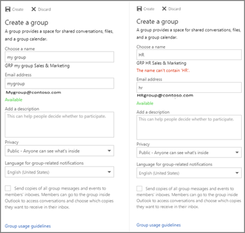
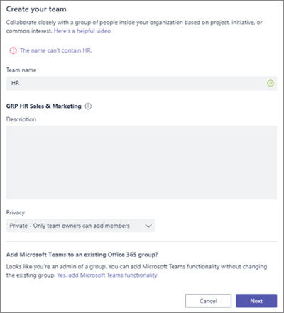
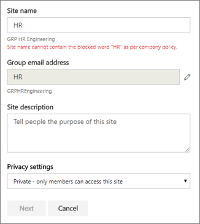
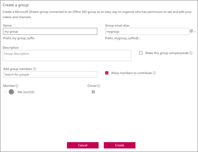
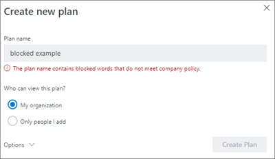
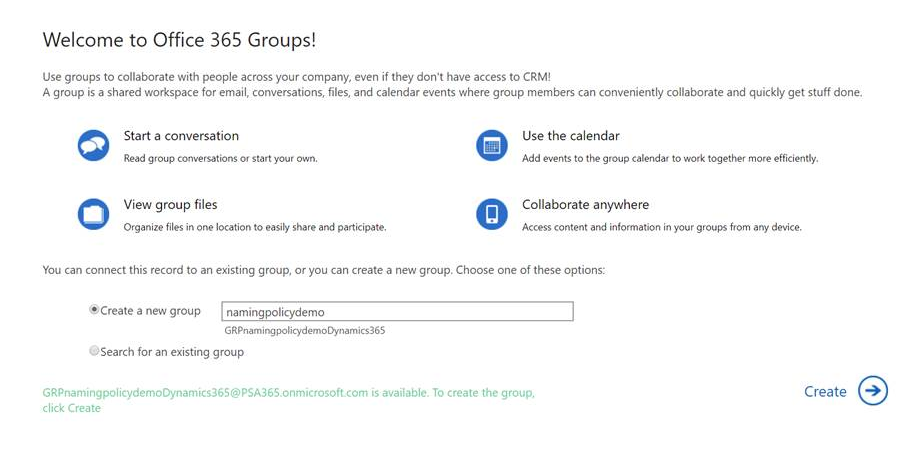

# Office 365 Groups naming policy

You use a group naming policy to enforce a consistent naming strategy for groups created by users in your organization. A naming policy can help you and your users identify the function of the group, membership, geographic region, or who created the group. The naming policy can also help categorize groups in the address book. You can use the policy to block specific words from being used in group names and aliases.

The naming policy is applied to groups that are created across all groups workloads (like Outlook, Microsoft Teams, SharePoint, Planner, Yammer, etc). It gets applied to both the group name and group alias. It gets applied when a user creates a group and when group name or alias is edited for an existing group.

> [!TIP]
> An Office 365 group naming policy only applies to Office 365 Groups. It doesn't apply to distribution groups created in Exchange Online. To create a naming policy for distribution groups, see [Create a distribution group naming policy](https://docs.microsoft.com/exchange/recipients-in-exchange-online/manage-distribution-groups/create-group-naming-policy).

The group naming policy consists of the following features:

- **Prefix-Suffix naming policy**: You can use prefixes or suffixes to define the naming convention of groups (for example: "GRP\_US\_My Group\_Engineering"). The prefixes/suffixes can either be fixed strings or user attributes like [Department] that will get substituted based on the user who is creating the group.

- **Custom Blocked Words**: You can upload a set of blocked words specific to their organization that would be blocked in groups created by users. (For example: "CEO, Payroll, HR").

## Licensing requirements

Using Azure AD naming policy for Office 365 groups requires that you possess but not necessarily assign an Azure Active Directory Premium P1 license or Azure AD Basic EDU license for each unique user (including guests) that is a member of one or more Office 365 groups.
This is also required for the administrator that creates the Groups naming policy.

## Prefix-Suffix naming policy

Prefixes and suffixes can either be fixed strings or user attributes.

### Fixed strings

You can use short strings that can help you differentiate groups in the GAL and Left nav of the group workloads. Some of the common prefixes suffixes are Keywords like 'Grp\_Name' , '\#Name', '\_Name'

### Attributes

You can use attributes that can help identify who created the group like [Department] and where it was created from like [Country].

|||
|:-----|:-----|
|**Examples**|Policy = "GRP [GroupName] [Department]"|
||User's department = Engineering|
||Created group name = "GRP My Group Engineering"|

Supported Azure Active Directory (Azure AD) attributes are [Department], [Company], [Office], [StateOrProvince], [CountryOrRegion], [Title]

- Unsupported user attributes are considered as fixed strings. E.g. "[postalCode]"

- Extension attributes and custom attributes aren't supported.

It's recommended that you use attributes that have values filled in for all users in your organization and don't use attributes that have longer values.

### Things to look out for

- During policy creation, the total prefixes and suffixes string length is restricted to 53 characters.

- Prefixes and suffixes can contain special characters supported in group name and group alias. When the prefixes and suffixes contain special characters that are not allowed in the group alias, they are removed and applied to the group alias. So in this case, the prefixes and suffixes applied to group name would be different from the ones applied to the group alias.

- If you are using Yammer Office 365 connected groups, avoid using the following characters in your naming policy: @, \#, \[, \], \<, and \>. If these characters are in the naming policy, regular Yammer users will not be able to create groups.

## Custom blocked words

You can enter a comma separated list of blocked words that will be blocked in group names and aliases.

The blocked words check is done on the user entered group name. So if user enters 'darnit' and 'Prefix\_' is the naming policy, 'Prefix\_darnit' will fail.

No sub-string searches are carried out; specifically, an exact match between the user entered name and the custom blocked words is required to trigger a failure. Sub-string search isn't done so that users can use some of the common words like 'Class' even if 'ass' is a blocked word.

**Things to look out for**:

- The blocked words are case-insensitive.

- When a user enters a blocked word, the group client will show an error message with the blocked word.

- There are no character restrictions in the blocked words used.

- There is an upper limit of 5000 words that can be set as blocked words.

## Admin override

Selective administrators are exempted from these policies, across all group workloads and endpoints, so that they can create groups with these blocked words and with their desired naming conventions. The following are the list of administrator roles exempted from the group naming policy.

- Global admin

- Partner Tier 1 Support

- Partner Tier 2 Support

- User account admin

- Directory writers

## How to set up the naming policy

To set up a naming policy:

1. In [Azure Active Directory](https://aad.portal.azure.com), under **Manage**, click **Groups**.
2. Under **Settings**, click **Naming policy**.
3. Choose the **Group naming policy** tab.
4. Under **Current policy**, choose if you want to require a prefix or suffix or both, and select the appropriate check boxes.
5. Choose between **Attribute** and **String** for each line and then specify the attribute or string.
6. When you have added the prefixes and suffixes that you need, click **Save**.

## Naming policy experiences across Office 365 apps

The Office 365 apps have been updated to show a preview of the naming policy group name (with prefixes and suffixes) when the user types in the group name and alias. When the user enters blocked words, they'll see an error message so they can remove the blocked words.

## Outlook on the web

Outlook on the web (formerly known as Outlook Web App or OWA) shows the naming policy decorated name when the user types a group name or group alias. When an user enters a custom blocked word, an error message is shown in the UI along with the blocked word so that the user can remove it. Outlook on the web experience snapshots are shown below.

## Outlook Desktop

Groups created in Outlook desktop are compliant with naming policy. Outlook desktop app doesn't yet show the preview of the naming policy and doesn't return the custom blocked word errors, when the user enters the group name. However, naming policy will be automatically applied on selecting create/edit and users will be presented with errors if there are custom blocked words in the group name or alias.

## Microsoft Teams

Microsoft Teams shows the naming policy decorated name when the user types a team name. When a user enters a custom blocked word, an error message is shown along with the blocked word so that the user can remove it.

## SharePoint

SharePoint shows the naming policy name when the user types a site name or group email address. When an user enters a custom blocked word, an error message is shown, along with the blocked word so that the user can remove it.

## Microsoft Stream

Microsoft Stream shows the naming policy decorated name when the user types a group name or group email alias. When an user enters a custom blocked word, an error message is shown with the blocked word so the user can remove it.

## Outlook iOS and Android App

Groups created in Outlook apps are compliant with naming policy. Outlook mobile shows the naming policy preview when entering the Group name. When a user enters a custom blocked word, an error message is shown on creating the group, so the user can remove the blocked word.

## Planner

Planner is compliant with naming policy. Planner shows the naming policy preview when entering the Plan name. When a user enters a custom blocked word, an error message is shown on creating the plan, so the user can remove the blocked word.

## Dynamics 365 for Customer Engagement

Dynamics 365 for Customer Engagement is compliant with naming policy. Dynamics 365 shows the naming policy decorated name when the user types a group name or group email alias. When the user enters a custom blocked word, an error message is shown with the blocked word so the user can remove it.

## School Data Sync (SDS)

Groups created through SDS comply with naming policy, but the naming policy isn't applied automatically. SDS administrators have to append the prefixes and suffixes to class names for which groups need to be created and then upload to SDS. Groups creation/edit would fail otherwise.

## Outlook Customer Manager (OCM)

Outlook Customer Manager is compliant with naming policy. The naming policy gets automatically applied to the group created in Outlook Customer Manager. If any of the words within "All Sales Team" is defined as a custom blocked word, the group creation in OCM will be blocked. The user will not be able to create the OCM group and will be blocked from using the OCM app."

## Classroom App

Groups created in classroom app comply with naming policy, but the naming policy isn't applied automatically, and the naming policy preview isn't shown to the users while entering a classroom group name. So users would have to enter the decorated classroom group name with prefixes and suffixes. Otherwise the classroom group create or edit will fail with errors.

## Power BI

Groups created in Power BI workspaces comply with the naming policy, but the naming policy isn't applied automatically. And, the naming policy preview isn't shown to users when they enter a Power BI workspace name.

The recommended name - with the naming policy applied - is shown in the error details on create or edit workspaces. This means users have to enter the decorated workspace name with prefixes and suffixes. Otherwise the workspace create or edit will fail with errors.

## Yammer

When a user signed in to Yammer with their Azure Active Directory account creates a group or edits a group name, the group name will comply with naming policy. This applies both to Office 365 connected groups and all other Yammer groups.

If an Office 365 connected group was created before the naming policy is in place, the group name will not automatically follow the naming policies. When a user edits the group name, they will be prompted to add the prefix and suffix.

If the naming policy includes characters that can't be in Yammer group names, only admins will be able to create a connected group in Yammer.

## StaffHub

StaffHub teams do not follow the naming policy, but the underlying Office 365 group does. StaffHub team name does not apply the prefixes and suffixes and does not check for custom blocked words. But StaffHub does apply the prefixes and suffixes and removes blocked words from the underlying Office 365 group.

## Exchange PowerShell

Exchange PowerShell cmdlets are compliant with naming policy. Users will get appropriate error messages with suggested prefixes and suffixes and for custom blocked words if naming convention isn't used in the group names and group alias.

## Azure Active Directory PowerShell cmdlets

Azure Active Directory PowerShell cmdlets are compliant with naming policy. Users will get appropriate error messages with suggested prefixes and suffixes and for custom blocked words if naming convention isn't used in the group names and group alias.

## Exchange admin center

The Exchange admin center (EAC) is compliant with naming policy. On create or edit actions, users will get appropriate error messages with suggested prefixes and suffixes and for custom blocked words if naming convention isn't used in the group names and group alias.

## Microsoft 365 admin center

The Microsoft 365 admin center is compliant with naming policy. On create or edit actions, naming policy will automatically get applied. Users will get appropriate errors when they enter custom blocked words. The Microsoft 365 admin center doesn't yet show the preview of the naming policy and doesn't return the custom blocked word errors, when the user enters the group name.

## Azure Active Directory portal

The Azure Active Directory portal is compliant with naming policy. Azure Active Directory portal shows the naming policy preview when entering the Group name. When a user enters a custom blocked word, an error message is shown on creating the group, so the user can remove the blocked word.

## More articles on naming policy

[Enforce a naming policy for Office 365 groups in Azure Active Directory](https://go.microsoft.com/fwlink/?linkid=868340)

[Azure Active Directory cmdlets for configuring group settings](https://go.microsoft.com/fwlink/?linkid=868341)
