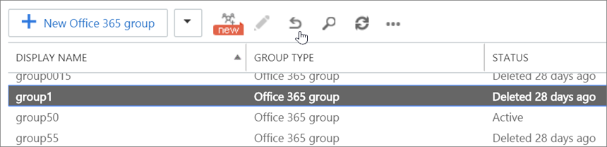

# Restore a deleted Office 365 Group

If you are the owner of an Office 365 group, you can restore the group yourself by following these steps.

1. On the [deleted groups page](https://outlook.office.com/people/group/deleted), select the **Manage groups** option under the **Groups** node, and then choose **Deleted**.
2. Click on the **Restore** tab next to the group you want to restore.

If the deleted group doesn't appear here, contact an administrator.
  
If you're a user who wants to restore an Office 365 group, ask an administrator to do these steps for you or contact your help desk.  
   
If you've deleted a group, it will be retained for 30 days by default. This 30-day period is considered a "soft-delete" because you can still restore the group. After 30 days, the group and its associated contents are permanently deleted and cannot be restored.
  
During the "soft-delete" period, if a user tries to access the site they will get a 404 _forbidden_ message. After this period, if a user tries to access the site, they will get a 404 _not found_ message.
  
When a group is restored, the following content is restored:
  
- Azure Active Directory (AD) Office 365 groups object, properties, and members.
    
- Group's e-mail addresses.
    
- Exchange Online shared Inbox and calendar.
    
- SharePoint Online team site and files.
    
- OneNote notebook
    
- Planner
    
- Teams

- Yammer group and group content (If the Office 365 group was created from Yammer)
    
You can also [Permanently delete an Office 365 group](#permanently-delete-an-office-365-group) if you can't wait the 30 days for the retention period to expire for the content to be permanently deleted. 

> [!NOTE]
> The owner of the deleted Office 365 group is also able to restore the group. To restore an office 365 group using owner permission without administrator permission, see [Restore an Office 365 Group using PowerShell](#restore-an-office-365-group-using-powershell).

## Restore an Office 365 Group using the Exchange admin center

You must have Office 365 global administrator permissions.

1. Go to the <a href="https://go.microsoft.com/fwlink/p/?linkid=2059104" target="_blank">Exchange admin center</a>.
    
2. In the Exchange admin center, select **recipients**, and then choose **groups**. You can view whether the group is Active or soft-deleted. If the group has been permanently deleted, it won't be listed at all.
  
3. To view the exact time when the group was soft-deleted, select the group and view the info in the right pane.
      
4. Select the group you want to restore, and then select the restore icon.
    
    
  
5. Select refresh  to update the information on the page. Your group will show as Active. Any forms and form data associated with your group will also be restored.
    
## Restore an Office 365 Group using PowerShell

You must have Office 365 global administrator permissions, or be a former owner of the deleted Office 365 group.

> [!IMPORTANT]
> If you use Remove-MsolGroup in PowerShell to delete a group, this will delete the group permanently. When using PowerShell to delete groups, it's best practice to use **Remove-AzureADMSGroup** to soft-delete the Office 365 group. That way you can restore it if needed. 
  
### Install the preview version of the Azure Active Directory PowerShell for Graph

> [!IMPORTANT]
> You cannot install both the preview and GA versions on the same computer at the same time.
  
As a best practice, we recommend *always* staying current, i.e. uninstall the old AzureADPreview or old AzureAD version and get the latest one. 
  
 
1. In your search bar, type Windows PowerShell.
    
2. Right-click on **Windows PowerShell** and select **Run as Administrator**.
  
2. Review your installed modules:
    
  ```
  Get-InstalledModule -Name "AzureAD*"
  ```

3. To uninstall a previous version of AzureADPreview or AzureAD, run this command:
  
```
   Uninstall-Module AzureADPreview
```

or
  
```
   Uninstall-Module AzureAD
```

4. To install the latest version of AzureADPreview, run this command:
  
```
   Install-Module AzureADPreview
```


At the message about an untrusted repository, type **Y**. It will take a minute or so for the new module to install.
  
### Restore the deleted group
  
1. Did you install the **AzureADPreview** module, as instructed in the previoius section "Install the preview version of the Azure Active Directory Module for Windows PowerShell"?  Not having the most current **preview** version is the #1 reason these steps don't work for people. 
    
2. If you haven't already, open a Windows PowerShell window on your computer (it doesn't matter if it's a normal Windows PowerShell window, or one you opened by selecting **Run as administrator**).
    
3. Run the following commands by pressing **Enter** after each one: 
    
  ```
  Import-Module AzureADPreview
  ```

  ```
  Connect-AzureAD
  ```


  On the **Sign in to your Account** screen that opens, enter your administrative account user name and password to connect you to your Azure AD service, and select **Sign in**.
  
4. Run this command to display all soft-deleted Office 365 groups in your organization that are still within the 30 day soft-deletion period:
    
  ```
  Get-AzureADMSDeletedGroup
  ```

5. Take note of the object ID of the group, or groups, you want to restore. If you don't see the group you're looking for on this list then it has likely been permanently purged already.
    
    > [!CAUTION]
    > If a new group has been created with the same alias or SMTP address as your deleted group, you will have to delete that new group before you'll be able to restore your deleted group. 
  
6. To restore that group, run this command:
    
  ```
  Restore-AzureADMSDeletedDirectoryObject -Id <objectId>
  ```

7. This process usually takes just a few minutes but in a few rare cases it can take as long as 24 hours to be completely restored. To verify that the group has been successfully restored, run this command in PowerShell:
    
  ```
  Get-AzureADGroup -ObjectId <objectId>
  ```

Once the restore has successfully completed, the group should reappear on the navigation pane in Outlook and Outlook on the web. All restored content, including SharePoint and Planner, should be available to the group members again.
  
## Permanently delete an Office 365 group

Sometimes you may want to permanently purge a group without waiting for the 30 day soft-deletion period to expire. To do that, start PowerShell and run this command to get the object ID of the group:
  
```
Get-AzureADMSDeletedGroup
```

Take note of the object ID of the group, or groups, that you want to permanently delete.
  
> [!CAUTION]
> Purging the group removes the group and its data forever. 
  
To purge the group run this command in PowerShell:
  
```
Remove-AzureADMSDeletedDirectoryObject -Id <objectId>
```

To confirm that the group has been successfully purged, run the  *Get-AzureADMSDeletedGroup*  cmdlet again to confirm that the group no longer appears on the list of soft-deleted groups. In some cases it may take as long as 24 hours for the group and all of its data to be permanently deleted. 
  
## Got questions about Office 365 Groups?

Visit the [Microsoft Tech Community](https://techcommunity.microsoft.com/t5/Office-365-Groups/ct-p/Office365Groups) to post questions and participate in conversations about Office 365 Groups. 
  
## Related articles

[Manage Office 365 Groups with PowerShell](https://support.office.com/article/aeb669aa-1770-4537-9de2-a82ac11b0540)
  
[Delete groups using the Remove-UnifiedGroup cmdlet](https://technet.microsoft.com/library/mt238270%28v=exchg.160%29.aspx)
  
[Manage your group-connected team site settings](https://support.office.com/article/8376034d-d0c7-446e-9178-6ab51c58df42.aspx)
  
[Delete a group in Outlook](https://support.office.com/article/ca7f5a9e-ae4f-4cbe-a4bc-89c469d1726f.aspx)
