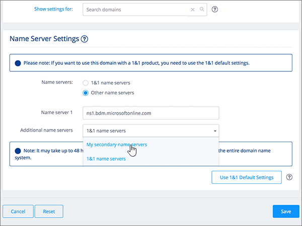
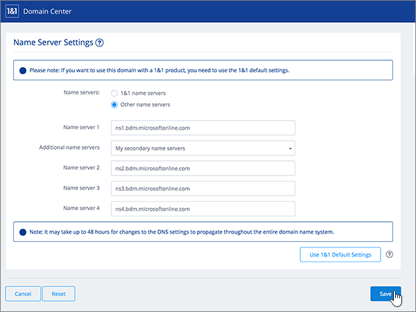

# Change nameservers to set up Microsoft 365 with 1&1 IONOS

 **[Check the Domains FAQ](../setup/domains-faq.yml)** if you don't find what you're looking for. 
  
Follow these instructions if you want Microsoft 365 to manage your Microsoft 365 DNS records for you. (If you prefer, you can [manage all your Microsoft 365 DNS records at 1&1 IONOS](create-dns-records-at-1-1-internet.md).) 
  

    
## Add a TXT record for verification

Before you use your domain with Microsoft 365, we have to make sure that you own it. Your ability to log in to your account at your domain registrar and create the DNS record proves to Microsoft 365 that you own the domain.
  
> [!NOTE]
> This record is used only to verify that you own your domain; it doesn't affect anything else. You can delete it later, if you like. 
  
Follow the steps below or [watch the video (start at 0:42)](https://support.microsoft.com/office/0ef1b3b5-d27a-4004-8ca1-fbe0453a0ea3).
  
1. To get started, go to your domains page at 1&1 IONOS via [this link](https://account.1and1.com/?redirect_url=https%3A%2F%2Fmy.1and1.com%2F). You'll be prompted to log in. 
    
2. Under **MY DOMAINS**, select **Manage domains**.
    
3. On the **Domain Center** page, find the domain that you want to update; then select the **Panel** ( **v**) control for that domain.
    
4. In the **Domain Settings** area, select **Edit DNS Settings**.
    
5. In the **TXT and SRV Records** section, select **Add Record**.
    
    (You may have to scroll down.) 
    
6. In the **Add Record** area, in the boxes for the new record, type or copy and paste the values from the following table. 
    
||||
|:-----|:-----|:-----|
|**Type**   |**Prefix**   |**Name Value**   |
|TXT    |(Leave this field empty.)    |MS=ms *XXXXXXXX*   **Note**: This is an example. Use your specific **Destination or Points to Address** value here, from the table in Microsoft 365. [How do I find this?](../get-help-with-domains/information-for-dns-records.md)   |

   
7. Select **Save**, and then **Save** again. 
    
8. In the **Edit DNS Settings** dialog box, select **Yes**.
    
9. Wait a few minutes before you continue, so that the record you just created can update across the Internet.
    
Now that you've added the record at your domain registrar's site, you'll go back to Microsoft 365 and request Microsoft 365 to look for the record.
  
When Microsoft 365 finds the correct TXT record, your domain is verified.
  
1. In the admin center, go to the **Settings** \> <a href="https://go.microsoft.com/fwlink/p/?linkid=834818" target="_blank">Domains</a> page.
    
2. On the **Domains** page, select the domain that you are verifying. 
    
3. On the **Setup** page, select **Start setup**.
    
4. On the **Verify domain** page, select **Verify**.
    
> [!NOTE]
> Typically it takes about 15 minutes for DNS changes to take effect. However, it can occasionally take longer for a change you've made to update across the Internet's DNS system. If you're having trouble with mail flow or other issues after adding DNS records, see [Find and fix issues after adding your domain or DNS records in Microsoft 365](../get-help-with-domains/find-and-fix-issues.md). 
  
## Change your domain's nameserver (NS) records

To complete setting up your domain with Microsoft 365, you change your domain's NS records at your domain registrar to point to the Microsoft 365 primary and secondary name servers. This sets up Microsoft 365 to update the domain's DNS records for you. We'll add all records so that email, Skype for Business Online, and your public website work with your domain, and you'll be all set.
  
> [!CAUTION]
> When you change your domain's NS records to point to the Microsoft 365 name servers, all the services that are currently associated with your domain are affected. For example, all email sent to your domain (like rob@ *your_domain*  .com) will start coming to Microsoft 365 after you make this change. 
  
Ready to change your NS records so Microsoft 365 can set up your domain? Follow the steps below or [watch the video (start at 2:47)](https://support.microsoft.com/office/0ef1b3b5-d27a-4004-8ca1-fbe0453a0ea3).
  
> [!IMPORTANT]
>  The following procedure will show you how to delete any other, unwanted nameservers from the list, and also how to add the correct nameservers if they are not already listed. >  When you have completed the steps in this section, the only nameservers that should be listed are these four: >  ns1.bdm.microsoftonline.com >  ns2.bdm.microsoftonline.com >  ns3.bdm.microsoftonline.com >  ns4.bdm.microsoftonline.com 
  
1. To get started, go to your domains page at 1&1 IONOS by using [this link](https://account.1and1.com/?redirect_url=https%3A%2F%2Fmy.1and1.com%2F). You'll be prompted to log in. 
    
2. Under **MY DOMAINS**, select **Manage domains**.
    
3. On the **Domain Center** page, find the domain that you want to update, and then select the **Panel** ( **v**) control for that domain.
    
4. In the **Domain Settings** area, select **Edit DNS Settings**.
    
5. In the **Name Server Settings** section, select **Other name servers**.
    
    (You may have to scroll down.)
    
6. Depending on whether or not there are already nameservers listed on the page that is displayed now, continue to one of the two following procedures:
    
  - If there are **NO** nameservers already listed, [If there are NO nameservers already listed](#if-there-are-no-nameservers-already-listed).
    
  - If there **ARE** nameservers already listed, [If there ARE nameservers already listed](#if-there-are-nameservers-already-listed).
    
### If there are NO nameservers already listed

1. In the **Name server 1** box, type or copy and paste the value from the following table. 
    
|||
|:-----|:-----|
|**Name server 1**   |ns1.bdm.microsoftonline.com    |
   
   
  
2. In the **Additional name servers** drop-down list, choose **My secondary name servers**.
    
    
  
3. In the **Name server 2, 3, and 4** boxes, type or copy and paste the value from the following table. 
    
|||
|:-----|:-----|
|**Name server 2**   |ns2.bdm.microsoftonline.com    |
|**Name server 3**   |ns3.bdm.microsoftonline.com    |
|**Name server 4**   |ns4.bdm.microsoftonline.com    |
   

  
4. Select **Save**.
    
    
  
5. In the **Edit DNS Settings** dialog box, select **Yes**.
    
    
  
> [!NOTE]
> Your nameserver record updates may take up to several hours to update across the Internet's DNS system. Then your Microsoft email and other services will be all set to work with your domain. 
  
### If there ARE nameservers already listed

> [!CAUTION]
> Follow these steps  *only*  if you have existing nameservers other than the four  *correct*  nameservers. (That is, delete  *only*  any current nameservers that are  *not*  named **ns1.bdm.microsoftonline.com**, **ns2.bdm.microsoftonline.com**, **ns3.bdm.microsoftonline.com**, or **ns4.bdm.microsoftonline.com**.) 
  
1. If there are already nameservers listed in the **Name server** boxes, delete each one by selecting it and then pressing the **Delete** key on your keyboard. 
    
    
  
2. In the **Name server 1, 2, 3, and 4** boxes, type or copy and paste the values from the following table. 
    
|||
|:-----|:-----|
|**Name server 1**   |ns1.bdm.microsoftonline.com    |
|**Name server 2**   |ns2.bdm.microsoftonline.com    |
|**Name server 3**   |ns3.bdm.microsoftonline.com    |
|**Name server 4**   |ns4.bdm.microsoftonline.com    |
   
   
  
3. Select **Save**.
    
    
  
4. In the **Edit DNS Settings** dialog box, select **Yes**.
    
    
  
> [!NOTE]
> Your nameserver record updates may take up to several hours to update across the Internet's DNS system. Then your Microsoft email and other services will be all set to work with your domain. 
  

