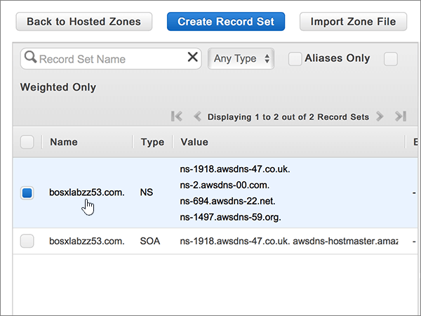
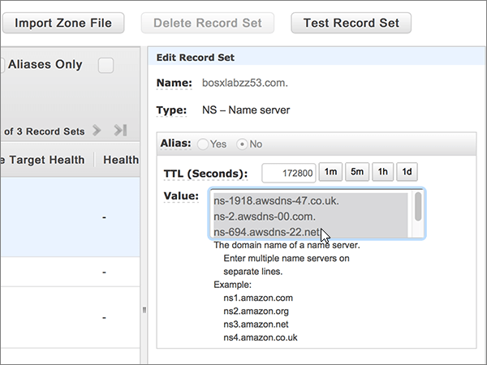
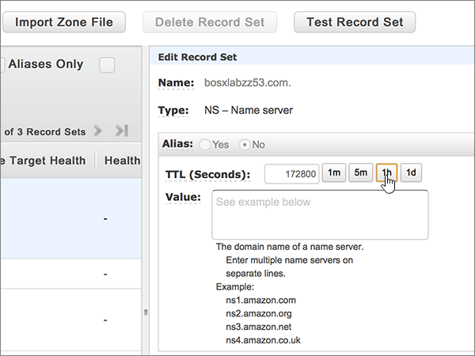
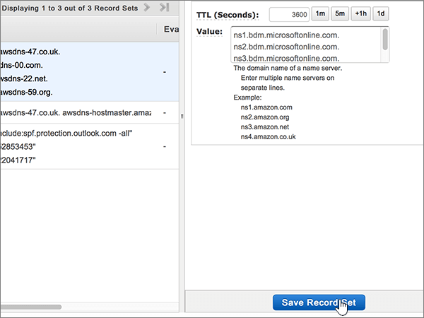

# Change nameservers to set up Microsoft with Amazon Web Services (AWS)

 **[Check the Domains FAQ](../setup/domains-faq.yml)** if you don't find what you're looking for. 
  
Follow these instructions if you want Microsoft to manage your DNS records for you. (If you prefer, you can [manage all your Microsoft DNS records at AWS](create-dns-records-at-aws.md).)
  
    
## Add a TXT record for verification

Before you use your domain with Microsoft, we have to make sure that you own it. Your ability to log in to your account at your domain registrar and create the DNS record proves to Microsoft that you own the domain.
  
> [!NOTE]
> This record is used only to verify that you own your domain; it doesn't affect anything else. You can delete it later, if you like. 
  
1. To get started, go to your domains page at AWS by using [this link](https://console.aws.amazon.com/route53/home). You'll be prompted to log in first.
    
2. On the **Resources** page, select **Hosted Zones**.
    
3. On the **Hosted Zones** page, in the **Domain Name** column, select the name of the domain that you want to edit. 
    
4. Select **Create Record Set**.
    
5. In the **Create Record Set** area, in the boxes for the new record, type or copy and paste the values from the following table. 
    
    (Choose the **Type** and **Routing Policy** values from the drop-down lists.) 
    
    > [!TIP]
    > The quotation marks required by the onscreen instructions are supplied automatically. You don't need to type them manually. 
  
|||||||
|:-----|:-----|:-----|:-----|:-----|:-----|
|**Name**   |**Type**   |**Alias**   |**TTL (Seconds)**   |**Value**   |**Routing Policy**   |
|(Leave this field empty)    |TXT - Text    |No    |300    |MS=ms *XXXXXXXX*   **Note:** This is an example. Use your specific **Destination or Points to Address** value here, from the table. [How do I find this?](../get-help-with-domains/information-for-dns-records.md)     |Simple   |
   
6. Select **Create**.
    
7. Wait a few minutes before you continue, so that the record you just created can update across the Internet.
    
Now that you've added the record at your domain registrar's site, you'll go back to Microsoft and request a search for the record.
  
When Microsoft finds the correct TXT record, your domain is verified.
  
1. In the Microsoft admin center, go to the **Settings** \> <a href="https://go.microsoft.com/fwlink/p/?linkid=834818" target="_blank">Domains</a> page.

    
2. On the **Domains** page, select the domain that you are verifying. 
    
3. On the **Setup** page, select **Start setup**.
    
4. On the **Verify domain** page, select **Verify**.
    
> [!NOTE]
> Typically it takes about 15 minutes for DNS changes to take effect. However, it can occasionally take longer for a change you've made to update across the Internet's DNS system. If you're having trouble with mail flow or other issues after adding DNS records, see [Find and fix issues after adding your domain or DNS records](../get-help-with-domains/find-and-fix-issues.md). 
  
## Change your domain's nameserver (NS) records

To complete setting up your domain with Microsoft, you change your domain's NS records at your domain registrar to point to the Microsoft primary and secondary name servers. This sets up Microsoft to update the domain's DNS records for you. We'll add all records so that email, Skype for Business Online, and your public website work with your domain, and you'll be all set.
  
> [!CAUTION]
> When you change your domain's NS records to point to the Microsoft name servers, all the services that are currently associated with your domain are affected. For example, all email sent to your domain (like rob@ *your_domain*  .com) will start coming to Microsoft after you make this change. 
  
> [!IMPORTANT]
>  The following procedure will show you how to delete any other, unwanted nameservers from the list, and also how to add the correct nameservers if they are not already listed. >  When you have completed the steps in this section, the only nameservers that should be listed are these four: >  ns1.bdm.microsoftonline.com >  ns2.bdm.microsoftonline.com >  ns3.bdm.microsoftonline.com >  ns4.bdm.microsoftonline.com 
  
1. To get started, go to your domains page at AWS by using [this link](https://console.aws.amazon.com/route53/home). You'll be prompted to log in first.
    
2. On the **Resources** page, select **Hosted Zones**.
    
3. On the **Hosted Zones** page, in the **Domain Name** column, select the name of the domain that you want to edit. 
    
4. Select the **Nameserver** record set. 
    
    
  
5. In the **NS - Name server** record set in the **Value** box, delete all of the nameservers by selecting them all and then pressing the **Delete** key on your keyboard. 
    
    > [!CAUTION]
    > Follow these steps only if you have existing nameservers other than the four correct nameservers. (That is, delete only any current nameservers that are  *not*  named **ns1.bdm.microsoftonline.com**, **ns2.bdm.microsoftonline.com**, **ns3.bdm.microsoftonline.com**, or **ns4.bdm.microsoftonline.com**.) 
  
    
  
6. In the **TTL (Seconds):** area, select **1h** (1 Hour). 
    
    
  
7. Still in the **NS - Name server** record set, in the **Value** box, type or copy and paste the **First line** value from the following table, then press the **Enter** key on your keyboard and type or copy and paste the next **line** value. 
    
    > [!IMPORTANT]
    > Each nameserver value  *must*  be on its own separate line within the **Value** box, as shown in the following illustration. 
  
|||
|:-----|:-----|
|**First line**   |ns1.bdm.microsoftonline.com.    **This value MUST end with a period (.)**   |
|**Second line**   |ns2.bdm.microsoftonline.com.    **This value MUST end with a period (.)**   |
|**Third line**   |ns3.bdm.microsoftonline.com.    **This value MUST end with a period (.)**   |
|**Fourth line**   |ns4.bdm.microsoftonline.com.    **This value MUST end with a period (.)**   |
   
   
  
8. Select **Save Record Set**.
    
    
  
> [!NOTE]
> Your nameserver record updates may take up to several hours to update across the Internet's DNS system. Then your Microsoft email and other services will be all set to work with your domain. 
