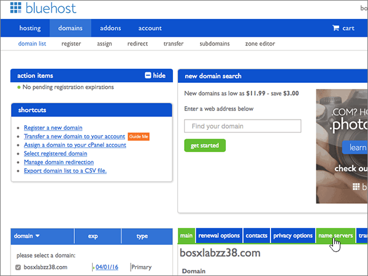
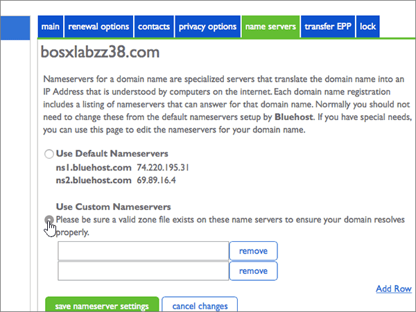
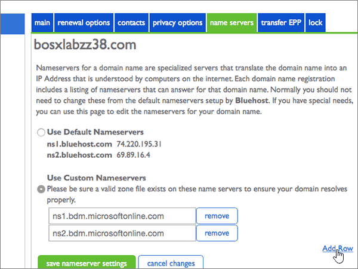
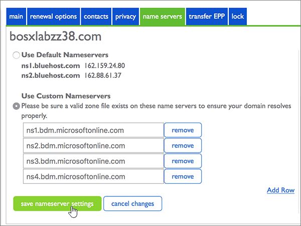
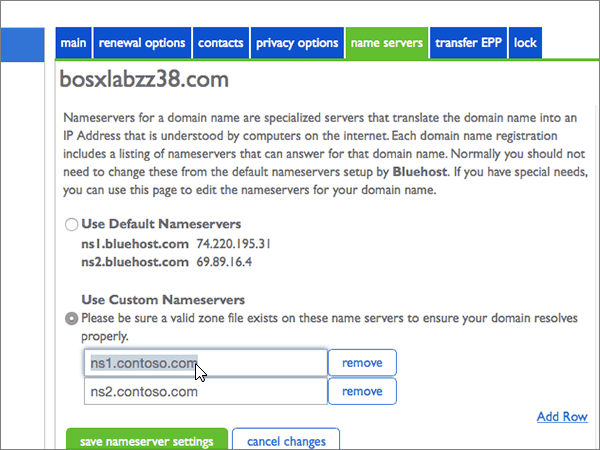
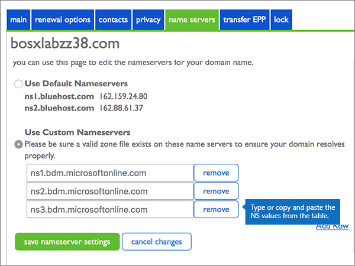

# Change nameservers to set up Microsoft with Bluehost

 **[Check the Domains FAQ](../setup/domains-faq.yml)** if you don't find what you're looking for. 
  
Follow these instructions if you want Microsoft to manage your DNS records for you. (If you prefer, you can [manage all your DNS records at Bluehost](create-dns-records-at-bluehost.md).)
  
## Add a TXT record for verification

Before you use your domain with Microsoft, we have to make sure that you own it. Your ability to log in to your account at your domain registrar and create the DNS record proves to Microsoft that you own the domain.
  
> [!NOTE]
> This record is used only to verify that you own your domain; it doesn't affect anything else. You can delete it later, if you like. 
  
1. To get started, go to your domains page at Bluehost by using [this link](https://my.bluehost.com/cgi/dm). You'll be prompted to log in first.
    
2. On the **domains** page, in the **domain** area, find the row for the domain that you're changing, and then select the check box for that domain. 
    
    (You may have to scroll down.) 
    
3. In the **domain_name** area, on the **DNS Zone Editor** row, select **Manage DNS records**.
    
4. On the **DNS Zone Editor** page, in the Add DNS Record area, in the boxes for the new record, type or copy and paste the values from the following table. 
    
    (Choose the **Type** value from the drop-down list.) 
    
|||||
|:-----|:-----|:-----|:-----|
|**Host Record**   |**TTL**   |**Type**   |**TXT Value**   |
|@    |14400    |TXT    |MS=ms *XXXXXXXX*   **Note:** This is an example. Use your specific **Destination or Points to Address** value here, from the table. [How do I find this?](../get-help-with-domains/information-for-dns-records.md)   |

   
5. Select **add record**.
    
6. Wait a few minutes before you continue, so that the record you just created can update across the Internet.
    
Now that you've added the record at your domain registrar's site, you'll go back to Microsoft and request a search for the record.
  
When Microsoft finds the correct TXT record, your domain is verified.
  
1. In the Microsoft admin center, go to the **Settings** \> <a href="https://go.microsoft.com/fwlink/p/?linkid=834818" target="_blank">Domains</a> page.

    
2. On the **Domains** page, select the domain that you are verifying. 
    
3. On the **Setup** page, select **Start setup**.
    
4. On the **Verify domain** page, select **Verify**.
    
> [!NOTE]
> Typically it takes about 15 minutes for DNS changes to take effect. However, it can occasionally take longer for a change you've made to update across the Internet's DNS system. If you're having trouble with mail flow or other issues after adding DNS records, see [Find and fix issues after adding your domain or DNS records](../get-help-with-domains/find-and-fix-issues.md). 
  
## Change your domain's nameserver (NS) records

To complete setting up your domain with Microsoft, you change your domain's NS records at your domain registrar to point to the  primary and secondary name servers. This sets up Microsoft to update the domain's DNS records for you. We'll add all records so that email, Skype for Business Online, and your public website work with your domain, and you'll be all set.
  
> [!CAUTION]
> When you change your domain's NS records to point to the Microsoft name servers, all the services that are currently associated with your domain are affected. For example, all email sent to your domain (like rob@ *your_domain*  .com) will start coming to Microsoft after you make this change. 
  
> [!IMPORTANT]
>  The following procedure will show you how to delete any other, unwanted nameservers from the list, and also how to add the correct nameservers if they are not already listed. >  When you have completed the steps in this section, the only nameservers that should be listed are these four: >  ns1.bdm.microsoftonline.com >  ns2.bdm.microsoftonline.com >  ns3.bdm.microsoftonline.com >  ns4.bdm.microsoftonline.com 
  
1. To get started, go to your domains page at Bluehost by using [this link](https://my.bluehost.com/cgi/dm). You'll be prompted to log in first.
    
2. On the **domains** page, in the **domain_name** area, select the checkbox for your domain, and then select **name servers**.
    
    
  
3. In the **domain_name** area, select **Use Custom Nameservers**.
    
    
  
4. Depending on whether or not there are already nameservers listed on the page that is displayed now, continue to one of the two following procedures:
    
  - If there are **NO** nameservers already listed, [If there are NO nameservers already listed](#if-there-are-no-nameservers-already-listed).
    
  - If there **ARE** nameservers already listed, [If there ARE nameservers already listed](#if-there-are-nameservers-already-listed).
    
### If there are NO nameservers already listed

1. In the **Use Custom Nameservers** section, type or copy and paste the values from the following table. 
    
|||
|:-----|:-----|
|**First empty row**   |ns1.bdm.microsoftonline.com    |
|**Second empty row**   |ns2.bdm.microsoftonline.com    |
   
   
  
2. Select **Add Row**.
    
    
  
3. Still in the **Use Custom Nameservers** section, type or copy and paste the values from the first row of the following table into the new empty row. 
    
|||
|:-----|:-----|
|**Third empty row**   |ns3.bdm.microsoftonline.com    |
|**Fourth empty row**   |ns4.bdm.microsoftonline.com    |
  
4. To add the fourth Nameserver record, select **Add Row** again, and create a record using the values from the last row of the above table. 
    
5. Select **save nameserver settings**.
    
    
  
> [!NOTE]
> Your nameserver record updates may take up to several hours to update across the Internet's DNS system. Then your Microsoft email and other services will be all set to work with your domain. 
  
### If there ARE nameservers already listed

> [!CAUTION]
> Follow these steps only if you have existing nameservers other than the four correct nameservers. (That is, delete only any current nameservers that are  *not*  named **ns1.bdm.microsoftonline.com**, **ns2.bdm.microsoftonline.com**, **ns3.bdm.microsoftonline.com**, or **ns4.bdm.microsoftonline.com**.) 
  
1. If there are any other name servers listed, delete each of them by selecting it and then pressing the **Delete** key on your keyboard. 
    
    
  
2. Still in the **Use Custom Nameservers** section, type or copy and paste the values from the following table. 
    
|||
|:-----|:-----|
|**First empty row**   |ns1.bdm.microsoftonline.com    |
|**Second empty row**   |ns2.bdm.microsoftonline.com    |
   
   
  
3. Select **Add Row**.
    
    
  
4. Still in the **Use Custom Nameservers** section, type or copy and paste the values from the first row of the following table into the new empty row. 
    
|||
|:-----|:-----|
|**Third empty row**   |ns3.bdm.microsoftonline.com    |
|**Fourth empty row**   |ns4.bdm.microsoftonline.com    |
   
   
  
5. To add the fourth Nameserver record, select **Add Row** again, and create a record using the values from the last row of the above table. 
    
6. Select **save nameserver settings**.
    
    
  
> [!NOTE]
> Your nameserver record updates may take up to several hours to update across the Internet's DNS system. Then your Microsoft email and other services will be all set to work with your domain. 
  
