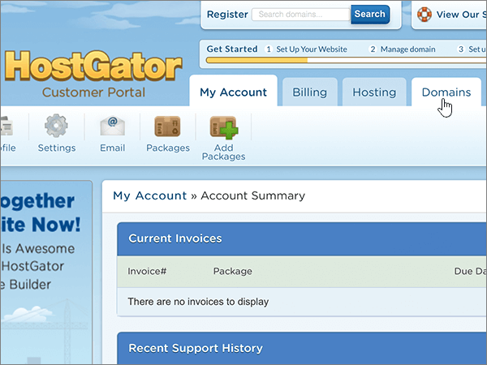
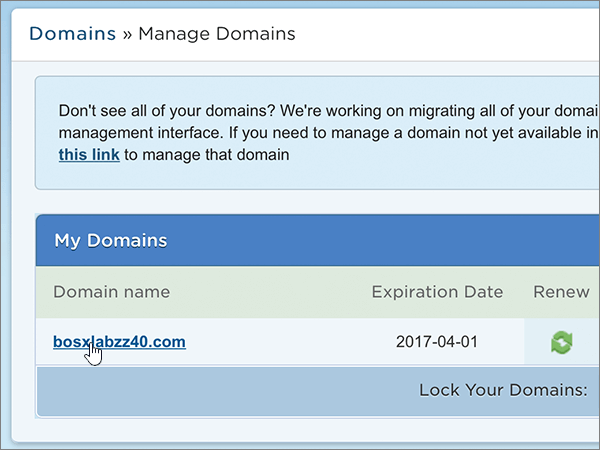
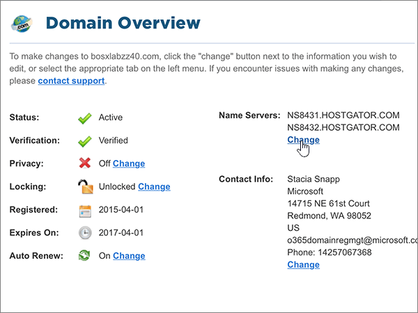
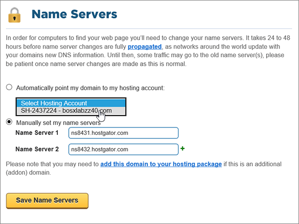
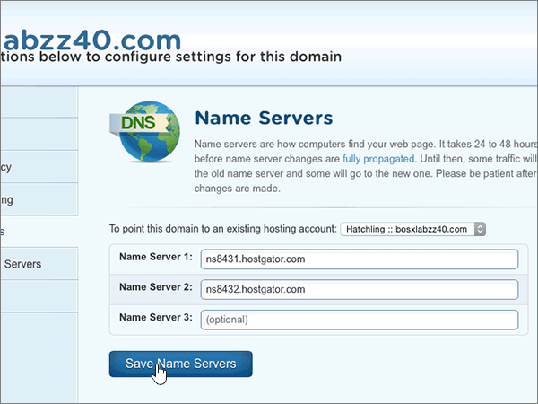
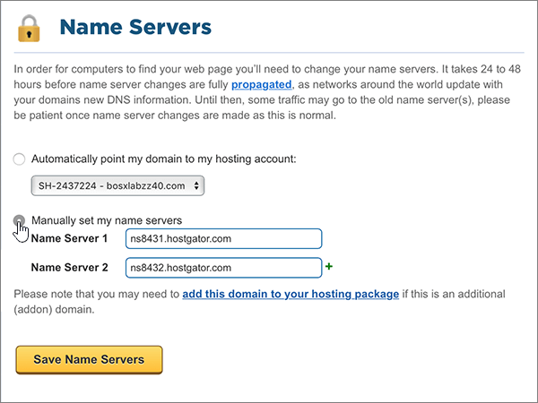
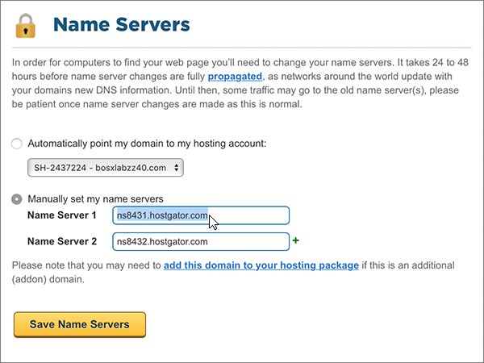
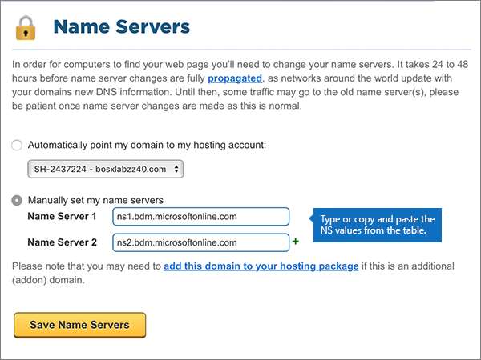
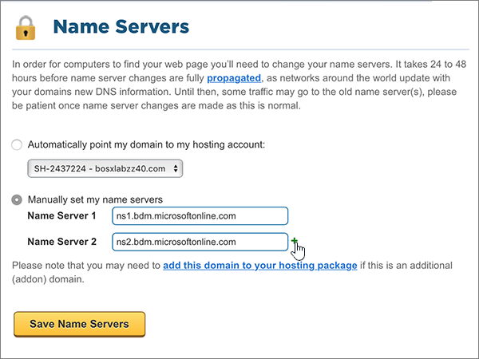
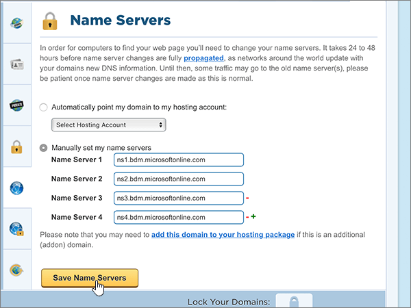

# Change nameservers to set up Microsoft 365 with Hostgator

 **[Check the Domains FAQ](../setup/domains-faq.md)** if you don't find what you're looking for.
  
Follow these instructions if you want Microsoft to manage your DNS records for you. (If you prefer, you can [manage all your Microsoft DNS records at Hostgator](create-dns-records-at-hostgator.md).)
  
    
## Point your domain to your hosting account.

> [!IMPORTANT]
> You must perform this procedure before you perform the procedure in the following section, **Add a TXT record for verification**.
  
Follow these steps to associate your domain and hosting accounts.
  
1. To get started, go to your customer portal page at Hostgator by using [this link](https://portal.hostgator.com/domain/manage). You'll be prompted to log in.
    
    
  
2. Select the **Domains** tab.
    
    
  
3. On the **Manage Domains** page, in the **My Domains** area, select the domain you want to update.
    
    
  
4. On the **Domains Overview** page, in the **Name Servers** area, select **Change**.
    
    
  
5. On the **Name Servers** page for your domain, in the **Select Hosting Account** drop-down list, choose the **hosting account** that is associated with your domain.
    
    
  
6. Select **Save Name Servers**.
    
    
  
## Add a TXT record for verification

> [!IMPORTANT]
> Before you perform this procedure, you must first perform the procedure in the first section of this article, [Point your domain to your hosting account.](#point-your-domain-to-your-hosting-account).
  
Before you use your domain with Microsoft, we have to make sure that you own it. Your ability to log in to your account at your domain registrar and create the DNS record proves to Microsoft that you own the domain.
  
> [!NOTE]
> This record is used only to verify that you own your domain; it doesn't affect anything else. You can delete it later, if you like.
  
1. To get started, go to your cPanel page at Hostgator. You'll be prompted to log in first.
    
    (Each hosted account at Hostgator is assigned a unique cPanel address. Your cPanel address should look like this: https://YourSiteAddress:secure-port-number. The sign-up email you received from Hostgator will specify that address.)
    
    > [!IMPORTANT]
    > To have a cPanel associated with your domain, you need a hosting account with Hostgator. To get started, you can either purchase a hosting account from Hostgator or [change your domain's nameserver (NS) records](#change-your-domains-nameserver-ns-records) to point to Microsoft. 
  
2. On the **Control Panel** page, in the **Domains** area, select **Advanced DNS Zone Editor**.
    
    (You may have to scroll down.) 
    
3. On the **Advanced DNS Zone Editor** page, in the **Add a Record** area, in the boxes for the new record, type or copy and paste the values from the following table. 
    
    (Choose the **Type** value from the drop-down list.) 
    
|||||
|:-----|:-----|:-----|:-----|
|**Name**   |**TTL**   |**Type**   |**TXT Data**   |
|Use your  *domain_name*  . (for example, fourthcoffee.com.)    **This value MUST end with a period (.)**   |1    |TXT    |MS=ms *XXXXXXXX*    **Note:** This is an example. Use your specific **Destination or Points to Address** value here, from the table. [How do I find this?](../get-help-with-domains/information-for-dns-records.md)        |
   
4. Select **Add Record**.
    
5. Wait a few minutes before you continue, so that the record you just created can update across the Internet.
    
Now that you've added the record at your domain registrar's site, you'll go back to Microsoft and request a search for the record.
  
When Microsoft finds the correct TXT record, your domain is verified.
  
1. In the admin center, go to the **Settings** \> <a href="https://go.microsoft.com/fwlink/p/?linkid=834818" target="_blank">Domains</a> page.

    
2. On the **Domains** page, select the domain that you are verifying. 
    
3. On the **Setup** page, select **Start setup**.
    
4. On the **Verify domain** page, select **Verify**.
    
> [!NOTE]
> Typically it takes about 15 minutes for DNS changes to take effect. However, it can occasionally take longer for a change you've made to update across the Internet's DNS system. If you're having trouble with mail flow or other issues after adding DNS records, see [Find and fix issues after adding your domain or DNS records](../get-help-with-domains/find-and-fix-issues.md). 
  
## Change your domain's nameserver (NS) records

To complete setting up your domain with Microsoft, you change your domain's NS records at your domain registrar to point to the Microsoft primary and secondary name servers. This sets up Microsoft to update the domain's DNS records for you. We'll add all records so that email, Skype for Business Online, and your public website work with your domain, and you'll be all set.
  
> [!CAUTION]
> When you change your domain's NS records to point to the Microsoft name servers, all the services that are currently associated with your domain are affected. For example, all email sent to your domain (like rob@ *your_domain*  .com) will start coming to Microsoft after you make this change.
  
> [!IMPORTANT]
> The following procedure will show you how to delete any other, unwanted nameservers from the list, and also how to add the correct nameservers if they are not already listed. When you have completed the steps in this section, the only nameservers that should be listed are these four:  **ns1.bdm.microsoftonline.com**, **ns2.bdm.microsoftonline.com**, **ns3.bdm.microsoftonline.com**, and **ns4.bdm.microsoftonline.com**.
  
1. To get started, go to your customer portal page at Hostgator by using [this link](https://portal.hostgator.com/domain/manage). You'll be prompted to log in.
    
    
  
2. Select the **Domains** tab. 
    
    
  
3. On the **Manage Domains** page, in the **My Domains** area, select the domain you want to update. 
    
    
  
4. On the **Domain Overview** page, in the **Name Servers** area, select **Change**.
    
    
  
5. On the **Name Servers** page for your domain, in the **Select Hosting Account** drop-down list, choose the **hosting account** that is associated with your domain. 
    
    
  
6. Select **Manually set my name servers**.
    
    
  
7.   **CAUTION**:
    Follow these steps only if you have existing nameservers other than the four correct nameservers. (That is, delete only any current nameservers that are  *not*  named **ns1.bdm.microsoftonline.com**, **ns2.bdm.microsoftonline.com**, **ns3.bdm.microsoftonline.com**, or **ns4.bdm.microsoftonline.com**.)
  
        Still on the **Name Servers** page for your domain, in the list of nameservers, delete each nameserver in the list by selecting it and then pressing the **Delete** key on your keyboard. 
    
   
  
8. Still in the list of nameservers, type or copy and paste the first two values from the following table.
    
|||
|:-----|:-----|
|**Name Server 1:**   |ns1.bdm.microsoftonline.com    |
|**Name Server 2:**   |ns2.bdm.microsoftonline.com    |
|**Name Server 3:**   |ns3.bdm.microsoftonline.com    |
|**Name Server 4:**   |ns4.bdm.microsoftonline.com    |
   
   
  
9. Add the other nameserver values.
    
    Select **(+)** add, and then type or copy and paste the value from the next row of the table into the box for the record. 
    
    Repeat this process until you have created all four nameserver records.
    
    
  
10. Select **Save Name Servers**.
    
    
  
> [!NOTE]
> Your nameserver record updates may take up to several hours to update across the Internet's DNS system. Then your Microsoft email and other services will be all set to work with your domain.
