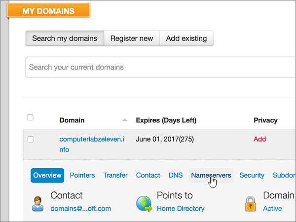
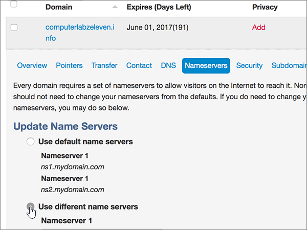
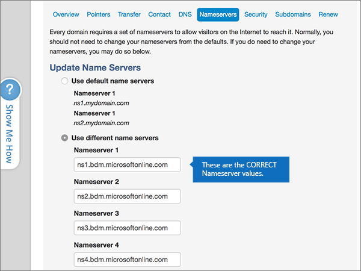
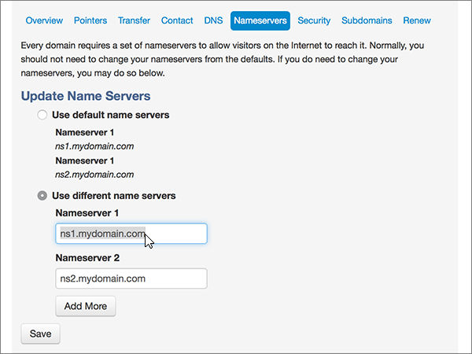
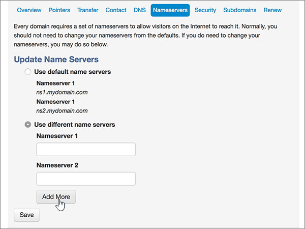
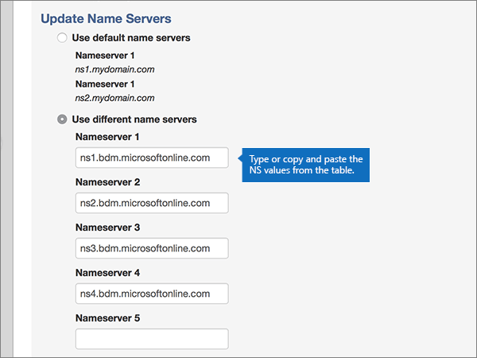
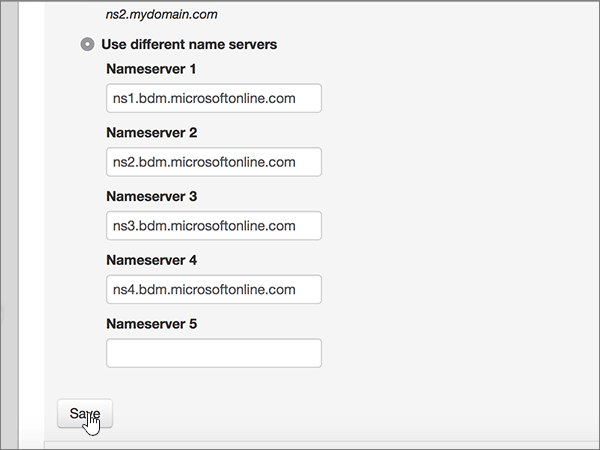

# Change nameservers to set up Microsoft with MyDomain

 **[Check the Domains FAQ](../setup/domains-faq.yml)** if you don't find what you're looking for.
  
Follow these instructions if you want Microsoft to manage your DNS records for you. (If you prefer, you can [manage all your Microsoft DNS records at MyDomain](create-dns-records-at-mydomain.md).)
  
## Add a TXT record for verification

Before you use your domain with Microsoft, we have to make sure that you own it. Your ability to log in to your account at your domain registrar and create the DNS record proves to Microsoft that you own the domain.
  
> [!NOTE]
> This record is used only to verify that you own your domain; it doesn't affect anything else. You can delete it later, if you like. 
  
1. To get started, go to your domains page at MyDomain by using [this link](https://www.mydomain.com/controlpanel). You'll be prompted to log in first.
    
2. In the **My Favorites** section, select **Domain Central**.
    
3. Under **Domain**, select the name of the domain that you want to edit.
    
4. In the **Overview** row, select **DNS**.
    
5. From the **Modify** drop-down list, choose **TXT/SPF Record**.
    
6. Under **Content**, in the box for the new record, type or copy and paste the value from the following table.
    
||
|:-----|
|**Content**   |
|MS=ms *XXXXXXXX*    **Note**: This is an example. Use your specific **Destination or Points to Address** value here, from the table. [How do I find this?](../get-help-with-domains/information-for-dns-records.md)          |
   
7. Select **Add**.
    
8. Wait a few minutes before you continue, so that the record you just created can update across the Internet.
    
Now that you've added the record at your domain registrar's site, you'll go back to Microsoft 365 and request Microsoft 365 to look for the record.
  
When Microsoft finds the correct TXT record, your domain is verified.
  
1. In the Microsoft admin center, go to the **Settings** \> <a href="https://go.microsoft.com/fwlink/p/?linkid=834818" target="_blank">Domains</a> page.

    
2. On the **Domains** page, select the domain that you are verifying. 
    
3. On the **Setup** page, select **Start setup**.
    
4. On the **Verify domain** page, select **Verify**.
    
> [!NOTE]
> Typically it takes about 15 minutes for DNS changes to take effect. However, it can occasionally take longer for a change you've made to update across the Internet's DNS system. If you're having trouble with mail flow or other issues after adding DNS records, see [Find and fix issues after adding your domain or DNS records](../get-help-with-domains/find-and-fix-issues.md). 
  
## Change your domain's nameserver (NS) records

To complete setting up your domain with Microsoft, you change your domain's NS records at your domain registrar to point to the Microsoft primary and secondary name servers. This sets up Microsoft to update the domain's DNS records for you. We'll add all records so that email, Skype for Business Online, and your public website work with your domain, and you'll be all set.
  
> [!CAUTION]
> When you change your domain's NS records to point to the Microsoft name servers, all the services that are currently associated with your domain are affected. For example, all email sent to your domain (like rob@ *your_domain.* com) will start coming to Microsoft after you make this change. 
  
> [!IMPORTANT]
> The following procedure will show you how to delete any other, unwanted nameservers from the list, and also how to add the correct nameservers if they are not already in the list.   When you have completed the steps in this section, the only nameservers that should be listed are these four:
  
1. To get started, go to your domains page at MyDomain by using [this link](https://www.mydomain.com/controlpanel). You'll be prompted to log in first.
    
2. In the **My Favorites** section, select **Domain Central**.
    
3. Under **Domain**, select the name of the domain that you want to edit.
    
4. In the **Overview** row, select **Nameservers**.
    
    
  
5. In the **Update Name Servers** section, select **Use different name servers**.
    
    
  
6. Depending on whether or not there are already nameservers listed on the page that is displayed now, continue to one of the two following procedures.
    
### If the correct nameservers ARE already listed

- If the correct nameservers are already listed, you can skip this step.
    
    
  
### If the correct nameservers are NOT already listed

> [!CAUTION]
> Follow these steps only if you have existing nameservers other than the four correct nameservers. (That is, delete only any current nameservers that are  *not*  named **ns1.bdm.microsoftonline.com**, **ns2.bdm.microsoftonline.com**, **ns3.bdm.microsoftonline.com**, or **ns4.bdm.microsoftonline.com**.) 
  
1. Delete the existing nameservers by selecting each entry in the **Nameserver:** field, and then pressing the **Delete** key on your keyboard. 
    
    
  
2. Select **Add More** twice to add two new Nameserver rows. 
    
    
  
3. In the boxes for the records, type or copy and paste the nameserver values from the following table.
    
|||
|:-----|:-----|
|**Nameserver 1**   |ns1.bdm.microsoftonline.com    |
|**Nameserver 2**   |ns2.bdm.microsoftonline.com    |
|**Nameserver 3**   |ns3.bdm.microsoftonline.com    |
|**Nameserver 4**   |ns4.bdm.microsoftonline.com    |
   
   
  
4. Select **Save**.
    
    
  
> [!NOTE]
> Your nameserver record updates may take up to several hours to update across the Internet's DNS system. Then your Microsoft email and other services will be all set to work with your domain. 
