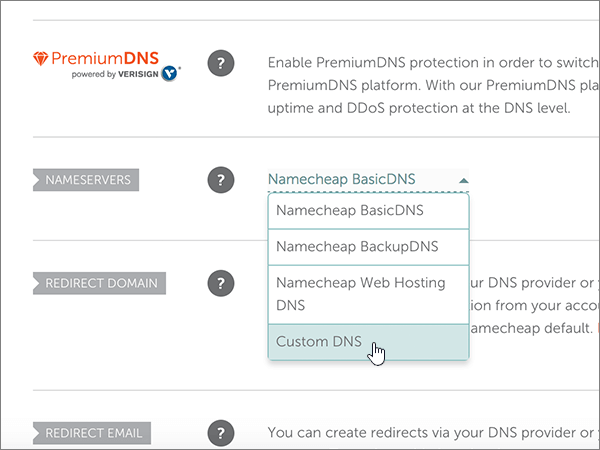
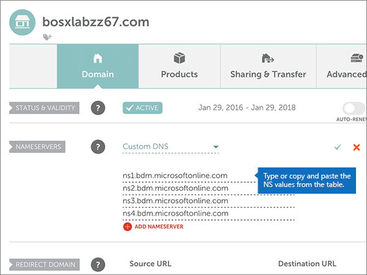
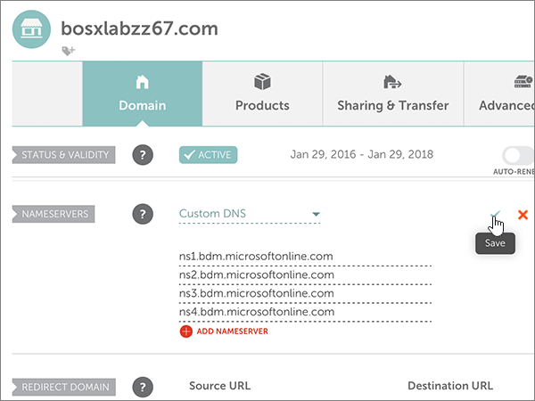
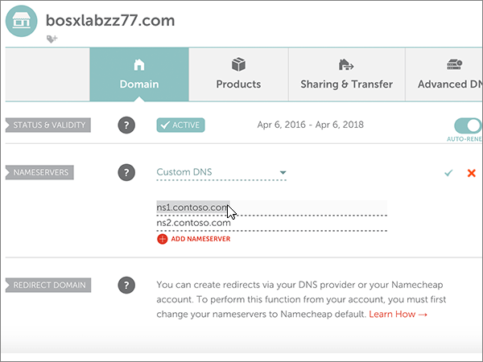

# Change nameservers to set up Microsoft with Namecheap

 **[Check the Domains FAQ](../setup/domains-faq.yml)** if you don't find what you're looking for.
  
Follow these instructions if you want Microsoft to manage your DNS records for you. (If you prefer, you can [manage all your Microsoft DNS records at Namecheap](create-dns-records-at-namecheap.md).)
  
    
## Add a TXT record for verification

1. To get started, go to your domains page at Namecheap by using [this link](https://www.namecheap.com/myaccount/login.aspx?ReturnUrl=%2f). You'll be prompted to Sign in and Continue.
    
    
  
2. On the **Landing** page, under **Account**, choose **Domain List** from the drop-down list. 
    
    
  
3. On the **Domain List** page, find the name of the domain that you want to edit, and then select **Manage**.
    
    
  
4. Select **Advanced DNS**.
    
    
  
5. In the **HOST RECORDS** section, select **ADD NEW RECORD**.
    
    
  
6. In the **Type** drop-down, select **TXT Record**.
    
    > [!NOTE]
    > The **Type** drop-down automatically appears when you select **ADD NEW RECORD**.
  
    
  
7. In the boxes for the new record, type or copy and paste the values from the following table.
    
    (Choose the **TTL** value from the drop-down list.) 
    
|**Type**|**Host**|**Value**|**TTL**|
|:-----|:-----|:-----|:-----|
|TXT    |@    |MS=ms *XXXXXXXX*    **Note**: This is an example. Use your specific **Destination or Points to Address** value here, from the table.           [How do I find this?](../get-help-with-domains/information-for-dns-records.md)          |30 min    |
   
   
  
8. Select the **Save Changes** (check mark) control. 
    
    
  
9. Wait a few minutes before you continue, so that the record you just created can update across the Internet.
    
Now that you've added the record at your domain registrar's site, you'll go back to Microsoft and request a search for the record.
  
When Microsoft finds the correct TXT record, your domain is verified.
  
1. In the admin center, go to the **Settings** \> <a href="https://go.microsoft.com/fwlink/p/?linkid=834818" target="_blank">Domains</a> page.

    
2. On the **Domains** page, select the domain that you are verifying. 
    
    
  
3. On the **Setup** page, select **Start setup**.
    
    
  
4. On the **Verify domain** page, select **Verify**.
    
    
  
> [!NOTE]
>  Typically it takes about 15 minutes for DNS changes to take effect. However, it can occasionally take longer for a change you've made to update across the Internet's DNS system. If you're having trouble with mail flow or other issues after adding DNS records, see [Troubleshoot issues after changing your domain name or DNS records](../get-help-with-domains/find-and-fix-issues.md). 
  
## Change your domain's nameserver (NS) records

To complete setting up your domain with Microsoft, you change your domain's NS records at your domain registrar to point to the Microsoft primary and secondary name servers. This sets up Microsoft to update the domain's DNS records for you. We'll add all records so that email, Skype for Business Online, and your public website work with your domain, and you'll be all set.
  
> [!CAUTION]
> When you change your domain's NS records to point to the Microsoft name servers, all the services that are currently associated with your domain are affected. For example, all email sent to your domain (like rob@ *your_domain*  .com) will start coming to Microsoft after you make this change. 
  
> [!IMPORTANT]
>  When you have completed the steps in this section, the  *only*  nameservers that should be listed are these four: >  ns1.bdm.microsoftonline.com >  ns2.bdm.microsoftonline.com >  ns3.bdm.microsoftonline.com >  ns4.bdm.microsoftonline.com >  The following procedure will show you how to delete any other, unwanted nameservers from the list, and also how to add the  *correct*  nameservers if they are not already in the list. 
  
1. To get started, go to your domains page at Namecheap by using [this link](https://www.namecheap.com/myaccount/login.aspx?ReturnUrl=%2f). You'll be prompted to Sign in and Continue.
    
    
  
2. On the **Landing** page, under **Account**, choose **Domain List** from the drop-down list. 
    
    
  
3. On the **Domain List** page, find the name of the domain that you want to edit, and then select **Manage**.
    
    
  
4. Select **Domain**.
    
    
  
5. Find the **NAMESERVERS** section, and then select **Custom** from the **Namecheap Default** drop-down list. 
    
    
  
6. Depending on whether or not there are already nameservers listed on the page that is displayed now, continue to one of the two following procedures.
    
### If there are NO nameservers already listed

1. Select **ADD NAMESERVER** twice to add two new rows.
    
    
  
2. In the **Nameserver** boxes, type or copy and paste the values from the following table.
    
|||
|:-----|:-----|
|**Nameserver 1**   |ns1.bdm.microsoftonline.com    |
|**Nameserver 2**   |ns2.bdm.microsoftonline.com    |
|**Nameserver 3**   |ns3.bdm.microsoftonline.com    |
|**Nameserver 4**   |ns4.bdm.microsoftonline.com    |
   
   
  
3. Select the **Save** (check mark) control. 
    
    
  
> [!NOTE]
> Your nameserver record updates may take up to several hours to update across the Internet's DNS system. Then your Microsoft email and other services will be all set to work with your domain. 
  
### If there ARE nameservers already listed

> [!CAUTION]
> Follow these steps  *only*  if you have existing nameservers other than the four  *correct*  nameservers. (That is, delete  *only*  any current nameservers that are  *not*  named **ns1.bdm.microsoftonline.com**, **ns2.bdm.microsoftonline.com**, **ns3.bdm.microsoftonline.com**, or **ns4.bdm.microsoftonline.com**.) 
  
1. If there are any other nameservers listed in the **Nameserver** boxes, delete each one by selecting it and then pressing the **Delete** key on your keyboard. 
    
    
  
2. Select **ADD NAMESERVER** twice to add two new rows. 
    
    
  
3. In the **Nameserver** boxes, type or copy and paste the values from the following table.
 
    
|||
|:-----|:-----|
|**Name Server 1**   |ns1.bdm.microsoftonline.com    |
|**Name Server 2**   |ns2.bdm.microsoftonline.com    |
|**Nameserver 3**   |ns3.bdm.microsoftonline.com    |
|**Nameserver 4**   |ns4.bdm.microsoftonline.com    |
   
   
  
4. Select the **Save** (check mark) control. 
    
    
  
> [!NOTE]
> Your nameserver record updates may take up to several hours to update across the Internet's DNS system. Then your Microsoft email and other services will be all set to work with your domain.
