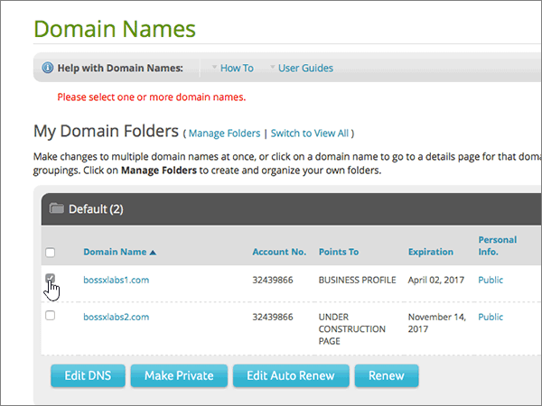
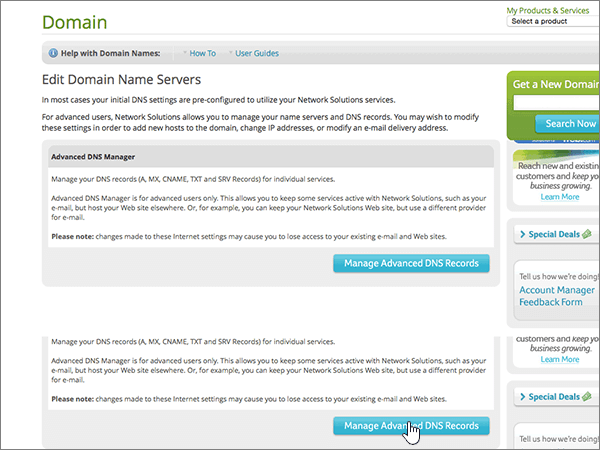
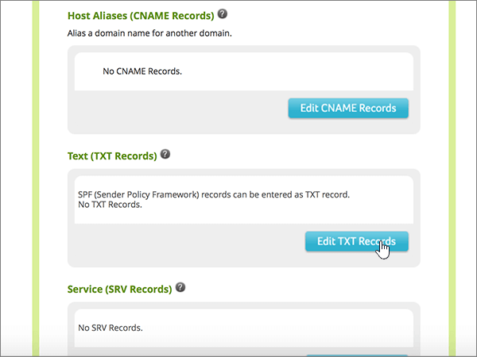
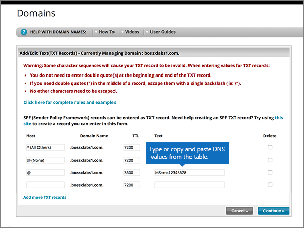
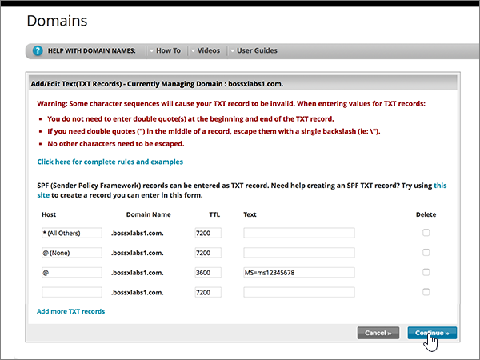
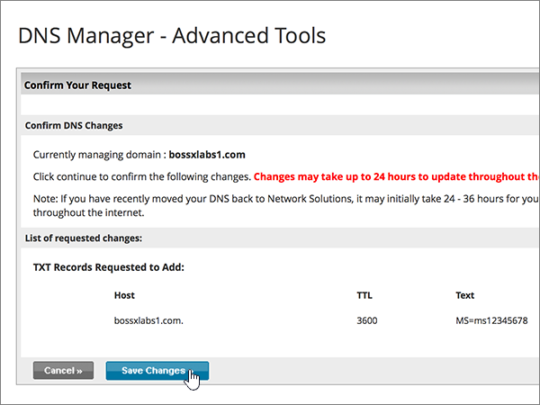
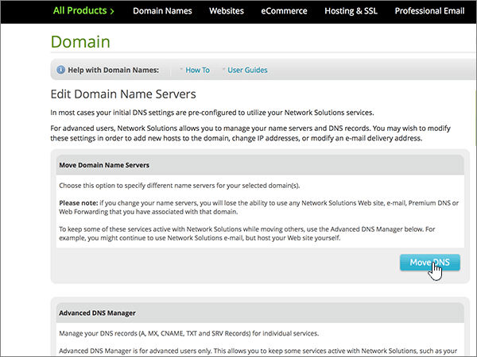
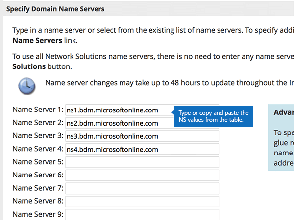
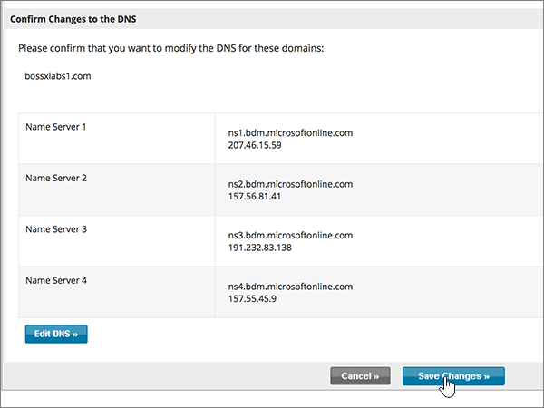

# Change nameservers to set up Microsoft with Network Solutions

 **[Check the Domains FAQ](../setup/domains-faq.md)** if you don't find what you're looking for.
  
Follow these instructions if you want Microsoft to manage your DNS records for you. (If you prefer, you can [manage all your Microsoft DNS records at Network Solutions](create-dns-records-at-network-solutions.md).)
  
    
## Add a TXT record at Network Solutions to verify that you own the domain

Before you use your domain with Microsoft, we have to make sure that you own it. Your ability to log in to your account at your domain registrar and create the DNS record proves to Microsoft that you own the domain.
  
> [!NOTE]
> This record is used only to verify that you own your domain; it doesn't affect anything else. You can delete it later, if you like. 
  
Follow the steps below or [watch the video (start at 0:47)](https://support.microsoft.com/office/69b092e3-c026-4d19-a7d0-16cdb2d8b261).
  
1. To get started, go to your domains page at Network Solutions by using [this link](https://www.networksolutions.com/manage-it). You'll be prompted to log in.
    
    > [!IMPORTANT]
    > Before you select the **Login** button, first choose **Manage My Domain Names** in the **Log In to:** drop-down list.
  
    
  
2. Select the check box next to the name of the domain that you are modifying.
    
    
  
3. Select **Edit DNS**.
    
    
  
4. Select **Manage Advanced DNS Records**.
    
    (You may have to scroll down.)
    
    
  
5. Scroll down to the **Text (TXT Records)** section, and then select **Edit TXT Records**.
    
    
  
6. In the boxes for the new record, type or copy and paste the values in the following table.
    
|**Host**|**TTL**|**Text**|
|:-----|:-----|:-----|
|@    (The system will change this value to **@ (None)** when you save the record.)    |3600    |MS=ms *XXXXXXXX*    **Note**: This is an example. Use your specific **Destination or Points to Address** value here, from the table in Microsoft 365.           [How do I find this?](../get-help-with-domains/information-for-dns-records.md)
   
    
   
  
7. Select **Continue**.
    
    
  
8. Select **Save Changes**.
    
    
  
9. Wait a few minutes before you continue, so that the record you just created can update across the Internet.
    
Now that you've added the record at your domain registrar's site, you'll go back to Microsoft 365 and request Microsoft 365 to look for the record.
  
When Microsoft finds the correct TXT record, your domain is verified.
  
1. In the Microsoft admin center, go to the **Settings** \> <a href="https://go.microsoft.com/fwlink/p/?linkid=834818" target="_blank">Domains</a> page.

    
2. On the **Domains** page, select the domain that you are verifying. 
    
    
  
3. On the **Setup** page, select **Start setup**.
    
    
  
4. On the **Verify domain** page, select **Verify**.
    
    
  
> [!NOTE]
>  Typically it takes about 15 minutes for DNS changes to take effect. However, it can occasionally take longer for a change you've made to update across the Internet's DNS system. If you're having trouble with mail flow or other issues after adding DNS records, see [Troubleshoot issues after changing your domain name or DNS records](../get-help-with-domains/find-and-fix-issues.md). 
  
## Change your domain's nameserver (NS) records

To complete setting up your domain with Microsoft, you change your domain's NS records at your domain registrar to point to the Microsoft primary and secondary name servers. This sets up Microsoft to update the domain's DNS records for you. We'll add all records so that email, Skype for Business Online, and your public website work with your domain, and you'll be all set.
  
> [!CAUTION]
> When you change your domain's NS records to point to the Microsoft name servers, all the services that are currently associated with your domain are affected. For example, all email sent to your domain (like rob@ *your_domain*  .com) will start coming to Microsoft after you make this change.
  
Ready to change your NS records so Microsoft can set up your domain? Follow the steps below or [watch the video (start at 2:23)](https://support.microsoft.com/office/69b092e3-c026-4d19-a7d0-16cdb2d8b261).
  
> [!IMPORTANT]
>  When you have completed the steps in this section, the  *only*  nameservers that should be listed are these four: **ns1.bdm.microsoftonline.com**, **ns2.bdm.microsoftonline.com**, **ns3.bdm.microsoftonline.com**, and **ns4.bdm.microsoftonline.com**. The following procedure will show you how to delete any other, unwanted nameservers from the list, and also how to add the  *correct*  nameservers if they are not already in the list. 
  
1. To get started, go to your domains page at Network Solutions by using [this link](https://www.networksolutions.com/manage-it). You'll be prompted to log in.
    
    > [!IMPORTANT]
    > Before you select the **Login** button, first choose **Manage My Domain Names** in the **Log In to:** drop-down list. 
  
    
  
2. Select the check box next to the name of the domain that you are modifying.
    
    
  
3. Select **Edit DNS**.
    
    
  
4. Select **Move DNS**.
    
    
  
5. Depending on whether or not there are already nameservers listed on the page that is displayed now, continue to one of the two following procedures:
    
  - If there are **NO** nameservers already listed, [If there are NO nameservers already listed](#if-there-are-no-nameservers-already-listed).
    
  - If there **ARE** nameservers already listed, [If there ARE nameservers already listed](#if-there-are-nameservers-already-listed).
    
### If there are NO nameservers already listed

1. On the **Domains** page, in the **Specify Domain Name Servers** section, select **Add More Name Servers**.
    
    
  
2. On the **Domain Names** page, type or copy and paste the nameserver values from the following table. 
    
|||
|:-----|:-----|
|**Name Server 1**   |ns1.bdm.microsoftonline.com    |
|**Name Server 2**   |ns2.bdm.microsoftonline.com    |
|**Name Server 2**   |ns3.bdm.microsoftonline.com    |
|**Name Server 2**   |ns4.bdm.microsoftonline.com    |
   
    

  
3. Select **Move DNS**.
    
    
  
4. Select **Save Changes**.
    
    
  
> [!NOTE]
> Your nameserver record updates may take up to several hours to update across the Internet's DNS system. Then your Microsoft email and other services will be all set to work with your domain. 
  
### If there ARE nameservers already listed

> [!CAUTION]
> Follow these steps  *only*  if you have existing nameservers other than the four  *correct*  nameservers. (That is, delete  *only*  any current nameservers that are  *not*  named **ns1.bdm.microsoftonline.com**, **ns2.bdm.microsoftonline.com**, **ns3.bdm.microsoftonline.com**, or **ns4.bdm.microsoftonline.com**.)
  
1. If there are any other nameservers listed, delete each one by selecting it and then pressing the **Delete** key on your keyboard.
    
    
  
2. Select **Add More Name Servers**.
    
    
  
3. On the **Domain Names** page, type or copy and paste the nameserver values from the following table. 
    
|||
|:-----|:-----|
|**Name Server 1**   |ns1.bdm.microsoftonline.com    |
|**Name Server 2**   |ns2.bdm.microsoftonline.com    |
|**Name Server 3**   |ns3.bdm.microsoftonline.com    |
|**Name Server 4**   |ns4.bdm.microsoftonline.com    |
   
    

  
4. Select **Move DNS**.
    
    
  
5. Select **Save Changes.**
    
    
  
> [!NOTE]
> Your nameserver record updates may take up to several hours to update across the Internet's DNS system. Then your Microsoft email and other services will be all set to work with your domain.
