# Create DNS records at 1&1 IONOS for Microsoft

 **[Check the Domains FAQ](../setup/domains-faq.md)** if you don't find what you're looking for. 
  
> [!CAUTION]
> Note that 1&1 IONOS doesn't allow a domain to have both an MX record and a top-level Autodiscover CNAME record. This limits the ways in which you can configure Exchange Online for Microsoft. There is a workaround, but we recommend employing it **only** if you already have experience with creating subdomains at 1&1 IONOS. > If despite this [service limitation](https://docs.microsoft.com/microsoft-365/admin/setup/domains-faq) you choose to manage your own Microsoft DNS records at 1&1 IONOS, follow the steps in this article to verify your domain and to set up DNS records for email, Skype for Business Online, and so on. 
  
After you add these records at 1&1 IONOS, your domain will be set up to work with Microsoft services.
  
  
> [!NOTE]
> Typically it takes about 15 minutes for DNS changes to take effect. However, it can occasionally take longer for a change you've made to update across the Internet's DNS system. If you're having trouble with mail flow or other issues after adding DNS records, see [Find and fix issues after adding your domain or DNS records](../get-help-with-domains/find-and-fix-issues.md). 
  
## Add a TXT record for verification

Before you use your domain with Microsoft, we have to make sure that you own it. Your ability to log in to your account at your domain registrar and create the DNS record proves to Microsoft that you own the domain.
  
> [!NOTE]
> This record is used only to verify that you own your domain; it doesn't affect anything else. You can delete it later, if you like. 
  
Follow the steps below or [watch the video (start at 0:42)](https://docs.microsoft.com/microsoft-365/admin/dns/create-dns-records-at-1-1-internet).
  
1. To get started, go to your domains page at 1&1 IONOS by using [this link](https://my.1and1.com/). You'll be prompted to log in.
    
2. Select **Manage domains**.
    
3. On the **Domain Center** page, find the domain that you want to update, and then select the **Panel** ( **v**) control for that domain.
    
4. In the **Domain Settings** area, select **Edit DNS Settings**.
    
5. In the **TXT and SRV Records** section, select **Add Record**.
    
6. In the **Add Record** area, in the boxes for the new record, type or copy and paste the values from the following table. 
    
    (Choose the **Type** value from the drop-down list.) 
    
    ||||
    |:-----|:-----|:-----|
    |**Type**   |**Prefix**   |**Name Value**   |
    |TXT    |(Leave this field blank)    |MS=ms *XXXXXXXX*    NOTE: This is an example. Use your specific **Destination or Points to Address** value here, from the table. [How do I find this?](../get-help-with-domains/information-for-dns-records.md)          |
   
7. Select **Save**.
    
8. Select **Save** again. 
    
9. In the **Edit DNS Settings** dialog box, select **Yes**.
    
10. Wait a few minutes before you continue, so that the record you just created can update across the Internet.
    
Now that you've added the record at your domain registrar's site, you'll go back to Microsoft 365 and request Microsoft 365 to look for the record.
  
When Microsoft finds the correct TXT record, your domain is verified.
  
1. In the Microsoft admin center, go to the **Settings** \> <a href="https://go.microsoft.com/fwlink/p/?linkid=834818" target="_blank">Domains</a> page.

    
2. On the **Domains** page, select the domain that you are verifying. 
    
3. On the **Setup** page, select **Start setup**.
    
4. On the **Verify domain** page, select **Verify**.
    
> [!NOTE]
> Typically it takes about 15 minutes for DNS changes to take effect. However, it can occasionally take longer for a change you've made to update across the Internet's DNS system. If you're having trouble with mail flow or other issues after adding DNS records, see [Find and fix issues after adding your domain or DNS records](../get-help-with-domains/find-and-fix-issues.md). 
  
## Add an MX record so email for your domain will come to Microsoft

Follow the steps below or [watch the video (start at 3:22)](https://docs.microsoft.com/microsoft-365/admin/dns/create-dns-records-at-1-1-internet).
  
> [!NOTE]
> If you've registered with 1und1.de, [sign in here](https://go.microsoft.com/fwlink/?linkid=859152). 
  
1. To get started, go to your domains page at 1&1 IONOS by using [this link](https://my.1and1.com/). You'll be prompted to log in.
    
2. Select **Manage domains**.
    
3. On the **Domain Center** page, find the domain that you want to update, and then select the **Panel** ( **v**) control for that domain.
    
4. In the **Domain Settings** area, select **Edit DNS Settings**.
    
5. In the **MX Records** section, in the **Mail Exchanger (MX Record)** area, select **Other mail server**. (You may have to scroll down.) 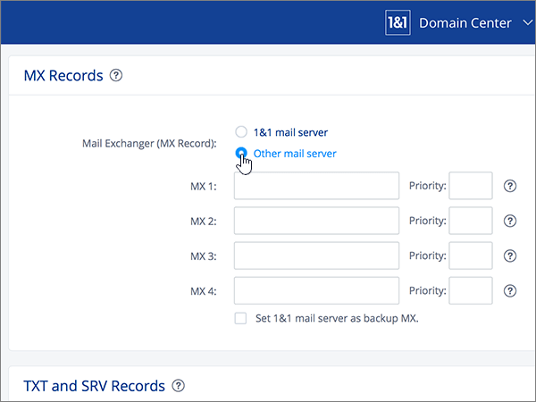  
  
6. If there are any MX records already listed, delete each of them by selecting the record and then pressing the **Delete** key on your keyboard. (If there are no MX records already listed, continue to the next step.) 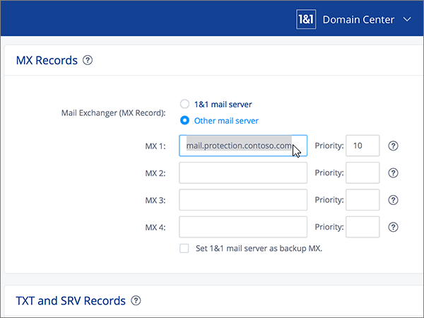 
  
7. In the boxes for the **MX 1** record, type or copy and paste the values from the following table. 
    
    |**MX 1**|**Priority**|
    |:-----|:-----|
    | *\<domain-key\>*  .mail.protection.outlook.com     NOTE: Get your \<domain-key\> from your Microsoft account. [How do I find this?](../get-help-with-domains/information-for-dns-records.md)          |10    For more information about priority, see [What is MX priority?](https://docs.microsoft.com/microsoft-365/admin/setup/domains-faq)   | 
    
     
  
8. Select **Save**. (You may have to scroll down.) 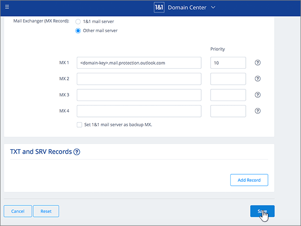
  
9. In the **Edit DNS Settings** dialog box, select **Yes**. 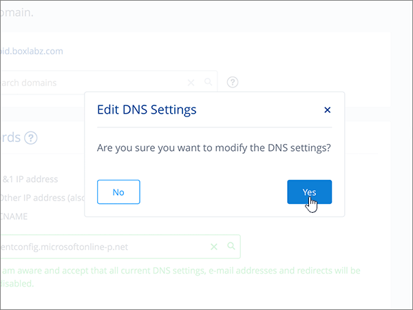
  
## Add the six CNAME records that are required for Microsoft

1&1 IONOS requires a workaround so that you can use an MX record together with the CNAME records that are required for Microsoft email services. This workaround requires you to create a set of subdomains at 1&1 IONOS, and to assign them to CNAME records.
  
> [!IMPORTANT]
> Make sure that you have at least two available subdomains before starting this procedure. We recommend this solution only if you already have experience with creating subdomains at 1&1 IONOS. 
  
### Basic CNAME records

Follow the steps below or [watch the video (start at 3:57)](https://docs.microsoft.com/microsoft-365/admin/dns/create-dns-records-at-1-1-internet).
  
> [!NOTE]
> If you've registered with 1und1.de, [sign in here](https://go.microsoft.com/fwlink/?linkid=859152). 
  
1. To get started, go to your domains page at 1&1 IONOS by using [this link](https://my.1and1.com/). You'll be prompted to log in.
    
2. Select **Manage domains**.
    
3. On the **Domain Center** page, find the domain that you want to update, and then select **Manage Subdomains**. 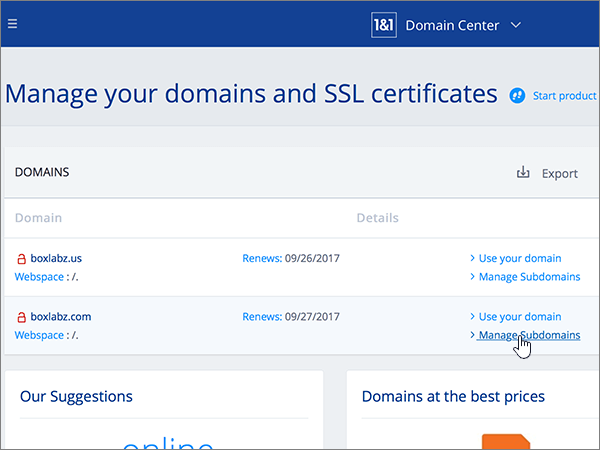  Now you'll create two subdomains and set an **Alias** value for each. (This is required because 1&1 IONOS supports only one top-level CNAME record, but Microsoft requires several CNAME records.) First, you'll create the Autodiscover subdomain.
    
4. In the **Subdomain Overview** section, select **Create Subdomain**.
    
    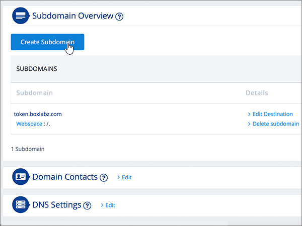
  
5. In the **Create Subdomain** box for the new subdomain, type or copy and paste only the **Create Subdomain** value from the following table. (You'll add the **Alias** value in a later step.)

    |**Create Subdomain**|**Alias**|
    |:-----|:-----|
    |autodiscover    |autodiscover.outlook.com   | 

    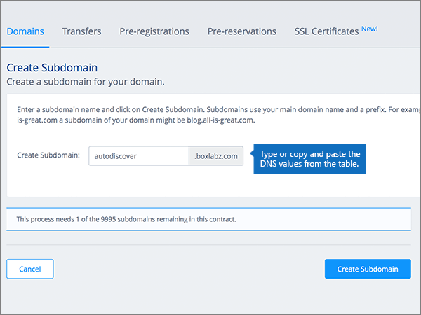
  
6. Select **Create Subdomain**. 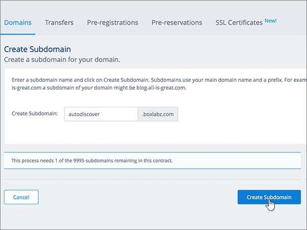
  
7. In the **Subdomain Overview** section, locate the **autodiscover** subdomain that you just created, and then select the **Panel (v)** control for that subdomain.  
  
8. In the **Subdomain Settings** area, select **Edit DNS Settings**.  
  
9. In the **A/AAAA Records (IP Addresses)** section, in the **IP address (A Record)** area, select **CNAME**. 
  
10. In the **Alias:** box, type or copy and paste only the **Alias** value from the following table.  
    
    |**Create Subdomain**|**Alias**|
    |:-----|:-----|
    |autodiscover    |autodiscover.outlook.com   |

    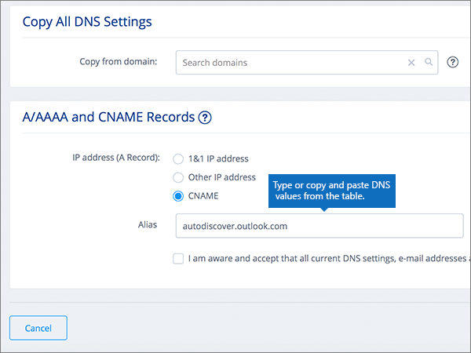
  
11. Select the check box for the **I am aware** disclaimer. 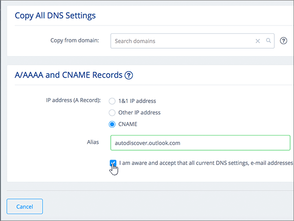
  
12. Select **Save**. 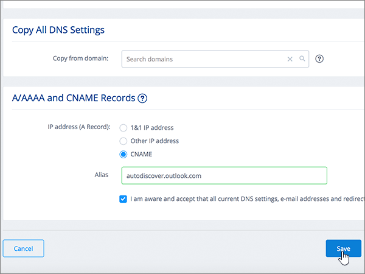
  
  
### Additional CNAME records

The additional CNAME records created in the following procedure enable Skype for Business Online services. You will employ the same steps that you used to create the two CNAME records you have already created.
  
1. Create the third subdomain (Lyncdiscover). On the **Subdomain Overview** section, select **Create Subdomain**.
    
2. In the **Create Subdomain** box for the new subdomain, type or copy and paste only the **Create Subdomain** value from the following table. (You'll add the **Alias** value in a later step.)  
    
    |**Create Subdomain**|**Alias**|
    |:-----|:-----|
    |lyncdiscover   |webdir.online.lync.com  |
   
3. Select **Create Subdomain**.
    
4. On the **Domain Center** page, select **Manage Subdomains**.
    
5. In the **Subdomain Overview** section, find the **lyncdiscover** subdomain that you just created, and then select the **Panel (v)** control for that subdomain.  In the **Subdomain Settings** area, select **Edit DNS Settings**.
    
6. In the **A/AAAA Records (IP Addresses)** section, in the **IP address (A Record)** area, select **CNAME**.
    
7. In the **Alias:** box, type or copy and paste only the **Alias** value from the following table.  
    
    |**Create Subdomain**|**Alias**|
    |:-----|:-----|
    |lyncdiscover    |webdir.online.lync.com    |
   
8. Select the check box for the **I am aware** disclaimer, and then select **Save**.
    
9. In the **Edit DNS Settings** dialog box, select **Yes**.
    
10. Create the fourth subdomain (SIP):  In the **Subdomain Overview** section, select **Create Subdomain**.
    
11. In the **Create Subdomain** box for the new subdomain, type or copy and paste only the **Create Subdomain** value from the following table. (You'll add the **Alias** value in a later step.)  
    
    |**Create Subdomain**|**Alias**|
    |:-----|:-----|
    |sip    |sipdir.online.lync.com    |
   
12. Select **Create Subdomain**.
    
13. On the **Domain Center** page, select **Manage Subdomains**.
    
14. In the **Subdomain Overview** section, find the **sip** subdomain that you just created, and then select the **Panel (v)** control for that subdomain.  In the **Subdomain Settings** area, select **Edit DNS Settings**.
    
15. In the **A/AAAA Records (IP Addresses)** section, in the **IP address (A Record)** area, select **CNAME**.
    
16. In the **Alias:** box, type or copy and paste only the **Alias** value from the following table. 
    
    |**Create Subdomain**|**Alias**|
    |:-----|:-----|
    |sip    |sipdir.online.lync.com    |
   
17. Select the check box for the **I am aware** disclaimer, and then select **Save**.
    
18. In the **Edit DNS Settings** dialog box, select **Yes**.
    
### CNAME records needed for MDM

> [!IMPORTANT]
> Follow the procedure that you used for the other four CNAME records, but supply the values from the following table. 
  
|**Create Subdomain**|**Alias**|
|:-----|:-----|
|enterpriseregistration    |enterpriseregistration.windows.net    |
|enterpriseenrollment    |enterpriseenrollment-s.manage.microsoft.com    |
   
## Add a TXT record for SPF to help prevent email spam

> [!IMPORTANT]
> You cannot have more than one TXT record for SPF for a domain. If your domain has more than one SPF record, you'll get email errors, as well as delivery and spam classification issues. If you already have an SPF record for your domain, don't create a new one for Microsoft. Instead, add the required Microsoft values to the current record so that you have a  *single*  SPF record that includes both sets of values. Need examples? Check out these [External Domain Name System records for Microsoft](https://docs.microsoft.com/microsoft-365/enterprise/external-domain-name-system-records). To validate your SPF record, you can use one of these[SPF validation tools](../setup/domains-faq.md). 
  
Follow the steps below or [watch the video (start at 5:09)](https://docs.microsoft.com/microsoft-365/admin/dns/create-dns-records-at-1-1-internet).
  
> [!NOTE]
> If you've registered with 1und1.de, [sign in here](https://go.microsoft.com/fwlink/?linkid=859152). 
  
1. To get started, go to your domains page at 1&1 IONOS by using [this link](https://my.1and1.com/). You'll be prompted to log in.
    
2. Select **Manage domains**.
    
3. On the **Domain Center** page, find the domain that you want to update, and then select the **Panel** (**v**) control for that domain.
    
4. In the **Domain Settings** area, select **Edit DNS Settings**.
    
5. In the **TXT and SRV Records** section, select **Add Record**.  (You may have to scroll down.)
    
6. In the **Add Record** area, in the boxes for the new record, type or copy and paste the values from the following table.  (Choose the **Type** value from the drop-down list.)  
    
    |**Type**|**Prefix**|**Name Value**|
    |:-----|:-----|:-----|
    |TXT    |(Leave this field empty.)    |v=spf1 include:spf.protection.outlook.com -all    **Note:** We recommend copying and pasting this entry, so that all of the spacing stays correct.           | 
    
    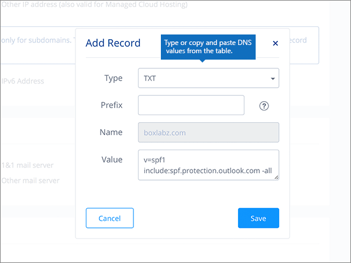
  
7. Select **Save**. 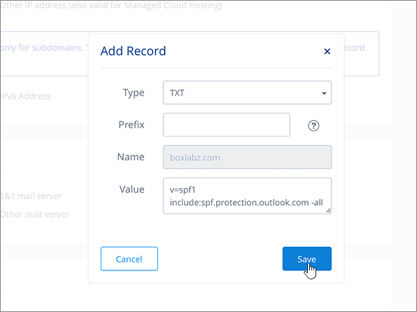
  
8. Select **Save**. 
  
9. In the **Edit DNS Settings** dialog box, select **Yes**. 
  
## Add the two SRV records that are required for Microsoft

Follow the steps below or [watch the video (start at 5:51)](https://docs.microsoft.com/microsoft-365/admin/dns/create-dns-records-at-1-1-internet).
  
> [!NOTE]
> If you've registered with 1und1.de, [sign in here](https://go.microsoft.com/fwlink/?linkid=859152). 
  
1. To get started, go to your domains page at 1&1 IONOS by using [this link](https://my.1and1.com/). You'll be prompted to log in.
    
2. Select **Manage domains**.
    
3. On the **Domain Center** page, find the domain that you want to update, and then select the **Panel** ( **v**) control for that domain.
    
4. In the **Domain Settings** area, select **Edit DNS Settings**.
    
5. In the **TXT and SRV Records** section, select **Add Record**.
    
6. Add the first of the two SRV records. In the **Add Record** area, in the boxes for the new record, type or copy and paste the values from the first row in the following table.  (Choose the **Type** and **TTL** values from the drop-down list.) 
    
    |**Type**|**Service**|**Protocol**|**Name**|**Host**|**Priority**|**Weight**|**Port**|**TTL**|
    |:-----|:-----|:-----|:-----|:-----|:-----|:-----|:-----|:-----|
    |SRV    |sip    |tls    |(Leave this field empty.)    |sipdir.online.lync.com    |100    |1    |443    |3600 (1 h)    |
    |SRV    |sipfederationtls    |tcp    |(Leave this field empty.)    |sipfed.online.lync.com    |100    |1    |5061    |3600 (1 h)    |  
    
    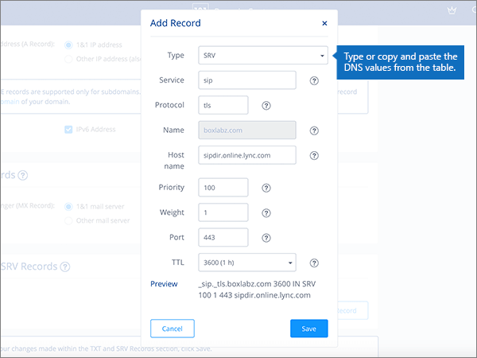
  
7. Select **Save**.  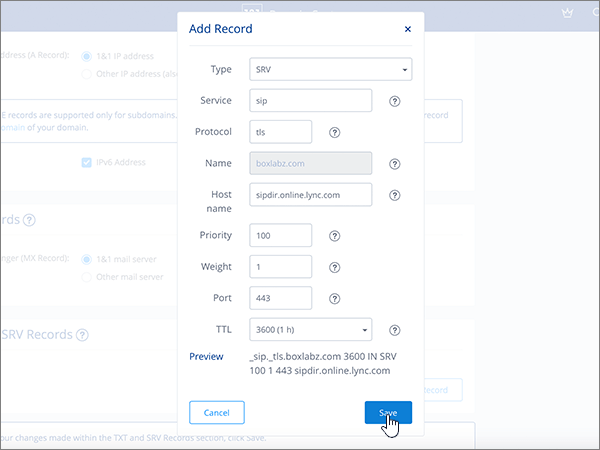
  
8. Select **Save**.  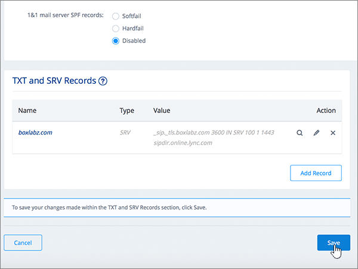
  
9. In the **Edit DNS Settings** dialog box, select **Yes**.  
  
10. Add the other SRV record.  In the **TXT and SRV Records** section, select **Add Record**.  In the **Add Record** area, create a record using the values from the other row in the table, and then again select **Add**, **Save**, and **Yes** to complete the record. 
    
> [!NOTE]
> Typically it takes about 15 minutes for DNS changes to take effect. However, it can occasionally take longer for a change you've made to update across the Internet's DNS system. If you're having trouble with mail flow or other issues after adding DNS records, see [Find and fix issues after adding your domain or DNS records](../get-help-with-domains/find-and-fix-issues.md). 
  
