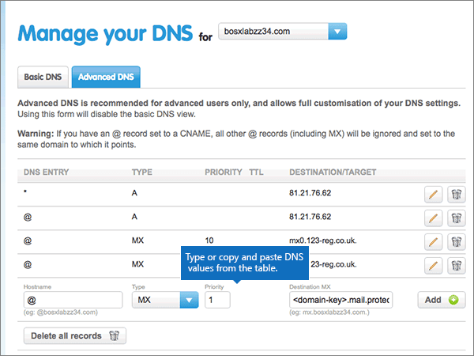
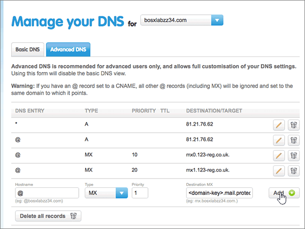
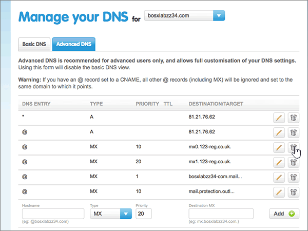
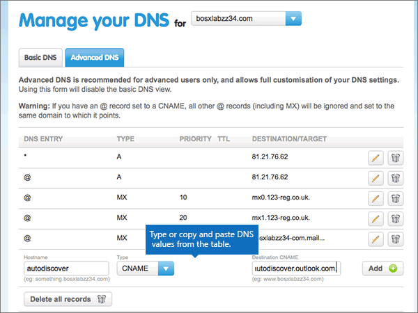
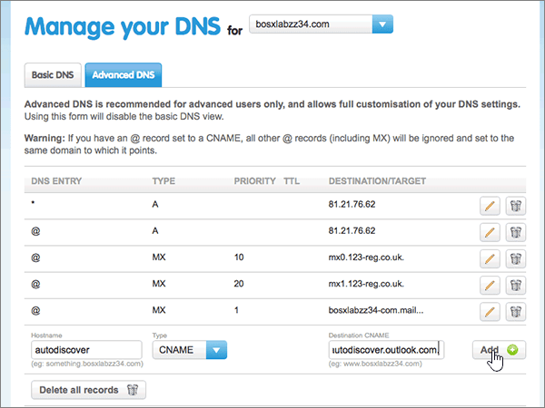
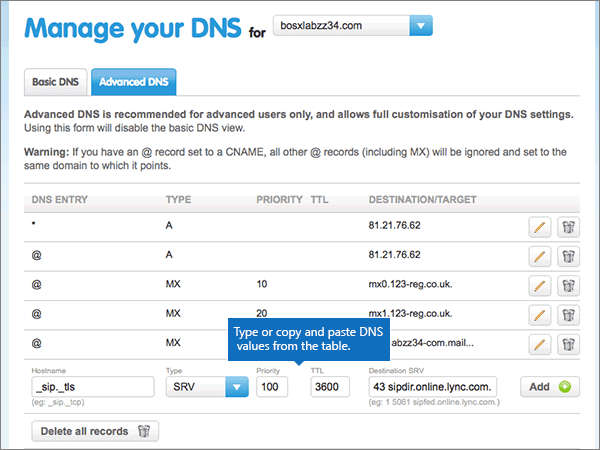
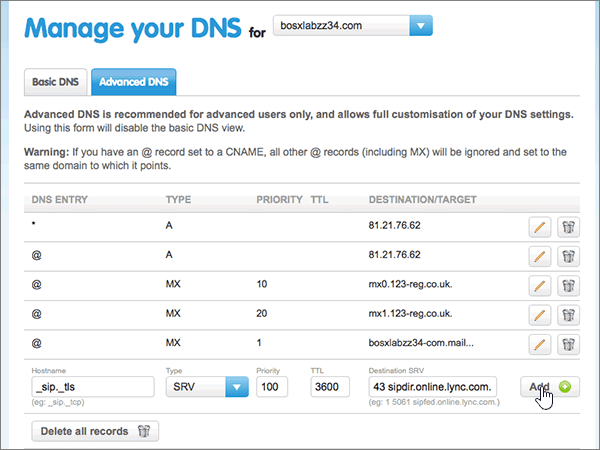

# Create DNS records at 123-reg.co.uk for Microsoft

 **[Check the Domains FAQ](../setup/domains-faq.md)** if you don't find what you're looking for. 
  
If 123-reg.co.uk is your DNS hosting provider, follow the steps in this article to verify your domain and set up DNS records for email, Skype for Business Online, and so on.
  
After you add these records at 123-reg.co.uk, your domain will be set up to work with Microsoft services.
  
  
> [!NOTE]
> Typically it takes about 15 minutes for DNS changes to take effect. However, it can occasionally take longer for a change you've made to update across the Internet's DNS system. If you're having trouble with mail flow or other issues after adding DNS records, see [Find and fix issues after adding your domain or DNS records](../get-help-with-domains/find-and-fix-issues.md). 
  
## Add a TXT record for verification

Before you use your domain with Microsoft, we have to make sure that you own it. Your ability to log in to your account at your domain registrar and create the DNS record proves to Microsoft that you own the domain.
  
> [!NOTE]
> This record is used only to verify that you own your domain; it doesn't affect anything else. You can delete it later, if you like. 
  
1. To get started, go to your domains page at 123-reg.co.uk by using [this link](https://www.123-reg.co.uk/secure/cpanel/domain/overview). You'll be prompted to log in first.
    
2. On the **Domain name overview** page, select the name of the domain that you want to edit. 
    
3. Choose **DNS** from the **Select action** drop-down list. 
    
4. On the **Manage your DNS** page, select the **Advanced DNS** tab. 
    
5. In the **Advanced DNS** section, in the boxes for the new record, type or copy and paste the values from the following table. 
    
    (Choose the **Type** value from the drop-down list.) 
    
    ||||
    |:-----|:-----|:-----|
    |**Hostname**   |**Type**   |**Destination TXT/SPF**   |
    |@    |TXT/SPF    |MS=ms *XXXXXXXX*    **Note:** This is an example. Use your specific **Destination or Points to Address** value here, from the table. [How do I find this?](../get-help-with-domains/information-for-dns-records.md)          |
   
6. Select **Add**.
    
7. Wait a few minutes before you continue, so that the record you just created can update across the Internet.
    
Now that you've added the record at your domain registrar's site, you'll go back to Microsoft and request a search for the record.
  
When Microsoft finds the correct TXT record, your domain is verified.
  
1. In the Microsoft admin center, go to the **Settings** \> <a href="https://go.microsoft.com/fwlink/p/?linkid=834818" target="_blank">Domains</a> page.

    
2. On the **Domains** page, select the domain that you are verifying. 
    
3. On the **Setup** page, select **Start setup**.
    
4. On the **Verify domain** page, select **Verify**.
    
> [!NOTE]
> Typically it takes about 15 minutes for DNS changes to take effect. However, it can occasionally take longer for a change you've made to update across the Internet's DNS system. If you're having trouble with mail flow or other issues after adding DNS records, see [Find and fix issues after adding your domain or DNS records](../get-help-with-domains/find-and-fix-issues.md). 
  
## Add an MX record so email for your domain will come to Microsoft

1. To get started, go to your domains page at 123-reg.co.uk by using [this link](https://www.123-reg.co.uk/secure/cpanel/domain/overview). You'll be prompted to log in first.
    
2. On the **Domain name overview** page, select the name of the domain that you want to edit. 
    
3. Choose **DNS** from the **Select action** drop-down list. 
    
4. On the **Manage your DNS** page, select the **Advanced DNS** tab. 
    
5. In the **Advanced DNS** section, in the boxes for the new record, type or copy and paste the values from the following table. 
    
    (Choose the **Type** value from the drop-down list.) 
    
    |**Hostname**|**Type**|**Priority**|**Destination MX**|
    |:-----|:-----|:-----|:-----|
    |@    |MX    |1    For more information about priority, see [What is MX priority?](https://docs.microsoft.com/microsoft-365/admin/setup/domains-faq)   | *\<domain-key\>*  .mail.protection.outlook.com.    **This value MUST end with a period (.)**   **Note:** Get your \<domain-key\> from your Microsoft account. [How do I find this?](../get-help-with-domains/information-for-dns-records.md)          |
   
    
  
6. Select **Add**.
    
    
  
7. If there are any other MX records, remove each one by choosing the **Delete (trash can)** icon for that record. 
    
    
  
## Add the six CNAME records that are required for Microsoft

1. To get started, go to your domains page at 123-reg.co.uk by using [this link](https://www.123-reg.co.uk/secure/cpanel/domain/overview). You'll be prompted to log in first.
    
2. On the **Domain name overview** page, select the name of the domain that you want to edit. 
    
3. Choose **DNS** from the **Select action** drop-down list. 
    
4. On the **Manage your DNS** page, select the **Advanced DNS** tab. 
    
5. Add the first of the six CNAME records.
    
    In the **Advanced DNS** section, in the boxes for the new record, type or copy and paste the values from the following table. 
    
    (Choose the **Type** value from the drop-down list.) 
    
    |**Hostname**|**Type**|**Destination CNAME**|
    |:-----|:-----|:-----|
    |autodiscover    |CNAME    |autodiscover.outlook.com.    **This value MUST end with a period (.)**   |
    |sip    |CNAME    |sipdir.online.lync.com.    **This value MUST end with a period (.)**   |
    |lyncdiscover    |CNAME    |webdir.online.lync.com.    **This value MUST end with a period (.)**   |
    |enterpriseregistration    |CNAME    |enterpriseregistration.windows.net.    **This value MUST end with a period (.)**   |
    |enterpriseenrollment    |CNAME    |enterpriseenrollment-s.manage.microsoft.com.    **This value MUST end with a period (.)**   |
   
    
  
6. Select **Add**.
    
    
  
7. Add the other five CNAME records.
    
    In the **Advanced DNS** section, create a record using the values from the next row in the table, and then again select **Add** to complete that record. 
    
    Repeat this process until you have created all six CNAME records.
    
## Add a TXT record for SPF to help prevent email spam

> [!IMPORTANT]
> You cannot have more than one TXT record for SPF for a domain. If your domain has more than one SPF record, you'll get email errors, as well as delivery and spam classification issues. If you already have an SPF record for your domain, don't create a new one for Microsfot. Instead, add the required Microsoft values to the current record so that you have a  *single*  SPF record that includes both sets of values. Need examples? Check out these [External Domain Name System records for Microsoft](https://docs.microsoft.com/microsoft-365/enterprise/external-domain-name-system-records#external-dns-records-required-for-spf). To validate your SPF record, you can use one of these [SPF validation tools](../setup/domains-faq.md). 
  
1. To get started, go to your domains page at 123-reg.co.uk by using [this link](https://www.123-reg.co.uk/secure/cpanel/domain/overview). You'll be prompted to log in first.
    
2. On the **Domain name overview** page, select the name of the domain that you want to edit. 
    
3. Choose **DNS** from the **Select action** drop-down list. 
    
4. On the **Manage your DNS** page, select the **Advanced DNS** tab. 
    
5. In the **Advanced DNS** section, in the boxes for the new record, type or copy and paste the values from the following table. 
    
    (Choose the **Type** value from the drop-down list.) 
    
    |**Hostname**|**Type**|**Destination TXT/SPF**|
    |:-----|:-----|:-----|
    |@    |TXT/SPF    |v=spf1 include:spf.protection.outlook.com -all    **Note:** We recommend copying and pasting this entry, so that all of the spacing stays correct.           |
   
    
  
6. Select **Add**.
    
    
  
## Add the two SRV records that are required for Microsoft

1. To get started, go to your domains page at 123-reg.co.uk by using [this link](https://www.123-reg.co.uk/secure/cpanel/domain/overview). You'll be prompted to log in first.
    
2. On the **Domain name overview** page, select the name of the domain that you want to edit. 
    
3. Choose **DNS** from the **Select action** drop-down list. 
    
4. On the **Manage your DNS** page, select the **Advanced DNS** tab. 
    
5. Add the first of the two SRV records:
    
    In the **Advanced DNS** section, in the boxes for the new record, type or copy and paste the values from the following table. 
    
    (Choose the **Type** value from the drop-down list.) 
    
    ||||||
    |:-----|:-----|:-----|:-----|:-----|
    |Hostname|Type|Priority|TTL|Destination SRV|
    |_sip._tls|SRV|100|3600|1 443 sipdir.online.lync.com. **This value MUST end with a period (.)**  **Note:** We recommend copying and pasting this entry, so that all of the spacing stays correct.           |
    |_sipfederationtls._tcp|SRV|100|3600|1 5061 sipfed.online.lync.com. **This value MUST end with a period (.)**   **Note:** We recommend copying and pasting this entry, so that all of the spacing stays correct.           |
   
    
  
6. Select **Add**.
    
    
  
7. To add the other SRV record:
    
    In the **Advanced DNS** section, create a record by using the values from the second row in the table, and then again select **Add** to complete that record. 
    
> [!NOTE]
> Typically it takes about 15 minutes for DNS changes to take effect. However, it can occasionally take longer for a change you've made to update across the Internet's DNS system. If you're having trouble with mail flow or other issues after adding DNS records, see [Find and fix issues after adding your domain or DNS records](../get-help-with-domains/find-and-fix-issues.md). 
  
