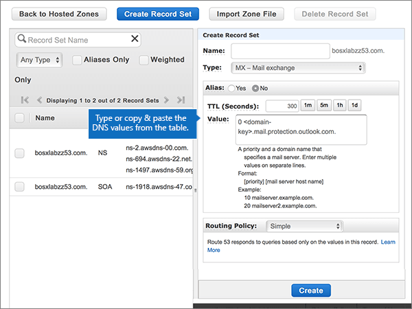
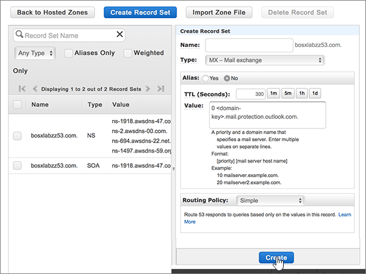
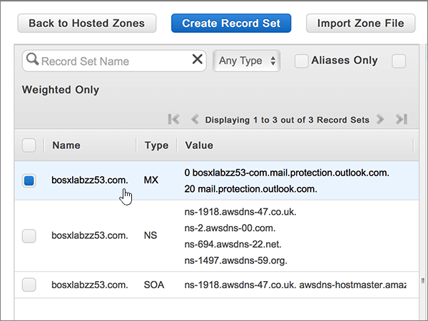
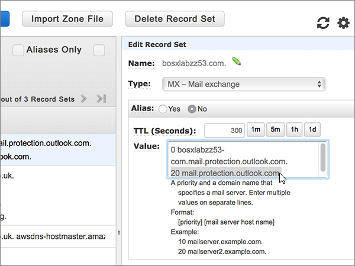
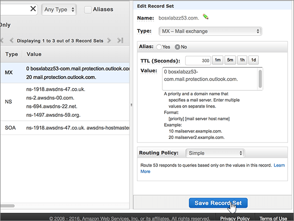
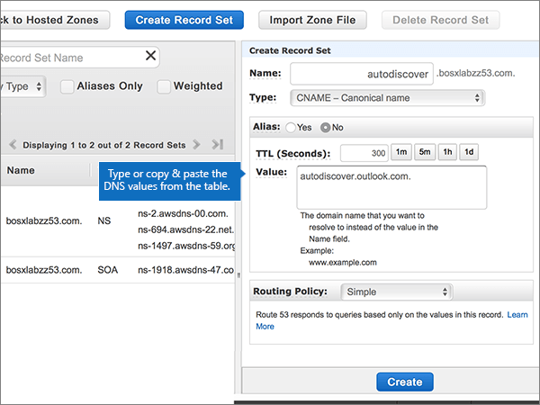
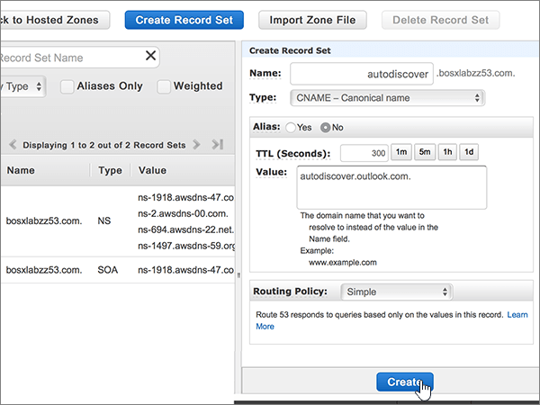
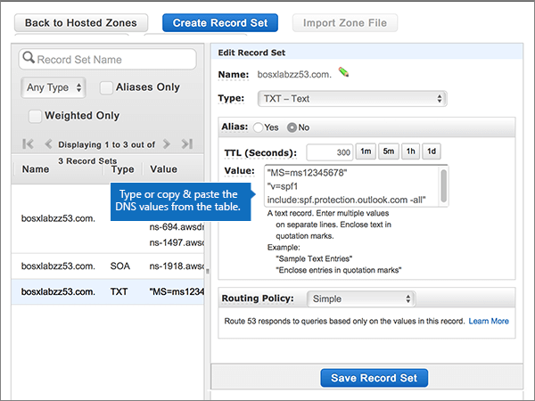
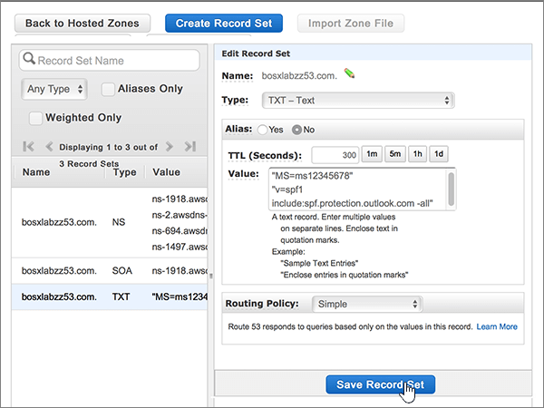
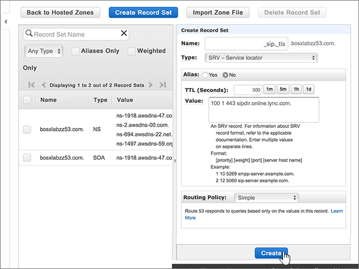

# Create DNS records at Amazon Web Services (AWS) for Microsoft

 **[Check the Domains FAQ](../setup/domains-faq.md)** if you don't find what you're looking for. 
  
If AWS is your DNS hosting provider, follow the steps in this article to verify your domain and set up DNS records for email, Skype Online for Business, and so on.
  
After you add these records at AWS, your domain will be set up to work with Microsoft services.
  

  
> [!NOTE]
> Typically it takes about 15 minutes for DNS changes to take effect. However, it can occasionally take longer for a change you've made to update across the Internet's DNS system. If you're having trouble with mail flow or other issues after adding DNS records, see [Find and fix issues after adding your domain or DNS records](../get-help-with-domains/find-and-fix-issues.md). 
  
## Add a TXT record for verification

Before you use your domain with Microsoft, we have to make sure that you own it. Your ability to log in to your account at your domain registrar and create the DNS record proves to Microsoft that you own the domain.
  
> [!NOTE]
> This record is used only to verify that you own your domain; it doesn't affect anything else. You can delete it later, if you like. 
  
1. To get started, go to your domains page at AWS by using [this link](https://console.aws.amazon.com/route53/home). You'll be prompted to log in first.
    
2. On the **Resources** page, select **Hosted Zones**.
    
3. On the **Hosted Zones** page, in the **Domain Name** column, select the name of the domain that you want to edit. 
    
4. Select **Create Record Set**.
    
5. In the **Create Record Set** area, in the boxes for the new record, type or copy and paste the values from the following table. 
    
    (Choose the **Type** and **Routing Policy** values from the drop-down lists.) 
    
    > [!TIP]
    > The quotation marks required by the onscreen instructions are supplied automatically. You don't need to type them manually. 
  
    |||||||
    |:-----|:-----|:-----|:-----|:-----|:-----|
    |**Name**   |**Type**   |**Alias**   |**TTL (Seconds)**   |**Value**   |**Routing Policy**   |
    |(Leave this field empty.)    |TXT - Text    |No    |300    |MS=ms *XXXXXXXX*   **Note:** This is an example. Use your specific **Destination or Points to Address** value here, from the table in Microsoft 365. [How do I find this?](../get-help-with-domains/information-for-dns-records.md)          |Simple    |
   
6. Select **Create**.
    
7. Wait a few minutes before you continue, so that the record you just created can update across the Internet.
    
Now that you've added the record at your domain registrar's site, you'll go back to Microsoft and request a search for the record.
  
When Microsoft finds the correct TXT record, your domain is verified.
  
1. In the Microsoft admin center, go to the **Settings** \> <a href="https://go.microsoft.com/fwlink/p/?linkid=834818" target="_blank">Domains</a> page.

    
2. On the **Domains** page, select the domain that you are verifying. 
    
3. On the **Setup** page, select **Start setup**.
    
4. On the **Verify domain** page, select **Verify**.
    
> [!NOTE]
> Typically it takes about 15 minutes for DNS changes to take effect. However, it can occasionally take longer for a change you've made to update across the Internet's DNS system. If you're having trouble with mail flow or other issues after adding DNS records, see [Find and fix issues after adding your domain or DNS records](../get-help-with-domains/find-and-fix-issues.md). 
  
## Add an MX record so email for your domain will come to Microsoft 365

1. To get started, go to your domains page at AWS by using [this link](https://console.aws.amazon.com/route53/home). You'll be prompted to log in first.
    
2. On the **Resources** page, select **Hosted Zones**.
    
3. On the **Hosted Zones** page, in the **Domain Name** column, select the name of the domain that you want to edit. 
    
4. Select **Create Record Set**.
    
5. In the **Create Record Set** area, in the boxes for the new record, type or copy and paste the values from the following table. 
    
    (Choose the **Type** and **Routing Policy** values from the drop-down lists.) 
    
    |**Name**|**Type**|**Alias**|**TTL (Seconds)**|**Value**|**Routing Policy**|
    |:-----|:-----|:-----|:-----|:-----|:-----|
    |(Leave this field empty.)    |MX - Mail exchange    |No    |300    |0  *\<domain-key\>*  .mail.protection.outlook.com.    The 0 is the MX priority value. Add it to the beginning of the MX value, separated from the remainder of the value by a space.    **This value MUST end with a period (.)**   **Note:** Get your \<*domain-key*\> from your Microsoft 365 account. [How do I find this?](../get-help-with-domains/information-for-dns-records.md)          |Simple    |
       
    
  
6. Select **Create**.
    
    
  
7. If there are any other MX records, remove them.
    
    > [!IMPORTANT]
    > AWS stores MX records as a set that may contain multiple records. **DO NOT** select **Delete Record Set**, as this will delete all of your MX records, including the one you just added. Use the following instructions instead. 
  
    First, select the MX record set.
    
    
  
    Next, in the **Edit Record Set** area, delete each obsolete MX record by selecting the entry in the **Value** box and then pressing the **Delete** key on your keyboard. 
    
    
  
8. Select **Save Record Set**.
    
    
  
## Add the five CNAME records that are required for Microsoft 365

1. To get started, go to your domains page at AWS by using [this link](https://console.aws.amazon.com/route53/home). You'll be prompted to log in first.
    
2. On the **Resources** page, select **Hosted Zones**.
    
3. On the **Hosted Zones** page, in the **Domain Name** column, select the name of the domain that you want to edit. 
    
4. Select **Create Record Set**.
    
5. Add the first CNAME record.
    
    In the **Create Record Set** area, in the boxes for the new record, type or copy and paste the values from the first row in the following table. 
    
    (Choose the **Type** and **Routing Policy** values from the drop-down lists.) 
    
    |**Name**|**Type**|**Alias**|**TTL (Seconds)**|**Value**|**Routing Policy**|
    |:-----|:-----|:-----|:-----|:-----|:-----|
    |autodiscover    |CNAME - Canonical name    |No    |300    |autodiscover.outlook.com.    **This value MUST end with a period (.)**   |Simple    |
    |sip    |CNAME - Canonical name    |No    |300    |sipdir.online.lync.com.    **This value MUST end with a period (.)**   |Simple    |
    |lyncdiscover    |CNAME - Canonical name    |No    |300    |webdir.online.lync.com.    **This value MUST end with a period (.)**   |Simple    |
    |enterpriseregistration    |CNAME - Canonical name    |No    |300    |enterpriseregistration.windows.net.    **This value MUST end with a period (.)**   |Simple    |
    |enterpriseenrollment    |CNAME - Canonical name    |No    |300    |enterpriseenrollment-s.manage.microsoft.com.    **This value MUST end with a period (.)**   |Simple    |
   
    
  
6. Select **Create**.
    
    
  
7. Add the other four CNAME records.
    
    In the **Hosted Zones** page, select **Create Record Set**, create a record using the values from the next row in the table, and then again select **Create** to complete that record. 
    
    Repeat this process until you have created all five CNAME records.
    
## Add a TXT record for SPF to help prevent email spam

> [!IMPORTANT]
> You cannot have more than one TXT record for SPF for a domain. If your domain has more than one SPF record, you'll get email errors, as well as delivery and spam classification issues. If you already have an SPF record for your domain, don't create a new one for Microsoft. Instead, add the required Microsoft values to the current record so that you have a  *single*  SPF record that includes both sets of values. Need examples? Check out these [External Domain Name System records for Microsoft](https://docs.microsoft.com/microsoft-365/enterprise/external-domain-name-system-records). To validate your SPF record, you can use one of these[SPF validation tools](../setup/domains-faq.md). 
  
1. To get started, go to your domains page at AWS by using [this link](https://console.aws.amazon.com/route53/home). You'll be prompted to log in first.
    
2. On the **Resources** page, select **Hosted Zones**.
    
3. On the **Hosted Zones** page, in the **Domain Name** column, select the name of the domain that you want to edit. 
    
4. Select the **TXT** record set. 
    
    
  
5. In the **Edit Record Set** area, at the end of the current entry in the **Value:** box for the existing record, press Enter on your keyboard to create a new line; and then, on that new line (under the existing value), type or copy and paste the value from the following table. (You can see an example in the illustration below the table.) 
    
    |**Value:**|
    |:-----|
    |v=spf1 include:spf.protection.outlook.com -all    (The quotation marks required by the onscreen instructions are supplied automatically. You don't need to type them manually.)    **Note:** We recommend copying and pasting this entry, so that all of the spacing stays correct.           |
   
    
  
6. Select **Save Record Set**.
    
    
  
## Add the two SRV records that are required for Microsoft 365

1. To get started, go to your domains page at AWS by using [this link](https://console.aws.amazon.com/route53/home). You'll be prompted to log in first.
    
2. On the **Resources** page, select **Hosted Zones**.
    
3. On the **Hosted Zones** page, in the **Domain Name** column, select the name of the domain that you want to edit. 
    
4. Select **Create Record Set**.
    
5. Add the first SRV record:
    
    In the **Create Record Set** area, in the boxes for the new record, type or copy and paste the values from the first row in the following table. 
    
    (Choose the **Type** and **Routing Policy** values from the drop-down lists.) 
    
    |**Name**|**Type**|**Alias**|**TTL (Seconds)**|**Value**|**Routing Policy**|
    |:-----|:-----|:-----|:-----|:-----|:-----|
    |_sip._tls|SRV - Service locator|No|300|100 1 443 sipdir.online.lync.com. **This value MUST end with a period (.)**>  **Note:** We recommend copying and pasting this entry, so that all of the spacing stays correct.           |Simple|
    |_sipfederationtls._tcp|SRV - Service locator|No|300|100 1 5061 sipfed.online.lync.com. **This value MUST end with a period (.)**  **Note:** We recommend copying and pasting this entry, so that all of the spacing stays correct.           |Simple|
   
    
  
6. Select **Create**.
    
    
  
7. To add the other SRV record:
    
    In the **Hosted Zones** page, select **Create Record Set**, create a record using the values from the next row in the table, and then again select **Create** to complete that record. 
    
> [!NOTE]
> Typically it takes about 15 minutes for DNS changes to take effect. However, it can occasionally take longer for a change you've made to update across the Internet's DNS system. If you're having trouble with mail flow or other issues after adding DNS records, see [Find and fix issues after adding your domain or DNS records](../get-help-with-domains/find-and-fix-issues.md). 
  
