# Create DNS records at Bluehost for Microsoft

 **[Check the Domains FAQ](../setup/domains-faq.md)** if you don't find what you're looking for. 
  
If Bluehost is your DNS hosting provider, follow the steps in this article to verify your domain and set up DNS records for email, Skype for Business Online, and so on.
  
After you add these records at Bluehost, your domain will be set up to work with Microsoft services.

> [!NOTE]
> Typically it takes about 15 minutes for DNS changes to take effect. However, it can occasionally take longer for a change you've made to update across the Internet's DNS system. If you're having trouble with mail flow or other issues after adding DNS records, see [Find and fix issues after adding your domain or DNS records](../get-help-with-domains/find-and-fix-issues.md). 
  
## Add a TXT record for verification

Before you use your domain with Microsoft, we have to make sure that you own it. Your ability to log in to your account at your domain registrar and create the DNS record proves to Microsoft that you own the domain.
  
> [!NOTE]
> This record is used only to verify that you own your domain; it doesn't affect anything else. You can delete it later, if you like. 
  
1. To get started, go to your domains page at Bluehost by using [this link](https://my.bluehost.com/cgi/dm). You'll be prompted to log in first.
    
2. On the **domains** page, in the **domain** area, find the row for the domain that you're changing, and then select the check box for that domain. 
    
    (You may have to scroll down.)
    
3. In the ***domain_name*** area, on the **DNS Zone Editor** row, select **Manage DNS records**.
    
4. On the **DNS Zone Editor** page, in the **Add DNS Record** area, in the boxes for the new record, type or copy and paste the values from the following table. 
    
    (Choose the **Type** value from the drop-down list.) 
    
    |||||
    |:-----|:-----|:-----|:-----|
    |**Host Record**   |**TTL**   |**Type**   |**TXT Value**   |
    |@    |14400    |TXT    |MS=ms *XXXXXXXX*    **Note:** This is an example. Use your specific **Destination or Points to Address** value here, from the table. [How do I find this?](../get-help-with-domains/information-for-dns-records.md)          |
   
5. Select **add record**.
    
6. Wait a few minutes before you continue, so that the record you just created can update across the Internet.
    
Now that you've added the record at your domain registrar's site, you'll go back to Microsoft and request a search for the record.
  
When Microsoft finds the correct TXT record, your domain is verified.
  
1. In the Microsoft admin center, go to the **Settings** \> <a href="https://go.microsoft.com/fwlink/p/?linkid=834818" target="_blank">Domains</a> page.

    
2. On the **Domains** page, select the domain that you are verifying. 
    
3. On the **Setup** page, select **Start setup**.
    
4. On the **Verify domain** page, select **Verify**.
    
> [!NOTE]
> Typically it takes about 15 minutes for DNS changes to take effect. However, it can occasionally take longer for a change you've made to update across the Internet's DNS system. If you're having trouble with mail flow or other issues after adding DNS records, see [Find and fix issues after adding your domain or DNS records](../get-help-with-domains/find-and-fix-issues.md). 
  
## Add an MX record so email for your domain will come to Microsoft

1. To get started, go to your domains page at Bluehost by using [this link](https://my.bluehost.com/cgi/dm). You'll be prompted to log in first.
    
2. On the **domains** page, in the **domain** area, find the row for the domain that you're changing, and then select the check box for that domain. 
    
    (You may have to scroll down.)
    
3. In the ***domain_name*** area, on the **DNS Zone Editor** row, select **Manage DNS records**.
    
4. On the **DNS Zone Editor** page, in the **Add DNS Record** area, in the boxes for the new record, type or copy and paste the values from the following table. 
    
    (Choose the **Type** value from the drop-down list.) 
    
    |**Host Record**|**TTL**|**Type**|**Points To**|**Priority**|
    |:-----|:-----|:-----|:-----|:-----|
    |@    |14400    |MX    | *\<domain-key\>*  .mail.protection.outlook.com   **Note:** Get your \<*domain-key*\> from your Microsoft account. [How do I find this?](../get-help-with-domains/information-for-dns-records.md)          |0    For more information about priority, see [What is MX priority?](https://docs.microsoft.com/microsoft-365/admin/setup/domains-faq)   |
   
   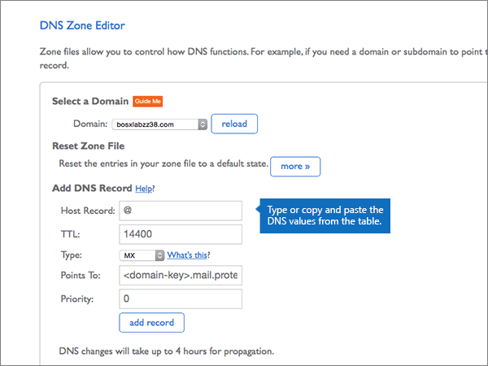
  
5. Select **add record**.
    
    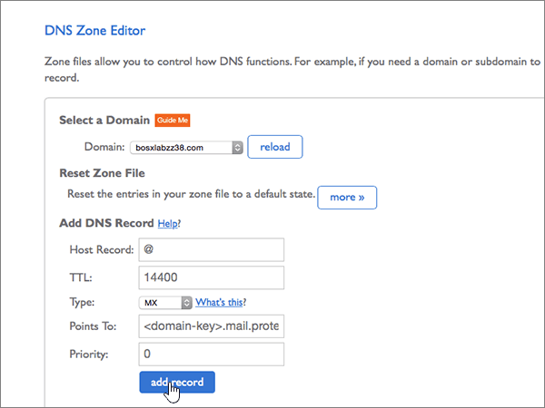
  
6. If there are any other MX records in the **MX (Mail Exchanger)** section, delete each of them. 
    
    For one of the other MX records, select **Delete.**
    
    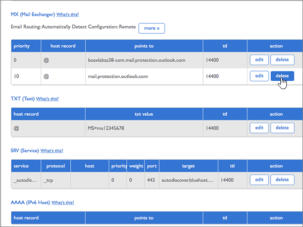
  
7. In the confirmation dialog box, select **OK**.
    
    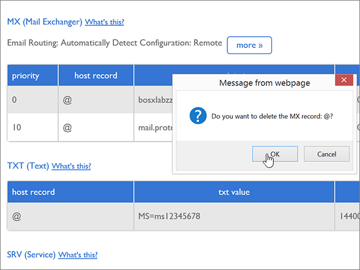
  
8. Use the same process to delete any other MX records that were already listed.
    
## Add the six CNAME records that are required for Microsoft

1. To get started, go to your domains page at Bluehost by using [this link](https://my.bluehost.com/cgi/dm). You'll be prompted to log in first.
    
2. On the **domains** page, in the **domain** area, find the row for the domain that you're changing, and then select the check box for that domain. 
    
    (You may have to scroll down.)
    
3. In the ***domain_name*** area, on the **DNS Zone Editor** row, select **Manage DNS records**.
    
4. In the **A (Host)** records section, find the row for the **autodiscover** record, and then select **delete** for that row. 
    
    > [!IMPORTANT]
    > You must delete the existing **autodiscover** record  *before*  adding the **autodiscover** record that is required by Microsoft. Bluehost does not allow you to maintain two **autodiscover** records simultaneously. 
  
    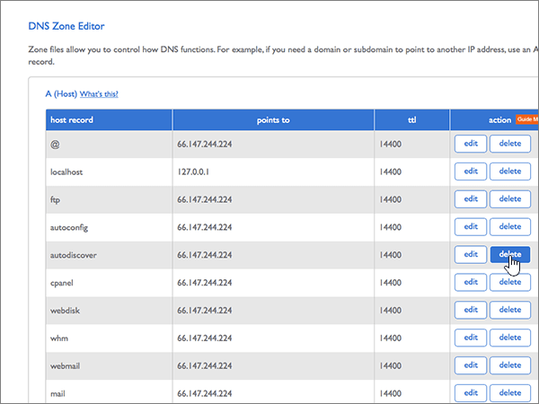
  
5. Select **OK**.
    
    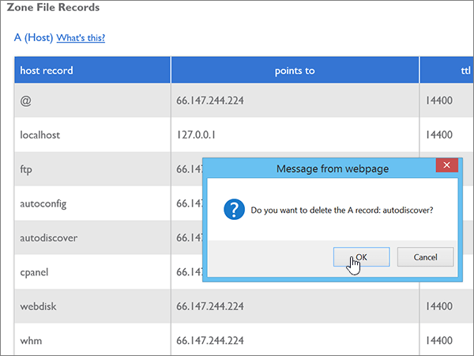
  
6. Create the first of the six CNAME records.
    
    On the **DNS Zone Editor** page, in the **Add DNS Record** area, in the boxes for the new record, type or copy and paste the values from the first row in the following table. 
    
    (Choose the **Type** value from the drop-down list.) 
    
    |**Host Record**|**TTL**|**Type**|**Points To**|
    |:-----|:-----|:-----|:-----|
    |autodiscover    |14400    |CNAME    |autodiscover.outlook.com    |
    |sip    |14400    |CNAME    |sipdir.online.lync.com    |
    |lyncdiscover    |14400    |CNAME    |webdir.online.lync.com    |
    |enterpriseregistration    |14400    |CNAME    |enterpriseregistration.windows.net    |
    |enterpriseenrollment    |14400    |CNAME    |enterpriseenrollment-s.manage.microsoft.com    |
   
    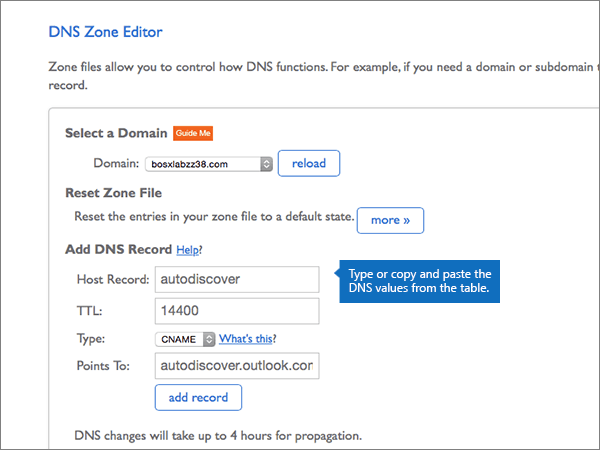
  
7. Select **add record**.
    
    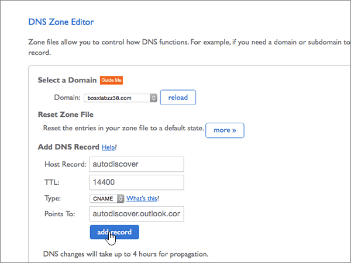
  
8. Add each of the other five CNAME records.
    
    Still in the **Add DNS Record** section, create a record by using the values from the next row in the table, and then again select **add record** to complete that record. 
    
    Repeat this process until you have created all six CNAME records.
    
## Add a TXT record for SPF to help prevent email spam

> [!IMPORTANT]
> You cannot have more than one TXT record for SPF for a domain. If your domain has more than one SPF record, you'll get email errors, as well as delivery and spam classification issues. If you already have an SPF record for your domain, don't create a new one for Microsoft. Instead, add the required Microsoft values to the current record so that you have a  *single*  SPF record that includes both sets of values. Need examples? Check out these [External Domain Name System records for Microsoft](https://docs.microsoft.com/microsoft-365/enterprise/external-domain-name-system-records). To validate your SPF record, you can use one of these[SPF validation tools](../setup/domains-faq.md). 
  
1. To get started, go to your domains page at Bluehost by using [this link](https://my.bluehost.com/cgi/dm). You'll be prompted to log in first.
    
2. On the **domains** page, in the **domain** area, find the row for the domain that you're changing, and then select the check box for that domain. 
    
    (You may have to scroll down.)
    
3. In the ***domain_name*** area, on the **DNS Zone Editor** row, select **Manage DNS records**.
    
4. On the **DNS Zone Editor** page, in the **Add DNS Record** area, in the boxes for the new record, type or copy and paste the values from the following table. 
    
    (Choose the **Type** value from the drop-down list.) 
        
    |**Host Record**|**TTL**|**Type**|**TXT Value**|
    |:-----|:-----|:-----|:-----|
    |@    |14400    |TXT    |v=spf1 include:spf.protection.outlook.com -all   **Note:** We recommend copying and pasting this entry, so that all of the spacing stays correct.           |
   
    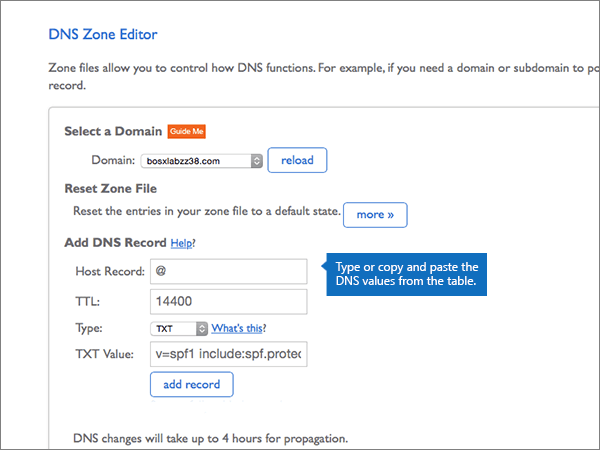
  
5. Select **add record**.
    
    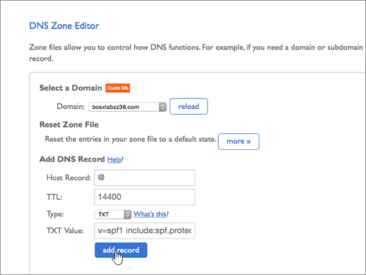
  
## Add the two SRV records that are required for Microsoft

1. To get started, go to your domains page at Bluehost by using [this link](https://my.bluehost.com/cgi/dm). You'll be prompted to log in first.
    
2. On the **domains** page, in the **domain** area, find the row for the domain that you're changing, and then select the check box for that domain. 
    
    (You may have to scroll down.)
    
3. In the ***domain_name*** area, on the **DNS Zone Editor** row, select **Manage DNS records**.
    
4. Create the first of the two SRV records.
    
    On the **DNS Zone Editor** page, in the **Add DNS Record** area, in the boxes for the new record, type or copy and paste the values from the first row in the following table. 
    
    (Choose the **Type** value from the drop-down list.) 
    
    |**Service**|**Protocol**|**Host**|**TTL**|**Type**|**Priority**|**Weight**|**Port**|**Points To**|
    |:-----|:-----|:-----|:-----|:-----|:-----|:-----|:-----|:-----|
    |_sip    |_tls    |@    |14400    |SRV    |100    |1    |443    |sipdir.online.lync.com    |
    |_sipfederationtls    |_tcp    |@    |14400    |SRV    |100    |1    |5061    |sipfed.online.lync.com    |
   
    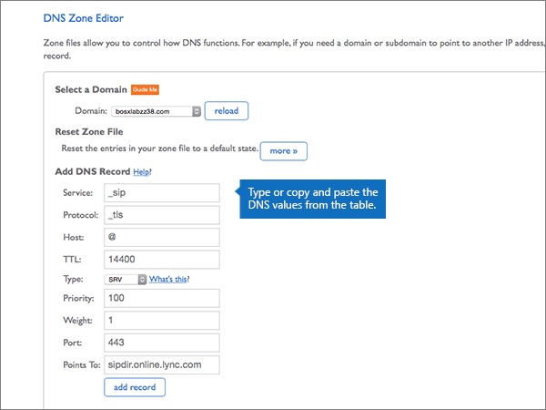
  
5. Select **add record**.
    
    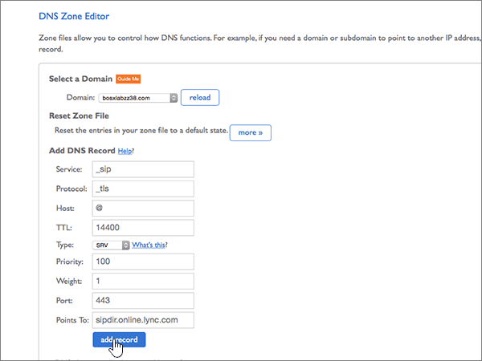
  
6. Add the other SRV record.
    
    Still in the **Add DNS Record** section, create a record by using the values from the other row in the table, and then again select **add record** to complete that record. 
    
> [!NOTE]
> Typically it takes about 15 minutes for DNS changes to take effect. However, it can occasionally take longer for a change you've made to update across the Internet's DNS system. If you're having trouble with mail flow or other issues after adding DNS records, see [Find and fix issues after adding your domain or DNS records](../get-help-with-domains/find-and-fix-issues.md). 
  

