# Create DNS records at Crazy Domains for Microsoft

 **[Check the Domains FAQ](../setup/domains-faq.md)** if you don't find what you're looking for. 
  
If Crazy Domains is your DNS hosting provider, follow the steps in this article to verify your domain and set up DNS records for email, Skype for Business Online, and so on.
  
After you add these records at Crazy Domains, your domain will be set up to work with Microsoft services.
  

  
> [!NOTE]
> Typically it takes about 15 minutes for DNS changes to take effect. However, it can occasionally take longer for a change you've made to update across the Internet's DNS system. If you're having trouble with mail flow or other issues after adding DNS records, see [Troubleshoot issues after changing your domain name or DNS records](../get-help-with-domains/find-and-fix-issues.md). 
  
## Add a TXT record for verification

Before you use your domain with Microsoft, we have to make sure that you own it. Your ability to log in to your account at your domain registrar and create the DNS record proves to Microsoft that you own the domain.
  
> [!NOTE]
> This record is used only to verify that you own your domain; it doesn't affect anything else. You can delete it later, if you like. 
  
1. To get started, go to your domains page at Crazy Domains by using [this link](https://manage.crazydomains.com/members/domains/). You'll be prompted to log in first.
    
    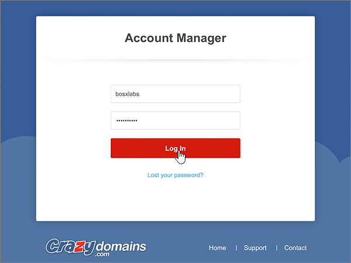
  
2. In the **My Account** section, select **Domains**.
    
    
  
3. On the **Domain Names** page, in the **Domain** section, select the name of the domain that you are updating. 
    
    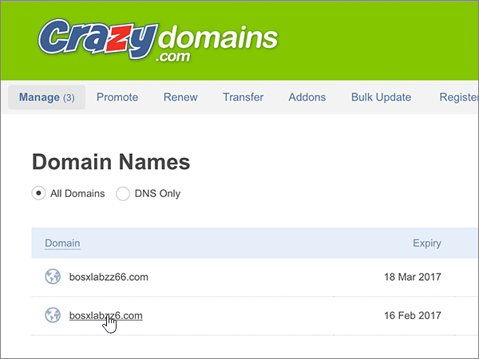
  
4. In the **DNS Settings** section, select the drop-down list icon. 
    
    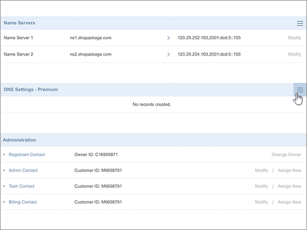
  
5. Select **Add Record**.
    
    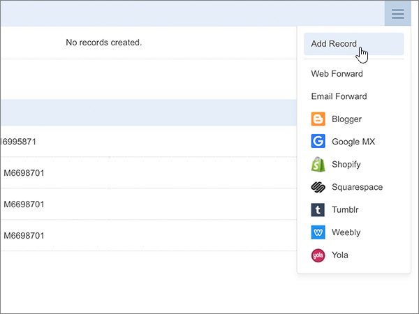
  
6. Choose **TXT Record** from the **Add Record** drop-down list. 
    
    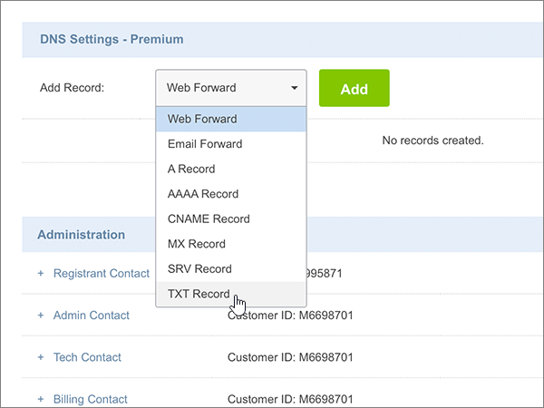
  
7. Select **Add**.
    
    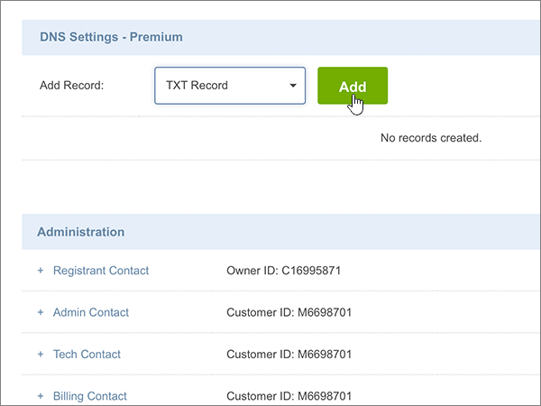
  
8. In the boxes for the new record, type or copy and paste the values from the following table.
    
    |**Sub Domain**|**Text Record**|
    |:-----|:-----|
    |(Leave this field empty.)    |MS=ms *XXXXXXXX*    **Note:** This is an example. Use your specific **Destination or Points to Address** value here, from the table.           [How do I find this?](../get-help-with-domains/information-for-dns-records.md)          |
   
    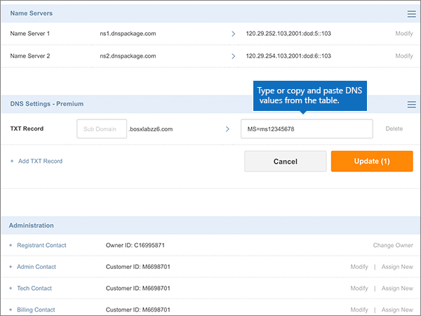
  
9. Select **Update**.
    
    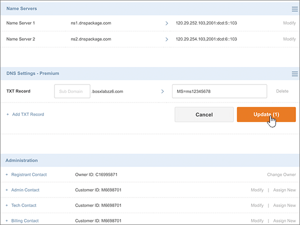
  
10. Wait a few minutes before you continue, so that the record you just created can update across the Internet.
    
Now that you've added the record at your domain registrar's site, you'll go back to Microsoft and request the record.
  
When Microsoft finds the correct TXT record, your domain is verified.
  
1. In the Microsoft admin center, go to the **Settings** \> <a href="https://go.microsoft.com/fwlink/p/?linkid=834818" target="_blank">Domains</a> page.

    
2. On the **Domains** page, select the domain that you are verifying. 
    
    
  
3. On the **Setup** page, select **Start setup**.
    
    
  
4. On the **Verify domain** page, select **Verify**.
    
    
  
> [!NOTE]
>  Typically it takes about 15 minutes for DNS changes to take effect. However, it can occasionally take longer for a change you've made to update across the Internet's DNS system. If you're having trouble with mail flow or other issues after adding DNS records, see [Troubleshoot issues after changing your domain name or DNS records](../get-help-with-domains/find-and-fix-issues.md). 
  
## Add an MX record so email for your domain will come to Microsoft

1. To get started, go to your domains page at Crazy Domains by using [this link](https://manage.crazydomains.com/members/domains/). You'll be prompted to log in first.
    
    
  
2. In the **My Account** section, select **Domains**.
    
    
  
3. On the **Domain Names** page, in the **Domain** section, select the name of the domain that you are updating. 
    
    
  
4. In the **DNS Settings** section, select the drop-down list icon. 
    
    
  
5. Select **Add Record**.
    
    
  
6. Choose **MX Record** from the **Add Record:** drop-down list. 
    
    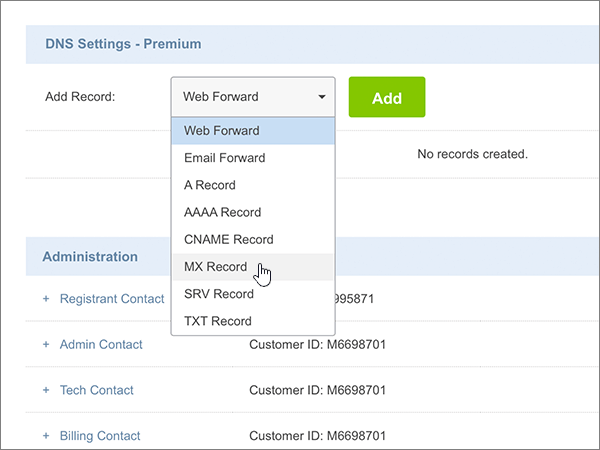
  
7. Select **Add**.
    
    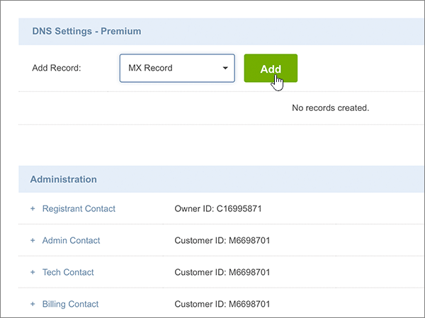
  
8. In the boxes for the new record, type or copy and paste the values from the following table.
    
    (Choose the **Priority** value from the drop-down list.) 
    
    |**Mail For Zone**|**Priority**|**Assigned To Server**|
    |:-----|:-----|:-----|
    |(Leave this field empty.)    |1    For more information about priority, see [What is MX priority?](https://docs.microsoft.com/microsoft-365/admin/setup/domains-faq)   | *\<domain-key\>*  .mail.protection.outlook.com    **Note:** Get your  *\<domain-key\>*  from your Microsoft account.           [How do I find this?](../get-help-with-domains/information-for-dns-records.md)          |
       
   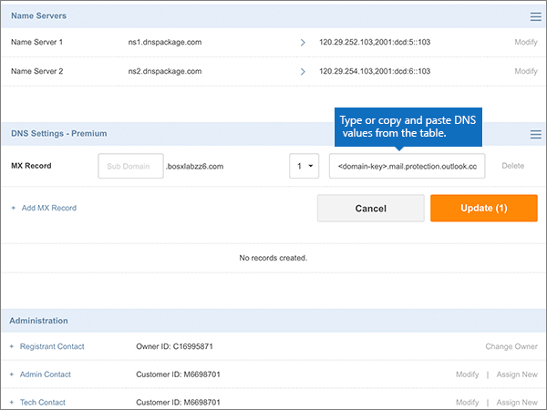
  
9. Select **Update**.
    
    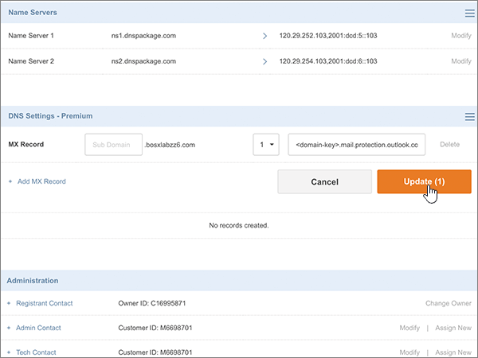
  
10. If there are any other MX records listed in the **MX Record** section, select **Modify** for one of those records. 
    
    
  
11. Select **Delete**.
    
    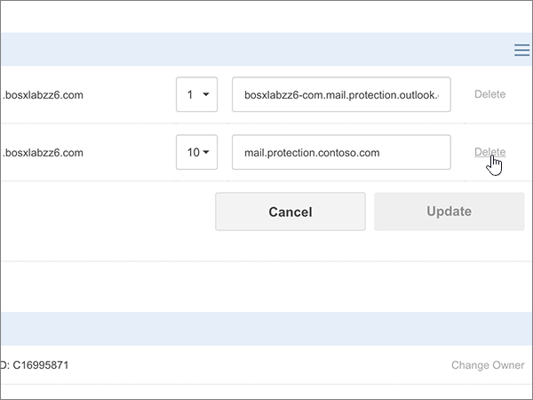
  
12. Select **Update** to confirm the deletion. 
    
    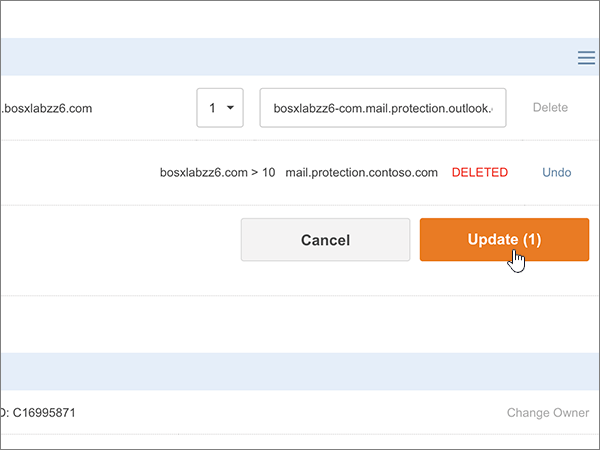
  
13. Use the same process to remove any other MX records in the list, until only the one that you added earlier in this procedure remains.
    
## Add the six CNAME records that are required for Microsoft

1. To get started, go to your domains page at Crazy Domains by using [this link](https://manage.crazydomains.com/members/domains/). You'll be prompted to log in first.
    
    
  
2. In the **My Account** section, select **Domains**.
    
    
  
3. On the **Domain Names** page, in the **Domain** section, select the name of the domain that you are updating. 
    
    
  
4. In the **DNS Settings** section, select the drop-down list icon. 
    
    
  
5. Select **Add Record**.
    
    
  
6. Choose **CNAME Record** from the **Add Record:** drop-down list. 
    
    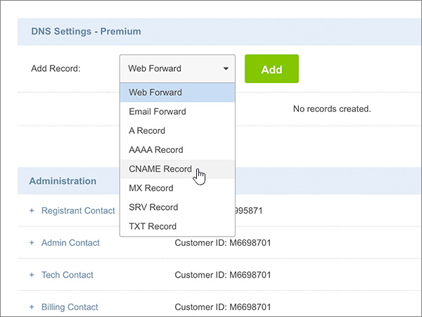
  
7. Select **Add**.
    
    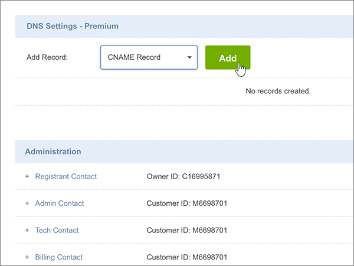
  
8. Add the first of the six CNAME records.
    
    In the boxes for the new record, type or copy and paste the values from the first row of the following table.
    
    |**Sub Domain**|**Alias for**|
    |:-----|:-----|
    |autodiscover    |autodiscover.outlook.com    |
    |sip    |sipdir.online.lync.com    |
    |lyncdiscover    |webdir.online.lync.com    |
    |enterpriseregistration    |enterpriseregistration.windows.net    |
    |enterpriseenrollment    |enterpriseenrollment-s.manage.microsoft.com    |
   
    
  
9. Select **Add CNAME Record**.
    
    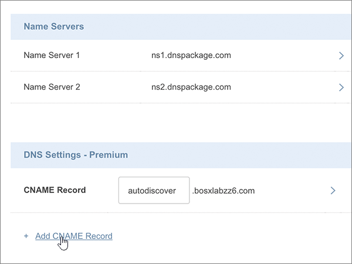
  
10. Add the second CNAME record.
    
    In the boxes for the new record, use the values from the next row in the table, and then again select **Add CNAME Record**.
    
    Repeat this process until you have created all six CNAME records.
    
11. Select **Update** to save your changes. 
    
    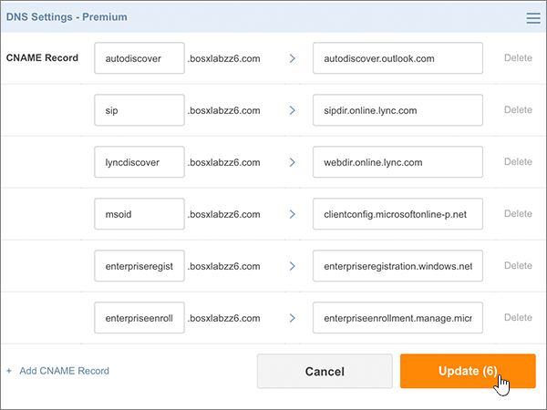
  
## Add a TXT record for SPF to help prevent email spam

> [!IMPORTANT]
> You cannot have more than one TXT record for SPF for a domain. If your domain has more than one SPF record, you'll get email errors, as well as delivery and spam classification issues. If you already have an SPF record for your domain, don't create a new one for Microsoft. Instead, add the required Microsoft values to the current record so that you have a  *single*  SPF record that includes both sets of values. 
  
1. To get started, go to your domains page at Crazy Domains by using [this link](https://manage.crazydomains.com/members/domains/). You'll be prompted to log in first.
    
    
  
2. In the **My Account** section, select **Domains**.
    
    
  
3. On the **Domain Names** page, in the **Domain** section, select the name of the domain that you are updating. 
    
    
  
4. In the **DNS Settings** section, select the drop-down list icon. 
    
    
  
5. Select **Add Record**.
    
    
  
6. Choose **TXT Record** from the **Add Record:** drop-down list. 
    
    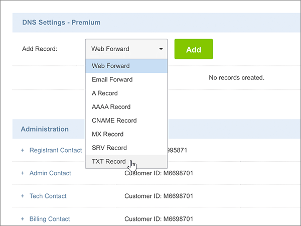
  
7. Select **Add**.
    
    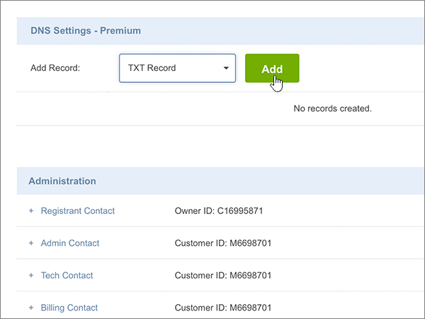
  
8. In the boxes for the new record, type or paste the values from the following table.
    
    |**Sub Domain**|**Text Record**|
    |:-----|:-----|
    |(Leave this field empty.)    |v=spf1 include:spf.protection.outlook.com -all    **Note:** We recommend copying and pasting this entry, so that all of the spacing stays correct.           |
   
    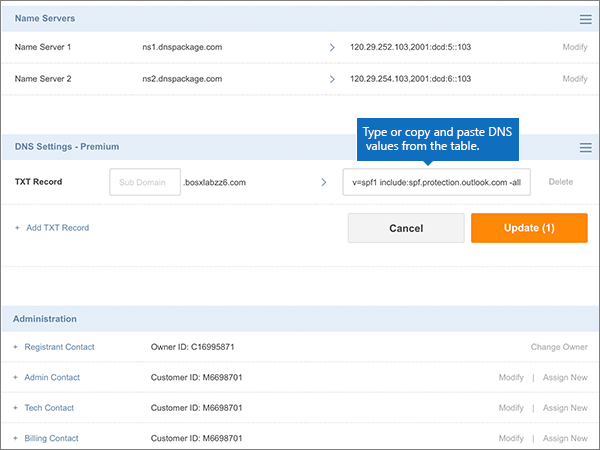
  
9. Select **Update**.
    
    
  
## Add the two SRV records that are required for Microsoft

1. To get started, go to your domains page at Crazy Domains by using [this link](https://manage.crazydomains.com/members/domains/). You'll be prompted to log in first.
    
    
  
2. In the **My Account** section, select **Domains**.
    
    
  
3. On the **Domain Names** page, in the **Domain** section, select the name of the domain that you are updating. 
    
    
  
4. In the **DNS Settings** section, select the drop-down list icon. 
    
    
  
5. Select **Add Record**.
    
    
  
6. Choose **SRV Record** from the **Add Record:** drop-down list. 
    
    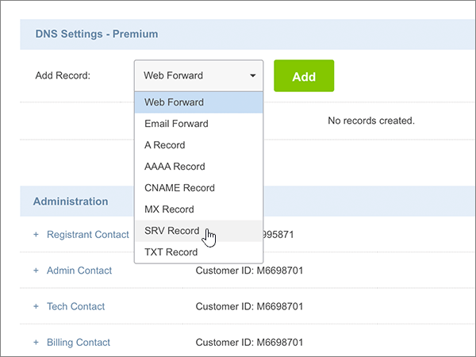
  
7. Select **Add**.
    
    
  
8. Add the first of the two SRV records.
    
    In the boxes for the new record, type or copy and paste the values from the first row of the following table.
    
    |**Record Type**|**Sub Domain**|**Priority**|**Weight**|**Port**|**Target**|
    |:-----|:-----|:-----|:-----|:-----|:-----|
    |SRV Record    |_sip._tls    |100    |1    |443    |sipdir.online.lync.com    |
    |SRV Record    |_sipfederationtls._tcp    |100    |1    |5061    |sipfed.online.lync.com    |
   
    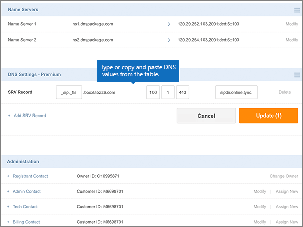
  
9. Select **Add SRV Record**.
    
    
  
10. Add the other SRV record.
    
    In the boxes for the new record, use the values from the second row in the table.
    
11. Select **Update** to save your changes. 
    
    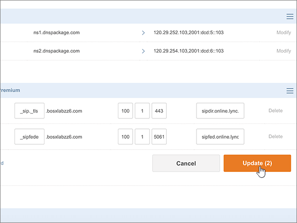
  
> [!NOTE]
> Typically it takes about 15 minutes for DNS changes to take effect. However, it can occasionally take longer for a change you've made to update across the Internet's DNS system. If you're having trouble with mail flow or other issues after adding DNS records, see [Troubleshoot issues after changing your domain name or DNS records](../get-help-with-domains/find-and-fix-issues.md). 
  
