# Create DNS records at DNSMadeEasy for Microsoft

 **[Check the Domains FAQ](../setup/domains-faq.yml)** if you don't find what you're looking for. 
  
If DNSMadeEasy is your DNS hosting provider, follow the steps in this article to verify your domain and set up DNS records for email, Skype for Business Online, and so on.
  
After you add these records at DNSMadeEasy, your domain will be set up to work with Microsoft services.
  

  
> [!NOTE]
> Typically it takes about 15 minutes for DNS changes to take effect. However, it can occasionally take longer for a change you've made to update across the Internet's DNS system. If you're having trouble with mail flow or other issues after adding DNS records, see [Find and fix issues after adding your domain or DNS records](../get-help-with-domains/find-and-fix-issues.md). 
  
## Add a TXT record for verification

Before you use your domain with Microsoft, we have to make sure that you own it. Your ability to log in to your account at your domain registrar and create the DNS record proves to Microsoft that you own the domain.
  
> [!NOTE]
> This record is used only to verify that you own your domain; it doesn't affect anything else. You can delete it later, if you like. 
  
> [!IMPORTANT]
> For DNSMadeEasy accounts, the domain you added was purchased from a separate domain registrar. DNSMadeEasy does not offer domain registration services. Your ability to log in at DNSMadeEasy and create the DNS record is sufficient proof of ownership. 
  
1. To get started, go to your domains page at DNSMadeEasy by using [this link](https://cp.dnsmadeeasy.com/). You'll be prompted to login first.
    
2. On the **Management Console** page, in the **Recently Updated Domains** area, select the domain that you want to update. 
    
3. On the **Managed DNS** page, in the **TXT Records** area, select the ( **+**) control ( **Add new**).
    
    (You may have to scroll down.)
    
4. In the **Add TXT Records** area, in the boxes for the new record, type or copy and paste the values from the following table. 
    
    ||||
    |:-----|:-----|:-----|
    |**Name**   |**Value**   |**TTL**   |
    |(Leave this field empty.)    |MS=ms *XXXXXXXX*    **Note:** This is an example. Use your specific **Destination or Points to Address** value here, from the table. [How do I find this?](../get-help-with-domains/information-for-dns-records.md)          |1800    |
   
5. Select **Submit**.
    
6. Wait a few minutes before you continue, so that the record you just created can update across the Internet.
    
Now that you've added the record at your domain registrar's site, you'll go back to Microsoft and request the record.
  
When Microsoft finds the correct TXT record, your domain is verified.
  
1. In the Microsoft admin center, go to the **Settings** \> <a href="https://go.microsoft.com/fwlink/p/?linkid=834818" target="_blank">Domains</a> page.

    
2. On the **Domains** page, select the domain that you are verifying. 
    
3. On the **Setup** page, select **Start setup**.
    
4. On the **Verify domain** page, select **Verify**.
    
> [!NOTE]
> Typically it takes about 15 minutes for DNS changes to take effect. However, it can occasionally take longer for a change you've made to update across the Internet's DNS system. If you're having trouble with mail flow or other issues after adding DNS records, see [Find and fix issues after adding your domain or DNS records](../get-help-with-domains/find-and-fix-issues.md). 
  
## Add an MX record so email for your domain will come to Microsoft

1. To get started, go to your domains page at DNSMadeEasy by using [this link](https://cp.dnsmadeeasy.com/). You'll be prompted to login first.
    
2. On the **Management Console** page, in the **Recently Updated Domains** area, select the domain that you want to update. 
    
    On the **Management Console** page, in the **Recently Updated Domains** area, select the domain that you want to update. 
    
    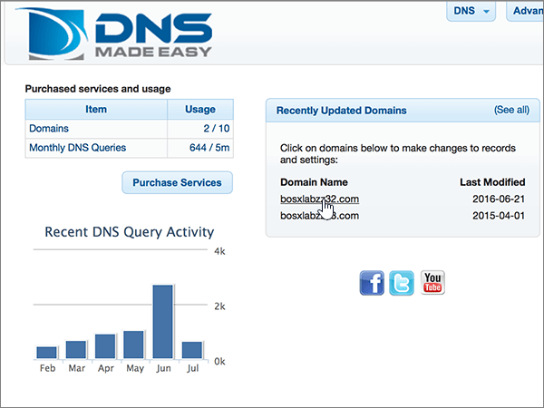
  
3. On the **Managed DNS** page, in the **MX Records** area, select the **(+)** control ( **Add new**).
    
    (You may have to scroll down.)
    
    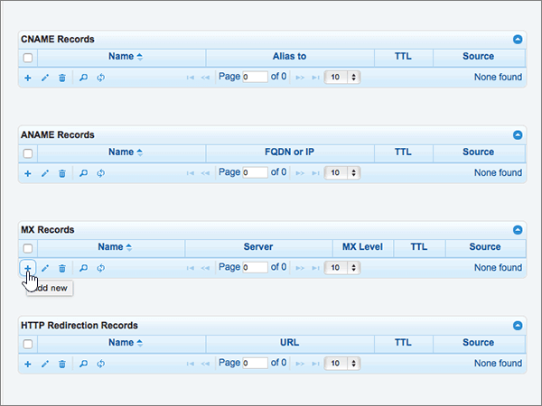
  
4. In the **Add MX Records** area, in the boxes for the new record, type or copy and paste the values from the following table. 
    
    (You may have to scroll down.)
    
    |**Name**|**Server**|**MX Level**|**TTL**|
    |:-----|:-----|:-----|:-----|
    |(Leave this field empty.)    | *\<domain-key\>*  .mail.protection.outlook.com    **This value MUST end with a period (.)**   **Note:** Get your \<*domain-key*\> from your Microsoft account. [How do I find this?](../get-help-with-domains/information-for-dns-records.md)          |10    For more information about priority, see [What is MX priority?](https://docs.microsoft.com/microsoft-365/admin/setup/domains-faq)   |1800    |
   
    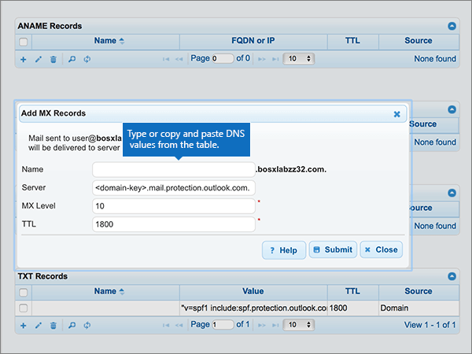
  
5. Select **Submit**.
    
    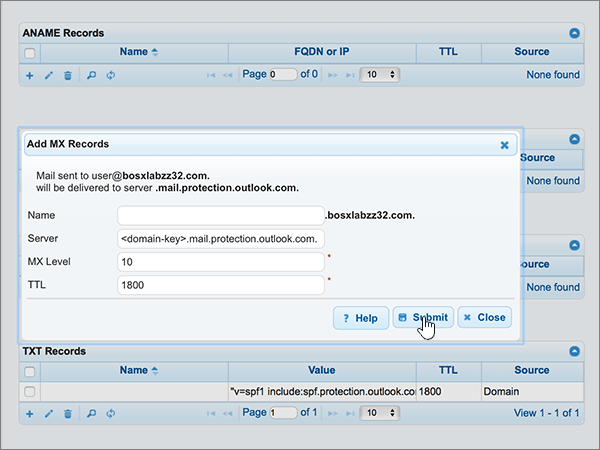
  
6. If there are any other MX records listed in the **MX Records** section, delete all of them by selecting each one. 
    
    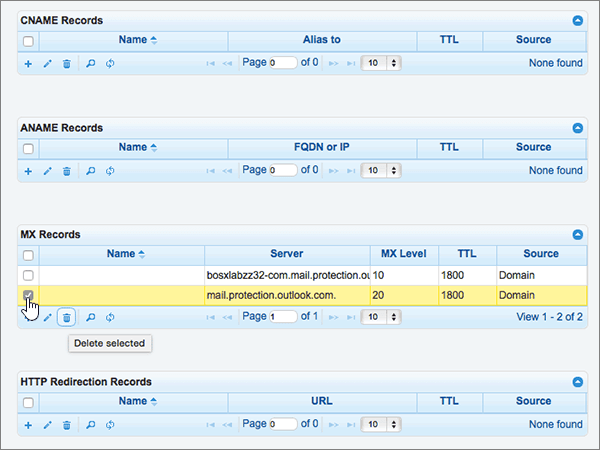
  
7. When all records are selected, select **Delete selected**.
    
    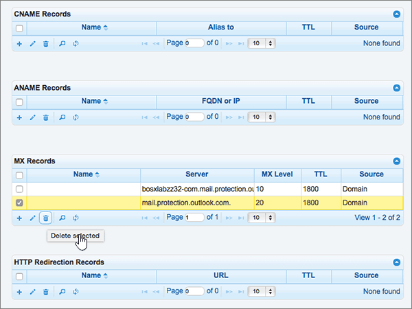
  
8. In the **Delete MX Records** dialog box, select **Delete** to confirm your changes. 
    
    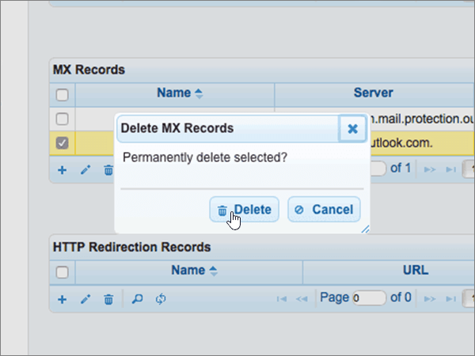
  
## Add the five CNAME records that are required for Microsoft

1. To get started, go to your domains page at DNSMadeEasy by using [this link](https://cp.dnsmadeeasy.com/). You'll be prompted to login first.
    
2. On the **Management Console** page, in the **Recently Updated Domains** area, select the domain that you want to update. 
    
3. On the **Managed DNS** page, in the **CNAME Records** area, select the **(+)** control ( **Add new**).
    
    (You may have to scroll down.)
    
    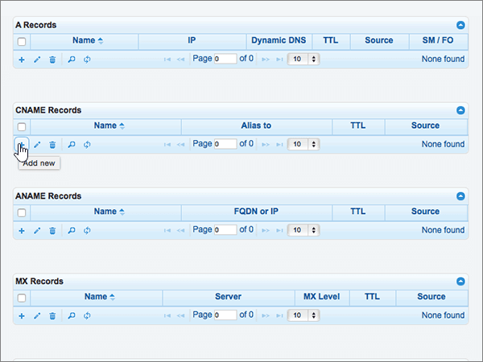
  
4. Add the first of the five CNAME records.
    
    In the **Add CNAME Records** area, in the boxes for the new record, type or copy and paste the values from the first row in the following table. 
    
    |**Name**|**Alias to**|**TTL**|
    |:-----|:-----|:-----|
    |autodiscover    |autodiscover.outlook.com.    **This value MUST end with a period (.)**   |1800    |
    |sip    |sipdir.online.lync.com.    **This value MUST end with a period (.)**   |1800    |
    |lyncdiscover    |webdir.online.lync.com.    **This value MUST end with a period (.)**   |1800    |
    |enterpriseregistration    |enterpriseregistration.windows.net.    **This value MUST end with a period (.)**   |1800    |
    |enterpriseenrollment    |enterpriseenrollment-s.manage.microsoft.com.    **This value MUST end with a period (.)**   |1800    |
   
    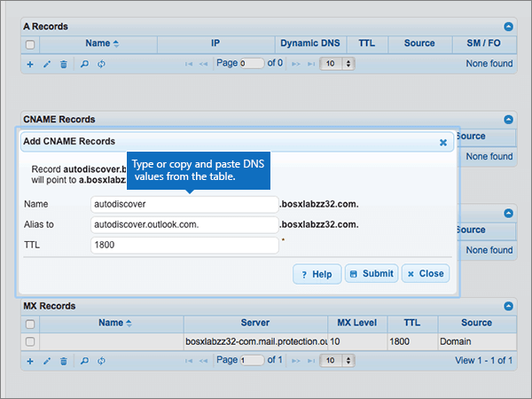
  
5. Select **Submit**.
    
    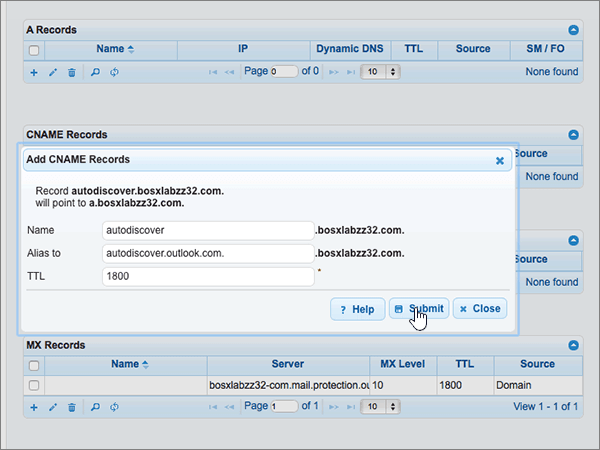
  
6. Add each of the other four CNAME records.
    
    In the **CNAME Records** section, select the **(+)** control ( **Add new**), create a record by using the values from the next row in the table, and then again select **Submit** to complete that record. 
    
    Repeat this process until you have created all five CNAME records.
    
## Add a TXT record for SPF to help prevent email spam

> [!IMPORTANT]
> You cannot have more than one TXT record for SPF for a domain. If your domain has more than one SPF record, you'll get email errors, as well as delivery and spam classification issues. If you already have an SPF record for your domain, don't create a new one for Microsoft. Instead, add the required Microsoft values to the current record so that you have a  *single*  SPF record that includes both sets of values. Need examples? Check out these [External Domain Name System records for Microsoft](https://docs.microsoft.com/microsoft-365/enterprise/external-domain-name-system-records). To validate your SPF record, you can use one of these[SPF validation tools](../setup/domains-faq.yml). 
  
1. To get started, go to your domains page at DNSMadeEasy by using [this link](https://cp.dnsmadeeasy.com/). You'll be prompted to login first.
    
2. On the **Management Console** page, in the **Recently Updated Domains** area, select the domain that you want to update. 
    
3. On the **Managed DNS** page, in the **TXT Records** area, select the **(+)** control ( **Add new**).
    
    (You may have to scroll down.)
    
    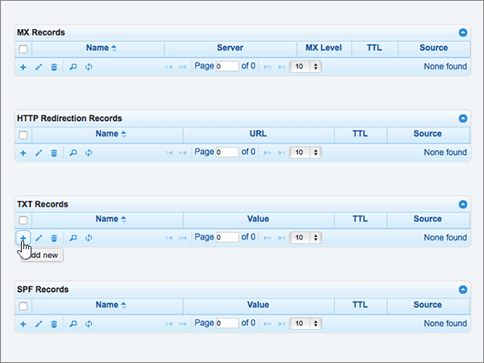
  
4. In the **Add TXT Records** area, in the boxes for the new record, type or copy and paste the values from the following table. 
    
    |**Name**|**Value**|**TTL**|
    |:-----|:-----|:-----|
    |(Leave this field empty.)    |v=spf1 include:spf.protection.outlook.com -all    **Note:** We recommend copying and pasting this entry, so that all of the spacing stays correct.           |1800    |
   
    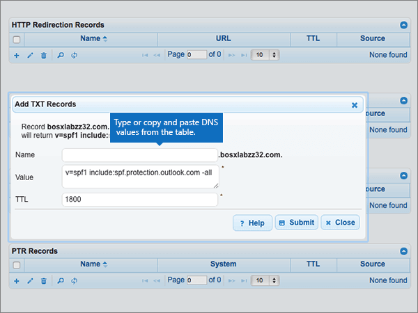
  
5. Select **Submit**.
    
    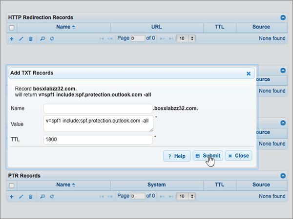
  
## Add the two SRV records that are required for Microsoft

1. To get started, go to your domains page at DNSMadeEasy by using [this link](https://cp.dnsmadeeasy.com/). You'll be prompted to login first.
    
2. On the **Management Console** page, in the **Recently Updated Domains** area, select the domain that you want to update. 
    
3. On the **Managed DNS** page, in the **SRV Records** area, select the **(+)** control ( **Add new**).
    
    (You may have to scroll down)
    
    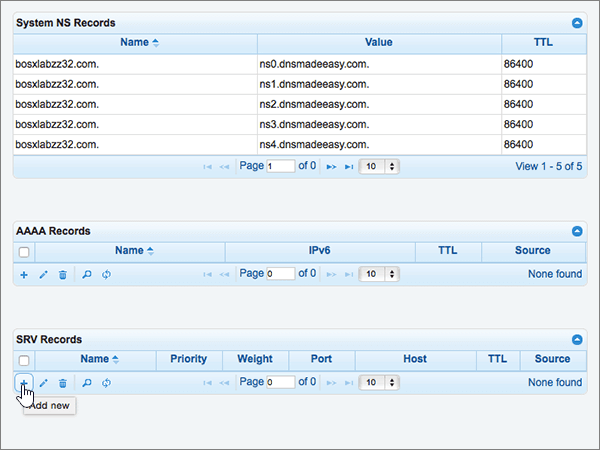
  
4. Add the first of the two SRV records.
    
    In the **Add SRV Records** area, in the boxes for the new record, type or copy and paste the values from the first row in the following table. 
    
    |**Name**|**Priority**|**Weight**|**Port**|**Host**|**TTL**|
    |:-----|:-----|:-----|:-----|:-----|:-----|
    |_sip._tls    |100    |1    |443    |sipdir.online.lync.com.    **This value MUST end with a period (.)**   |1800    |
    |_sipfederationtls._tcp    |100    |1    |5061    |sipfed.online.lync.com.    **This value MUST end with a period (.)**   |1800    |
   
    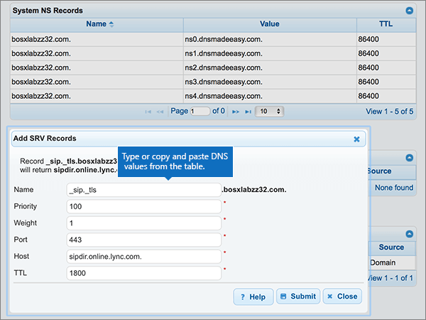
  
5. Select **Submit**.
    
    
  
6. Add the other SRV record.
    
    In the **SRV Records** section, select the **(+)** control ( **Add new**), create a record by using the values from the next row in the table, and then again select **Submit** to complete that record. 
    
> [!NOTE]
> Typically it takes about 15 minutes for DNS changes to take effect. However, it can occasionally take longer for a change you've made to update across the Internet's DNS system. If you're having trouble with mail flow or other issues after adding DNS records, see [Find and fix issues after adding your domain or DNS records](../get-help-with-domains/find-and-fix-issues.md). 
  

