# Create DNS records at Dreamhost for Microsoft

 **[Check the Domains FAQ](../setup/domains-faq.md)** if you don't find what you're looking for. 
  
If DreamHost is your DNS hosting provider, follow the steps in this article to verify your domain and set up DNS records for email, Lync, and so on.
 
After you add these records at DreamHost, your domain will be set up to work with Microsoft services.
  
  
> [!NOTE]
> Typically it takes about 15 minutes for DNS changes to take effect. However, it can occasionally take longer for a change you've made to update across the Internet's DNS system. If you're having trouble with mail flow or other issues after adding DNS records, see [Troubleshoot issues after changing your domain name or DNS records](../get-help-with-domains/find-and-fix-issues.md). 
  
## Add a TXT record for verification

Before you use your domain with Microsoft, we have to make sure that you own it. Your ability to log in to your account at your domain registrar and create the DNS record proves to Microsoft that you own the domain.
  
> [!NOTE]
> This record is used only to verify that you own your domain; it doesn't affect anything else. You can delete it later, if you like. 
  
1. To get started, go to your domains page at DreamHost by using [this link](https://panel.dreamhost.com/). You'll be prompted to Sign in.
    
    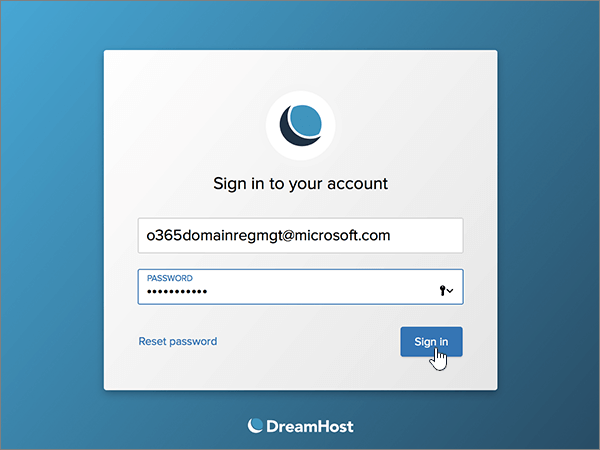
  
2. On the **Dashboard** page, select **Domains**, and then **Manage Domains**.
    
    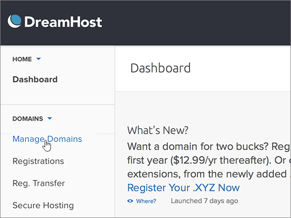
  
3. On the **Manage Domains** page, in the **Domain** section, select **DNS** for the domain that you want to edit. 
    
    
  
4. In the **Add a custom DNS record** section, in the boxes for the new record, type or copy and paste the values from the following table. 
    
    (You may have to scroll down.)
    
    (Choose the **Type** value from the drop-down list.) 
    
    |**Name**|**Type**|**Value**|**Comment**|
    |:-----|:-----|:-----|:-----|
    |(Leave this field empty.)    |TXT    |MS=ms *XXXXXXXX*    **Note:** This is an example. Use your specific **Destination or Points to Address** value here, from the table.           [How do I find this?](../get-help-with-domains/information-for-dns-records.md)          |(This field is optional.)    |
   
   
  
5. Select **Add Record Now!**
    
    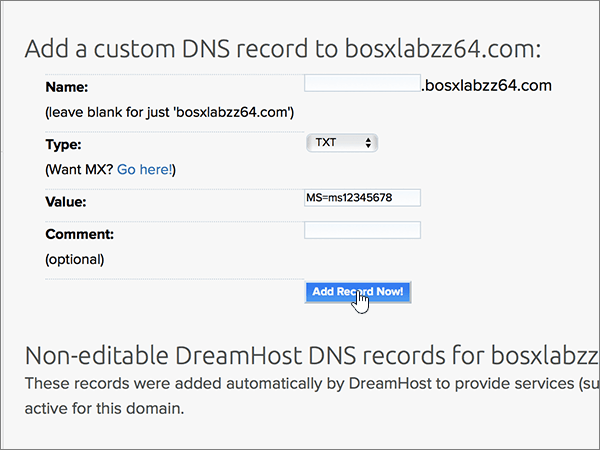
  
6. Wait a few minutes before you continue, so that the record you just created can update across the Internet.
    
Now that you've added the record at your domain registrar's site, you'll go back to Microsoft and request the record.
  
When Microsoft finds the correct TXT record, your domain is verified.
  
1. In the Microsoft admin center, go to the **Settings** \> <a href="https://go.microsoft.com/fwlink/p/?linkid=834818" target="_blank">Domains</a> page.

    
2. On the **Domains** page, select the domain that you are verifying. 
    
    
  
3. On the **Setup** page, select **Start setup**.
    
    
  
4. On the **Verify domain** page, select **Verify**.
    
    
  
> [!NOTE]
>  Typically it takes about 15 minutes for DNS changes to take effect. However, it can occasionally take longer for a change you've made to update across the Internet's DNS system. If you're having trouble with mail flow or other issues after adding DNS records, see [Troubleshoot issues after changing your domain name or DNS records](../get-help-with-domains/find-and-fix-issues.md). 
  

  
## Add an MX record so email for your domain will come to Microsoft

Follow the steps below.
  
1. To get started, go to your domains page at DreamHost by using [this link](https://panel.dreamhost.com/). You'll be prompted to Sign in.
    
    
  
2. On the **Dashboard** page, select **Mail**, and then **Custom MX**.
    
    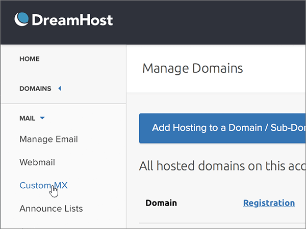
  
3. In the **Manage Mail Delivery** section, in the **Actions** column, select **Edit** for the domain that you want to edit. 
    
    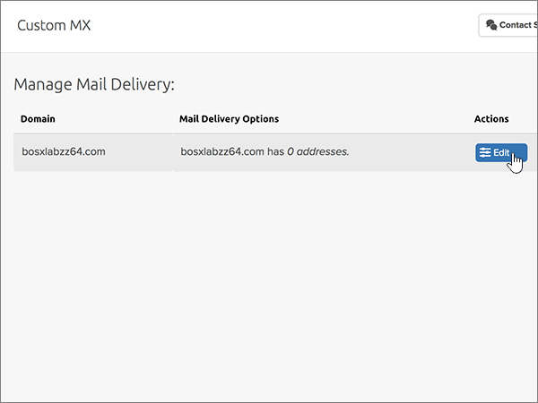
  
4. In the **Custom MX Record** section, in the boxes for the new record, type or copy and paste the following values from the following table. 
    
    (You may have to scroll down.)
    
    (If there are any other existing MX records, mark those records to be deleted.)
    
    |**MX Record (required)**|
    |:-----|
    |0  *\<domain-key\>*  .mail.protection.outlook.com.    **This value MUST end with a period (.)**   The 0 is the MX priority value. Add it to the beginning of the MX value, separated from the remainder of the value by a space.    **Note:** Get your  *\<domain-key\>*  from your Microsoft account.           [How do I find this?](../get-help-with-domains/information-for-dns-records.md)          |
   
    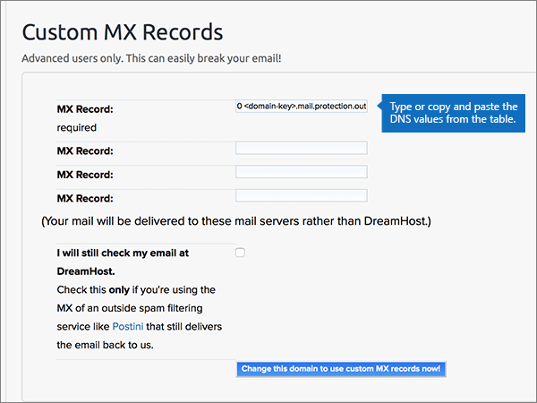
  
5. Select **Change this domain to use custom MX records now!**
    
    
  
6. If there are any other existing MX records, delete each record by selecting the entry and then pressing the **Delete** key on your keyboard. 
    
    
  
7. If you have deleted any records, select **Update your custom MX records now!**
    
    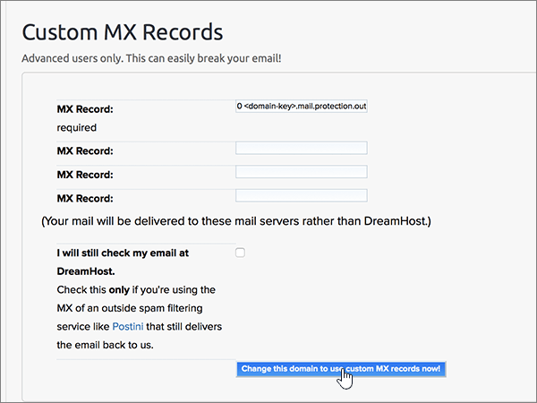

  
## Add the six CNAME records that are required for Microsoft

Follow the steps below.
  
1. To get started, go to your domains page at DreamHost by using [this link](https://panel.dreamhost.com/). You'll be prompted to Sign in.
    
    
  
2. On the **Dashboard** page, select **Domains**, and then **Manage Domains**.
    
    
  
3. On the **Manage Domains** page, in the **Domain** section, select **DNS** for the domain that you want to edit. 
    
    
  
4. In the **Add a custom DNS record** section, in the boxes for the new record, type or copy and paste the values from the first row in the following table. 
    
    (You may have to scroll down.)
    
    (Choose the **Type** value from the drop-down list.) 
    
    |**Name**|**Type**|**Value**|**Comment**|
    |:-----|:-----|:-----|:-----|
    |autodiscover    |CNAME    |autodiscover.outlook.com.    **This value MUST end with a period (.)**   |(This field is optional.)    |
    |sip    |CNAME    |sipdir.online.lync.com.    **This value MUST end with a period (.)**   |(This field is optional.)    |
    |lyncdiscover    |CNAME    |webdir.online.lync.com.    **This value MUST end with a period (.)**   |(This field is optional.)    |
    |enterpriseregistration    |CNAME    |enterpriseregistration.windows.net.    **This value MUST end with a period (.)**   |(This field is optional.)    |
    |enterpriseenrollment    |CNAME    |enterpriseenrollment-s.manage.microsoft.com.    **This value MUST end with a period (.)**   |(This field is optional.)    |
   
    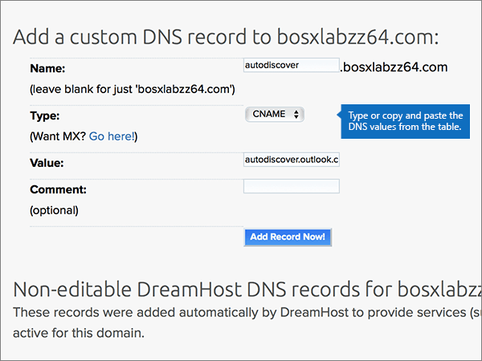
  
5. Select **Add Record Now!**
    
    
  
6. Using the preceding two steps and the values from the other five rows in the table, add each of the other five CNAME records.

  
## Add a TXT record for SPF to help prevent email spam

> [!IMPORTANT]
> You cannot have more than one TXT record for SPF for a domain. If your domain has more than one SPF record, you'll get email errors, as well as delivery and spam classification issues. If you already have an SPF record for your domain, don't create a new one for Microsoft. Instead, add the required Microsoft values to the current record so that you have a  *single*  SPF record that includes both sets of values.
  
Follow the steps below.
  
1. To get started, go to your domains page at DreamHost by using [this link](https://panel.dreamhost.com/). You'll be prompted to Sign in.
    
    
  
2. On the **Dashboard** page, select **Domains**, and then **Manage Domains**.
    
    
  
3. On the **Manage Domains** page, in the **Domain** section, select **DNS** for the domain that you want to edit. 
    
    
  
4. In the **Add a custom DNS record** section, in the boxes for the new record, type or copy and paste the values from the first row in the following table. 
    
    (You may have to scroll down.)
    
    (Choose the **Type** value from the drop-down list.) 
    
    |**Name**|**Type**|**Value**|**Comment**|
    |:-----|:-----|:-----|:-----|
    |(Leave this field empty.)    |TXT    |v=spf1 include:spf.protection.outlook.com -all    **Note:** We recommend copying and pasting this entry, so that all of the spacing stays correct.           |(This field is optional.)    |
   
   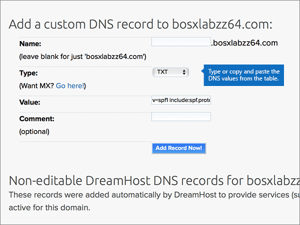
  
5. Select **Add Record Now!**
    
    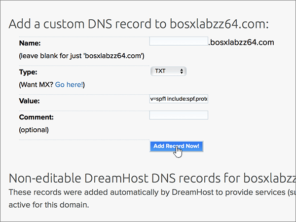
  
6. Using the preceding two steps and the values from the second row in the table, add the other SRV record.
    
  
## Add the two SRV records that are required for Microsoft

Follow the steps below.
  
1. To get started, go to your domains page at DreamHost by using [this link](https://panel.dreamhost.com/). You'll be prompted to Sign in.
    
    
  
2. On the **Dashboard** page, select **Domains**, and then **Manage Domains**.
    
    
  
3. On the **Manage Domains** page, in the **Domain** section, select **DNS** for the domain that you want to edit. 
    
    
  
4. In the **Add a custom DNS record** section, in the boxes for the new record, type or copy and paste the values from the first row in the following table. 
    
    (You may have to scroll down.)
    
    (Choose the **Type** value from the drop-down list.) 
    
    |**Name**|**Type**|**Value**|**Comment**|
    |:-----|:-----|:-----|:-----|
    |_sip._tls    |SRV    |100 1 443    sipdir.online.lync.com.    **This value MUST end with a period (.)**   |(This field is optional.)    |
    |_sipfederationtls._tcp    |SRV    |100 1 5061    sipfed.online.lync.com.    **This value MUST end with a period (.)**   |(This field is optional.)    |
   
    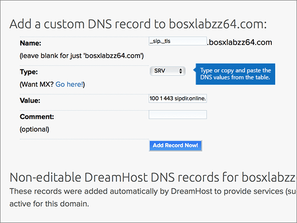
  
5. Select **Add Record Now!**.
    
    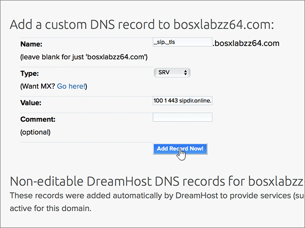
  
6. Using the preceding two steps and the values from the second row in the table, add the other SRV record.
    
> [!NOTE]
>  Typically it takes about 15 minutes for DNS changes to take effect. However, it can occasionally take longer for a change you've made to update across the Internet's DNS system. If you're having trouble with mail flow or other issues after adding DNS records, see [Troubleshoot issues after changing your domain name or DNS records](../get-help-with-domains/find-and-fix-issues.md). 

  
