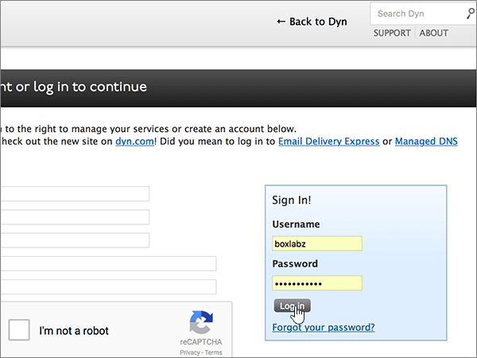
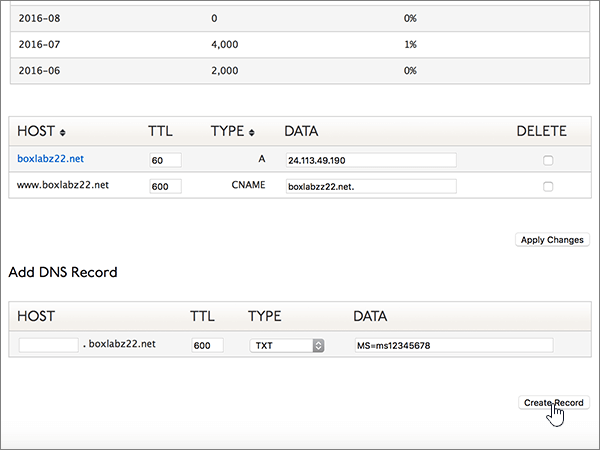
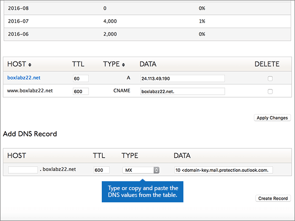
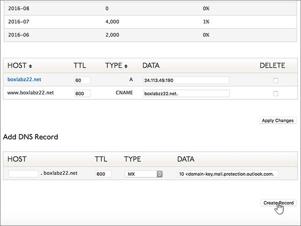
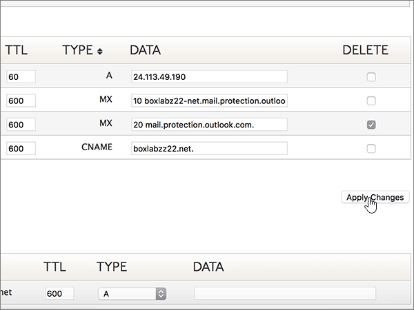
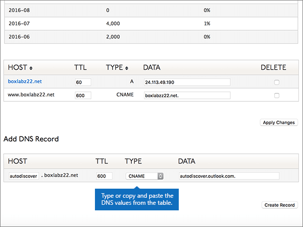
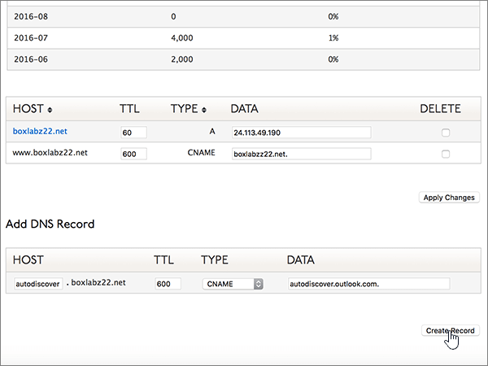
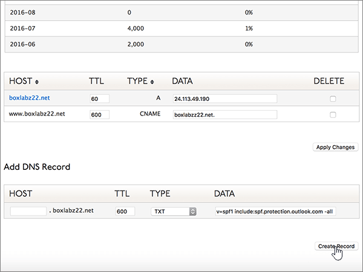
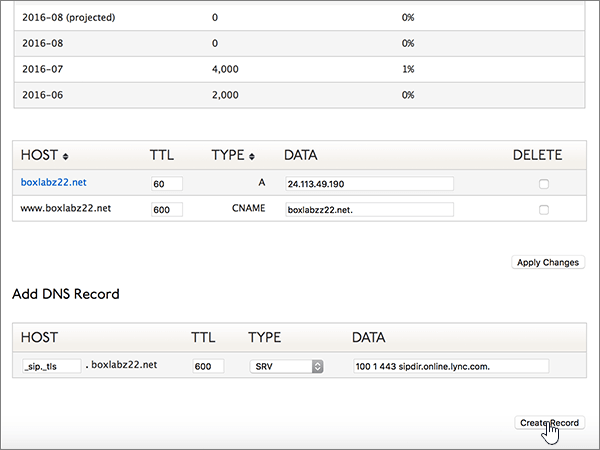

# Create DNS records at Dyn.com for Microsoft

 **[Check the Domains FAQ](../setup/domains-faq.yml)** if you don't find what you're looking for. 
  
If Dyn.com is your DNS hosting provider, follow the steps in this article to verify your domain and set up DNS records for email, Skype for Business Online, and so on.
 

  
> [!NOTE]
>  Typically it takes about 15 minutes for DNS changes to take effect. However, it can occasionally take longer for a change you've made to update across the Internet's DNS system. If you're having trouble with mail flow or other issues after adding DNS records, see [Troubleshoot issues after changing your domain name or DNS records](../get-help-with-domains/find-and-fix-issues.md). 
  
## Add a TXT record for verification

1. To get started, go to your domains page at Dyn.com by using [this link](https://account.dyn.com/dns/). You'll be prompted to login first.
    
    
  
2. On the **Zone Level Services** page, select **Dyn Standard DNS Service** for the domain that you want to edit. 
    
3. On the **DNS** page for your domain, select **Preferences**.
    
4. Select **Enable Expert Interface**.
    
5. In the **Add DNS Record** section, in the boxes for the new record, type or copy and paste the values from the following table. 
    
    (Choose the **Type** value from the drop-down list.) 
    
    |**Host**|**TTL**|**Type**|**Data**|
    |:-----|:-----|:-----|:-----|
    |(Leave this field empty.)    |600    |TXT    |MS=ms *XXXXXXXX*    **Note:** This is an example. Use your specific **Destination or Points to Address** value here, from the table.           [How do I find this?](../get-help-with-domains/information-for-dns-records.md)          |
       
   
  
6. Select **Create Record**.
    
    
  
7. Wait a few minutes before you continue, so that the record you just created can update across the Internet.
    
Now that you've added the record at your domain registrar's site, you'll go back to Microsoft and request the record.
  
When Microsoft finds the correct TXT record, your domain is verified.
  
1. In the Microsoft admin center, go to the **Settings** \> <a href="https://go.microsoft.com/fwlink/p/?linkid=834818" target="_blank">Domains</a> page.

    
2. On the **Domains** page, select the domain that you are verifying. 
    
    
  
3. On the **Setup** page, select **Start setup**.
    
    
  
4. On the **Verify domain** page, select **Verify**.
    
    
  
> [!NOTE]
>  Typically it takes about 15 minutes for DNS changes to take effect. However, it can occasionally take longer for a change you've made to update across the Internet's DNS system. If you're having trouble with mail flow or other issues after adding DNS records, see [Troubleshoot issues after changing your domain name or DNS records](../get-help-with-domains/find-and-fix-issues.md). 
  
## Add an MX record so email for your domain will come to Microsoft

1. To get started, go to your domains page at Dyn.com by using [this link](https://account.dyn.com/dns/). You'll be prompted to login first.
    
    
  
2. On the **Zone Level Services** page, select **Dyn Standard DNS Service** for the domain that you want to edit. 
    
3. On the DNS page for your domain, select **Preferences**.
    
4. Select **Enable Expert Interface**.
    
5. In the **Add DNS Record** section, in the boxes for the new record, type or copy and paste the values from the following table. 
    
    (Choose the **Type** value from the drop-down list.) 
    
    |**Host**|**TTL**|**Type**|**Data**|
    |:-----|:-----|:-----|:-----|
    |(Leave this field empty.)    |600    |MX    |10  *\<domain-key\>*  .mail.protection.outlook.com.    **This value MUST end with a period (.)**   The **10** is the MX priority value. Add it to the beginning of the MX value, separated from the remainder of the value by a space.    **Note:** Get your  *\<domain-key\>*  from your Microsoft account.           [How do I find this?](../get-help-with-domains/information-for-dns-records.md)           For more information about priority, see [What is MX priority?](https://docs.microsoft.com/microsoft-365/admin/setup/domains-faq)   |
   
    
  
6. Select **Create Record**.
    
    
  
7. If there are any other MX records, remove them by selecting the check box for each one in the **Delete** column. 
    
    
  
8. Select **Apply Changes**.
    
    
  
## Add the six CNAME records that are required for Microsoft

1. To get started, go to your domains page at Dyn.com by using [this link](https://account.dyn.com/dns/). You'll be prompted to login first.
    
    
  
2. On the **Zone Level Services** page, select **Dyn Standard DNS Service** for the domain that you want to edit. 
    
3. On the **DNS** page for your domain, select **Preferences**.
    
4. Select **Enable Expert Interface**.
    
5. Add the first of the six CNAME records.
    
    In the **Add DNS Record** section, in the boxes for the new record, type or copy and paste the values from the first row of the following table. 
    
    (Choose the **Type** value from the drop-down list.) 
    
    |**Host**|**TTL**|**Type**|**Data**|
    |:-----|:-----|:-----|:-----|
    |autodiscover    |600    |CNAME    |autodiscover.outlook.com.    **This value MUST end with a period (.)**   |
    |sip    |600    |CNAME    |sipdir.online.lync.com.    **This value MUST end with a period (.)**   |
    |lyncdiscover    |600    |CNAME    |webdir.online.lync.com.    **This value MUST end with a period (.)**   |
    |enterpriseregistration    |600    |CNAME    |enterpriseregistration.windows.net.    **This value MUST end with a period (.)**   |
    |enterpriseenrollment    |600    |CNAME    |enterpriseenrollment-s.manage.microsoft.com.    **This value MUST end with a period (.)**   |
   
    
  
6. Select **Create Record**.
    
    
  
7. Add the remaining five CNAME records.
    
    In the **Add DNS Record** section, create a record by using the values from the next row in the table, and then again select **Create Record** to complete that record. 
    
    Repeat this process until you have created all six CNAME records.
    
## Add a TXT record for SPF to help prevent email spam

> [!IMPORTANT]
> You cannot have more than one TXT record for SPF for a domain. If your domain has more than one SPF record, you'll get email errors, as well as delivery and spam classification issues. If you already have an SPF record for your domain, don't create a new one for Microsoft. Instead, add the required Microsoft values to the current record so that you have a  *single*  SPF record that includes both sets of values.
  
1. To get started, go to your domains page at Dyn.com by using [this link](https://account.dyn.com/dns/). You'll be prompted to login first.
    
    
  
2. On the **Zone Level Services** page, select **Dyn Standard DNS Service** for the domain that you want to edit. 
    
3. On the **DNS** page for your domain, select **Preferences**.
    
4. Select **Enable Expert Interface**.
    
5. In the **Add DNS Record** section, in the boxes for the new record, type or copy and paste the values from the following table. 
    
    (Choose the **Type** value from the drop-down list.) 
    
    |**Host**|**TTL**|**Type**|**Data**|
    |:-----|:-----|:-----|:-----|
    |(Leave this field empty.)    |600    |TXT    |v=spf1 include:spf.protection.outlook.com -all    **Note:** We recommend copying and pasting this entry, so that all of the spacing stays correct.           |
   
    
  
6. Select **Create Record**.
    
    
  
## Add the two SRV records that are required for Microsoft

1. To get started, go to your domains page at Dyn.com by using [this link](https://account.dyn.com/dns/). You'll be prompted to login first 
    
    
  
2. On the **Zone Level Services** page, select **Dyn Standard DNS Service** for the domain that you want to edit. 
    
3. On the **DNS** page for your domain, select **Preferences**.
    
4. Select **Enable Expert Interface**.
    
5. Add the first of the two SRV records.
    
    In the **Add DNS Record** section, in the boxes for the new record, type or copy and paste the values from the first row of the following table. 
    
    (Choose the **Type** value from the drop-down list.) 
    
    |**Host**|**TTL**|**Type**|**Data**|
    |:-----|:-----|:-----|:-----|
    |_sip._tls|600|SRV|100 1 443 sipdir.online.lync.com. **This value MUST end with a period (.)** **Note:** We recommend copying and pasting this entry, so that all of the spacing stays correct.           |
    |_sipfederationtls._tcp|600|SRV|100 1 5061 sipfed.online.lync.com. **This value MUST end with a period (.)**  **Note:** We recommend copying and pasting this entry, so that all of the spacing stays correct.           |
   
    
  
6. Select **Create Record**.
    
    
  
7. Add the other SRV record.
    
    In the **Add DNS Record** section, create a record by using the values from the second row in the table, and then again select **Create Record** to complete that record. 
    
> [!NOTE]
>  Typically it takes about 15 minutes for DNS changes to take effect. However, it can occasionally take longer for a change you've made to update across the Internet's DNS system. If you're having trouble with mail flow or other issues after adding DNS records, see [Troubleshoot issues after changing your domain name or DNS records](../get-help-with-domains/find-and-fix-issues.md). 
  
