# Create DNS records at eNomCentral for Microsoft

 **[Check the Domains FAQ](../setup/domains-faq.yml)** if you don't find what you're looking for.

If eNomCentral is your DNS hosting provider, follow the steps in this article to verify your domain and set up DNS records for email, Skype for Business Online, and so on.

After you add these records at eNomCentral, your domain will be set up to work with Microsoft services.

> [!NOTE]
> Typically it takes about 15 minutes for DNS changes to take effect. However, it can occasionally take longer for a change you've made to update across the Internet's DNS system. If you're having trouble with mail flow or other issues after adding DNS records, see [Troubleshoot issues after changing your domain name or DNS records](../get-help-with-domains/find-and-fix-issues.md).

## Add a TXT record for verification

Before you use your domain with Microsoft, we have to make sure that you own it. Your ability to log in to your account at your domain registrar and create the DNS record proves to Microsoft that you own the domain.

> [!NOTE]
> This record is used only to verify that you own your domain; it doesn't affect anything else. You can delete it later, if you like.

Follow the steps below or [watch the video (start at 0:46)](https://support.microsoft.com/office/3766a9e8-77dd-4a42-908d-89b076143e7d).

1. To get started, go to your domains page at eNom Central by using [this link](https://www.enomcentral.com/domains/Domain-Manager.aspx?tab=registered). You'll be prompted to login.

   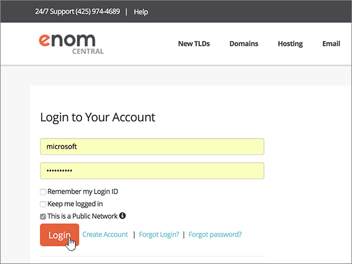

2. Under **my domains**, select the name of the domain that you want to edit.

   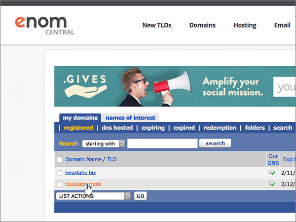

3. On the **Manage Domain** drop-down list, choose **Host Records**.

   

4. In the boxes for the new record, type or copy and paste the values from the following table.

   Choose the **Record Type** value from the drop-down list.

   |Host Name|Record Type|Address|
   |---|---|---|
   |@|TXT|MS=ms *XXXXXXXX*    **Note:** This is an example. Use your specific **Destination or Points to Address** value here, from the table. [How do I find this?](../get-help-with-domains/information-for-dns-records.md)|

   

5. Select **save**.

   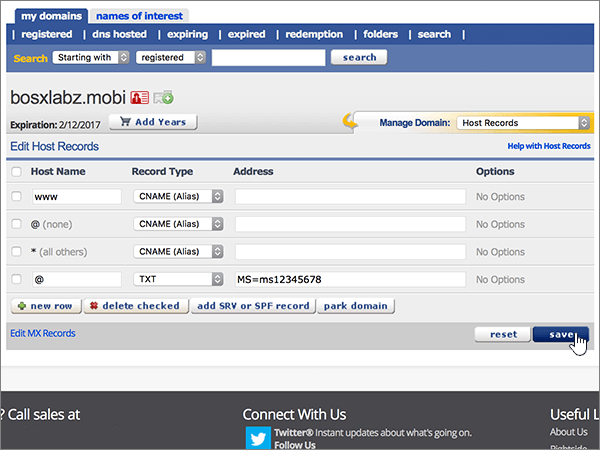

6. Wait a few minutes before you continue, so that the record you just created can update across the Internet.

Now that you've added the record at your domain registrar's site, you'll go back to Microsoft 365 and request Microsoft 365 to look for the record.

When Microsoft finds the correct TXT record, your domain is verified.

1. In the Microsoft admin center, go to the **Settings** \> <a href="https://go.microsoft.com/fwlink/p/?linkid=834818" target="_blank">Domains</a> page.

2. On the **Domains** page, select the domain that you are verifying.

3. On the **Setup** page, select **Start setup**.

4. On the **Verify domain** page, select **Verify**.

> [!NOTE]
> Typically it takes about 15 minutes for DNS changes to take effect. However, it can occasionally take longer for a change you've made to update across the Internet's DNS system. If you're having trouble with mail flow or other issues after adding DNS records, see [Troubleshoot issues after changing your domain name or DNS records](../get-help-with-domains/find-and-fix-issues.md).

## Add an MX record so email for your domain will come to Microsoft

Follow the steps below or [watch the video (start at 3:40)](https://support.microsoft.com/office/3766a9e8-77dd-4a42-908d-89b076143e7d).

1. To get started, go to your domains page at eNom Central by using [this link](https://www.enomcentral.com/domains/Domain-Manager.aspx?tab=registered). You'll be prompted to login.

   

2. Under **my domains**, select the name of the domain that you want to edit.

   

3. On the **Manage Domain** drop-down list, choose **Email Settings**.

   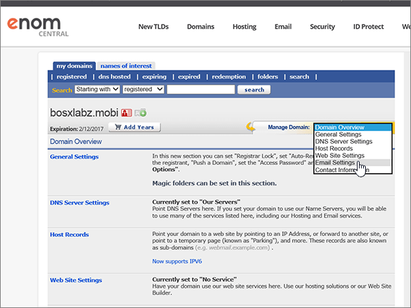

4. On the **Service Selection** drop-down list, choose **User (MX)**.

   

5. In the boxes for the new record, type or copy and paste the values from the following table.

   |Host Name|Address|Pref|
   |---|---|---|
   |@| *\<domain-key\>*  .mail.protection.outlook.com.    **This value MUST end with a period (.)**   **Note:** Get your  *\<domain-key\>*  from your Microsoft account. [How do I find this?](../get-help-with-domains/information-for-dns-records.md)|10    For more information about priority, see [What is MX priority?](https://docs.microsoft.com/microsoft-365/admin/setup/domains-faq)|

   

6. Select **save**.

   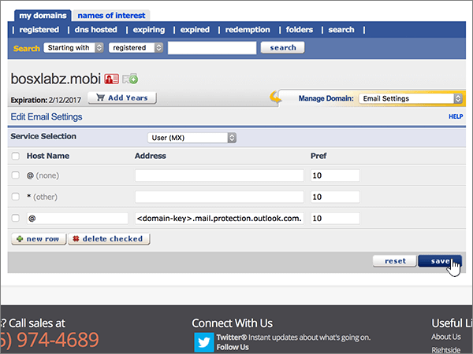

7. If there are any other existing MX records, select the check boxes for those records to select them.

   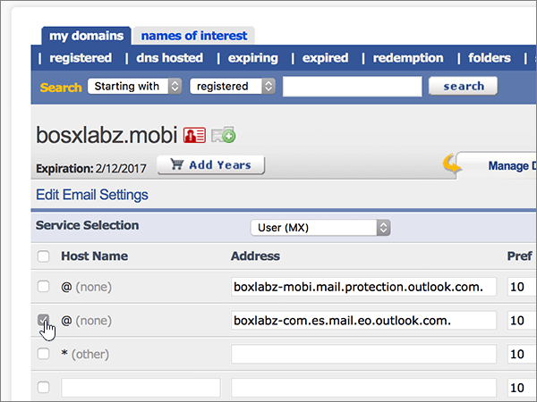

8. Select **delete checked**.

   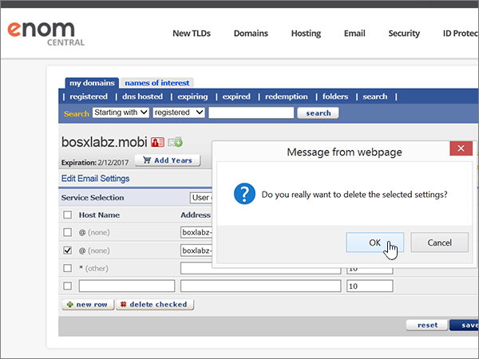

## Add the CNAME records that are required for Microsoft

Follow the steps below or [watch the video (start at 4:24)](https://support.microsoft.com/office/3766a9e8-77dd-4a42-908d-89b076143e7d).

1. To get started, go to your domains page at eNom Central by using [this link](https://www.enomcentral.com/domains/Domain-Manager.aspx?tab=registered). You'll be prompted to login.

   

2. Under **my domains**, select the name of the domain that you want to edit.

   

3. On the **Manage Domain** drop-down list, choose **Host Records**.

   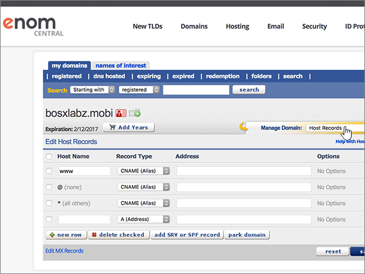

4. Select **new row**.

   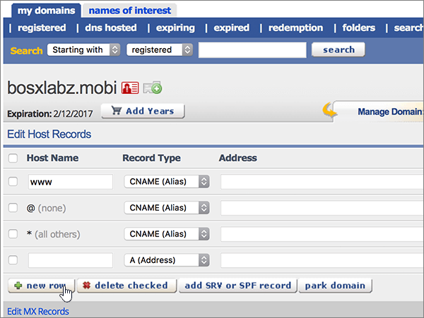

5. In the boxes for the six new records, type or copy and paste the following values.

   Choose the **Record Type** value from the drop-down list.

   |Host Name|Record Type|Address|
   |---|---|---|
   |autodiscover|CNAME (Alias)|autodiscover.outlook.com.    **This value MUST end with a period (.)**|
   |sip|CNAME (Alias)|sipdir.online.lync.com.    **This value MUST end with a period (.)**|
   |lyncdiscover|CNAME (Alias)|webdir.online.lync.com.    **This value MUST end with a period (.)**|
   |enterpriseregistration|CNAME (Alias)|enterpriseregistration.windows.net.    **This value MUST end with a period (.)**|
   |enterpriseenrollment|CNAME (Alias)|enterpriseenrollment-s.manage.microsoft.com.    **This value MUST end with a period (.)**|

   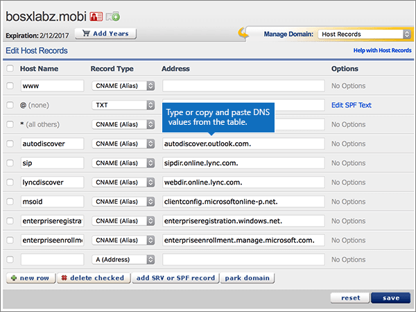

6. Select **save**.

   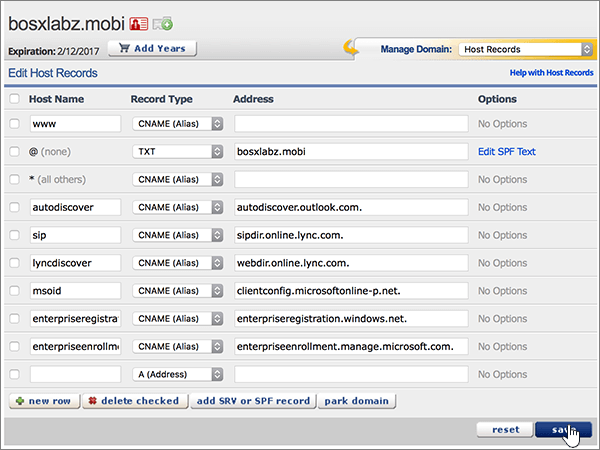

## Add a TXT record for SPF to help prevent email spam

> [!IMPORTANT]
> You cannot have more than one TXT record for SPF for a domain. If your domain has more than one SPF record, you'll get email errors, as well as delivery and spam classification issues. If you already have an SPF record for your domain, don't create a new one for Microsoft. Instead, add the required Microsoft values to the current record so that you have a  *single*  SPF record that includes both sets of values.

Follow the steps below or [watch the video (start at 5:12)](https://support.microsoft.com/office/3766a9e8-77dd-4a42-908d-89b076143e7d).

1. To get started, go to your domains page at eNom Central by using [this link](https://www.enomcentral.com/domains/Domain-Manager.aspx?tab=registered). You'll be prompted to login.

   

2. Under **my domains**, select the name of the domain that you want to edit.

   

3. On the **Manage Domain** drop-down list, choose **Host Records**.

   

4. In the boxes for the new record, type or copy and paste the values from the following table.

   Choose the **Record Type** value from the drop-down list.

   |Host Name|Record Type|Address|
   |---|---|---|
   |@|TXT|v=spf1 include:spf.protection.outlook.com -all   **Note:** We recommend copying and pasting this entry, so that all of the spacing stays correct.|

   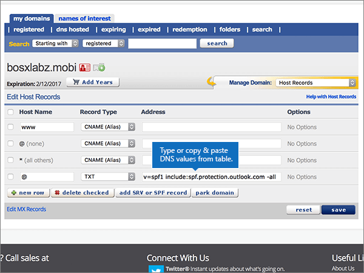

5. Select **save**.

   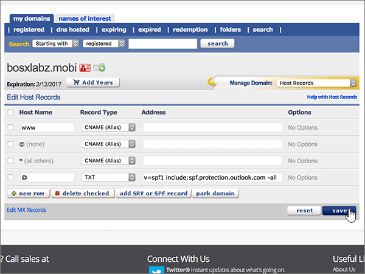

## Add the two SRV records that are required for Microsoft

Follow the steps below or [watch the video (start at 5:50)](https://support.microsoft.com/office/3766a9e8-77dd-4a42-908d-89b076143e7d).

1. To get started, go to your domains page at eNom Central by using [this link](https://www.enomcentral.com/domains/Domain-Manager.aspx?tab=registered). You'll be prompted to login.

   

2. Under **my domains**, select the name of the domain that you want to edit.

   

3. On the **Manage Domain** drop-down list, choose **Host Records**.

   

4. To the right of **new row**, select **add SRV or SPF record**.

   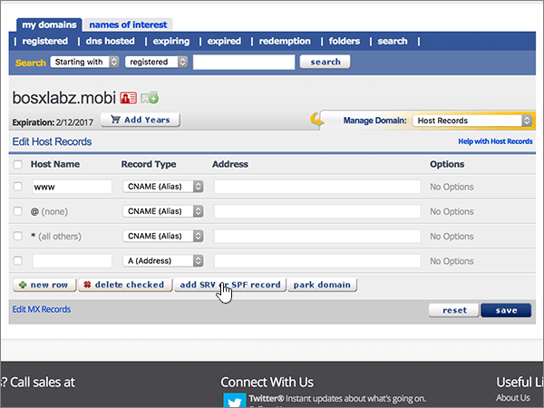

5. In the boxes for the two new records, type or copy and paste the values from the following table.

   |Service|Protocol|Priority|Weight|Port|Target (Hostname)|
   |---|---|---|---|---|---|
   |_sip|_tls|100|1|443|sipdir.online.lync.com.    **This value MUST end with a period (.)**|
   |_sipfederationtls|_tcp|100|1|5061|sipfed.online.lync.com.    **This value MUST end with a period (.)**|

   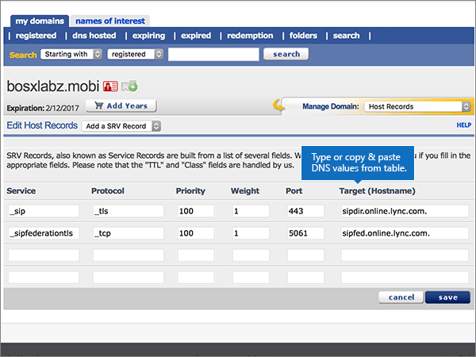

6. Select **save**

   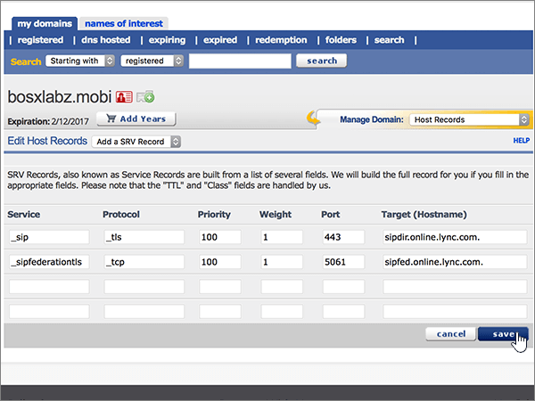

> [!NOTE]
> Typically it takes about 15 minutes for DNS changes to take effect. However, it can occasionally take longer for a change you've made to update across the Internet's DNS system. If you're having trouble with mail flow or other issues after adding DNS records, see [Troubleshoot issues after changing your domain name or DNS records](../get-help-with-domains/find-and-fix-issues.md).
