# Create DNS records at Freenom for Microsoft

[Check the Domains FAQ ](../setup/domains-faq.md) if you don't find what you're looking for. 
  
> [!CAUTION]
> The Freenom website doesn't support SRV records, which means that several Skype for Business Online and Outlook Web App features won't work. No matter which Microsoft plan you use, there are significant service limitations, and you may want to switch to a different DNS hosting provider. 
  
If despite the service limitations, you choose to manage your own Microsoft DNS records at Freenom, follow the steps in this article to verify your domain and set up DNS records for email and other services.
  
  
> [!NOTE]
> Typically it takes about 15 minutes for DNS changes to take effect. However, it can occasionally take longer for a change you've made to update across the Internet's DNS system. If you're having trouble with mail flow or other issues after adding DNS records, see [Troubleshoot issues after changing your domain name or DNS records](../get-help-with-domains/find-and-fix-issues.md). 
  
## Add a TXT record for verification

Before you use your domain with Microsoft, we have to make sure that you own it. Your ability to log in to your account at your domain registrar and create the DNS record proves to Microsoft that you own the domain.
  
> [!NOTE]
> This record is used only to verify that you own your domain; it doesn't affect anything else. You can delete it later, if you like. 
  
1. To get started, go to your domains page in Freenom by using [this link](https://my.freenom.com/). You'll be prompted to log in.
    
    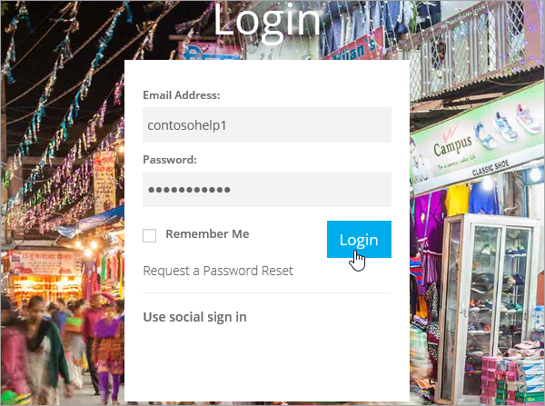
  
2. Select **Services**, and then select **My Domains**.
    
    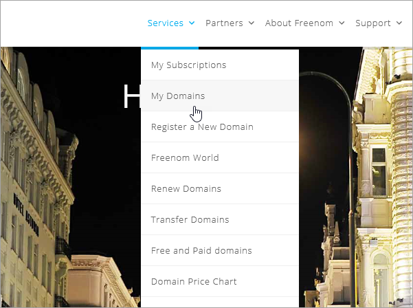
  
3. For the domain that you want to edit, select **Manage Domain**.
    
    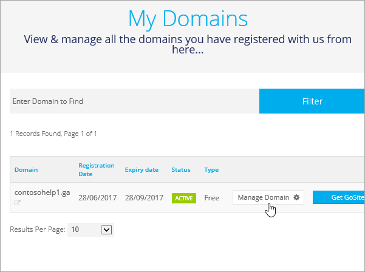
  
4. Select **Manage Freenom DNS**.
    
    
  
5. Under **Add Record**, in the **Type** column, choose **TXT** from the menu. 
    
    
  
6. In the boxes for the new record, type or copy and paste the values from the following table. 
    
    |**Name**|**Type**|**TTL**|**Target**|
    |:-----|:-----|:-----|:-----|
    |(leave blank)    |TXT    |3600 (seconds)    |MS=msXXXXXXXX    **Note:** This is an example. Use your specific **Destination or Points to Address** value here, from the table.           [How do I find this?](../get-help-with-domains/information-for-dns-records.md)          |
   
    
  
7. Select **Save Changes**.
    
    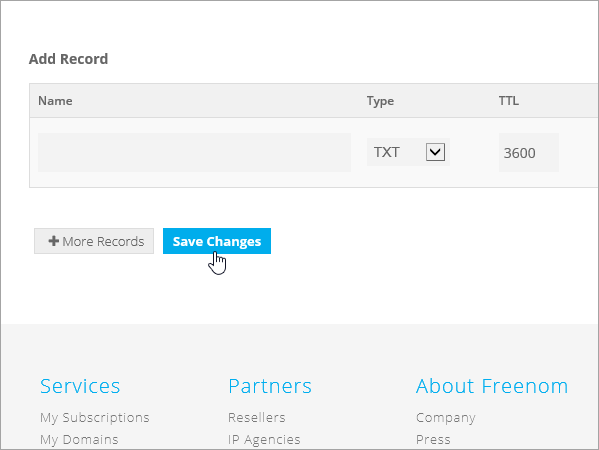
  
8. Wait a few minutes before you continue, so that the record you just created can update across the Internet.
    
Now that you've added the record at your domain registrar's site, you'll go back to Microsoft and request the record.
  
When Microsoft finds the correct TXT record, your domain is verified.
  
1. In the Microsoft admin center, go to the **Settings** \> <a href="https://go.microsoft.com/fwlink/p/?linkid=834818" target="_blank">Domains</a> page.

    
2. On the **Domains** page, select the domain that you are verifying. 
    
    
  
3. On the **Setup** page, select **Start setup**.
    
    
  
4. On the **Verify domain** page, select **Verify**.
    
    
  
> [!NOTE]
>  Typically it takes about 15 minutes for DNS changes to take effect. However, it can occasionally take longer for a change you've made to update across the Internet's DNS system. If you're having trouble with mail flow or other issues after adding DNS records, see [Troubleshoot issues after changing your domain name or DNS records](../get-help-with-domains/find-and-fix-issues.md). 
  
## Add an MX record so email for your domain will come to Microsoft

1. To get started, go to your domains page in Freenom by using [this link](https://my.freenom.com/). You'll be prompted to log in.
    
    
  
2. Select **Services**, and then select **My Domains**.
    
    
  
3. For the domain that you want to edit, select **Manage Domain**.
    
    
  
4. Set the name serves for your domain to the default Freenom name servers. Select **Management Tools**, and then select **Nameservers**.
    
    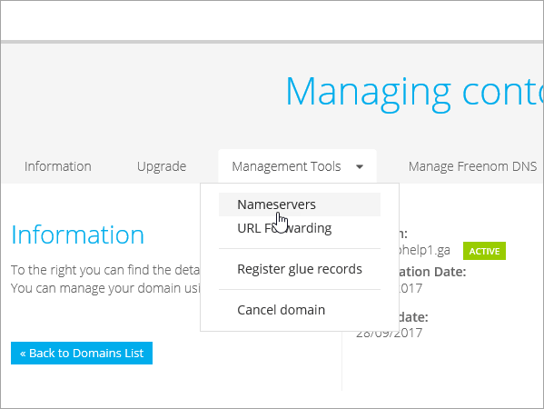
  
5. Make sure **Use default nameservers** is selected, and then select **Change Nameservers**.
    
    
  
6. Select **Manage Freenom DNS**.
    
    
  
7. Under **Add Record**, in the **Type** column, choose **MX** from the menu. 
    
    
  
8. In the boxes for the new record, type or copy and paste the values from the first row of the following table. 
    
    |**Name**|**Type**|**TTL**|**Target**|**Priority**|
    |:-----|:-----|:-----|:-----|:-----|
    |(leave blank)    |MX (Mail Exchanger)    |3600 (seconds)    |\<domain-key\>.mail.protection.outlook.com    **Note:** Get your  *\<domain-key\>*  from your Microsoft account.   [How do I find this?](../get-help-with-domains/information-for-dns-records.md)          |10    For more information about priority, see [What is MX priority?](https://docs.microsoft.com/microsoft-365/admin/setup/domains-faq)   |
   
   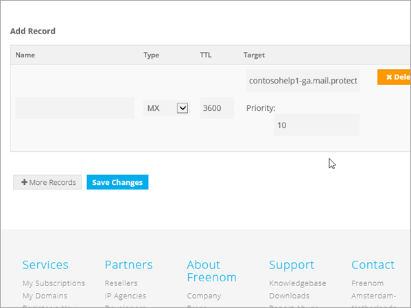
  
9. Select **Save Changes**.
    
    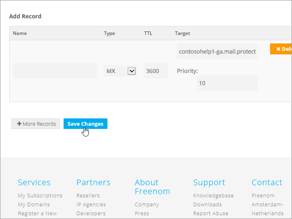
  
10. If there are any other MX records, delete them all. For each record, select **Delete**. When the message **Do you really want to remove this entry?** appears, select **OK**.
    
## Add the CNAME records that are required for Microsoft

1. To get started, go to your domains page in Freenom by using [this link](https://my.freenom.com/). You'll be prompted to log in.
    
    
  
2. Select **Services**, and then select **My Domains**.
    
    
  
3. For the domain that you want to edit, select **Manage Domain**.
    
    
  
4. Select **Manage Freenom DNS**.
    
    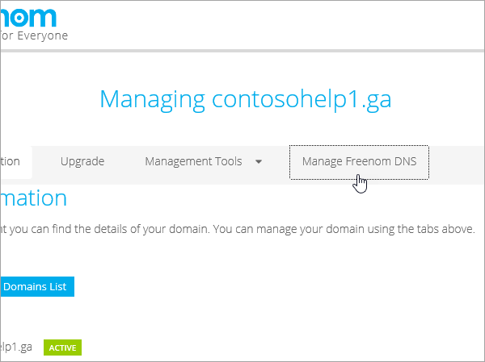
  
5. Under **Add Record**, in the **Type** column, choose **CNAME** from the menu. 
    
    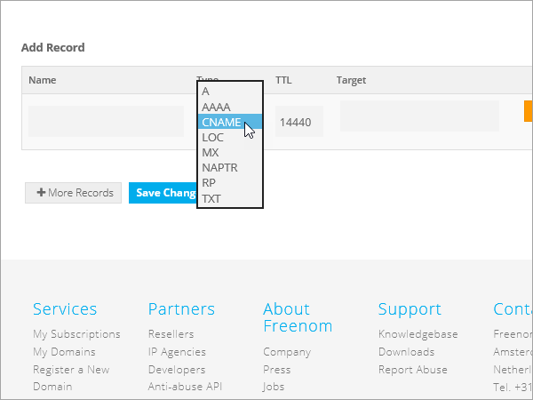
  
6. Create the first CNAME record. In the boxes for the new record, type or copy and paste the values from the first row of the following table. 
    
    |**Name**|**Record type**|**TTL**|**Target**|
    |:-----|:-----|:-----|:-----|
    |autodiscover    |CNAME    |3600 (seconds)    |autodiscover.outlook.com    |
    |sip    |CNAME    |3600 (seconds)    |sipdir.online.lync.com    |
    |lyncdiscover    |CNAME    |3600 (seconds)    |webdir.online.lync.com    |
    |enterpriseregistration    |CNAME    |3600 (seconds)    |enterpriseregistration.windows.net    |
    |enterpriseenrollment    |CNAME    |3600 (seconds)    |enterpriseenrollment-s.manage.microsoft.com    |
   
    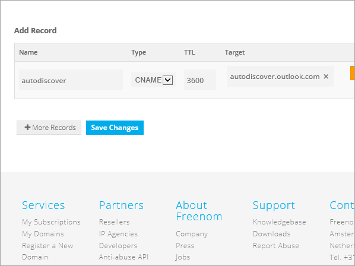
  
7. Select **Save Changes**.
    
    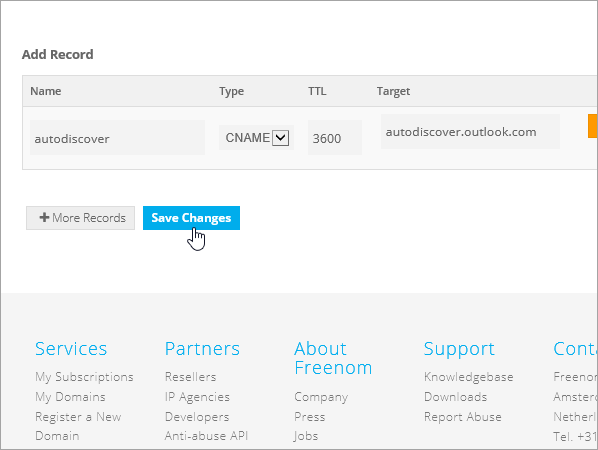
  
8. Repeat the previous steps to create the other five CNAME records. 
    
    For each record, type or copy and paste the values from the next row of the table above into the boxes for that record.
    
## Add a TXT record for SPF to help prevent email spam

> [!IMPORTANT]
> You cannot have more than one TXT record for SPF for a domain. If your domain has more than one SPF record, you'll get email errors, as well as delivery and spam classification issues. If you already have an SPF record for your domain, don't create a new one for Microsoft. Instead, add the required Microsoft values to the current record so that you have a  *single*  SPF record that includes both sets of values. 

1. To get started, go to your domains page in Freenom by using [this link](https://my.freenom.com/). You'll be prompted to log in.
    
    
  
2. Select **Services**, and then select **My Domains**.
    
    
  
3. For the domain that you want to edit, select **Manage Domain**.
    
    
  
4. Select **Manage Freenom DNS**.
    
    
  
5. Under **Add Record**, in the **Type** column, choose **TXT** from the menu. 
    
    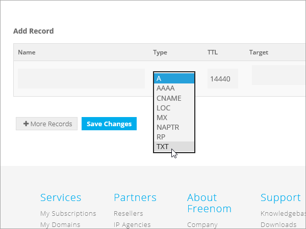
  
6. In the boxes for the new record, type or copy and paste the following values. 
    
    |**Name**|**Record type**|**TTL**|**Target**|
    |:-----|:-----|:-----|:-----|
    |(leave blank)    |TXT    |3600 (seconds)    |v=spf1 include:spf.protection.outlook.com -all   **Note:** We recommend copying and pasting this entry, so that all of the spacing stays correct.           |
   
    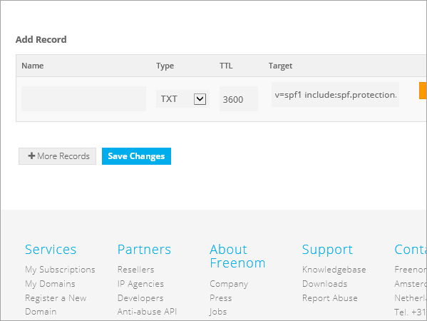
  
7. Select **Save Changes**.
    
    
  

