# Create DNS records at Google Domains for Microsoft

 **[Check the Domains FAQ](../setup/domains-faq.md)** if you don't find what you're looking for. 
  
If Google Domains is your DNS hosting provider, follow the steps in this article to verify your domain and set up DNS records for email, Lync, and so on.
  
After you add these records at Google Domains, your domain will be set up to work with Microsoft services.
  

  
> [!NOTE]
> Typically it takes about 15 minutes for DNS changes to take effect. However, it can occasionally take longer for a change you've made to update across the Internet's DNS system. If you're having trouble with mail flow or other issues after adding DNS records, see [Find and fix issues after adding your domain or DNS records in Microsoft](../get-help-with-domains/find-and-fix-issues.md). 
  
## Add a TXT record for verification

Before you use your domain with Microsoft, we have to make sure that you own it. Your ability to log in to your account at your domain registrar and create the DNS record proves to Microsoft that you own the domain.
  
> [!NOTE]
> This record is used only to verify that you own your domain; it doesn't affect anything else. You can delete it later, if you like. 
  
1. To get started, go to your domains page at Google Domains by using [this link](https://domains.google.com/registrar). You'll be prompted to sign in. To do so:
    
1. Select **Sign In**.
    
2. Enter your login credentials, and then again select **Sign In**.
    
2. On the **My domains** page, find the domain you want to use with Microsoft, and select the **MANAGE** link next to it. In the left navigation, select **DNS**.
    
3. In the **Custom resource records** section, in the boxes for the new record, type or copy and paste the values from the following table. 
    
    (You may have to scroll down.)
    
    (Choose the **Type** value from the drop-down list.) 
    
    |||||
    |:-----|:-----|:-----|:-----|
    |**Name**   |**Type**   |**TTL**   |**Data**   |
    |@    |TXT    |1H    |MS=ms *XXXXXXXX*    **Note:** This is an example. Use your specific **Destination or Points to Address** value here, from the table. [How do I find this?](../get-help-with-domains/information-for-dns-records.md)          |
   
4. Select **Add**.
    
5. Wait a few minutes before you continue, so that the record you just created can update across the Internet.
    
Now that you've added the record at your domain registrar's site, you'll go back to Microsoft and request the record.
  
When Microsoft finds the correct TXT record, your domain is verified.
  
1. In the Microsoft admin center, go to the **Settings** \> <a href="https://go.microsoft.com/fwlink/p/?linkid=834818" target="_blank">Domains</a> page.

    
2. On the **Domains** page, select the domain that you are verifying. 
    
3. On the **Setup** page, select **Start setup**.
    
4. On the **Verify domain** page, select **Verify**.
    
> [!NOTE]
> Typically it takes about 15 minutes for DNS changes to take effect. However, it can occasionally take longer for a change you've made to update across the Internet's DNS system. If you're having trouble with mail flow or other issues after adding DNS records, see [Find and fix issues after adding your domain or DNS records](../get-help-with-domains/find-and-fix-issues.md). 

  
## Add an MX record so email for your domain will come to Microsoft

1. To get started, go to your domains page at Google Domains by using [this link](https://domains.google.com/registrar). You'll be prompted to sign in. To do so:
    
2. Select **Sign In**.
    
3. Enter your login credentials, and then again select **Sign In**.
4. On the **Domains** page, in the **Domain** section, select **Configure DNS** for the domain that you want to edit.
    
    > [!IMPORTANT]
    > If you have a G Suite email account, you must first delete the MX records associated with that account. The G Suite MX records prevent you from adding any other MX records, including those required for Microsoft. Note that deleting the G Suite records does not delete your G Suite account. To delete your G Suite MX records, use the following steps. 
  
5. In the **Synthetic records** section, in the **G Suite** area, select **Delete**.
    
    (You may have to scroll down.)
    
    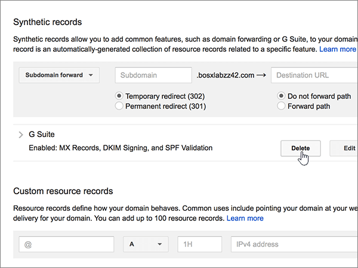
  
6. Select **Delete**.
    
    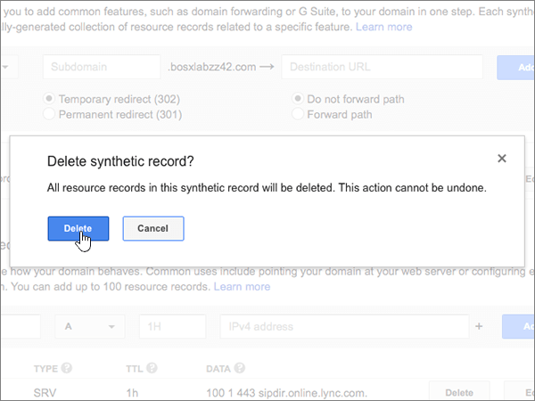
  
7. In the **Custom resource records** section, in the boxes for the new record, type or copy and paste the values from the following table. 
    
    (You may have to scroll down.)
    
    (Choose the **Type** value from the drop-down list.) 
    
    |**Name**|**Type**|**TTL**|**Data**|
    |:-----|:-----|:-----|:-----|
    |@    |MX    |1H    |0  *\<domain-key\>*  .mail.protection.outlook.com.    **This value MUST end with a period (.)**   The **0** is the MX priority value. Add it to the beginning of the MX value, separated from the remainder of the value by a space.    **Note:** Get your \<*domain-key*\> from your Microsoft account.  [How do I find this?](../get-help-with-domains/information-for-dns-records.md)          For more information about priority, see [What is MX priority?](https://docs.microsoft.com/microsoft-365/admin/setup/domains-faq)   |
   
    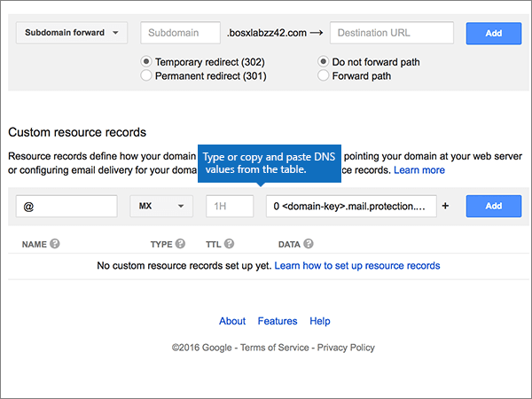
  
5. Select **Add**.
    
    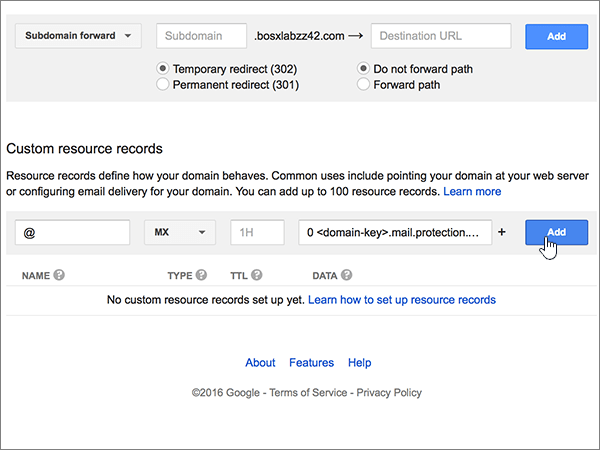
  
6. If there are any other Custom MX records, remove them.
    
1. Select **Edit** in the MX record row. 
    
    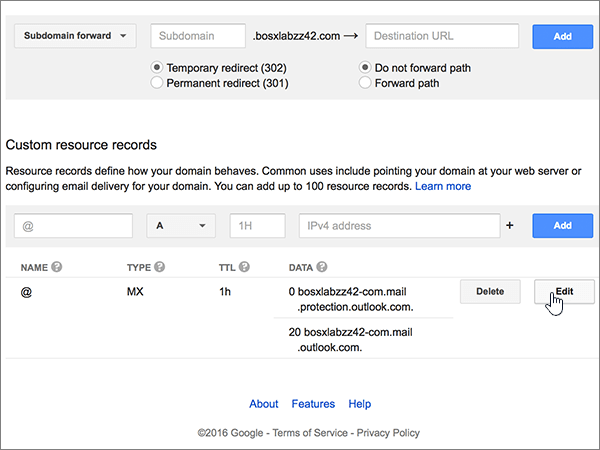
  
2. For each of the other Custom MX records, select the entry in the **Data** box and then press the **Delete** key on your keyboard to delete that record. 
    
    Continue until you have deleted the **Data** entry for each of the other MX records. 
    
    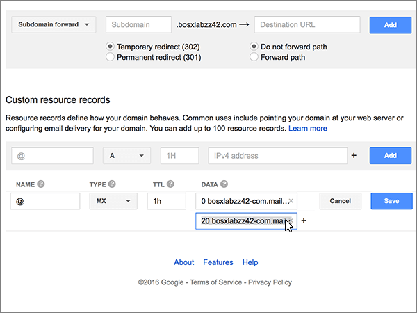
  
7. When you have deleted the **Data** entry for each of the other MX records, select **Save** to save your changes. 
    
    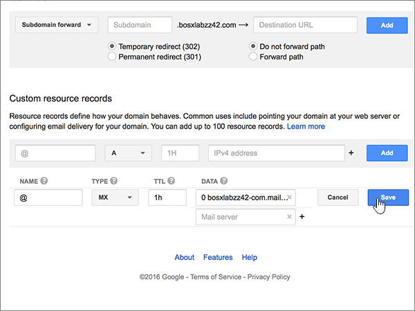
  
## Add the five CNAME records that are required for Microsoft

1. To get started, go to your [Google Domains page] (https://domains.google.com/registrar) and sign in.
    
2. On the **Domains** page, in the **Domain** section, select **Configure DNS** for the domain that you want to edit. 
    
3. Add the first CNAME record.
    
    In the **Custom resource records** section, in the boxes for the new record, type or copy and paste the values from first row of the following table. 
    
    (You may have to scroll down.)
    
    (Choose the **Type** value from the drop-down list.) 
    
    |**Name**|**Type**|**TTL**|**Data**|
    |:-----|:-----|:-----|:-----|
    |autodiscover    |CNAME    |1H    |autodiscover.outlook.com.    **This value MUST end with a period (.)**   |
    |sip    |CNAME    |1H    |sipdir.online.lync.com.    **This value MUST end with a period (.)**   |
    |lyncdiscover    |CNAME    |1H    |webdir.online.lync.com.    **This value MUST end with a period (.)**   |
    |enterpriseregistration    |CNAME    |1H    |enterpriseregistration.windows.net.    **This value MUST end with a period (.)**   |
    |enterpriseenrollment    |CNAME    |1H    |enterpriseenrollment-s.manage.microsoft.com.    **This value MUST end with a period (.)**   |
   
    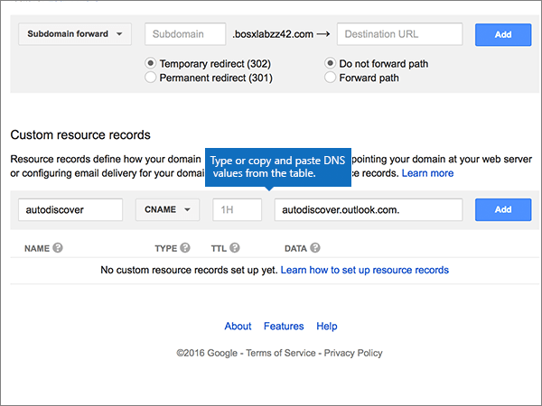
  
4. Select **Add**.
    
    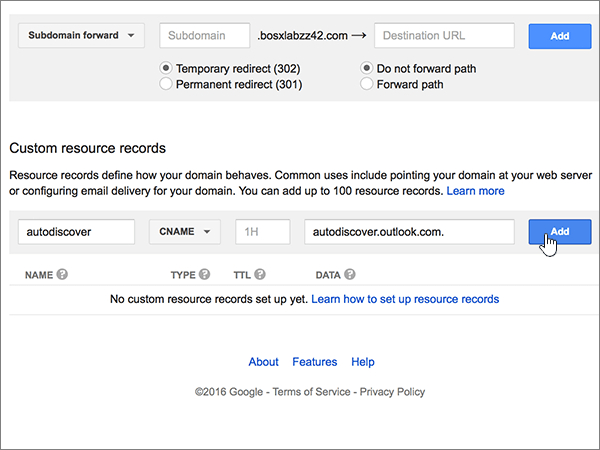
  
5. Add the other four CNAME records.
    
    In the **Custom resource records** section, create a record by using the values from the next row in the table, and then again select **Add** to complete that record. 
    
    Repeat this process until you have created all of the required CNAME records.
    
## Add a TXT record for SPF to help prevent email spam

> [!IMPORTANT]
> You cannot have more than one TXT record for SPF for a domain. If your domain has more than one SPF record, you'll get email errors, as well as delivery and spam classification issues. If you already have an SPF record for your domain, don't create a new one for Microsoft. Instead, add the required Microsoft values to the current record so that you have a single SPF record that includes both sets of values. Need examples? Check out these [External Domain Name System records for Microsoft](https://docs.microsoft.com/microsoft-365/enterprise/external-domain-name-system-records#bkmk_spfrecords). To validate your SPF record, you can use one of these [SPF validation tools](../setup/domains-faq.md). 
  
1. To get started, go to your domains page at Google Domains by using [this link](https://domains.google.com/registrar). You'll be prompted to sign in. To do so:
    
1. Select **Sign In**.
    
2. Enter your login credentials, and then again select **Sign In**.
    
3. On the **Domains** page, in the **Domain** section, select **Configure DNS** for the domain that you want to edit. 
    
4. In the **Custom resource records** section, on the TXT record row, select **Edit**. 
    
    > [!IMPORTANT]
    > Google Domains stores TXT records as a set that may contain multiple records. When you have at least one other TXT record, such as the TXT record you used to verify your domain, you must add TXT new records to that record set. Any attempt to enter additional TXT records as separate entries will result in a **Duplicate record** error message. 
  
    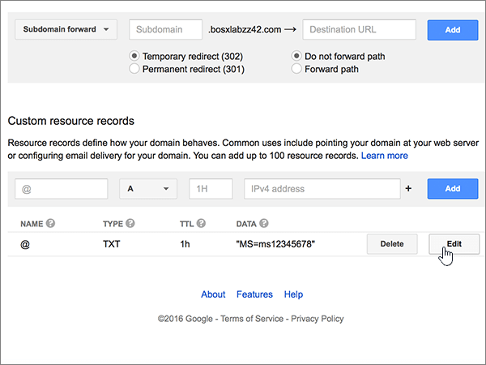
  
5. Select the **(+)** control. 
    
    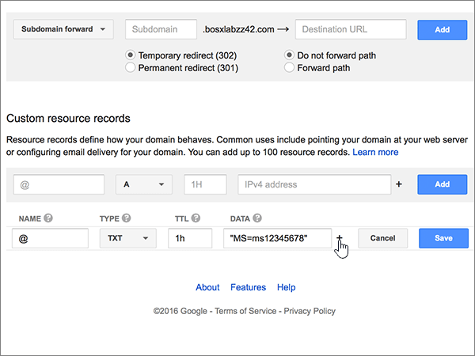
  
6. In the boxes for the new record, type or copy and paste the values from the following table.
    
    (You may have to scroll down.)
    
    |**Data**|
    |:-----|
    |v=spf1 include:spf.protection.outlook.com -all    

    > [!NOTE]
    > We recommend copying and pasting this entry, so that all of the spacing stays correct.           
   
   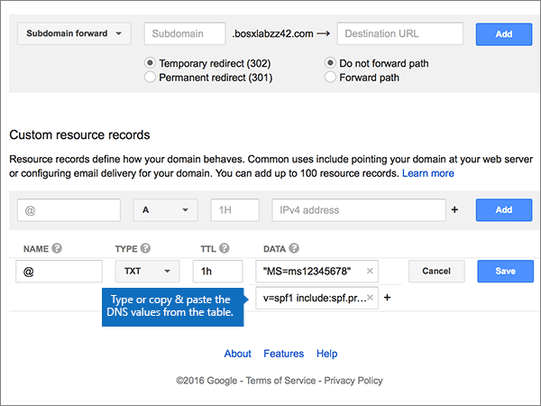
  
7. Select **Save**.
    
    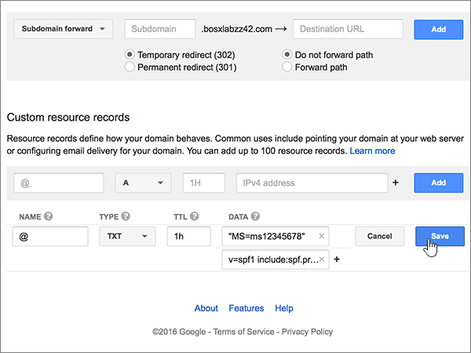
  
## Add the two SRV records that are required for Microsoft

1. To get started, go to your domains page at Google Domains by using [this link](https://domains.google.com/registrar). You'll be prompted to sign in. To do so:
    
2. Select **Sign In**.
    
3. Enter your login credentials, and then again select **Sign In**.
    
4. On the **Domains** page, in the **Domain** section, select **Configure DNS** for the domain that you want to edit. 
    
5. Add the first SRV record.
    
    In the **Custom resource records** section, in the boxes for the new record, type or copy and paste the values from the following table. 
    
    (You may have to scroll down.)
    
    (Choose the **Type** value from the drop-down list.) 
    
    |**Name**|**Type**|**TTL**|**Data**|
    |:-----|:-----|:-----|:-----|
    |_sip._tls|SRV|1H|100 1 443 sipdir.online.lync.com. **This value MUST end with a period (.)** **Note:** We recommend copying and pasting this entry, so that all of the spacing stays correct.           |
    |_sipfederationtls._tcp|SRV|1H|100 1 5061 sipfed.online.lync.com. **This value MUST end with a period (.)**

    We recommend copying and pasting this entry, so that all of the spacing stays correct.       
   
    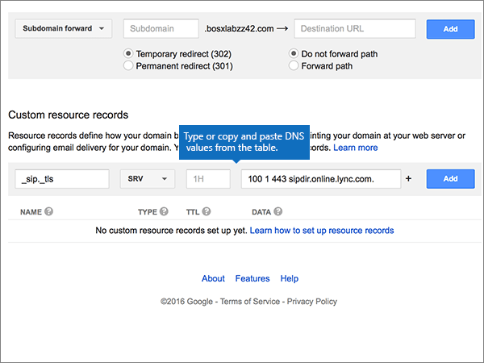
  
6. Select **Add**.
    
    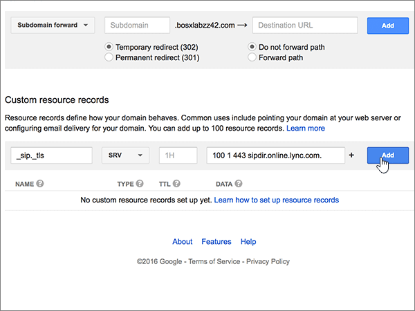
  
7. Add the other SRV record.
    
    In the **Custom resource records** section, create a record by using the values from the second row in the table, and then again select **Add** to complete that record. 
    
    > [!NOTE]
    > Typically it takes about 15 minutes for DNS changes to take effect. However, it can occasionally take longer for a change you've made to update across the Internet's DNS system. If you're having trouble with mail flow or other issues after adding DNS records, see [Find and fix issues after adding your domain or DNS records](../get-help-with-domains/find-and-fix-issues.md). 
  
