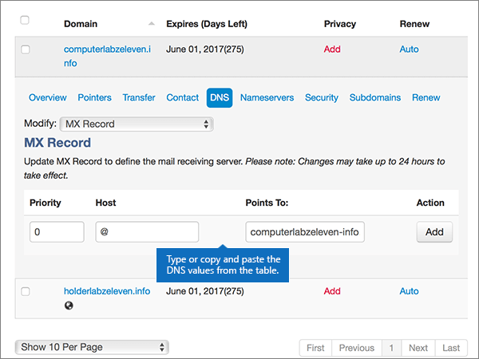
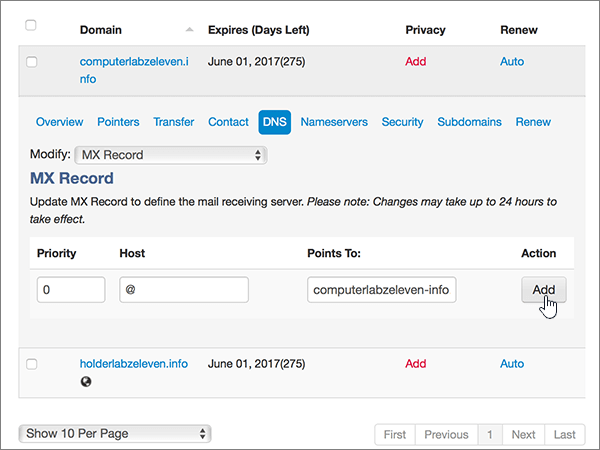
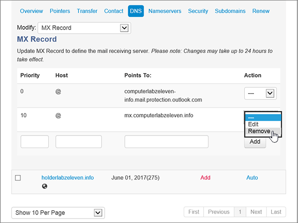
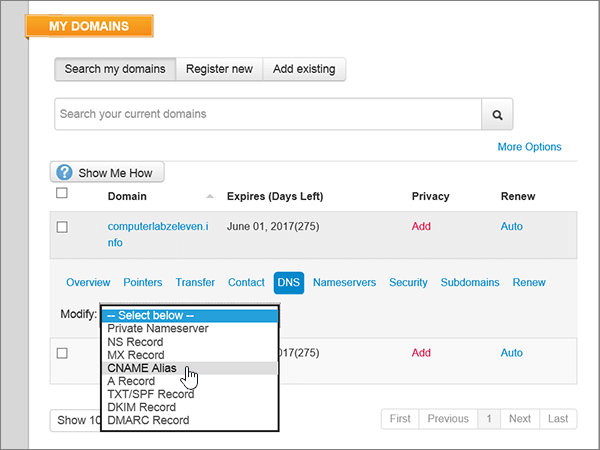
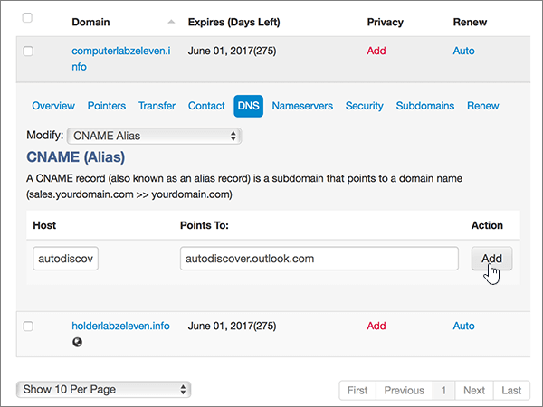
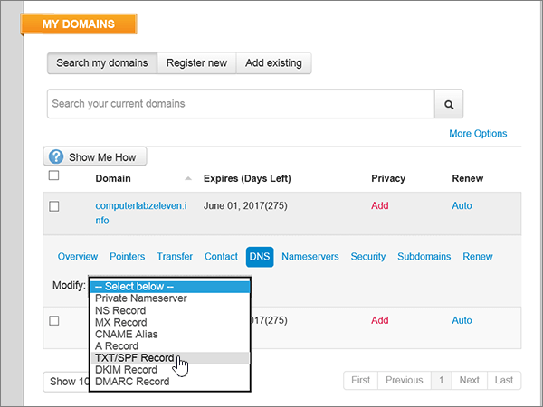
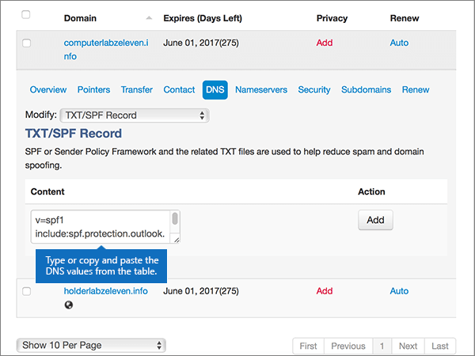
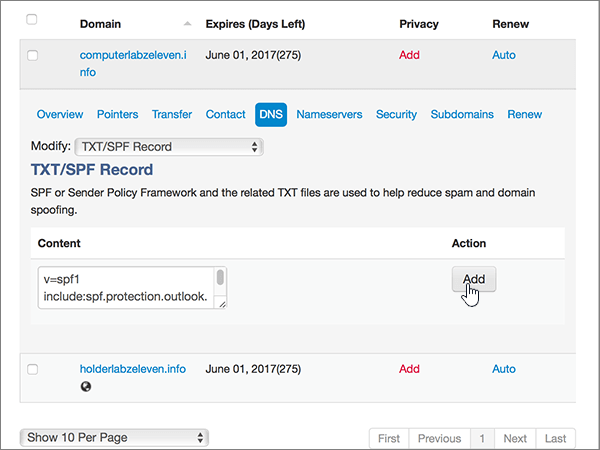

# Create DNS records at MyDomain for Microsoft

  
 **[Check the Domains FAQ](../setup/domains-faq.yml)** if you don't find what you're looking for. 
  
> [!CAUTION]
> The MyDomain website doesn't support SRV records, which means several Skype for Business Online and Outlook Web App features won't work. No matter which Microsoft plan you use, if you manage your DNS records at MyDomain, there are [significant service limitations](https://docs.microsoft.com/microsoft-365/admin/setup/domains-faq), and you might want to switch to a different DNS hosting provider. 
  
If you choose to manage your own Microsoft DNS records at MyDomain despite the service limitations, follow the steps in this article to set up your DNS records for email, Skype for Business Online, and so on.
    
After you add these records at MyDomain, your domain will be set up to work with Microsoft services.
  

  
> [!NOTE]
> Typically it takes about 15 minutes for DNS changes to take effect. However, it can occasionally take longer for a change you've made to update across the Internet's DNS system. If you're having trouble with mail flow or other issues after adding DNS records, see [Find and fix issues after adding your domain or DNS records](../get-help-with-domains/find-and-fix-issues.md). 
  
## Add a TXT record for verification

Before you use your domain with Microsoft, we have to make sure that you own it. Your ability to log in to your account at your domain registrar and create the DNS record proves to Microsoft that you own the domain.
  
> [!NOTE]
> This record is used only to verify that you own your domain; it doesn't affect anything else. You can delete it later, if you like. 
  
1. To get started, go to your domains page at MyDomain by using [this link](https://www.mydomain.com/controlpanel). You'll be prompted to log in first.
    
2. In the **My Favorites** section, select **Domain Central**.
    
3. Under **Domain**, select the name of the domain that you want to edit.
    
4. In the **Overview** row, select **DNS**.
    
5. From the **Modify** drop-down list, choose **TXT/SPF Record**.
    
6. Under **Content**, in the box for the new record, type or copy and paste the value from the following table.
    
    ||
    |:-----|
    |**Content**   |
    |MS=ms *XXXXXXXX*    **Note:** This is an example. Use your specific **Destination or Points to Address** value here, from the table. [How do I find this?](../get-help-with-domains/information-for-dns-records.md)          |
   
7. Select **Add**.
    
8. Wait a few minutes before you continue, so that the record you just created can update across the Internet.
    
Now that you've added the record at your domain registrar's site, you'll go back to Microsoft and request the record.
  
When Microsoft finds the correct TXT record, your domain is verified.
  
1. In the Microsoft admin center, go to the **Settings** \> <a href="https://go.microsoft.com/fwlink/p/?linkid=834818" target="_blank">Domains</a> page.
    
2. On the **Domains** page, select the domain that you are verifying. 
    
3. On the **Setup** page, select **Start setup**.
    
4. On the **Verify domain** page, select **Verify**.
    
> [!NOTE]
> Typically it takes about 15 minutes for DNS changes to take effect. However, it can occasionally take longer for a change you've made to update across the Internet's DNS system. If you're having trouble with mail flow or other issues after adding DNS records, see [Find and fix issues after adding your domain or DNS records](../get-help-with-domains/find-and-fix-issues.md). 
  
## Add an MX record so email for your domain will come to Microsoft

1. To get started, go to your domains page at MyDomain by using [this link](https://www.mydomain.com/controlpanel). You'll be prompted to log in first.
    
2. In the **My Favorites** section, select **Domain Central**.
    
3. Under **Domain**, select the name of the domain that you want to edit.
    
4. In the **Overview** row, select **DNS**.
    
5. From the **Modify** drop-down list, choose **MX Record**.
    
    
  
6. In the boxes for the new record, type or copy and paste the values from the following table.
    
    |**Priority**|**Host**|**Points To:**|
    |:-----|:-----|:-----|
    |0    For more information about priority, see [What is MX priority?](https://docs.microsoft.com/microsoft-365/admin/setup/domains-faq)   |@    | *\<domain-key\>*  .mail.protection.outlook.com    **Note:** Get your \<*domain-key*\> from your Microsoft account. > [How do I find this?](../get-help-with-domains/information-for-dns-records.md)          |
   
    
  
7. Select **Add**.
    
    
  
8. If there are any other existing MX records, select **Remove** in the **Action** column for each one to delete it. 
    
    
  
9. Select **OK**.
    
    
  
## Add the CNAME records that are required for Microsoft

1. To get started, go to your domains page at MyDomain by using [this link](https://www.mydomain.com/controlpanel). You'll be prompted to log in first.
    
2. In the **My Favorites** section, select **Domain Central**.
    
3. Under **Domain**, select the name of the domain that you want to edit.
    
4. In the **Overview** row, select **DNS**.
    
5. From the **Modify** drop-down list, choose **CNAME Alias**.
    
    
  
6. Add the first CNAME record.
    
    In the boxes for the new record, type or copy and paste the values from the first row of the following table.
    
    |**Host**|**Points To:**|
    |:-----|:-----|
    |autodiscover    |autodiscover.outlook.com    |
    |sip    |sipdir.online.lync.com    |
    |lyncdiscover    |webdir.online.lync.com    |
    |enterpriseregistration    |enterpriseregistration.windows.net    |
    |enterpriseenrollment    |enterpriseenrollment-s.manage.microsoft.com    |
   
    
  
7. Select **Add** to add the first record. 
    
    
  
8. Add the second CNAME record.
    
    Use the values from the second row of the table above, and then select **Add** to add the second record. 
    
    Add the remaining records in the same way, using the values from the third, fourth, fifth, and sixth rows of the table.
    
## Add a TXT record for SPF to help prevent email spam

> [!IMPORTANT]
> You cannot have more than one TXT record for SPF for a domain. If your domain has more than one SPF record, you'll get email errors, as well as delivery and spam classification issues. If you already have an SPF record for your domain, don't create a new one for Microsoft. Instead, add the required Microsoft values to the current record so that you have a single SPF record that includes both sets of values. Need examples? Check out these [External Domain Name System records for Microsoft](https://docs.microsoft.com/microsoft-365/enterprise/external-domain-name-system-records#bkmk_spfrecords). To validate your SPF record, you can use one of these [SPF validation tools](../setup/domains-faq.yml). 
  
1. To get started, go to your domains page at MyDomain by using [this link](https://www.mydomain.com/controlpanel). You'll be prompted to log in first.
    
2. In the **My Favorites** section, select **Domain Central**.
    
3. Under **Domain**, select the name of the domain that you want to edit.
    
4. In the **Overview** row, select **DNS**.
    
5. From the **Modify** drop-down list, choose **TXT/SPF Record**.
    
    
  
6. Under **Content**, in the box for the new record, type or copy and paste the value from the following table.
    
    |**Content**|
    |:-----|
    |v=spf1 include:spf.protection.outlook.com -all    **Note:** We recommend copying and pasting this entry, so that all of the spacing stays correct.           |
   
    
  
7. Select **Add**.
    
    
  
## Add the two SRV records that are required for Microsoft

> [!CAUTION]
> The MyDomain website doesn't support SRV records, which means several Skype for Business Online and Outlook Web App features won't work. No matter which Microsoft plan you use, if you manage your DNS records at MyDomain, there are [significant service limitations](https://docs.microsoft.com/microsoft-365/admin/setup/domains-faq), and you might want to switch to a different DNS hosting provider. 
  
> [!NOTE]
> Typically it takes about 15 minutes for DNS changes to take effect. However, it can occasionally take longer for a change you've made to update across the Internet's DNS system. If you're having trouble with mail flow or other issues after adding DNS records, see [Find and fix issues after adding your domain or DNS records](../get-help-with-domains/find-and-fix-issues.md). 
  
