# Create DNS records at name.com for Microsoft

 **[Check the Domains FAQ](../setup/domains-faq.md)** if you don't find what you're looking for. 
  
If name.com is your DNS hosting provider, follow the steps in this article to verify your domain and set up DNS records for email, Skype for Business Online, and so on.
  
After you add these records at name.com, your domain will be set up to work with Microsoft services.

  
> [!NOTE]
> Typically it takes about 15 minutes for DNS changes to take effect. However, it can occasionally take longer for a change you've made to update across the Internet's DNS system. If you're having trouble with mail flow or other issues after adding DNS records, see [Troubleshoot issues after changing your domain name or DNS records](../get-help-with-domains/find-and-fix-issues.md). 
  
## Add a TXT record for verification

Before you use your domain with Microsoft, we have to make sure that you own it. Your ability to log in to your account at your domain registrar and create the DNS record proves to Microsoft that you own the domain.
  
> [!NOTE]
> This record is used only to verify that you own your domain; it doesn't affect anything else. You can delete it later, if you like. 
  
1. To get started, go to your domains page at name.com by using [this link](https://www.name.com/account/domain). You'll be prompted to log in first.
    
    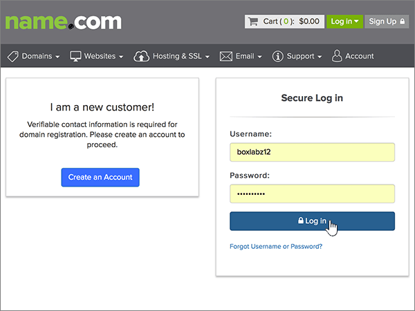
  
2. Under **My Domains**, select the name of the domain that you want to modify.
    
    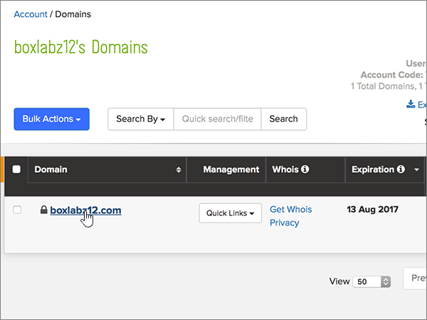
  
3. In the **Details** column, select **DNS Records**. 
    
    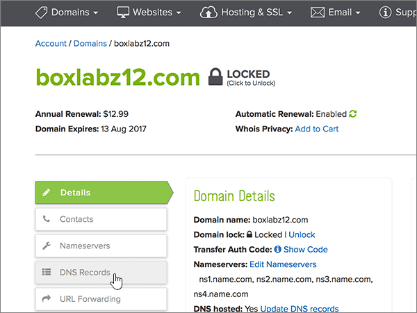
  
4. In the boxes for the new record, type or copy and paste the values from the following table.
    
    (Choose the **Type** value from the drop-down list.) 
    
    |||||
    |:-----|:-----|:-----|:-----|
    |**Type**   |**Host**   |**Answer**   |**TTL**   |
    |TXT    |(Leave this field empty.)    |MS=ms *XXXXXXXX*    **Note:** This is an example. Use your specific **Destination or Points to Address** value here, from the table.           [How do I find this?](../get-help-with-domains/information-for-dns-records.md)          |Use the default value (300).    |
   
    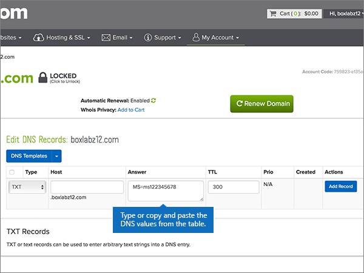
  
5. Select **Add Record**.
    
    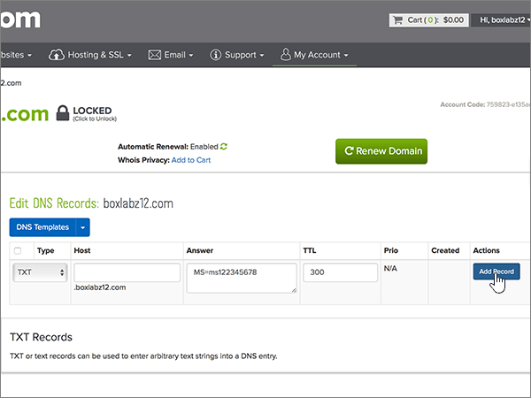
  
6. Wait a few minutes before you continue, so that the record you just created can update across the Internet.
    
Now that you've added the record at your domain registrar's site, you'll go back to Microsoft and request the record.
  
When Microsoft finds the correct TXT record, your domain is verified.
  
1. In the admin center, go to the **Settings** \> <a href="https://go.microsoft.com/fwlink/p/?linkid=834818" target="_blank">Domains</a> page.
    
2. On the **Domains** page, select the domain that you are verifying. 
    
    
  
3. On the **Setup** page, select **Start setup**.
    
    
  
4. On the **Verify domain** page, select **Verify**.
    
    
  
> [!NOTE]
> Typically it takes about 15 minutes for DNS changes to take effect. However, it can occasionally take longer for a change you've made to update across the Internet's DNS system. If you're having trouble with mail flow or other issues after adding DNS records, see [Troubleshoot issues after changing your domain name or DNS records](../get-help-with-domains/find-and-fix-issues.md). 
  
## Add an MX record so email for your domain will come to Microsoft

1. To get started, go to your domains page at name.com by using [this link](https://www.name.com/account/domain). You'll be prompted to log in first.
    
    
  
2. Under **My Domains**, select the name of the domain that you want to modify.
    
    
  
3. In the **Details** column, select **DNS Records**. 
    
    
  
4. In the boxes for the new record, type or copy and paste the values from the following table.
    
    (Choose the **Type** value from the drop-down list.) 
    
    |**Type**|**Host**|**Answer**|**TTL**|**Prio**|
    |:-----|:-----|:-----|:-----|:-----|
    |MX    |(Leave this field empty.)    | *\<domain-key\>*  .mail.protection.outlook.com    **Note:** Get your  *\<domain-key\>*  from your Microsoft account.           [How do I find this?](../get-help-with-domains/information-for-dns-records.md)          |Use the default value (300).    |0    For more information about priority, see [What is MX priority?](https://docs.microsoft.com/microsoft-365/admin/setup/domains-faq)   |
   
   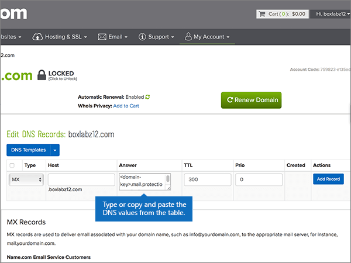
  
5. Select **Add Record**.
    
    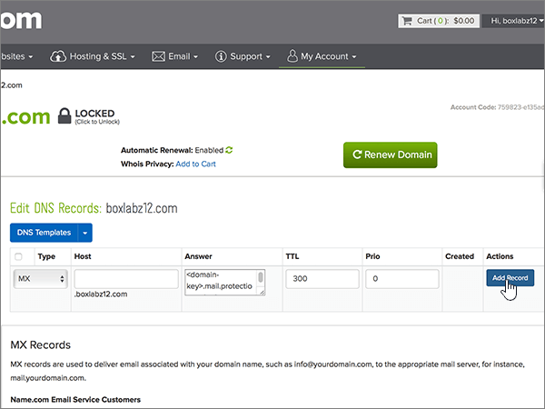
  
6. If there are any other MX records, delete each of them by using the following two-step procedure:
    
    For each other MX record, select **Delete** in the **Actions** column. 
    
    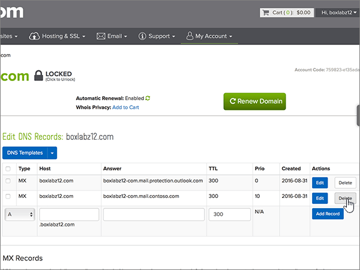
  
    To confirm each deletion, select **Delete** in the **Actions** column again. 
    
    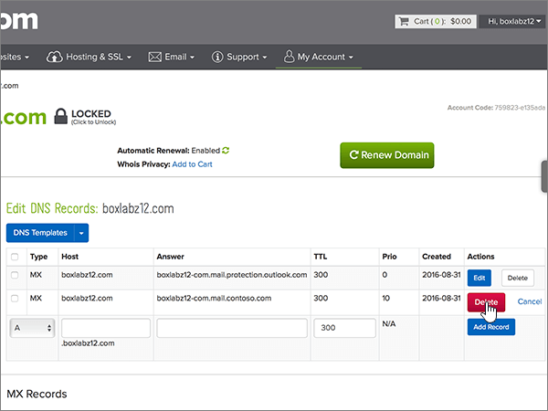
  
    Repeat this two-step procedure until you have deleted each of the other MX records.
    
## Add the CNAME records that are required for Microsoft

1. To get started, go to your domains page at name.com by using [this link](https://www.name.com/account/domain). You'll be prompted to log in first.
    
    
  
2. Under **My Domains**, select the name of the domain that you want to modify.
    
    
  
3. In the **Details** column, select **DNS Records**. 
    
    
  
4. Add the first CNAME record.
    
    In the boxes for the new record, type or copy and paste the values from the first row of the following table.
    
    (Choose the **Type** value from the drop-down list.) 
    
    |**Type**|**Host**|**Answer**|**TTL**|
    |:-----|:-----|:-----|:-----|
    |CNAME    |autodiscover    |autodiscover.outlook.com    |Use the default value (300).    |
    |CNAME    |sip    |sipdir.online.lync.com    |Use the default value (300).    |
    |CNAME    |lyncdiscover    |webdir.online.lync.com    |Use the default value (300).    |
    |CNAME    |enterpriseregistration    |enterpriseregistration.windows.net    |Use the default value (300).    |
    |CNAME    |enterpriseenrollment    |enterpriseenrollment-s.manage.microsoft.com    |Use the default value (300).    |
   
   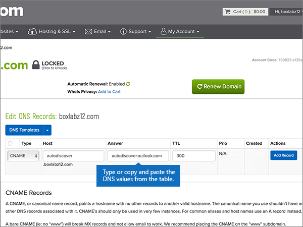
  
5. Select **Add Record** to add the first record. 
    
    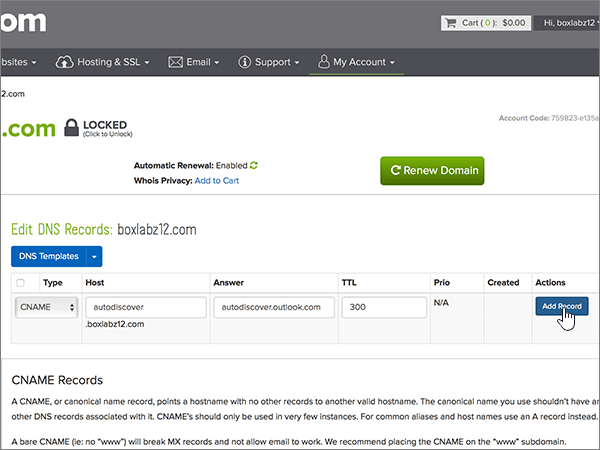
  
6. Add the second CNAME record.
    
    Use the values from the second row of the table above, and then select **Add Record** to add the second record. 
    
    Add the remaining records in the same way, using the values from the third, fourth, fifth, and sixth rows of the table.
    
## Add a TXT record for SPF to help prevent email spam

> [!IMPORTANT]
> You cannot have more than one TXT record for SPF for a domain. If your domain has more than one SPF record, you'll get email errors, as well as delivery and spam classification issues. If you already have an SPF record for your domain, don't create a new one for Microsoft. Instead, add the required Microsoft values to the current record so that you have a  *single*  SPF record that includes both sets of values. 
  
1. To get started, go to your domains page at name.com by using [this link](https://www.name.com/account/domain). You'll be prompted to log in first.
    
    
  
2. Under **My Domains**, select the name of the domain that you want to modify.

    
  
3. In the **Details** column, select **DNS Records**. 
    
    
  
4. In the boxes for the new record, type or copy and paste the values from the following table.
    
    (Choose the **Type** value from the drop-down list.) 
    
    |**Type**|**Host**|**Answer**|**TTL**|
    |:-----|:-----|:-----|:-----|
    |TXT    |(Leave this field empty.)    |v=spf1 include:spf.protection.outlook.com -all    **Note:** We recommend copying and pasting this entry, so that all of the spacing stays correct.           |Use the default value (300).    |
   
   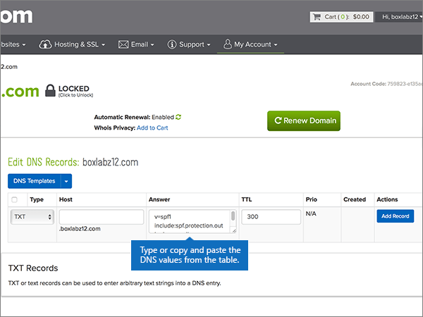
  
5. Select **Add Record**.
    
    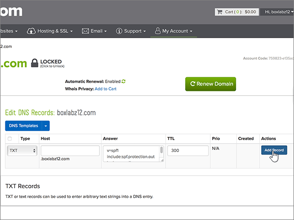
  
## Add the two SRV records that are required for Microsoft

1. To get started, go to your domains page at name.com by using [this link](https://www.name.com/account/domain). You'll be prompted to log in first.
    
    
  
2. Under **My Domains**, select the name of the domain that you want to modify.
    
    
  
3. In the **Details** column, select **DNS Records+**. 
    
    
  
4. Add the first SRV record:
    
    In the boxes for the new record, type or copy and paste the values from the first row of the following table.
    
    (Choose the **Type** value from the drop-down list.) 
    
    |**Type**|**Service**|**Weight**|**TTL**|**Prio**|**Protocol**|**Port**|**Target**|
    |:-----|:-----|:-----|:-----|:-----|:-----|:-----|:-----|
    |SRV|sip|1|Use the default value (300).|100|tls|443|sipdir.online.lync.com   **Note:** We recommend copying and pasting this entry, so that all of the spacing stays correct.           |
    |SRV|sipfederationtls|1|Use the default value (300).|100|tcp|5061|sipfed.online.lync.com  **Note:** We recommend copying and pasting this entry, so that all of the spacing stays correct.           |
   
   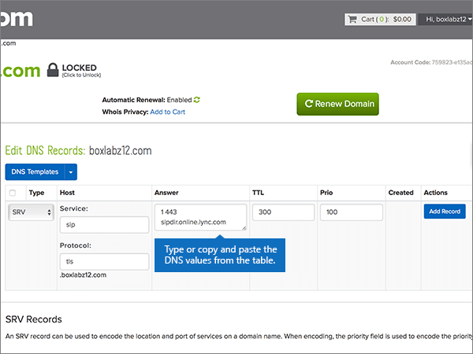
  
5. Select **Add Record**.

    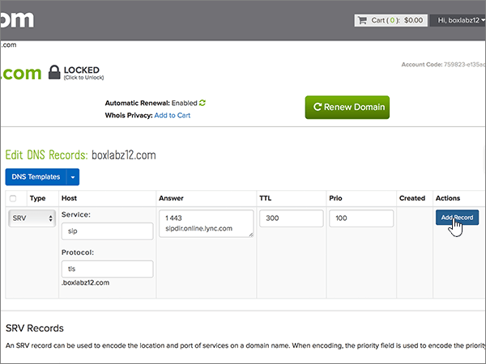
  
6. Add the second SRV record:

Use the values from the next row of the table above, and then select **Add Record** to add the second record.

>[!NOTE]
>Typically it takes about 15 minutes for DNS changes to take effect. However, it can occasionally take longer for a change you've made to update across the Internet's DNS system. If you're having trouble with mail flow or other issues after adding DNS records, see [Troubleshoot issues after changing your domain name or DNS records](../get-help-with-domains/find-and-fix-issues.md).
