# Create DNS records at Namecheap for Microsoft

 **[Check the Domains FAQ](../setup/domains-faq.yml)** if you don't find what you're looking for. 
  
If Namecheap is your DNS hosting provider, follow the steps in this article to verify your domain and set up DNS records for email, Skype for Business Online, and so on.
  
After you add these records at Namecheap, your domain will be set up to work with Microsoft services.
  
> [!NOTE]
> Typically it takes about 15 minutes for DNS changes to take effect. However, it can occasionally take longer for a change you've made to update across the Internet's DNS system. If you're having trouble with mail flow or other issues after adding DNS records, see [Troubleshoot issues after changing your domain name or DNS records](../get-help-with-domains/find-and-fix-issues.md). 
  
## Add a TXT record for verification

Before you use your domain with Microsoft, we have to make sure that you own it. Your ability to log in to your account at your domain registrar and create the DNS record proves to Microsoft that you own the domain.
  
> [!NOTE]
> This record is used only to verify that you own your domain; it doesn't affect anything else. You can delete it later, if you like. 
  
Follow the steps below.
  
1. To get started, go to your domains page at Namecheap by using [this link](https://www.namecheap.com/myaccount/login.aspx?ReturnUrl=%2f). You'll be prompted to Sign in and Continue.
    
    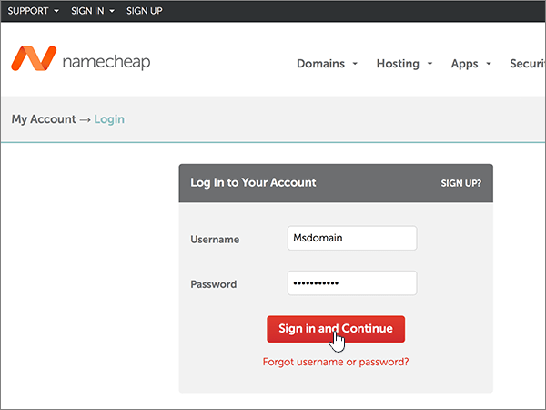
  
2. On the **Landing** page, under **Account**, choose **Domain List** from the drop-down list. 
    
    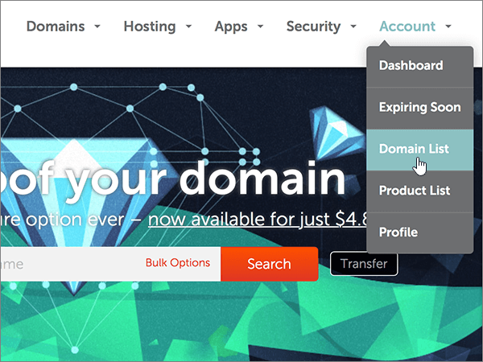
  
3. On the **Domain List** page, find the name of the domain that you want to edit, and then select **Manage**.
    
    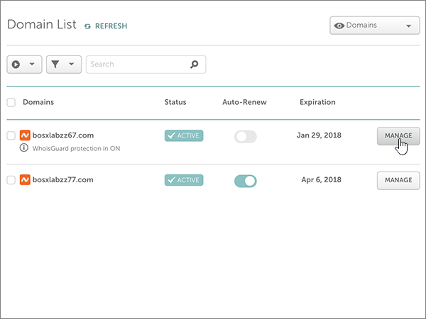
  
4. Select **Advanced DNS**.
    
    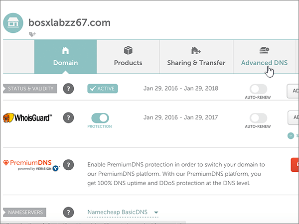
  
5. In the **HOST RECORDS** section, select **ADD NEW RECORD**.
    
    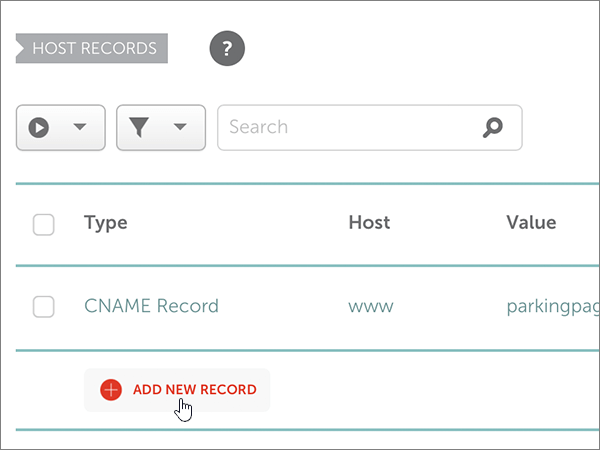
  
6. In the **Type** drop-down, select **TXT Record**.
    
    > [!NOTE]
    > The **Type** drop-down automatically appears when you select **ADD NEW RECORD**. 
  
    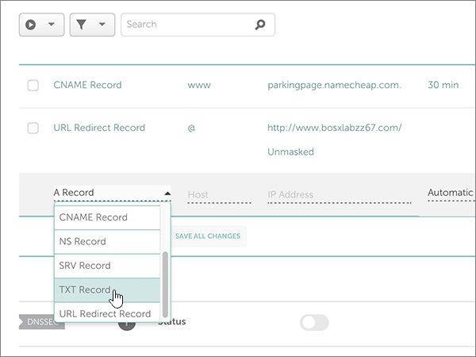
  
7. In the boxes for the new record, type or copy and paste the values from the following table.
    
    (Choose the **TTL** value from the drop-down list.) 
    
    |**Type**|**Host**|**Value**|**TTL**|
    |:-----|:-----|:-----|:-----|
    |TXT    |@    |MS=ms *XXXXXXXX*   **Note:** This is an example. Use your specific **Destination or Points to Address** value here, from the table.  [How do I find this?](../get-help-with-domains/information-for-dns-records.md)          |30 min    |
       
    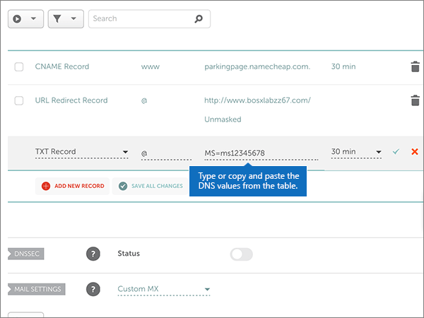
  
8. Select the **Save Changes** (check mark) control. 
    
    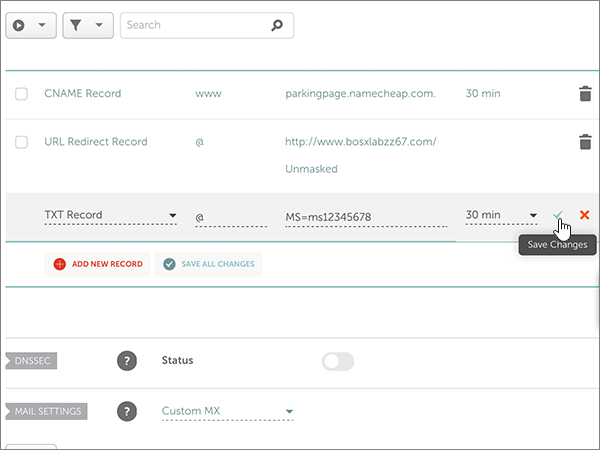
  
9. Wait a few minutes before you continue, so that the record you just created can update across the Internet.
    
Now that you've added the record at your domain registrar's site, you'll go back to Microsoft and request the record.
  
When Microsoft finds the correct TXT record, your domain is verified.
  
1. In the admin center, go to the **Settings** \> <a href="https://go.microsoft.com/fwlink/p/?linkid=834818" target="_blank">Domains</a> page.
    
2. On the **Domains** page, select the domain that you are verifying. 
    
    
  
3. On the **Setup** page, select **Start setup**.
    
    
  
4. On the **Verify domain** page, select **Verify**.
    
    
  
> [!NOTE]
> Typically it takes about 15 minutes for DNS changes to take effect. However, it can occasionally take longer for a change you've made to update across the Internet's DNS system. If you're having trouble with mail flow or other issues after adding DNS records, see [Troubleshoot issues after changing your domain name or DNS records](../get-help-with-domains/find-and-fix-issues.md). 

  
## Add an MX record so email for your domain will come to Microsoft

Follow the steps below.
  
1. To get started, go to your domains page at Namecheap by using [this link](https://www.namecheap.com/myaccount/login.aspx?ReturnUrl=%2f). You'll be prompted to Sign in and Continue.
    
    
  
2. On the **Landing** page, under **Account**, choose **Domain List** from the drop-down list. 
    
    
  
3. On the **Domain List** page, find the name of the domain that you want to edit, and then select **Manage**.
    
    
  
4. Select **Advanced DNS**.
    
    
  
5. In the **MAIL SETTINGS** section, select **Custom MX** from the **Email Forwarding** drop-down list. 
    
    (You may have to scroll down.)
    
    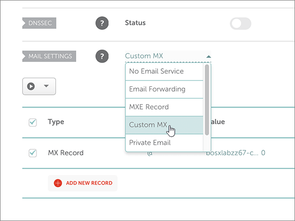
  
6. Select **Add New Record**.
    
    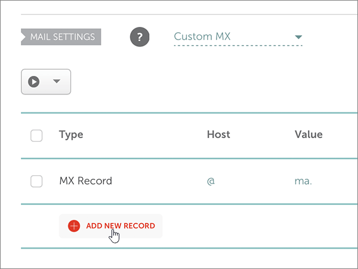
  
7. In the boxes for the new record, type or copy and paste the values, from the following table.
    
    (The **Priority** box is the unnamed box to the right of the **Value** box. Choose the **TTL** value from the drop-down list.) 
    
    |**Type**|**Host**|**Value**|**Priority**|**TTL**|
    |:-----|:-----|:-----|:-----|:-----|
    |MX Record    |@    |\<*domain-key*\>.mail.protection.outlook.com.    **This value MUST end with a period (.)**   **Note:** Get your  *\<domain-key\>*  from your Microsoft account.  [How do I find this?](../get-help-with-domains/information-for-dns-records.md)          |0    For more information about priority, see [What is MX priority?](https://docs.microsoft.com/microsoft-365/admin/setup/domains-faq)   |30 min    |
       
    
  
8. Select the **Save Changes** (check mark) control. 
    
    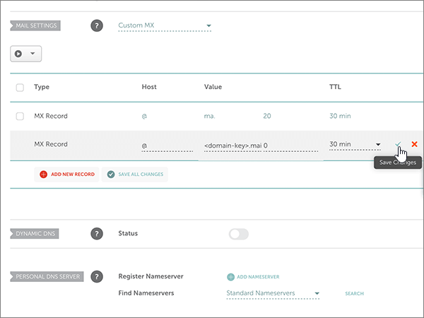
  
9. If there are any other MX records, use the following two-step process to remove each of them:
    
    First, select the **Delete icon** (trash can) for the record that you want to remove. 
    
    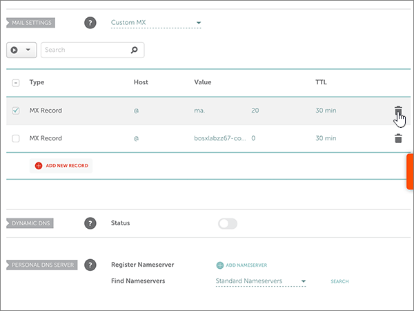
  
    Second, select **Yes** to confirm the deletion. 
    
    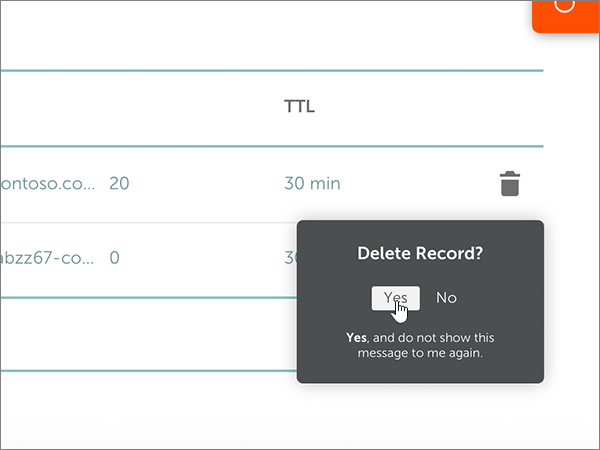
  
    Remove all MX records except for the one that you added earlier in this procedure.

  
## Add the six CNAME records that are required for Microsoft

Follow the steps below.
  
1. To get started, go to your domains page at Namecheap by using [this link](https://www.namecheap.com/myaccount/login.aspx?ReturnUrl=%2f). You'll be prompted to Sign in and Continue.
    
    
  
2. On the **Landing** page, under **Account**, choose **Domain List** from the drop-down list. 
    
    
  
3. On the **Domain List** page, find the name of the domain that you want to edit, and then select **Manage**.
    
    
  
4. Select **Advanced DNS**.
    
    
  
5. In the **HOST RECORDS** section, select **ADD NEW RECORD**.
    
    
  
6. In the **Type** drop-down, select **CNAME Record**.
    
    > [!NOTE]
    > The **Type** drop-down automatically appears when you select **ADD NEW RECORD**. 
  
    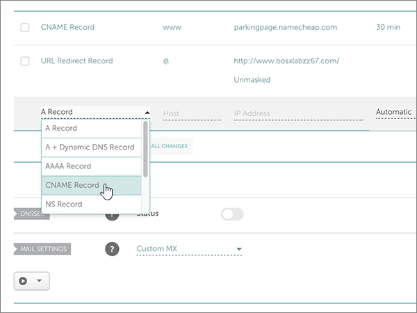
  
7. In the empty boxes for the new record, select **CNAME** for the **Record Type**, and then type or copy and paste the values from the first row in the following table.
    
    |**Type**|**Host**|**Value**|**TTL**|
    |:-----|:-----|:-----|:-----|
    |CNAME    |autodiscover    |autodiscover.outlook.com.    **This value MUST end with a period (.)**   |3600    |
    |CNAME    |sip    |sipdir.online.lync.com.    **This value MUST end with a period (.)**   |3600    |
    |CNAME    |lyncdiscover    |webdir.online.lync.com.    **This value MUST end with a period (.)**   |3600    |
    |CNAME    |enterpriseregistration    |enterpriseregistration.windows.net.    **This value MUST end with a period (.)**   |3600    |
    |CNAME    |enterpriseenrollment    |enterpriseenrollment-s.manage.microsoft.com.    **This value MUST end with a period (.)**   |3600    |
       
    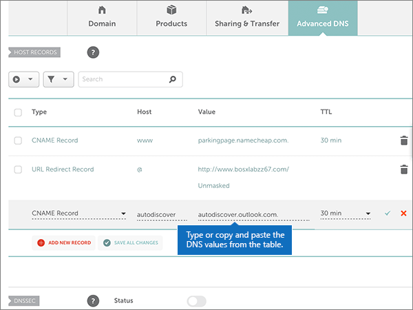
  
8. Select the **Save Changes** (check mark) control. 
    
    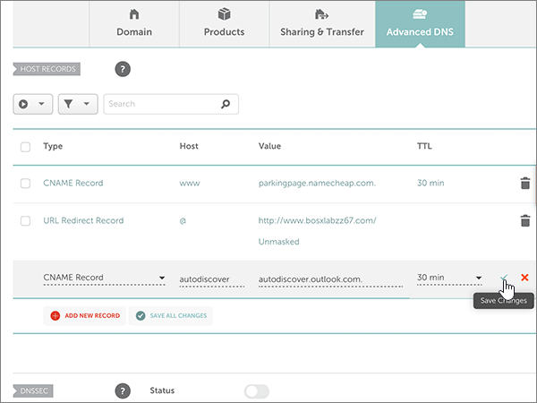
  
9. Using the preceding four steps and the values from the other five rows in the table, add each of the other five CNAME records.

  
## Add a TXT record for SPF to help prevent email spam

> [!IMPORTANT]
> You cannot have more than one TXT record for SPF for a domain. If your domain has more than one SPF record, you'll get email errors, as well as delivery and spam classification issues. If you already have an SPF record for your domain, don't create a new one for Microsoft. Instead, add the required Microsoft values to the current record so that you have a  *single*  SPF record that includes both sets of values. 

Follow the steps below.
  
1. To get started, go to your domains page at Namecheap by using [this link](https://www.namecheap.com/myaccount/login.aspx?ReturnUrl=%2f). You'll be prompted to Sign in and Continue.
    
2. On the **Landing** page, under **Account**, choose **Domain List** from the drop-down list. 
    
    
  
3. On the **Domain List** page, find the name of the domain that you want to edit and then select **Manage**.
    
    
  
4. Select **Advanced DNS**.
    
    
  
5. In the **HOST RECORDS** section, select **ADD NEW RECORD**.
    
    
  
6. In the **Type** drop-down, select **TXT Record**.
    
    > [!NOTE]
    > The **Type** drop-down automatically appears when you select **ADD NEW RECORD**. 
  
    
  
7. In the boxes for the new record, type or copy and paste the following values from the following table.
    
    (Choose the **TTL** value from the drop-down list.) 
    
    |**Type**|**Host**|**Value**|**TTL**|
    |:-----|:-----|:-----|:-----|
    |TXT    |@    |v=spf1 include:spf.protection.outlook.com -all    **Note:** We recommend copying and pasting this entry, so that all of the spacing stays correct.           |30 min    |
       
    
  
8. Select the **Save Changes** (check mark) control. 
    
    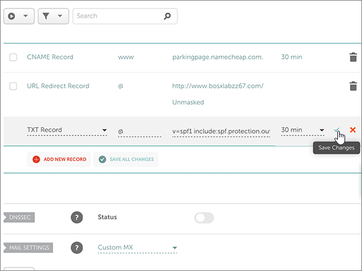
  
## Add the two SRV records that are required for Microsoft

1. To get started, go to your domains page at Namecheap by using [this link](https://www.namecheap.com/myaccount/login.aspx?ReturnUrl=%2f). You'll be prompted to sign in.
    
    
  
2. On the **Landing** page, under **Account**, choose **Domain List** from the drop-down list. 
    
    
  
3. On the **Domain List** page, find the name of the domain that you want to edit and then select **Manage**.
    
    
  
4. Select **Advanced DNS**.
    
    
  
5. In the **HOST RECORDS** section, select **ADD NEW RECORD**.
    
    
  
6. In the **Type** drop-down, select **SRV Record**.
    
    > [!NOTE]
    > The **Type** drop-down automatically appears when you select **ADD NEW RECORD**. 
  
    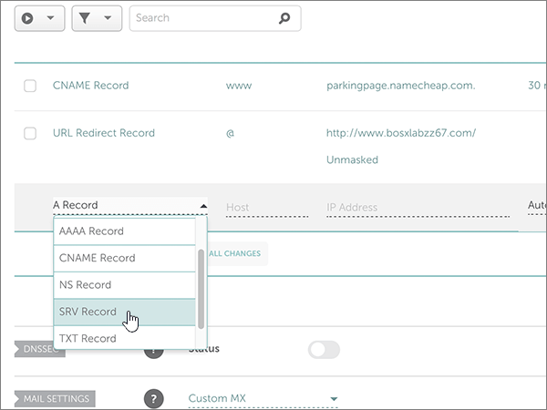
  
7. In the empty boxes for the new records, type or copy and paste the values from the first row in the following table.
    
    |**Service**|**Protocol**|**Priority**|**Weight**|**Port**|**Target**|**TTL**|
    |:-----|:-----|:-----|:-----|:-----|:-----|:-----|
    |_sip    |_tls    |100    |1    |443    |sipdir.online.lync.com.    **This value MUST end with a period (.)**   |30 min    |
    |_sipfederationtls    |_tcp    |100    |1    |5061    |sipfed.online.lync.com.    **This value MUST end with a period (.)**   |30 min    |
       
    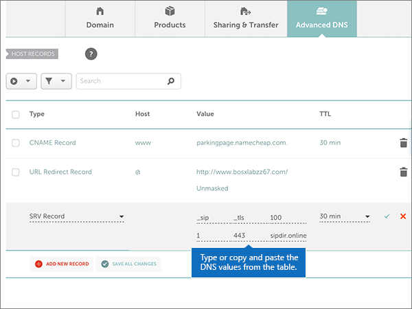
  
8. Select the **Save Changes** (check mark) control. 
    
    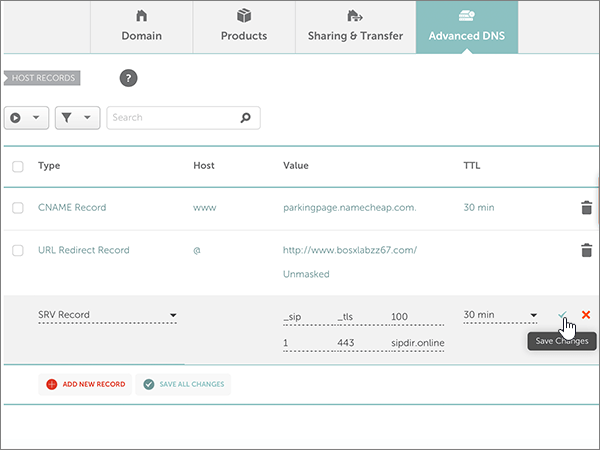
  
9. Using the preceding four steps and the values from the second row in the table, add the other SRV record.
    
> [!NOTE]
> Typically it takes about 15 minutes for DNS changes to take effect. However, it can occasionally take longer for a change you've made to update across the Internet's DNS system. If you're having trouble with mail flow or other issues after adding DNS records, see [Troubleshoot issues after changing your domain name or DNS records](../get-help-with-domains/find-and-fix-issues.md). 
  

  
