# Create DNS records at Netregistry for Microsoft

[Check the Domains FAQ](../setup/domains-faq.yml) if you don't find what you're looking for. 
  
If Netregistry is your DNS hosting provider, follow the steps in this article to verify your domain and set up DNS records for email, Skype for Business Online, and so on.
  
These are the main records to add.
  
- [Add a TXT record for verification](#add-a-txt-record-for-verification)
    
- [Add an MX record so email for your domain will come to Microsoft](#add-an-mx-record-so-email-for-your-domain-will-come-to-microsoft)

- [Add the CNAME records that are required for Microsoft](#add-the-cname-records-that-are-required-for-microsoft)
    
- [Add a TXT record for SPF to help prevent email spam](#add-a-txt-record-for-spf-to-help-prevent-email-spam)
    
- [Add the two SRV records that are required for Microsoft](#add-the-two-srv-records-that-are-required-for-microsoft)
    
After you add these records at Netregistry, your domain will be set up to work with Microsoft services.
  
  
> [!NOTE]
> Typically it takes about 15 minutes for DNS changes to take effect. However, it can occasionally take longer for a change you've made to update across the Internet's DNS system. If you're having trouble with mail flow or other issues after adding DNS records, see [Troubleshoot issues after changing your domain name or DNS records](../get-help-with-domains/find-and-fix-issues.md). 
  
## Add a TXT record for verification

Before you use your domain with Microsoft, we have to make sure that you own it. Your ability to log in to your account at your domain registrar and create the DNS record proves to Microsoft that you own the domain.
  
> [!NOTE]
> This record is used only to verify that you own your domain; it doesn't affect anything else. You can delete it later, if you like. 
  
1. To get started, go to your domains page in Netregistry by using [this link](https://theconsole.netregistry.com.au/). You'll be prompted to log in.
    
    
  
2. Next to the domain you want to manage, select **Manage**.
    
    
  
3. Select **Zone Manager**.
    
    
  
4. Under **Add a zone record**, choose **TXT Record** from the list, and then select **Create new record**.
    
    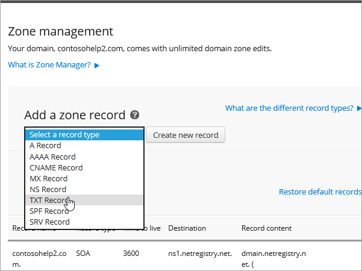
  
    > [!NOTE]
    > You must use quotation marks before and after the entry in the TXT box. 
  
    In the **New TXT Record** form, type or copy and paste the values from the following table. 
    
    |**Name**|**TTL (SEC)**|**TXT (Points to address or value)**|
    |:-----|:-----|:-----|
    |(leave blank)    |3600 (seconds)    |"MS=msXXXXXXXX"    **Note:** This is an example. Use your specific **Destination or Points to Address** value here, from the table. [How do I find this?](../get-help-with-domains/information-for-dns-records.md)  |
       
    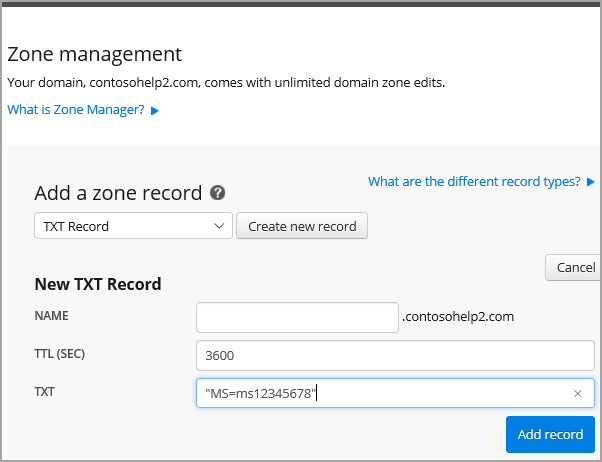
  
6. Select **Add record**.
    
Now that you've added the record at your domain registrar's site, you'll go back to Microsoft and request the record.
  
When Microsoft finds the correct TXT record, your domain is verified.
  
1. In the admin center, go to the **Settings** \> <a href="https://go.microsoft.com/fwlink/p/?linkid=834818" target="_blank">Domains</a> page.
    
2. On the **Domains** page, select the domain that you are verifying. 
    
    
  
3. On the **Setup** page, select **Start setup**.
    
    
  
4. On the **Verify domain** page, select **Verify**.
    
    
  
> [!NOTE]
>  Typically it takes about 15 minutes for DNS changes to take effect. However, it can occasionally take longer for a change you've made to update across the Internet's DNS system. If you're having trouble with mail flow or other issues after adding DNS records, see [Troubleshoot issues after changing your domain name or DNS records](../get-help-with-domains/find-and-fix-issues.md). 
  
## Add an MX record so email for your domain will come to Microsoft

1. To get started, go to your domains page in Netregistry by using [this link](https://theconsole.netregistry.com.au/). You'll be prompted to log in.
    
    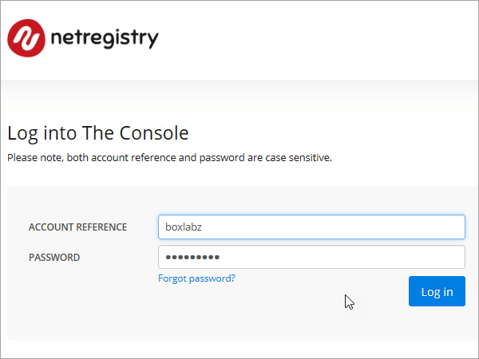
  
2. Next to the domain you want to manage, select **Manage**.
    
    
  
3. Select **Zone Manager**.
    
    
  
4. Under **Current zone records**, remove the default MX records by selecting **Remove** next to each MX record in the list. 
    
    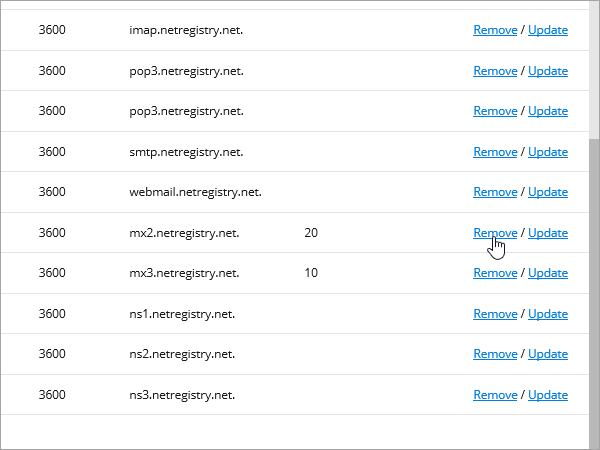
  
5. Under **Add a zone record**, choose **MX Record** from the list, and then select **Create new record**.
    
    
  
6. In the **New MX Record** form, type or copy and paste the values from the following table. 
    
    |**Name**|**TTL (SEC)**|**Exchange (Points to address or value)**|**Is host fully qualified?**|**Preference (Priority)**|
    |:-----|:-----|:-----|:-----|:-----|
    |(leave blank)    |3600 (seconds)    | *\<domain-key\>*  .mail.protection.outlook.com    **Note:** Get your  *\<domain-key\>*  from your Microsoft account.  [How do I find this?](../get-help-with-domains/information-for-dns-records.md)      |(select the checkbox)    |10    For more information about priority, see What is MX priority?    |
       
    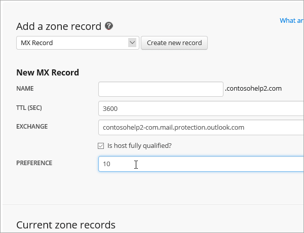
  
7. Select **Add Record**.
    
    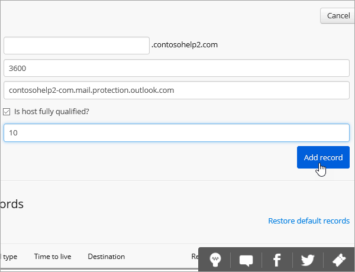
  
## Add the CNAME records that are required for Microsoft

1. To get started, go to your domains page in Netregistry by using [this link](https://theconsole.netregistry.com.au/). You'll be prompted to log in.
    
    
  
2. Next to the domain you want to manage, select **Manage**.
    
    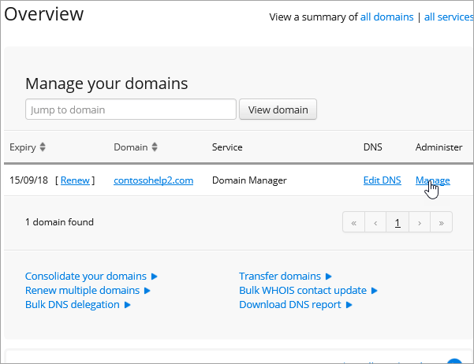
  
3. Select **Zone Manager**.
    
    
  
4. Under  **Add a zone record**, choose **CNAME Record** from the list, and then select **Create new record**.
    
    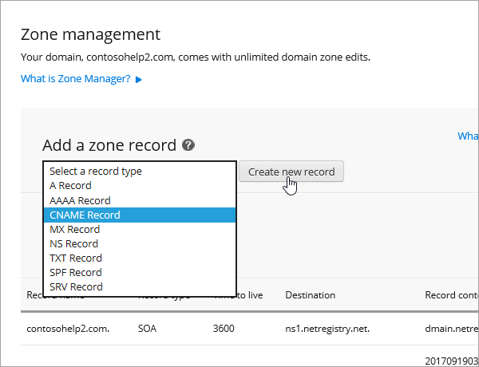
  
5. In the boxes for the new record, type or copy and paste the values from the following table.
    
    |**Name**|**Type**|**TTL**|**HOST (Points to or address value)**|
    |:-----|:-----|:-----|:-----|
    |autodiscover    |CNAME    |3600 (seconds)    |autodiscover.outlook.com    |
    |sip    |CNAME    |3600 (seconds)    |sipdir.online.lync.com    |
    |lyncdiscover    |CNAME    |3600 (seconds)    |webdir.online.lync.com    |
    |enterpriseregistration    |CNAME    |3600 (seconds)    |enterpriseregistration.windows.net    |
    |enterpriseenrollment    |CNAME    |3600 (seconds)    |enterpriseenrollment-s.manage.microsoft.com    |
       
    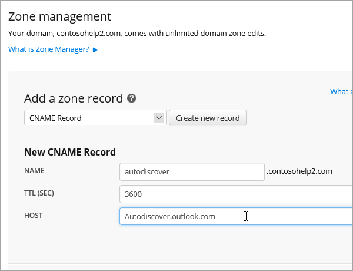
      
6. Select **Add record**.
    
    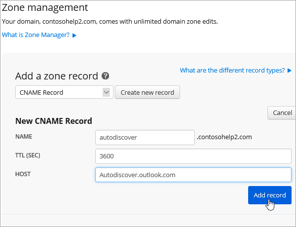
  
7. Repeat the previous steps to create the other five CNAME records.
    
    For each record, type or copy and paste the values from the next row of the table above into the boxes for that record.
    
## Add a TXT record for SPF to help prevent email spam

> [!IMPORTANT]
> You cannot have more than one TXT record for SPF for a domain. If your domain has more than one SPF record, you'll get email errors, as well as delivery and spam classification issues. If you already have an SPF record for your domain, don't create a new one for Microsoft. Instead, add the required Microsoft values to the current record so that you have a  *single*  SPF record that includes both sets of values.
  
1. To get started, go to your domains page in Netregistry by using [this link](https://theconsole.netregistry.com.au/). You'll be prompted to log in.
    
    
  
2. Next to the domain you want to manage, select **Manage**.
    
    
  
3. Select **Zone Manager**.
    
    
  
4. Under **Add a zone record**, choose **TXT Record** from the list, and then select **Create new record**.
    
    
  
5. In the boxes for the new record, type or copy and paste the values from the following table. 
    
    > [!NOTE]
    > You must use quotation marks before and after the entry in the TXT box. 
  
    |**Name**|**Type**|**TTL**|**TXT Data (Target)**|
    |:-----|:-----|:-----|:-----|
    |(leave blank)    |TXT    |3600 (seconds)    |"v=spf1 include:spf.protection.outlook.com -all"    **Note:** We recommend copying and pasting this entry, so that all of the spacing stays correct.           |
   
    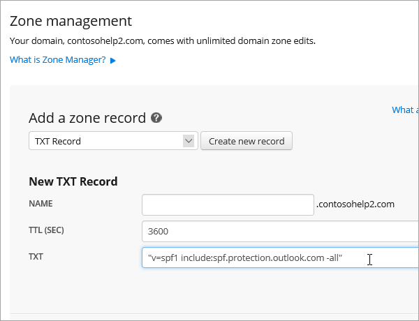
  
6. Select **Add Record**.
    
    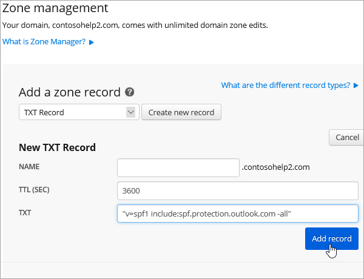
  
## Add the two SRV records that are required for Microsoft

1. To get started, go to your domains page in Netregistry by using [this link](https://theconsole.netregistry.com.au/). You'll be prompted to log in.
    
    
  
2. Next to the domain you want to manage, select  **Manage**.
    
    
  
3. Select **Zone Manager**.
    
    
  
4. Under  **Add a zone record**, choose **SRV Record** from the list, and then select **Create new record**.
    
    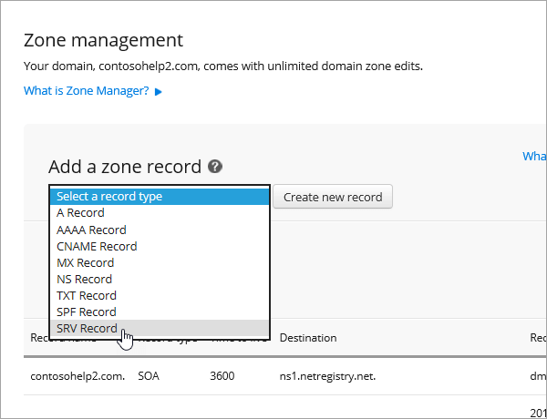
  
5. In the boxes for the new record, type or copy and paste the values from the following table.
    
    > [!NOTE]
    > The Name field is a combination of the service (for example, _sip) and protocol (for example, _tls). 
  
    |**Type**|**Name**|**TTL (SEC)**|**Priority**|**Weight**|**Port**|**Target**|
    |:-----|:-----|:-----|:-----|:-----|:-----|:-----|
    |SRV (service)    |_sip._tls    |3600 (seconds)    |100    |1    |443    |sipdir.online.lync.com    |
    |SRV (service)    |_sipfederationtls._tcp    |3600 (seconds)    |100    |1    |5061    |sipfed.online.lync.com    |
       
    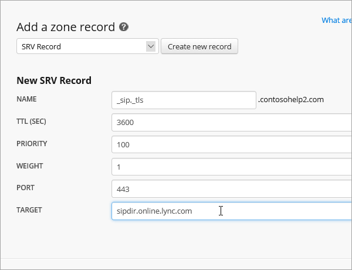
  
6. Select **Add Record**.
    
    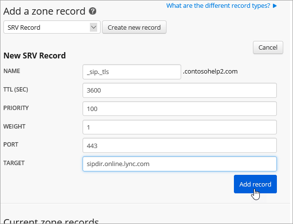
  
7. Repeat the previous steps to create the other SRV record.
    
    Type or copy and paste the values from the second row of the table above into the boxes for the second record.
    
> [!NOTE]
> Typically it takes about 15 minutes for DNS changes to take effect. However, it can occasionally take longer for a change you've made to update across the Internet's DNS system. If you're having trouble with mail flow or other issues after adding DNS records, see [Troubleshoot issues after changing your domain name or DNS records](../get-help-with-domains/find-and-fix-issues.md). 
  

