# Create DNS records at Network Solutions for Microsoft

 **[Check the Domains FAQ](../setup/domains-faq.md)** if you don't find what you're looking for. 
  
If Network Solutions is your DNS hosting provider, follow the steps in this article to verify your domain and set up DNS records for email, Skype for Business Online, and so on.
  
These are the main records to add. Follow the steps below or [watch the video](https://support.microsoft.com/office/c49698c2-6991-47fb-b5ac-18e49a505099). 
  
- [Add a TXT record for verification](#add-a-txt-record-for-verification)
    
- [Add an MX record so email for your domain will come to Microsoft](#add-an-mx-record-so-email-for-your-domain-will-come-to-microsoft)
    
- [Add the CNAME records that are required for Microsoft](#add-the-cname-records-that-are-required-for-microsoft)
    
- [Add a TXT record for SPF to help prevent email spam](#add-a-txt-record-for-spf-to-help-prevent-email-spam)
    
- [Add the two SRV records that are required for Microsoft](#add-the-two-srv-records-that-are-required-for-microsoft)
    
After you add these records at Network Solutions, your domain will be set up to work with Microsoft services.
  

  
> [!NOTE]
>  Typically it takes about 15 minutes for DNS changes to take effect. However, it can occasionally take longer for a change you've made to update across the Internet's DNS system. If you're having trouble with mail flow or other issues after adding DNS records, see [Troubleshoot issues after changing your domain name or DNS records](../get-help-with-domains/find-and-fix-issues.md). 
  
## Add a TXT record for verification

Before you use your domain with Microsoft, we have to make sure that you own it. Your ability to log in to your account at your domain registrar and create the DNS record proves to Microsoft that you own the domain.
  
> [!NOTE]
> This record is used only to verify that you own your domain; it doesn't affect anything else. You can delete it later, if you like. 
  
Follow the steps below or [watch the video (start at 0:47)](https://support.microsoft.com/office/c49698c2-6991-47fb-b5ac-18e49a505099).
  
1. To get started, go to your domains page at Network Solutions by using [this link](https://www.networksolutions.com/manage-it). You'll be prompted to log in.
    
    > [!IMPORTANT]
    > Before you select the **Login** button, first choose **Manage My Domain Names** in the **Log In to:** drop-down list. 
  
    
  
2. Select the check box next to the name of the domain that you are modifying.
    
    
  
3. Select **Edit DNS**.
    
    
  
4. Select **Manage Advanced DNS Records**.
    
    (You may have to scroll down.)
    
    
  
5. Scroll down to the **Text (TXT Records)** section, and then select **Edit TXT Records**.
    
    
  
6. In the boxes for the new record, type or copy and paste the values in the following table.
    
    |**Host**|**TTL**|**Text**|
    |:-----|:-----|:-----|
    |@    (The system will change this value to **@ (None)** when you save the record.)    |3600    |MS=ms *XXXXXXXX*    **Note:** This is an example. Use your specific **Destination or Points to Address** value here, from the table.  [How do I find this?](../get-help-with-domains/information-for-dns-records.md)   |
       
    
  
7. Select **Continue**.
    
    
  
8. Select **Save Changes**.
    
    
  
9. Wait a few minutes before you continue, so that the record you just created can update across the Internet.
    
Now that you've added the record at your domain registrar's site, you'll go back to Microsoft and request the record.
  
When Microsoft finds the correct TXT record, your domain is verified.

1. In the admin center, go to the **Settings** \> <a href="https://go.microsoft.com/fwlink/p/?linkid=834818" target="_blank">Domains</a> page.
    
2. On the **Domains** page, select the domain that you are verifying. 
    
    
  
3. On the **Setup** page, select **Start setup**.
    
    
  
4. On the **Verify domain** page, select **Verify**.
    
    
  
> [!NOTE]
>  Typically it takes about 15 minutes for DNS changes to take effect. However, it can occasionally take longer for a change you've made to update across the Internet's DNS system. If you're having trouble with mail flow or other issues after adding DNS records, see [Troubleshoot issues after changing your domain name or DNS records](../get-help-with-domains/find-and-fix-issues.md). 
  
## Add an MX record so email for your domain will come to Microsoft

Follow the steps below or [watch the video (start at 3:51)](https://support.microsoft.com/office/c49698c2-6991-47fb-b5ac-18e49a505099).
  
1. To get started, go to your domains page at Network Solutions by using [this link](https://www.networksolutions.com/manage-it). You'll be prompted to log in.
    
    > [!IMPORTANT]
    > Before you select the **Login** button, first choose **Manage My Domain Names** in the **Log In to:** drop-down list. 
  
    
  
2. Select the check box next to the name of the domain that you are modifying.
    
    
  
3. Select **Edit DNS**.
    
    
  
4. Select **Manage Advanced DNS Records**.
    
    (You may have to scroll down.)
    
    
  
5. Scroll down to the **Mail Servers (MX Records)** section, and then select **Edit MX Records**.
    
    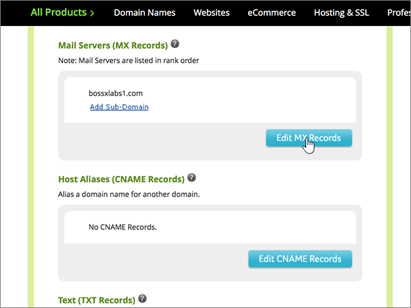
  
6. In the boxes for the new record, type or copy and paste the values from the following table.
    
    |**Priority**|**TTL**|**Mail Server**|
    |:-----|:-----|:-----|
    |10    For more information about priority, see [What is MX priority?](https://docs.microsoft.com/microsoft-365/admin/setup/domains-faq)   |3600    | *\<domain-key\>*  .mail.protection.outlook.com.    **This value MUST end with a period (.)**   **Note:** Get your  *\<domain-key\>*  from your Microsoft account. [How do I find this?](../get-help-with-domains/information-for-dns-records.md)          |
       
    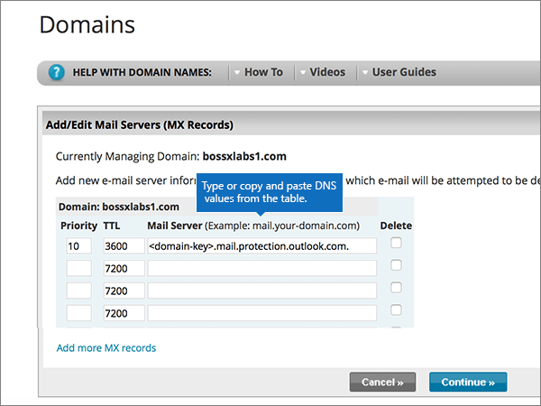
  
7. Select **Continue**.
    
    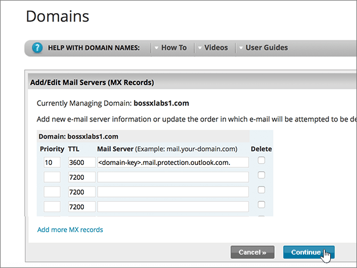
  
8. Select **Save Changes**.
    
    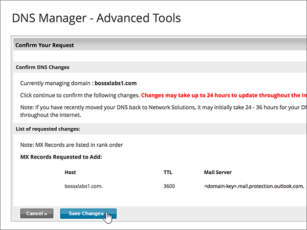
  
9. If there are any other MX records, delete all of them by selecting **Delete** for each record. 
    
    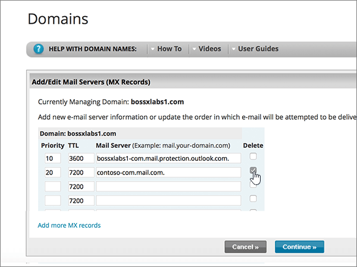
  
10. When they are all selected, select **Continue**.
    
    
  
11. Select **Save Changes**.
    
    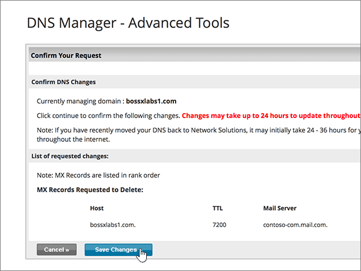
  
## Add the CNAME records that are required for Microsoft

Follow the steps below or [watch the video (start at 4:43)](https://support.microsoft.com/office/c49698c2-6991-47fb-b5ac-18e49a505099).
  
1. To get started, go to your domains page at Network Solutions by using [this link](https://www.networksolutions.com/manage-it). You'll be prompted to log in.
    
    > [!IMPORTANT]
    > Before you select the **Login** button, first choose **Manage My Domain Names** in the **Log In to:** drop-down list. 
  
    
  
2. Select the check box next to the name of the domain that you are modifying.
    
    
  
3. Select **Edit DNS**.
    
    
  
4. Select **Manage Advanced DNS Records**.
    
    (You may have to scroll down.)
    
    
  
5. Scroll down to the **Host Aliases (CNAME Records)** section, and then select **Edit CNAME Records**.
    
    
  
6. In the boxes for the four new records, type or copy and paste the values from the following table.
    
    |**Alias**|**TTL**|**Refers to Host Name**|**Other Host          (select the **Other Host** option button)**|
    |:-----|:-----|:-----|:-----|
    |autodiscover    |3600    |(No setting)    |autodiscover.outlook.com.    **This value MUST end with a period (.)**   |
    |sip    |3600    |(No setting)    |sipdir.online.lync.com.    **This value MUST end with a period (.)**   |
    |lyncdiscover    |3600    |(No setting)    |webdir.online.lync.com.    **This value MUST end with a period (.)**   |
    |enterpriseregistration    |3600    |(No setting)    |enterpriseregistration.windows.net    **This value MUST end with a period (.)**   |
    |enterpriseenrollment    |3600    |(No setting)    |enterpriseenrollment-s.manage.microsoft.com    **This value MUST end with a period (.)**   |
    
    
  
7. When you have added all of the CNAME records that you need, select **Continue**.
    
    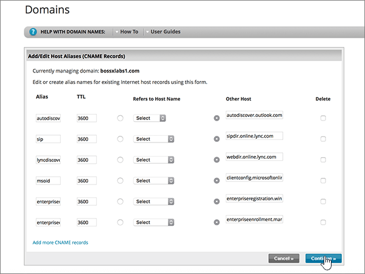
  
8. Select **Save Changes**.
    
    
  
## Add a TXT record for SPF to help prevent email spam

> [!IMPORTANT]
> You cannot have more than one TXT record for SPF for a domain. If your domain has more than one SPF record, you'll get email errors, as well as delivery and spam classification issues. If you already have an SPF record for your domain, don't create a new one for Microsoft. Instead, add the required Microsoft values to the current record so that you have a  *single*  SPF record that includes both sets of values. 
  
Follow the steps below or [watch the video (start at 5:35)](https://support.microsoft.com/office/c49698c2-6991-47fb-b5ac-18e49a505099).
  
1. To get started, go to your domains page at Network Solutions by using [this link](https://www.networksolutions.com/manage-it). You'll be prompted to log in.
    
    > [!IMPORTANT]
    > Before you select the **Login** button, first choose **Manage My Domain Names** in the **Log In to:** drop-down list. 
  
    
  
2. Select the check box next to the name of the domain that you are modifying.
    
    
  
3. Select **Edit DNS**.
    
    
  
4. Select **Manage Advanced DNS Records**.
    
    (You may have to scroll down.)
    
    
  
5. Scroll down to the **Text (TXT Records)** section, and then select **Edit TXT Records**.
    
    
  
6. In the boxes for the new record, type or copy and paste the following values.
    
    |**Host**|**TTL**|**Text**|
    |:-----|:-----|:-----|
    |@    (The system will change this value to **@ (None)** when you save the record.)    |3600    |v=spf1 include:spf.protection.outlook.com -all    **Note:** We recommend copying and pasting this entry, so that all of the spacing stays correct. |
       
    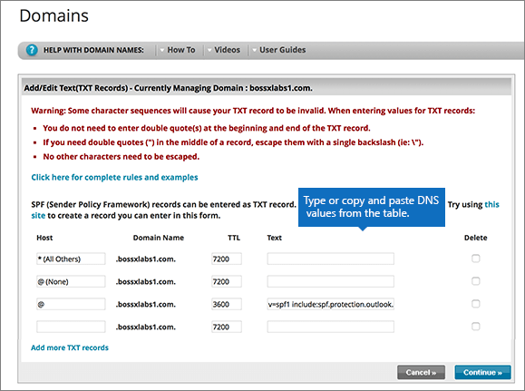
  
7. Select **Continue**.
    
    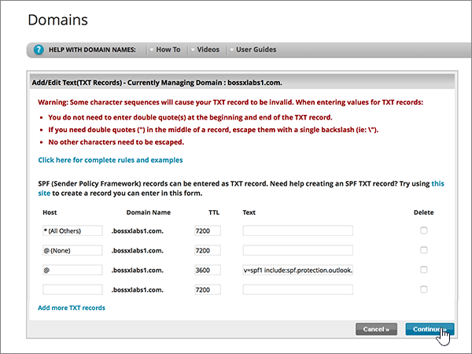
  
8. Select **Save Changes**.
    
    
  
## Add the two SRV records that are required for Microsoft

Follow the steps below or [watch the video (start at 6:18)](https://support.microsoft.com/office/c49698c2-6991-47fb-b5ac-18e49a505099).
  
1. To get started, go to your domains page at Network Solutions by using [this link](https://www.networksolutions.com/manage-it). You'll be prompted to log in.
    
    > [!IMPORTANT]
    > Before you select the **Login** button, first choose **Manage My Domain Names** in the **Log In to:** drop-down list. 
  
    
  
2. Select the check box next to the name of the domain that you are modifying.
    
    
  
3. Select **Edit DNS**.
    
    
  
4. Select **Manage Advanced DNS Records**.
    
    (You may have to scroll down.)
    
    
  
5. Scroll down to the **Service (SRV Records)** section, and then select **Edit SRV Records**.
    
    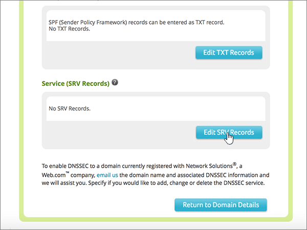
  
6. In the boxes for the two new records, type or copy and paste the values from the following table.
    
    (Choose the **Service** and **Protocol** values from the drop-down lists.) 
    
    |**Service**|**Protocol**|**TTL**|**Priority**|**Weight**|**Port**|**Target**|
    |:-----|:-----|:-----|:-----|:-----|:-----|:-----|
    |_sip    |_tls    |3600    |100    |1    |443    |sipdir.online.lync.com.    **This value MUST end with a period (.)**   |
    |_sipfederationtls    |_tcp    |3600    |100    |1    |5061    |sipfed.online.lync.com.    **This value MUST end with a period (.)**   |
       
    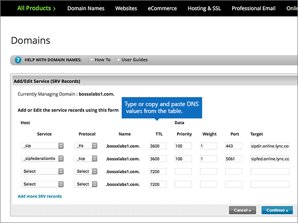
  
7. Select **Continue**.
    
    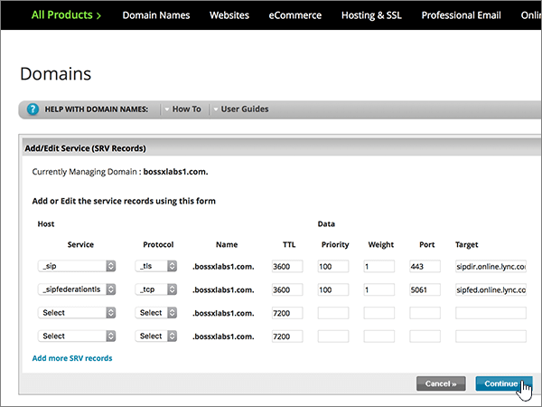
  
8. Select **Save Changes**.
    
    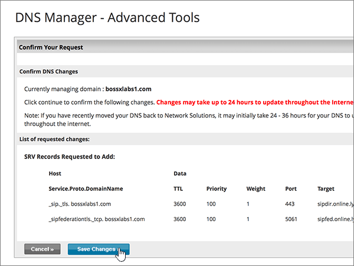
  
> [!NOTE]
>  Typically it takes about 15 minutes for DNS changes to take effect. However, it can occasionally take longer for a change you've made to update across the Internet's DNS system. If you're having trouble with mail flow or other issues after adding DNS records, see [Troubleshoot issues after changing your domain name or DNS records](../get-help-with-domains/find-and-fix-issues.md). 
  
