# Create DNS records at Register.com for Microsoft

 **[Check the Domains FAQ](../setup/domains-faq.yml)** if you don't find what you're looking for. 
  
If Register.com is your DNS hosting provider, follow the steps in this article to verify your domain and set up DNS records for email, Skype for Business Online, and so on.
  
These are the main records to add. Follow the steps below or [watch the video](https://support.microsoft.com/office/7448dd9e-c0e7-4d5e-a7e9-f0e4715433c4).
  
- [Add a TXT record at Register.com to verify that you own the domain](#add-a-txt-record-at-registercom-to-verify-that-you-own-the-domain)
    
- [Add an MX record so email for your domain will come to Microsoft](#add-an-mx-record-so-email-for-your-domain-will-come-to-microsoft)
    
- [Add the CNAME records that are required for Microsoft](#add-the-cname-records-that-are-required-for-microsoft)
    
- [Add a TXT record for SPF to help prevent email spam](#add-a-txt-record-for-spf-to-help-prevent-email-spam)

- [Add the two SRV records that are required for Microsoft](#add-the-two-srv-records-that-are-required-for-microsoft)
    
After you add these records at Register.com, your domain will be set up to work with Microsoft services.
  

  
> [!NOTE]
> Typically it takes about 15 minutes for DNS changes to take effect. However, it can occasionally take longer for a change you've made to update across the Internet's DNS system. If you're having trouble with mail flow or other issues after adding DNS records, see [Find and fix issues after adding your domain or DNS records](../get-help-with-domains/find-and-fix-issues.md). 
  
## Add a TXT record at Register.com to verify that you own the domain

Before you use your domain with Microsoft, we have to make sure that you own it. Your ability to log in to your account at your domain registrar and create the DNS record proves to Microsoft that you own the domain.
  
> [!NOTE]
> This record is used only to verify that you own your domain; it doesn't affect anything else. You can delete it later, if you like. 
  
Follow the steps below or [watch the video (start at 0:44)](https://support.microsoft.com/office/7448dd9e-c0e7-4d5e-a7e9-f0e4715433c4).
  
1. To get started, go to your domains page at Register.com by using [this link](https://www.register.com/myaccount/). You'll be prompted to sign in.
    
2. Select **Domains**.
    
3. Select **Manage**.
    
4. Find the row that contains the name of the domain that you want to modify; and then, in that row, select **Manage**.
    
5. Scroll down to the **Advanced Technical Settings** section, and then select **Edit TXT Records (SPF)**.
    
6. In the boxes for the new record, type or copy and paste the values from the following table.
    
    |||
    |:-----|:-----|
    |**Host Name**   |**TXT Record**   |
    |@    |MS=ms *XXXXXXXX*    **Note:** This is an example. Use your specific **Destination or Points to Address** value here, from the table. [How do I find this?](../get-help-with-domains/information-for-dns-records.md)          |
   
7. Select **Continue**.
    
8. On the next page, select **Continue** again to confirm your changes. 
    
9. Wait a few minutes before you continue, so that the record you just created can update across the Internet.
    
Now that you've added the record at your domain registrar's site, you'll go back to Microsoft and request the record.
  
When Microsoft finds the correct TXT record, your domain is verified.
  
1. In the admin center, go to the **Settings** \> <a href="https://go.microsoft.com/fwlink/p/?linkid=834818" target="_blank">Domains</a> page.
    
2. On the **Domains** page, select the domain that you are verifying. 
    
3. On the **Setup** page, select **Start setup**.
    
4. On the **Verify domain** page, select **Verify**.
    
> [!NOTE]
> Typically it takes about 15 minutes for DNS changes to take effect. However, it can occasionally take longer for a change you've made to update across the Internet's DNS system. If you're having trouble with mail flow or other issues after adding DNS records, see [Find and fix issues after adding your domain or DNS records](../get-help-with-domains/find-and-fix-issues.md). 
  
## Add an MX record so email for your domain will come to Microsoft

Follow the steps below or [watch the video (start at 3:32)](https://support.microsoft.com/office/7448dd9e-c0e7-4d5e-a7e9-f0e4715433c4).
  
1. To get started, go to your domains page at Register.com by using [this link](https://www.register.com/myaccount/). You'll be prompted to sign in.
    
2. Select **Domains**.
    
3. Select **Manage**.
    
4. Find the row that contains the name of the domain that you want to modify; and then, in that row, select **Manage**.
    
5. Scroll to the **Advanced Technical Settings** section, and then select **Edit Mail Exchanger Records**.
    
    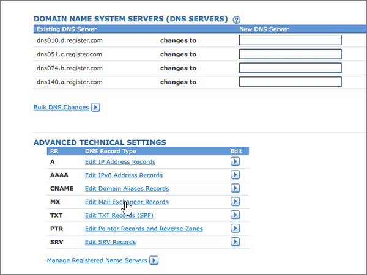
  
6. In the boxes for the new record, type or copy and paste the values from the following table.
    
    (Choose the **Priority** value from the drop-down list.) 
    
    |****Host Name****|****Priority****|****Mail Server****|
    |:-----|:-----|:-----|
    |@    |High    For more information about priority, see [What is MX priority?](https://docs.microsoft.com/microsoft-365/admin/setup/domains-faq)   | *\<domain-key\>*  .mail.protection.outlook.com      **Note:** Get your \<*domain-key*\> from your Microsoft account.   [How do I find this?](../get-help-with-domains/information-for-dns-records.md)          |
   
    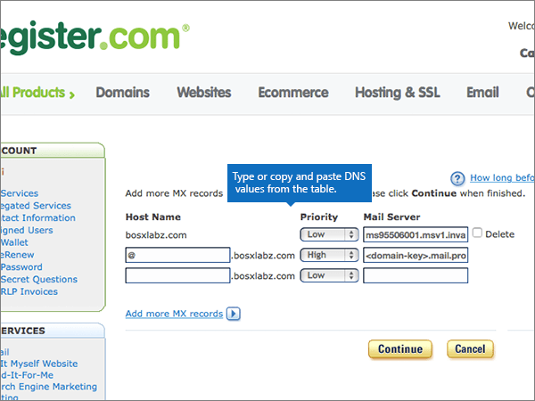
  
7. If there were any other MX records already listed, select each of those records to be deleted.
    
    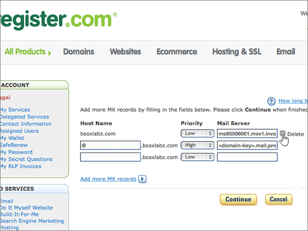
  
8. Select **Continue**.
    
    
  
9. On the next page, select **Continue** again to confirm and save your changes. 
    
    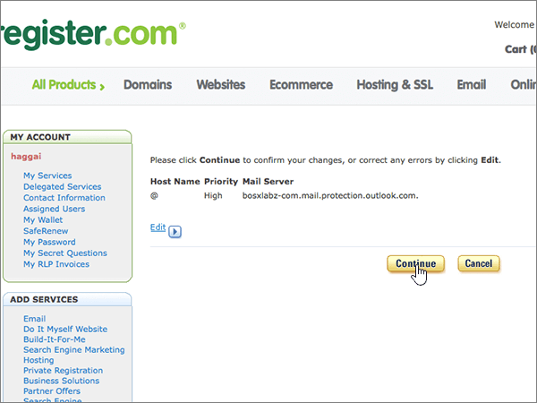
  
## Add the CNAME records that are required for Microsoft

Follow the steps below or [watch the video (start at 4:23)](https://support.microsoft.com/office/7448dd9e-c0e7-4d5e-a7e9-f0e4715433c4).
  
1. To get started, go to your domains page at Register.com by using [this link](https://www.register.com/myaccount/). You'll be prompted to sign in.
    
2. Select **Domains**.
    
3. Select **Manage**.
    
4. Find the row that contains the name of the domain that you want to modify; and then, in that row, select **Manage**.
    
5. Scroll to the **Advanced Technical Settings** section, and then select **Edit Domain Aliases Records**.
    
    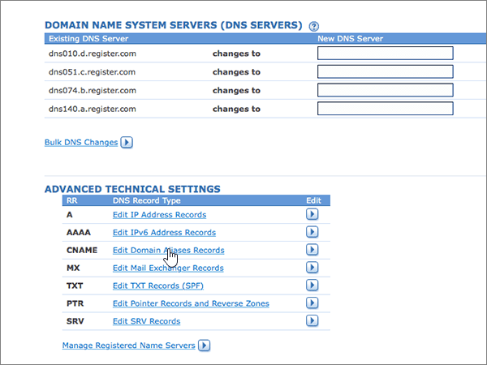
  
6. Select **Add more domain aliases**.
    
    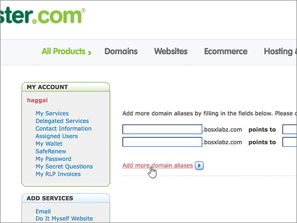
  
7. Add the required CNAME records.
    
    In the boxes for the new record, type or copy and paste the values from the first row of the following table.
    
    |****First field (unlabeled)****|****Points to****|
    |:-----|:-----|
    |autodiscover    |autodiscover.outlook.com       |
    |sip    |sipdir.online.lync.com       |
    |lyncdiscover    |webdir.online.lync.com      |
    |enterpriseregistration    |enterpriseregistration.windows.net       |
    |enterpriseenrollment    |enterpriseenrollment-s.manage.microsoft.com       |
   
     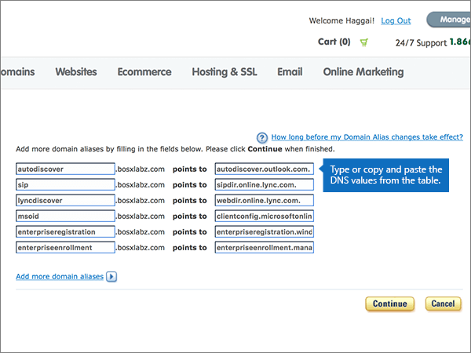
  
8. When you have added all of the CNAME records that you need, select **Continue**.
    
    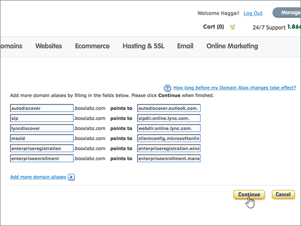
  
9. On the next page, select **Continue** again to confirm and save your changes. 
    
    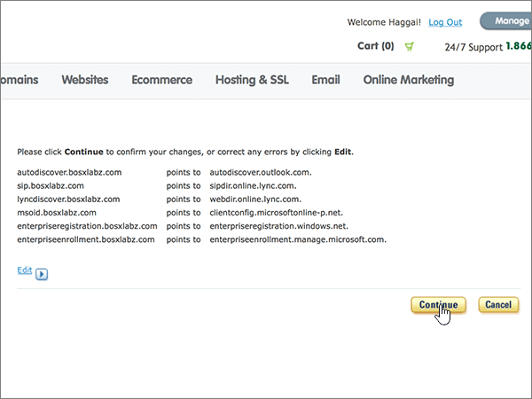
  
## Add a TXT record for SPF to help prevent email spam

> [!IMPORTANT]
> You cannot have more than one TXT record for SPF for a domain. If your domain has more than one SPF record, you'll get email errors, as well as delivery and spam classification issues. If you already have an SPF record for your domain, don't create a new one for Microsoft. Instead, add the required Microsoft values to the current record so that you have a single SPF record that includes both sets of values.  
  
Follow the steps below or [watch the video (start at 5:12)](https://support.microsoft.com/office/7448dd9e-c0e7-4d5e-a7e9-f0e4715433c4).
  
1. To get started, go to your domains page at Register.com by using [this link](https://www.register.com/myaccount/). You'll be prompted to sign in.
    
2. Select **Domains**.
    
3. Select **Manage**.
    
4. Find the row that contains the name of the domain that you want to modify; and then, in that row, select **Manage**.
    
5. Scroll to the **Advanced Technical Settings** section, and then select **Edit TXT Records (SPF)**.
    
    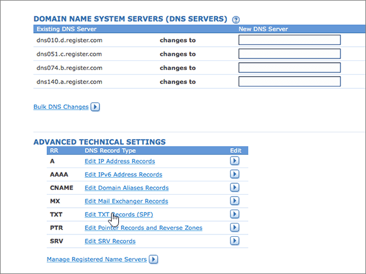
  
6. In the boxes for the new record, type or copy and paste the values from the following table.
    
    |****Host Name****|****TXT Record****|
    |:-----|:-----|
    |@    |v=spf1 include:spf.protection.outlook.com -all    **Note:** We recommend copying and pasting this entry, so that all of the spacing stays correct.  |
   
     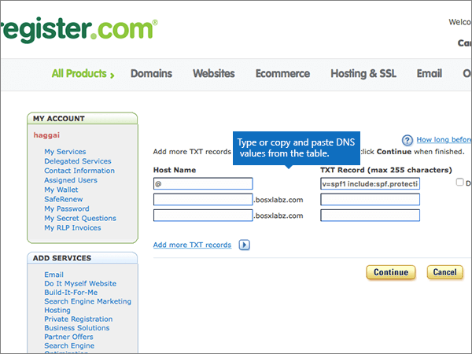
  
7. Select **Continue**.
    
    
  
8. On the next page, select **Continue** again to confirm and save your changes. 
    
    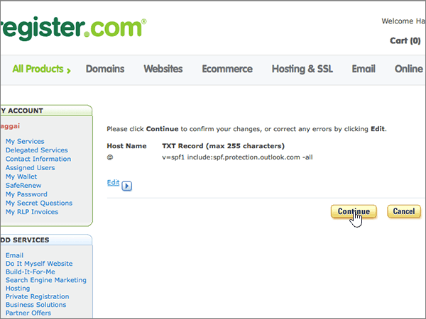
  
## Add the two SRV records that are required for Microsoft

Follow the steps below or [watch the video (start at 5:55)](https://support.microsoft.com/office/7448dd9e-c0e7-4d5e-a7e9-f0e4715433c4).
  
1. To get started, go to your domains page at Register.com by using [this link](https://www.register.com/myaccount/). You'll be prompted to sign in.
    
2. Select **Domains**.
    
3. Select **Manage**.
    
4. Find the row that contains the name of the domain that you want to modify; and then, in that row, select **Manage**.
    
5. Scroll to the **Advanced Technical Settings** section, and then select **Edit SRV Records**.
    
    
  
6. Add the first of the two SRV records:
    
    In the boxes for the new record, type or copy and paste the values from the first row of the following table.
    
    (Choose the **Priority** value from the drop-down list.) 
    
    |****Service****|****Proto****|****Name****|****Priority****|****Weight****|****Port****|****Target****|
    |:-----|:-----|:-----|:-----|:-----|:-----|:-----|
    |_sip    |_tls    |@    |High    |1    |443    |sipdir.online.lync.com       |
    |_sipfederationtls    |_tcp    |@    |High    |1    |5061    |sipfed.online.lync.com       |
   
    
  
7. Select **Add more SRV records**.
    
    
  
8. Add the second SRV record:
    
    Type or copy and paste the values from the second row of the table above into the boxes for the second record.
    
9. When you have added both of the SRV records, select **Continue**.
    
    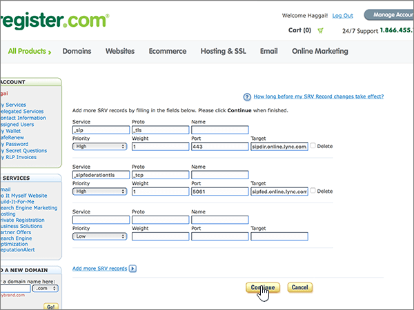
  
10. On the next page, select **Continue** again to confirm and save your changes. 
    
    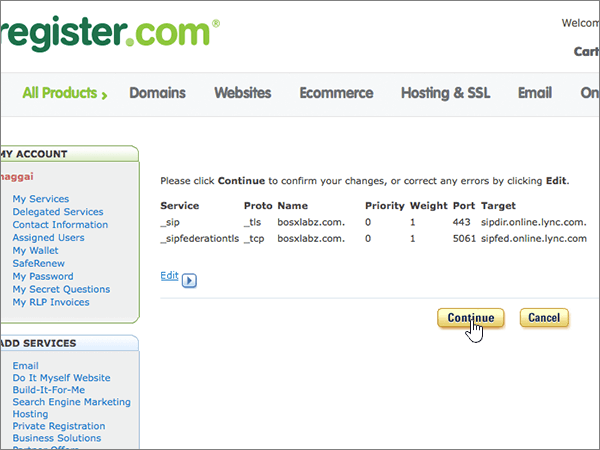
  
> [!NOTE]
> Typically it takes about 15 minutes for DNS changes to take effect. However, it can occasionally take longer for a change you've made to update across the Internet's DNS system. If you're having trouble with mail flow or other issues after adding DNS records, see [Find and fix issues after adding your domain or DNS records](../get-help-with-domains/find-and-fix-issues.md). 
  
