# Create DNS records for Azure DNS zones

 **[Check the Domains FAQ](../setup/domains-faq.md)** if you don't find what you're looking for. 
  
If Azure is your DNS hosting provider, follow the steps in this article to verify your domain and set up DNS records for email, Skype for Business Online, and so on.
  
These are the main records to add. 
  
- [Change your domain's nameserver (NS) records](#change-your-domains-nameserver-ns-records)
    
- [Add a TXT record for verification](#add-a-txt-record-for-verification)

- [Add an MX record so email for your domain will come to Microsoft](#add-an-mx-record-so-email-for-your-domain-will-come-to-microsoft)
    
- [Add the four CNAME records that are required for Microsoft](#add-the-four-cname-records-that-are-required-for-microsoft)
    
- [Add a TXT record for SPF to help prevent email spam](#add-a-txt-record-for-spf-to-help-prevent-email-spam)
    
- [Add the two SRV records that are required for Microsoft](#add-the-two-srv-records-that-are-required-for-microsoft)
    
After you add these records at Azure, your domain will be set up to work with Microsoft services.
  
> [!NOTE]
> Typically it takes about 15 minutes for DNS changes to take effect. However, it can occasionally take longer for a change you've made to update across the Internet's DNS system. If you're having trouble with mail flow or other issues after adding DNS records, see [Troubleshoot issues after changing your domain name or DNS records](../get-help-with-domains/find-and-fix-issues.md). 
  
## Change your domain's nameserver (NS) records

> [!IMPORTANT]
> You must perform this procedure at the domain registrar where you purchased and registered your domain. 
  
When you signed up for Azure, you created a resource group within a DNS zone, and then assigned your domain name to that resource group. That domain name is registered to an external domain registrar; Azure does not offer domain registration services.
  
To verify and create DNS records for your domain in Microsoft, you first need to change the nameservers at your domain registrar so that they use the Azure nameservers assigned to your resource group.
  
To change your domain's name servers at your domain registrar's website yourself, follow these steps.
  
1. Find the area on the domain registrar's website where you can edit the nameservers for your domain.
    
2. Either create two nameserver records by using the values in the following table, or edit the existing nameserver records so that they match these values. An example of Azure assigned nameservers is shown below.
    

**First nameserver:** Use the name server value assigned by Azure.  
**Second nameserver:** Use the name server value assigned by Azure.  

  
> [!TIP]
> You should use at least two name server records. If there are any other name servers listed at your domain registrar's website, you should delete them. 
  
3. Save your changes.
    
> [!NOTE]
> Your nameserver record updates may take up to several hours to update across the Internet's DNS system. Then your Microsoft email and other services will be all set to work with your domain. 
  
## Add a TXT record for verification

Before you use your domain with Microsoft, we have to make sure that you own it. Your ability to log in to your account at your domain registrar and create the DNS record proves to Microsoft that you own the domain.
  
> [!NOTE]
> This record is used only to verify that you own your domain; it doesn't affect anything else. You can delete it later, if you like. 
  
1. To get started, go to your domains page at Azure by using [this link](https://portal.azure.com ). You'll be prompted to log in first.
    
    
  
2. Using the **search bar** on the **Dashboard** page, type in **DNS zones**. In the results display, select **DNS zones** under the **Services** portion. Once you've been redirected, select the domain that you want to update.
    
    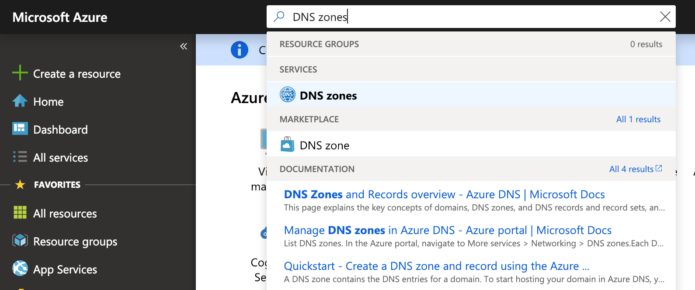
  
3. On the **Settings** page for your domain, in the **DNS zone** area, select **+ Record set**.
    
    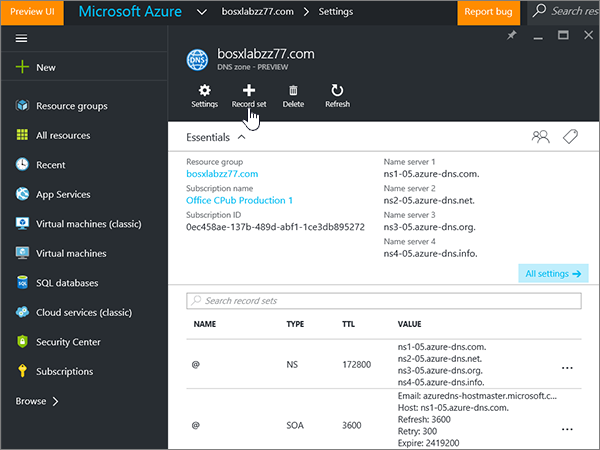
  
4. In the **Add record set** area, in the boxes for the new record set, select the values from the following table. 
    
    (Choose the **Type** and **TTL unit** values from the drop-down lists.) 
    
    |**Name**|**Type**|**TTL**|**TTL unit**|**Value**|
    |:-----|:-----|:-----|:-----|:-----|
    |@    |TXT    |1    |Hours    |MS=ms *XXXXXXXX*    **Note:** This is an example. Use your specific **Destination or Points to Address** value here, from the table.           [How do I find this?](../get-help-with-domains/information-for-dns-records.md)          |
   
    
  
5. Select **OK**.
  
6. Wait a few minutes before you continue, so that the record you just created can update across the Internet.
    
Now that you've added the record at your domain registrar's site, you'll go back to Microsoft and request the record.
  
When Microsoft finds the correct TXT record, your domain is verified.
  
1. In the admin center, go to the **Settings** \> <a href="https://go.microsoft.com/fwlink/p/?linkid=834818" target="_blank">Domains</a> page.
    
2. On the **Domains** page, select the domain that you are verifying. 
    
    
  
3. On the **Setup** page, select **Start setup**.
    
    
  
4. On the **Verify domain** page, select **Verify**.
    
    
  
> [!NOTE]
>  Typically it takes about 15 minutes for DNS changes to take effect. However, it can occasionally take longer for a change you've made to update across the Internet's DNS system. If you're having trouble with mail flow or other issues after adding DNS records, see [Troubleshoot issues after changing your domain name or DNS records](../get-help-with-domains/find-and-fix-issues.md). 
  
## Add an MX record so email for your domain will come to Microsoft

1. To get started, go to your domains page at Azure by using [this link](https://portal.azure.com ). You'll be prompted to log in first.
    
    
  
2. On the **Dashboard** page, in the **All resources** area, select the domain that you want to update. 
    
    
  
3. On the **Settings** page for your domain, in the **DNS zone** area, select **+ Record set**.
    
    
  
4. In the **Add record set** area, in the boxes for the new record set, select the values from the following table. 
    
    (Choose the **Type** and **TTL unit** values from the drop-down lists.) 
    
    |**Name**|**Type**|**TTL**|**TTL unit**|**Preference**|**Mail Exchange**|
    |:-----|:-----|:-----|:-----|:-----|:-----|
    |@    |MX    |1    |Hours    |10    For more information about priority, see [What is MX priority?](https://docs.microsoft.com/microsoft-365/admin/setup/domains-faq)   | *\<domain-key\>*  .mail.protection.outlook.com    **Note:** Get your  *\<domain-key\>*  from your Microsoft account.   [How do I find this?](../get-help-with-domains/information-for-dns-records.md)  
   
    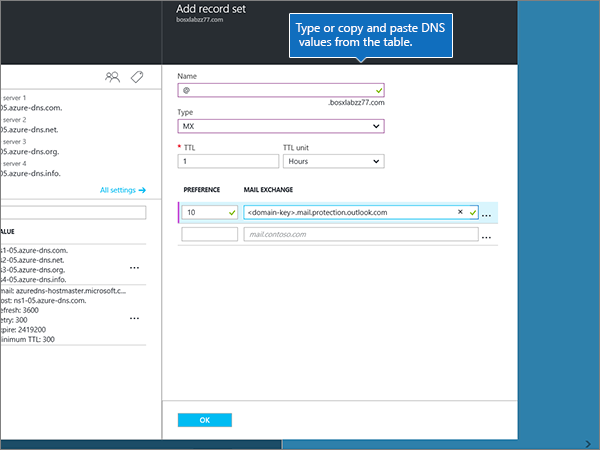
  
5. Select **OK**.
    
    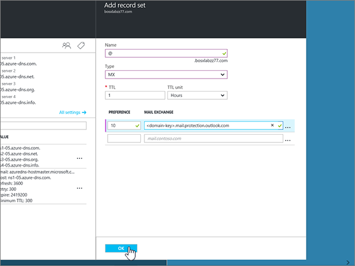
  
6. If there are any other MX records listed in the **MX Records** section, you must delete them. 
    
    First, in the **DNS zone** area, select the **MX Record set**.
    
    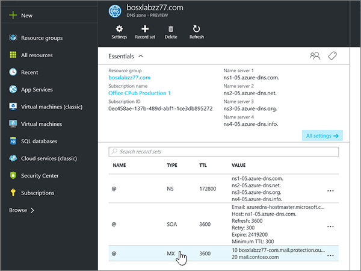
  
    Next, select the MX record you want to delete.
    
    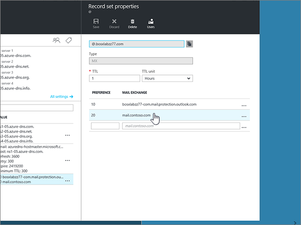
  
7. Select the **Context menu (…)**, and then choose **Remove**.
    
    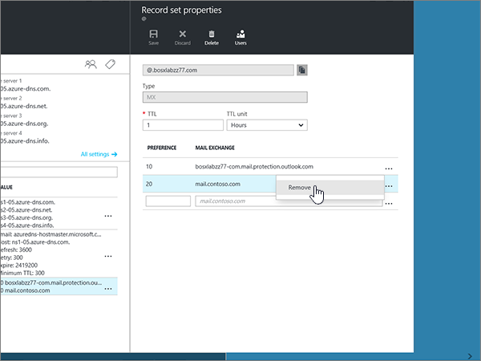
  
8. Select **Save**.
    
    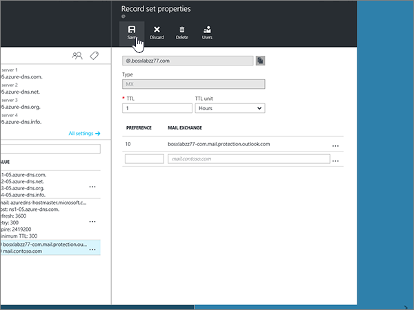
  
## Add the four CNAME records that are required for Microsoft

1. To get started, go to your domains page at Azure by using [this link](https://portal.azure.com ). You'll be prompted to log in first.
    
    
  
2. On the **Dashboard** page, in the **All resources** area, select the domain that you want to update. 
    
    
  
3. On the **Settings** page for your domain, in the **DNS zone** area, select **+ Record set**.
    
    
  
4. Add the first of the four CNAME records.
    
    In the **Add record set** area, in the boxes for the new record set, type or copy and paste the values from the first row in the following table. 
    
    (Choose the **Type** and **TTL unit** values from the drop-down lists.) 
    
    |**Name**|**Type**|**TTL**|**TTL unit**|**Alias**|
    |:-----|:-----|:-----|:-----|:-----|
    |autodiscover    |CNAME    |1    |Hours    |autodiscover.outlook.com    |
    |sip    |CNAME    |1    |Hours    |sipdir.online.lync.com    |
    |lyncdiscover    |CNAME    |1    |Hours    |webdir.online.lync.com    |
    
   
    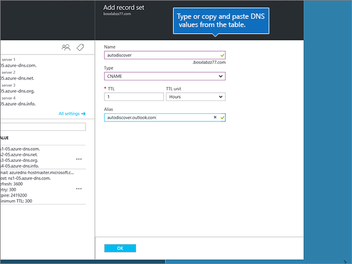
  
5. Select **OK**.
    
    
  
6. Add each of the other three CNAME records.
    
    In the **DNS zone** area, select **+ Record set**. Then, in the empty record set, create a record by using the values from the next row in the table, and again select **OK** to complete that record. 
    
    Repeat this process until you have created all four CNAME records.
    
7.  (Optional) Add 2 CNAME records for MDM.

> [!IMPORTANT]
> If you have Mobile Device Management (MDM) for Microsoft, then you must create two additional CNAME records. Follow the procedure that you used for the other four CNAME records, but supply the values from the following table. (If you do not have MDM, you can skip this step.) 
  
|**Name**|**Type**|**TTL**|**TTL unit**|**Alias**|
|:-----|:-----|:-----|:-----|:-----|
|enterpriseregistration    |CNAME    |1    |Hours    |enterpriseregistration.windows.net    |
|enterpriseenrollment    |CNAME    |1    |Hours    |enterpriseenrollment-s.manage.microsoft.com    |
   
## Add a TXT record for SPF to help prevent email spam

> [!IMPORTANT]
> You cannot have more than one TXT record for SPF for a domain. If your domain has more than one SPF record, you'll get email errors, as well as delivery and spam classification issues. If you already have an SPF record for your domain, don't create a new one for Microsoft. Instead, add the required Microsoft values to the current record so that you have a  *single*  SPF record that includes both sets of values. 
  
1. To get started, go to your domains page at Azure by using [this link](https://portal.azure.com ). You'll be prompted to log in first.
    
    
  
2. On the **Dashboard** page, in the **All resources** area, select the domain that you want to update. 
    
    
  
3. In the **DNS zone** area, select the **TXT record set**.
    
    
  
4. In the **Record set properties** area, in the boxes for the new record set, select the values from the following table. 
    
    (Choose the **Type** and **TTL unit** values from the drop-down lists.) 
    
    |**Name**|**Type**|**TTL**|**TTL unit**|**Value**|
    |:-----|:-----|:-----|:-----|:-----|
    |@    |TXT    |1    |Hours    |v=spf1 include:spf.protection.outlook.com -all    **Note:** We recommend copying and pasting this entry, so that all of the spacing stays correct.           

    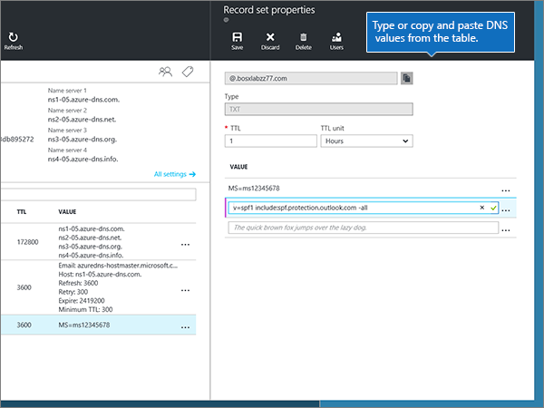
  
5. Select **Save**.
    
    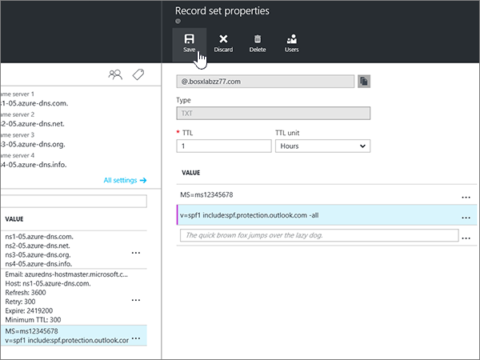
  
## Add the two SRV records that are required for Microsoft

1. To get started, go to your domains page at Azure by using [this link](https://portal.azure.com ). You'll be prompted to log in first.
    
    
  
2. On the **Dashboard** page, in the **All resources** area, select the domain that you want to update. 
    
    
  
3. On the **Settings** page for your domain, in the **DNS zone** area, select **+ Record set**.
    
    
  
4. Add the first of the two SRV records.
    
    In the **Add record set** area, in the boxes for the new record set, select the values from the first row in the following table. 
    
    (Choose the **Type** and **TTL unit** values from the drop-down lists.) 
    
    |**Name**|**Type**|**TTL**|**TTL unit**|**Priority**|**Weight**|**Port**|**Target**|
    |:-----|:-----|:-----|:-----|:-----|:-----|:-----|:-----|
    |_sip._tls    |SRV    |1    |Hours    |100    |1    |443    |sipdir.online.lync.com    |
    |_sipfederationtls._tcp    |SRV    |1    |Hours    |100    |1    |5061    |sipfed.online.lync.com    

    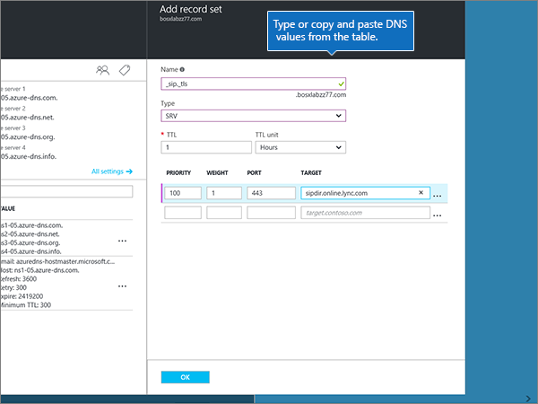
  
5. Select **OK**.
    
    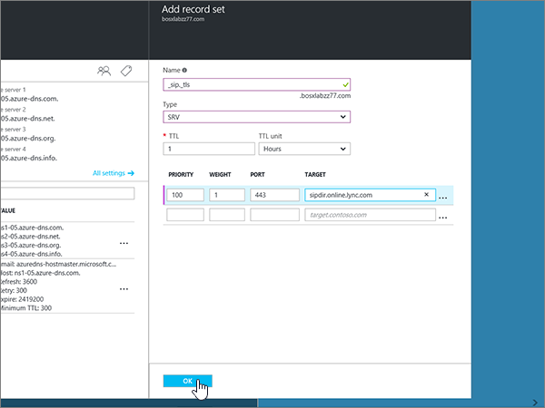
  
6. Add the other SRV record.
    
    In the boxes for the new record, type or copy and paste the values from the second row of the table.
    
> [!NOTE]
> Typically it takes about 15 minutes for DNS changes to take effect. However, it can occasionally take longer for a change you've made to update across the Internet's DNS system. If you're having trouble with mail flow or other issues after adding DNS records, see [Troubleshoot issues after changing your domain name or DNS records](../get-help-with-domains/find-and-fix-issues.md). 
  
