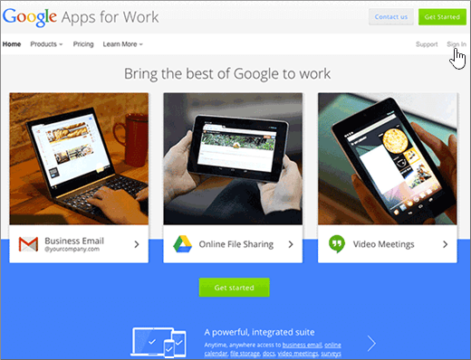
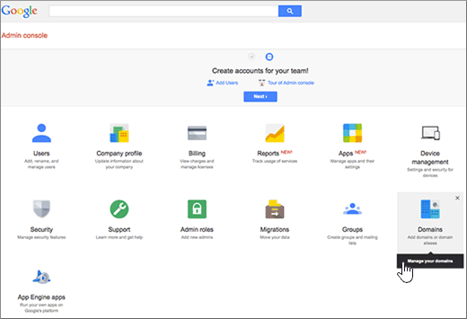
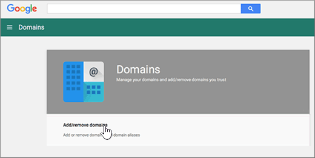
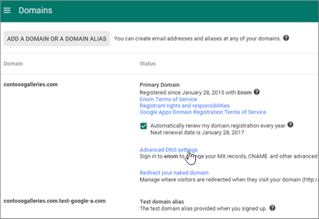
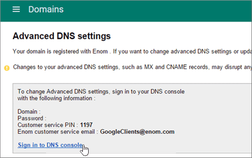
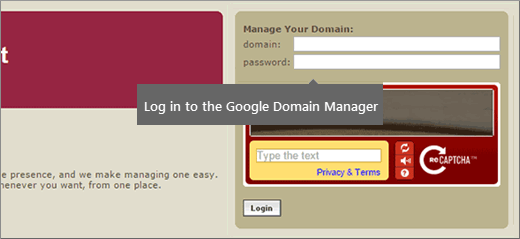
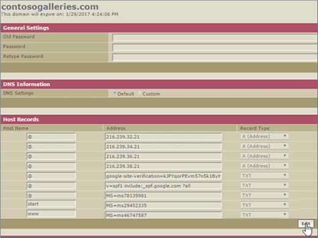
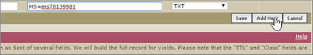
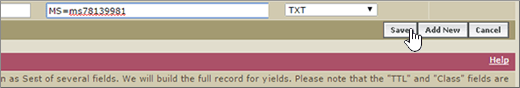

# Create DNS records when your domain is managed by Google (eNom)

 **[Check the Domains FAQ](../setup/domains-faq.yml)** if you don't find what you're looking for. 
  
To migrate your mail accounts to Microsoft, you need to create a DNS record at your domain registrar.
  
If you purchased your domain through Google while signing up for your **Google Apps for Work** account, your DNS records are managed by Google but registered with eNom. 
  
You can access eNom, and create DNS, through the Google **Domains** page. Just follow the steps in this article. 
  
## Create the DNS record

1. At the [Google Admin console](https://www.google.com/work/apps/business), select **Sign In**.
    
    
  
2. Enter your domain name, and then select **Go**.
    
    
  
3. At the bottom of the page, select **More controls**.
    
    
  
4. Select **Domains**.
    
    
  
5. On the **Domains** page, select **Add/remove domains**.
    
    
  
6. On the **Domains** page, select **Advanced DNS settings**.
    
    > [!NOTE]
    > If you didn't purchase a domain name through Google while signing up for your **Google Apps for Work** account, you won't have **Advanced DNS settings** on your **Domains** page. Instead, you must go directly to your domain host's web site to access your DNS settings and to perform this and the following steps. See [Access your G Suite domain settings](https://support.google.com/a/answer/54693?hl=en) for more information. 
  
    
  
7. On the **Advanced DNS settings** page, select **Sign in to DNS Console**. Note the **Sign-in name** and **Password** information. You'll need it in the next step. 
    
    
  
8. Log in to the Google **Domain Manager** using the **Sign-in name** and **Password** from the **Advanced DNS settings** page. 
    
    
  
9. On the ***domain_name*** page, in the **Host Records** section, select **Edit**.
    
    
  
10. In the **Host Records** section, select **Add New**.
    
    
  
11. In the boxes for the new record, type or copy and paste the values from the following table.
    
    |**HOST**|**TXT VALUE**|**RECORD TYPE**|
    |:-----|:-----|:-----|
    |@    ||TXT    |

    > [!NOTE]
    > This is an example. Use your specific **Destination or Points to Address** value here, from the table. 
  
    [How do I find this?](../get-help-with-domains/information-for-dns-records.md)
  
12. Select **Save**.
    
    
  
13. Select **Save Changes**.
    
    
  
> [!NOTE]
>  Typically it takes about 15 minutes for DNS changes to take effect. However, it can occasionally take longer for a change you've made to update across the Internet's DNS system. If you're having trouble with mail flow or other issues after adding DNS records, see [Troubleshoot issues after changing your domain name or DNS records](../get-help-with-domains/find-and-fix-issues.md). 
  
