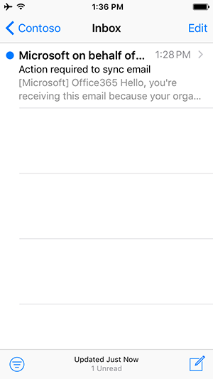

# Options for accessing email from your mobile device

Your organization configures settings which control what mobile apps you can use to access your work account for email, calendar and contacts.

The Outlook for Android and Outlook for iOS mobile apps are designed for your work or school email. These apps provide features like [Focused Inbox](https://support.microsoft.com/office/f445ad7f-02f4-4294-a82e-71d8964e3978), which keeps important emails front and center, and [Scheduling Assistant](https://support.microsoft.com/office/scheduling-made-easy-in-outlook-mobile-11c5bee5-d78a-4a2b-80c2-2b386ddb4470), which helps you find meeting times that work with colleagues and simply finds available conference rooms.
  
## End user experience

### Outlook Only

Your organization requires that you use the Outlook for Android or Outlook for iOS mobile apps to access company email, calendar, and contacts. Your data will start syncing once you download and install Outlook for Android or Outlook for iOS.

Check out [Optimize the Outlook mobile app for your iOS or Android phone](https://support.microsoft.com/office/de075b19-b73c-4d8a-841b-459982c7e890) for more Outlook features. And go to [Outlook for iOS and Android Help Center](https://support.microsoft.com/office/cd84214e-a5ac-4e95-9ea3-e07f78d0cde6) if you run into any issues.

### Any email app

Your organization recommends that you use the Outlook for Android or iOS mobile app to access your work or school account for email, calendar, and contacts. If you don't take any action within the next few hours, your email will automatically begin syncing. If you choose to use the Outlook for Android or iOS mobile app, your data will only sync with the Outlook for Android or Outlook for iOS mobile app. If you choose to continue using the third-party app, your data will start to sync instantly.
