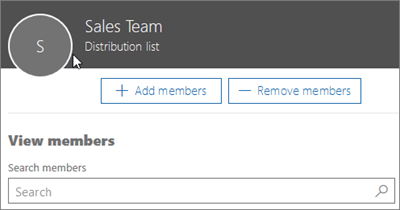

# Add a user or contact to a Microsoft 365 distribution group

Check out all of our small business content on [Small business help & learning](https://go.microsoft.com/fwlink/?linkid=2224585).

As the admin of an organization, you may need to add one of your users or contacts to a distribution group (see [Create distribution groups in Microsoft 365](../setup/create-distribution-lists.md). For example, you can add employees or external partners or vendors to an email distribution group.
  
## Add a user or contact to a distribution group

1. In the admin center, go to the **Groups** \> <a href="https://go.microsoft.com/fwlink/p/?linkid=2052855" target="_blank">Groups</a> page.

2. On the **Groups** page, select the name of the group you want to add a contact to.

3. On the **Members** tab, select **View all and manage members**.

4. On the **View Members** page, select **Add members**, and select the user or contact you want to add to the distribution group. 
    
    
  
5. Select **Save** and then **Close**.

## Watch: Add a user to a distribution list
  
> [!VIDEO https://www.microsoft.com/videoplayer/embed/ed4e6095-9a6a-4d3d-999d-698c39bb7ec8?autoplay=false]
  
## Next steps

Learn to [send email as a distribution group in Microsoft 365](../manage/send-email-as-distribution-list.md).

## Related content

[Manage clutter for your organization](configure-clutter.md) (article)\
[Create a shared mailbox](create-a-shared-mailbox.md) (article)
