<!-- DO NOT MAKE CHANGES TO THIS ARTICLE WITHOUT FIRST CONTACTING THE MS.AUTHOR AND MS.REVIEWER -->
<!-- THIS CONTENT IS MACHINE TRANSLATED FROM THE ORIGINAL JAPANESE AND MUST REMAIN UNTOUCHED -->
<!-- DO NOT MAKE CHANGES TO THIS ARTICLE WITHOUT FIRST CONTACTING THE MS.AUTHOR AND MS.REVIEWER -->
<!-- SERIOUSLY, JUST DON'T -->

# Microsoft 365 admin center katakana glossary

Explanations have been added to the main katakana terms used in the Microsoft 365 Management Center. For more detailed information, please refer to the text in the link on each item.

## Account

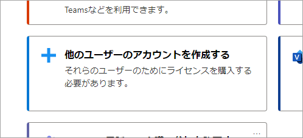

Refers to an identifying name assigned to an individual within an organization/company for the purpose of using Microsoft 365. It is created for each organization/company and a separate account is usually assigned to each individual. Use this account to use Microsoft 365 services.

[Add users and assign licenses](add-users/add-users.md)

## Add-on

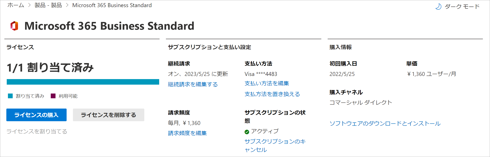

This is not a stand-alone offering by itself, but an additional feature to a service that is subscribed to by subscription. It provides more advanced and new features.

[Purchase or manage add-ons](../commerce/buy-or-edit-an-add-on.md)

## Alias

Another name for e-mail, etc. Refers to a name given to an e-mail distribution list, etc., that is shared by several people.

## Custom domain

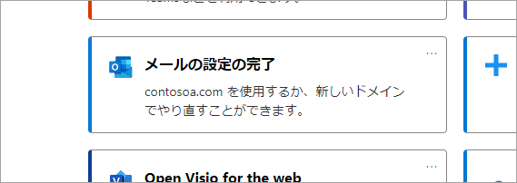

Also referred to as an original domain. An Internet domain dedicated to an organization, such as a company or school. The organization can use its own unique name to establish an e-mail address or a website. A domain indicates a location on the Internet and is used in URLs to indicate where to send e-mails or locate websites. Obtaining a name that is easy to understand and remember is effective in branding your company.

[Add a domain to Microsoft 365](setup/add-domain.md)

## Cloud storage

A place or device for storing files on the Internet. It can be beneficial when an individual uses the same file from multiple terminals or devices, or when multiple people work together. It is suitable for referencing and modifying files from different environments such as PCs and mobile devices, internal and remotely.

## Groups

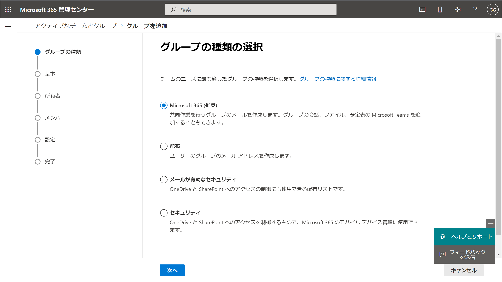

By using Microsoft 365 Groups, you can easily select teammates to collaborate with, and then share files and information among them to make collaboration easier.

[Create a group](create-groups/create-groups.md)

Various groups

[Compare groups](create-groups/compare-groups.md)

## Global administrator

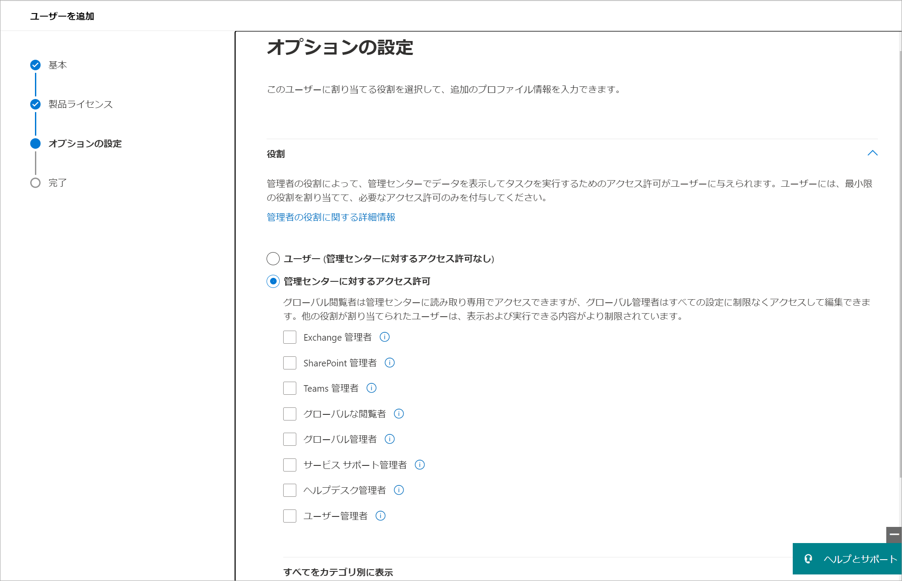

The global administrator, usually has the authority to change, delete, or set new settings for all setting items.

If you wish to appoint an administrator with limited administrative functions (e.g. you want to give them administrative functions but not allow them to purchase new services.), please refer to the following article.

[About the administrator role of the Microsoft 365 Management Center](add-users/about-admin-roles.md)

## Guest or guest user

Someone from outside the organization/company who can view or change certain authorized files or information, or participate in authorized meetings.

[Sharing with external or guest in OneDrive, SharePoint, and Lists](https://support.microsoft.com/office/7aa070b8-d094-4921-9dd9-86392f2a79e7)

[Guest access with Microsoft Teams](/microsoftteams/guest-access)

## Collaboration and communication

Cooperating with several different organizations and people toward a common purpose or goal. Refers to a modern work style in which people from different organizations and workplaces collaborate by sharing information and files via Teams, SharePoint, OneDrive, etc., and keeping in touch via Teams.

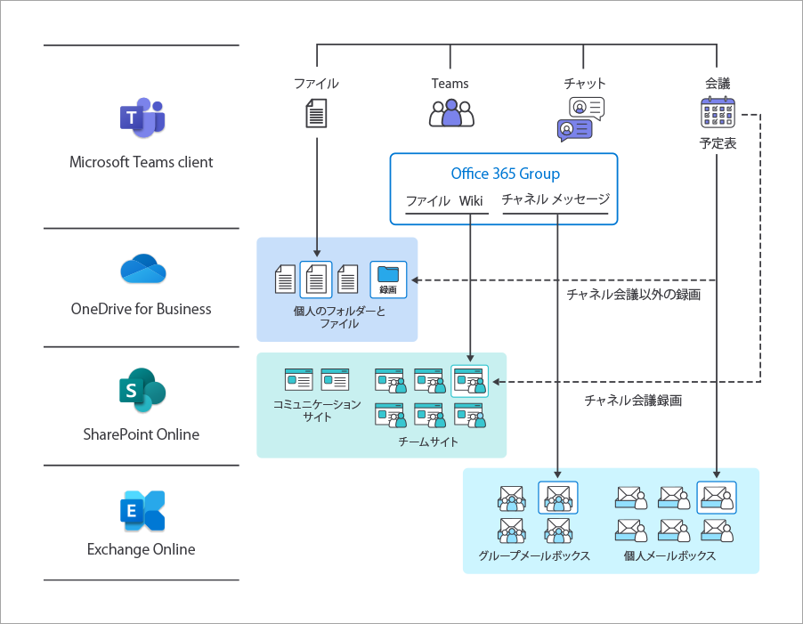

## Service (online service)

A computer or software function that is provided over a network (Internet). It is distinguished from software that is executed directly on the PC at your disposal.

## Website address

In Microsoft 365, it refers to the URL of the SharePoint site.

## Sign-in

To make the service available for use from the account via authentication, or to allow the service to recognize the user. Microsoft 365 services becomes available by signing in.

## Subscription

A type of contract in which the right to use a service for a certain period of time is purchased, as opposed to the purchase of the right to use software on a perpetual basis, which has been the norm in the past. With Microsoft 365, payment is done on a monthly or a yearly basis.

## Security

A system to prevent confidential and personal information of organizations, employees, customers, etc. from being illegally obtained or leaked to outside parties.

## Domain

The part of a website or e-mail address that corresponds to an address on the Internet used for a website or e-mail address.
E.g.: contoso.com part of www.contoso.com and mail@contoso.com.

## Training and guide

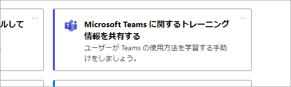

Refers to learning texts and videos for using and managing Microsoft 365 provided by Microsoft.

## Public

In Microsoft 365, it refers to the state of being viewable or editable by all users in the organization. E.g.: Public group: A group in which anyone in the organization can participate.

## Give feedback

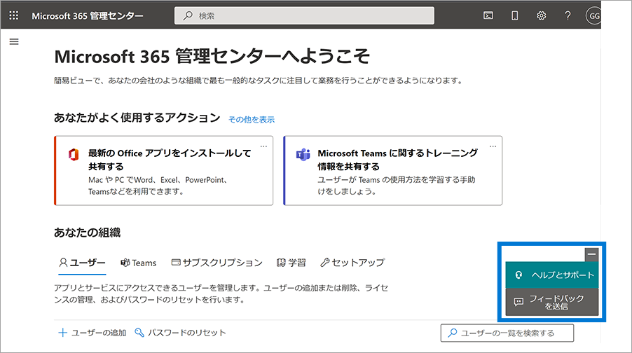

Refers to sending comments or requests to Microsoft from users of the service.

For matters that require customer support attention in accordance with your support contract, please use the "Help and Support" link at the top of the page, and for non-support related issues such as usability or new feature suggestions, please use this feedback form to send your suggestions. The development team looks directly at the content. The more specific your comments and requests are, the more likely it will be implemented.

## Privacy

A function to set the scope of disclosure of files and information related to the protection of personal information. Different disclosure ranges can be set, such as making files and information available to everyone in the organization (public), or just available to a few designated people (private).

[Manage data privacy and data protection with Microsoft Priva and Microsoft Purview](../solutions/data-privacy-protection.md)

## Private

A state in which only certain people within an organization can view, modify, etc. The owner or administrator of that information or group can set which people are granted permission to connect. E.g.: Private group

## Billing profile

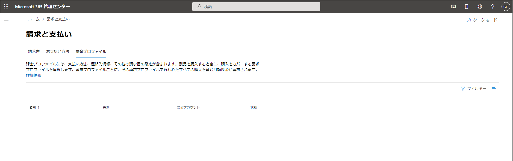

Billing information and other information related to Microsoft 365 payments are stored. It is used to pay for products and services purchased from Microsoft. Note: Billing profiles are not used for products and services purchased from Microsoft.com or the Management Center.

[Understanding the billing profile](../commerce/billing-and-payments/manage-billing-profiles.md)

## Hosted domains

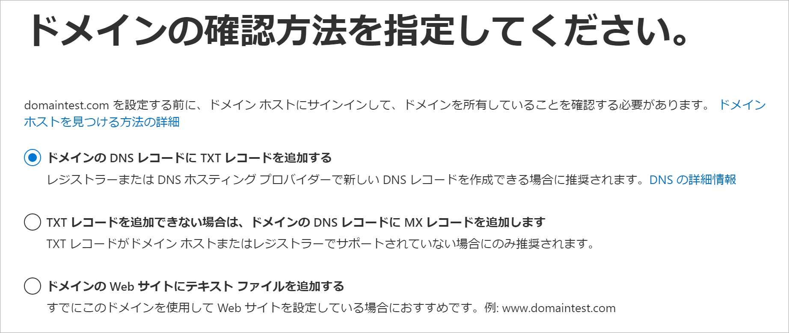

The domain service used by Microsoft 365. Used for website URLs and e-mail addresses. You can purchase it from the Microsoft 365 Management Center, or if you already have your own domain you can use that one.

## License

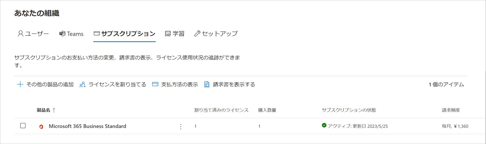

Refers to the usage and access rights assigned to individual employees when an organization purchases Microsoft 365. To use Microsoft 365, licenses must be purchased for the number of users and assigned to each user.

[Assign a Microsoft 365 license to a user](manage/assign-licenses-to-users.md)
