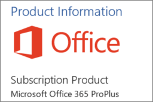

# Determine if Centralized Deployment of add-ins works for your organization

Centralized Deployment is the recommended and most feature-rich way for most customers to deploy Office add-ins to users and groups within your organization. If you're an admin, use this guidance to determine if your tenant and users meet the requirements so that you can use Centralized Deployment.
Centralized Deployment supports Windows, Mac, iOS, Android and Online Office apps.
It can take up to 12 hours for an add-in to show up for client for all users.
  
## Requirements

Centralized deployment of add-ins requires that the users are using Microsoft 365 Apps for enterprise (and are signed into Office using their Organizational ID), and have Exchange Online and active Exchange Online mailboxes. Your subscription'd directory must either be in, or federated to Azure Active Directory.
You can view specific requirements for Office and Exchange below, or use the [Office 365 Centralized Deployment Compatibility Checker](https://docs.microsoft.com/office365/admin/manage/centralized-deployment-of-add-ins?view=o365-worldwide#office-365-centralized-deployment-compatibility-checker).

Centralized Deployment doesn't support the following:
  
- Add-ins that target Word, Excel, or PowerPoint in Office 2013
    
- An on-premises directory service
    
- Add-in deployment to SharePoint  

- Teams apps
   
- Deployment of Component Object Model (COM) or Visual Studio Tools for Office (VSTO) add-ins
    
- Deployments of Microsoft 365 that do not include Exchange such as Microsoft 365 Apps for business

### Office Requirements

- For Word, Excel, and PowerPoint add-ins, your users must be using one of the following:
  - On a Windows device, Version 1704 or later of Microsoft 365 Apps for enterprise.
  - On a Mac, Version 15.34 or later.
      - On iOS (iPad only), Version 2.9.18010804 or later.
- For Outlook, your users must be using one of the following: 
  - Version 1701 or later of Microsoft 365 Apps for enterprise.
  - Version 1808 or later of Office Professional Plus 2019 or Office Standard 2019.
  - Version 16.0.4494.1000 or later of Office Professional Plus 2016 (MSI) or Office Standard 2016 (MSI)\*
  - Version 15.0.4937.1000 or later of Office Professional Plus 2013 (MSI) or Office Standard 2013 (MSI)\*
  - Version 16.0.9318.1000 or later of Office 2016 for Mac 
- Version 2.75.0 or later of Outlook mobile for iOS 
- Version 2.2.145 or later of Outlook mobile for Android 
    
    *MSI versions of Outlook show admin-installed add-ins in the appropriate Outlook ribbon, not the "My add-ins" section.
    

#### Find out if Microsoft 365 Apps for enterprise is installed

To use Microsoft 365 Apps for enterprise, a user must have an Office 365 account and must have been assigned a license. For more information, see [Overview of Microsoft 365 Apps for enterprise](https://go.microsoft.com/fwlink/p/?linkid=846328).

The simplest way to detect if a user has Microsoft 365 Apps for enterprise installed and has been using it recently is to use the Microsoft Office Activations report, which is available in the Microsoft 365 admin center. The report provides a list of all users who have activated Microsoft 365 Apps for enterprise within the last 7 days, 30 days, 90 days, or 180 days. For centralized deployment purposes, the desktop activations for Windows or Mac are the important columns in the report. You can export the report to Excel. For more information about the report, see [Office 365 Reports in the Admin Center - Microsoft Office activations](../activity-reports/microsoft-office-activations.md).
  
If you don't want to use the Activations report, you can ask a user to open an Office application such as Word on their machine, and then choose **File** \> **Account**. Under **Product Information**, you should see **Subscription Product** and **Microsoft Microsoft 365 Apps for enterprise**, as shown in the following image.


  
For help with Microsoft 365 Apps for enterprise, see [Troubleshooting tips for Microsoft 365 Apps for enterprise](https://go.microsoft.com/fwlink/p/?linkid=846339).


### Exchange Online requirements

Microsoft Exchange stores the add-in manifests within your organization's tenant. The admin deploying add-ins and the users receiving those add-ins must be on a version of Exchange Online that supports OAuth authentication.
  
Check with your organization's Exchange admin to find out which configuration is in use. OAuth connectivity per user can be verified by using the [Test-OAuthConnectivity](https://go.microsoft.com/fwlink/p/?linkid=846351) PowerShell cmdlet. 


### Office 365 Centralized Deployment Compatibility Checker

Using the Office 365 Centralized Deployment Compatibility Checker, you can verify whether the users on your tenant are set up to use Centralized Deployment for Word, Excel and PowerPoint. The Compatibility Checker is not required for Outlook support. Download the compatibility checker [here](https://aka.ms/officeaddindeploymentorgcompatibilitychecker).
  
#### Run the compatibility checker
  
1. Start an elevated PowerShell.exe window.
    
2. Run the following command:

```powershell
Import-Module O365CompatibilityChecker
```
    
3. Run the **Invoke-CompatabilityCheck** command:

```powershell
Invoke-CompatibilityCheck
```
   which prompts you for  *_TenantDomain_* (for example, *TailspinToysIncorporated.onmicrosoft.</span>com*) and  *_TenantAdmin_* credentials (use your global admin credentials), and then requests consent.
    
> [!NOTE]
> Depending on the number of users in your tenant, the checker could complete in minutes or hours. 
  
When the tool finishes running, it produces an output file in comma-separated (.csv) format. The file is saved to **C:\windows\system32** by default. The output file contains the following information:
  
- User Name
    
- User ID (User's email address)
    
- Centralized Deployment ready - If the remaining items are true
    
- Office plan - The plan of Office they are licensed for
    
- Office Activated - If they have activated Office
    
- Supported Mailbox - If they are on an OAuth-enabled mailbox


  
## User and group assignments

The Centralized Deployment feature currently supports the majority of groups supported by Azure Active Directory, including Office 365 Groups, distribution lists, and security groups.
  
> [!NOTE]
> Non-mail enabled security groups are not currently supported. 
  
Centralized Deployment supports assignments to individual users, groups, and everyone in the tenant. Centralized Deployment supports users in top-level groups or groups without parent groups, but not users in nested groups or groups that have parent groups.
   
Take a look at the following example where Sandra, Sheila, and the Sales Department group are assigned to an add-in. Because the West Coast Sales Department is a nested group, Bert and Fred aren't assigned to an add-in.
  


   
### Find out if a group contains nested groups

The easiest way to detect if a group contains nested groups is to view the group contact card within Outlook. If you enter the group name within the **To** field of an email and then select the group name when it resolves, it will show you if it contains users or nested groups. In the example below, the **Members** tab of the Outlook contact card for the Test Group shows no users and only two sub groups. 
  

  
You can do the opposite query by resolving the group to see if it's a member of any group. In the example below, you can see under the **Membership** tab of the Outlook contact card that Sub Group 1 is a member of the Test Group. 
  

  
Alternately, you can use the Azure Active Directory Graph API to run queries to find the list of groups within a group. For more information, see [Operations on groups | Graph API reference](https://go.microsoft.com/fwlink/p/?linkid=846342).
  
### Contacting Microsoft for support

If you or your users encounter problems loading the add-in while using Office apps for the web (Word, Excel, etc.), which were centrally deployed, you may need to contact Microsoft support ([learn how](../contact-support-for-business-products.md)). Provide the following information about your Office 365 environment in the support ticket.
  
|**Platform**|**Debug information**|
|:-----|:-----|
|Office  <br/> | Charles/Fiddler logs  <br/>  Tenant ID ( [learn how](https://support.office.com/article/6891b561-a52d-4ade-9f39-b492285e2c9b.aspx))  <br/>  CorrelationID. View the source of one of the office pages and look for the Correlation ID value and send it to support:  <br/>`<input name=" **wdCorrelationId**" type="hidden" value=" **{BC17079E-505F-3000-C177-26A8E27EB623}**">`  <br/>  `<input name="user_id" type="hidden" value="1003bffd96933623"></form>`  <br/> |
|Rich clients (Windows, Mac)  <br/> | Charles/Fiddler logs  <br/>  Build numbers of the client app (preferably as a screenshot from **File/Account**)  <br/> |
   

