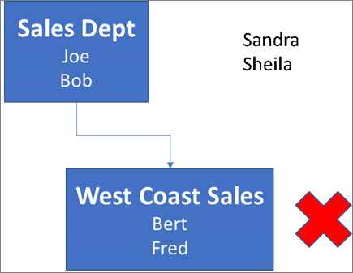
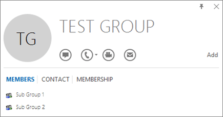

# Determine if Centralized Deployment of add-ins works for your organization

> [!NOTE]
>  [Integrated Apps](test-and-deploy-microsoft-365-apps.md) is the recommended and most feature-rich way for most customers to centrally deploy Office add-ins to users and groups within your organization.
>
>If Integrated Apps is not available for you or you are a customer in one of the sovereign or government clouds (GCC, GCC-H, DoD, AirGap or Gallatin), use this article as guidance to determine if your organization and users meet the requirements to use Centralized Deployment.  

Centralized Deployment provides the following benefits:

- An admin can deploy and assign an add-in directly to a user, to multiple users via a group, or to everyone in the organization (see Admin requirement section for information).
- When the relevant Microsoft 365 app starts, the add-in automatically downloads. If the add-in supports add-in commands, the add-in automatically appears in the ribbon within the Microsoft 365 app.
- Add-ins no longer appear for users if the admin turns off or deletes the add-in, or if the user is removed from Microsoft Entra ID or from a group that the add-in is assigned to.

Centralized Deployment supports three desktop platforms Windows, Mac and Microsoft 365 for the web. Centralized Deployment also supports iOS and Android (Outlook Mobile Add-ins Only).

It can take up to 24 hours for an add-in to show up for client for all users.

## Before you begin

Centralized deployment of add-ins requires that the users have one of the following licenses 

- Microsoft 365 Business (Business Basic, Business Standard, Business Premium)
- Office 365 Enterprise (E1/E3/E5/F3)
- Microsoft 365 Enterprise (E3/E5/F3) (and are signed in Microsoft 365 using their organizational ID)
- Office 365 Education (A1/A3/A5)
- Microsoft 365 Education (A3/A5)
- Office 365 Government (G3/G5)
- Microsoft 365 Government (G3/G5)

Users must also have Exchange Online and active Exchange Online mailboxes. Your subscription directory must either be in or federated to Microsoft Entra ID.

You can view specific requirements for Microsoft 365 and Exchange below, or use the [Centralized Deployment Compatibility Checker](#centralized-deployment-compatibility-checker).

Centralized Deployment doesn't support the following:

- Add-ins that target Office MSI version (except Outlook 2016)
- An on-premises directory service
- Add-in deployment to an Exchange On-Prem Mailbox
- Add-in deployment to SharePoint
- Teams apps
- Deployment of Component Object Model (COM) or Visual Studio Tools for Office (VSTO) add-ins.
- Deployments of Microsoft 365 that do not include Exchange Online such as SKUs: Microsoft 365 Apps for Business and Microsoft 365 Apps for Enterprise.

### Microsoft 365 Requirements

- For Word, Excel, and PowerPoint add-ins, your users must be using one of the following:
  - On a Windows device, Version 1704 or later of Microsoft 365 Business licenses (Business Basic, Business Standard, Business Premium), Office 365 Enterprise licenses (E1/E3/E5/F3), or Microsoft 365 Enterprise licenses (E3/E5/F3).
  - On a Mac, Version 15.34 or later.

- For Outlook, your users must be using one of the following:
  - Version 1701 or later of Microsoft 365 Business licenses (Business Basic, Business Standard, Business Premium), Office 365 Enterprise licenses (E1/E3/E5/F3), or Microsoft 365 Enterprise licenses (E3/E5/F3).
  - Version 1808 or later of Office Professional Plus 2019 or Office Standard 2019.
  - Version 16.0.4494.1000 or later of Office Professional Plus 2016 (MSI) or Office Standard 2016 (MSI)\*
  - Version 15.0.4937.1000 or later of Office Professional Plus 2013 (MSI) or Office Standard 2013 (MSI)\*
  - Version 16.0.9318.1000 or later of Office 2016 for Mac
- Version 2.75.0 or later of Outlook mobile for iOS
- Version 2.2.145 or later of Outlook mobile for Android

    *MSI versions of Outlook show admin-installed add-ins in the appropriate Outlook ribbon, not the "My add-ins" section.

### Exchange Online requirements

Microsoft Exchange stores the add-in manifests within your organization's tenant. The admin deploying add-ins and the users receiving those add-ins must be on a version of Exchange Online that supports OAuth authentication.

Check with your organization's Exchange admin to find out which configuration is in use. OAuth connectivity per user can be verified by using the [Test-OAuthConnectivity](/powershell/module/exchange/test-oauthconnectivity) PowerShell cmdlet.

### Exchange Online user role requirements

Use the classic Exchange admin center (EAC) to assign permissions to users. The permissions required to view and modify deployed add-ins are detailed in the following steps.

1.	Log in to the classic EAC as a global administrator.
2.	Go to **Permissions** and then select **User Roles**.
3.	Select an existing role assignment policy or create a new policy.
4.	Type a name for the policy if you are creating a new policy.
5.	Select the following roles: **My Custom Apps**, **My MarketPlace Apps**, and **My ReadWriteMailbox Apps**.
6.	Select **Save**.

> [!NOTE]
> These roles are selected by default.

For more information, see [Manage role groups in Exchange Online](/exchange/permissions-exo/role-groups). For a detailed description of the different roles, see [Role assignment policies in Exchange Online](/exchange/permissions-exo/role-assignment-policies).

### Admin requirements

In order to deploy an add-in via Centralized Deployment, you need to be either a Global admin or an Exchange admin in the organization.

> [!NOTE]
> An Exchange admin can deploy an add-in if the **Application Administrator** role is added or if the **App Registrations** property is set to true in Microsoft Entra admin center as shown in the following image:
>
> 

### Centralized Deployment Compatibility Checker

Using the Centralized Deployment Compatibility Checker, you can verify whether the users on your tenant are set up to use Centralized Deployment for Word, Excel, and PowerPoint. The Compatibility Checker is not required for Outlook support. Download and install the [compatibility checker](https://aka.ms/officeaddindeploymentorgcompatibilitychecker).

> [!NOTE]
> Compatibility checker is currently not supported in any of the sovereign or government clouds (GCC, GCC-H, DoD, AirGap, Gallatin).

#### Run the compatibility checker

1. Start an elevated PowerShell.exe window.

2. Run the following command:

   ```powershell
   Import-Module O365CompatibilityChecker
   ```

3. Run the **Invoke-CompatibilityCheck** command:

   ```powershell
   Invoke-CompatibilityCheck
   ```

   This command prompts you for _TenantDomain_ (for example, _TailspinToysIncorporated.onmicrosoft.com_) and _TenantAdmin_ credentials (use your global admin credentials), and then requests consent.

   > [!NOTE]
   > Depending on the number of users in your tenant, the checker could complete in minutes or hours.

When the tool finishes running, it produces an output file in comma-separated (.csv) format. The file is saved to **the current working directory** by default. The output file contains the following information:

- User Name
- User ID (User's email address)
- Centralized Deployment ready - If the remaining items are true
- Microsoft 365 plan - The plan of Office they are licensed for
- Microsoft 365 Activated - If they have activated Microsoft 365
- Supported Mailbox - If they are on an OAuth-enabled mailbox

Should your Microsoft 365 reports show anonymous user names instead of actual user names, fix this issue by changing the reports setting in Microsoft 365 admin center. For detailed steps, see [Microsoft 365 reports show anonymous user names instead of actual user names](/office365/troubleshoot/miscellaneous/reports-show-anonymous-user-name).

> [!NOTE]
> Multifactor authentication is not supported when using the Central Deployment PowerShell module. The module only works with Basic authentication.

## User and group assignments

The Centralized Deployment feature currently supports the majority of groups supported by Microsoft Entra ID, including Microsoft 365 groups, distribution lists, dynamic groups, and security groups.

> [!NOTE]
> Non-mail enabled security groups are not currently supported.

Centralized Deployment supports assignments to individual users, groups, and everyone in the tenant. Centralized Deployment supports users in top-level groups or groups without parent groups, but not users in nested groups or groups that have parent groups.

Take a look at the following example where Sandra, Sheila, and the Sales Department group are assigned to an add-in. Because the West Coast Sales Department is a nested group, Bert and Fred aren't assigned to an add-in.



### Find out if a group contains nested groups

The easiest way to detect if a group contains nested groups is to view the group contact card within Outlook. If you enter the group name within the **To** field of an email and then select the group name when it resolves, it will show you if it contains users or nested groups. In the example below, the **Members** tab of the Outlook contact card for the Test Group shows no users and only two sub groups.



You can do the opposite query by resolving the group to see if it's a member of any group. In the example below, you can see under the **Membership** tab of the Outlook contact card that Sub Group 1 is a member of the Test Group.


Alternately, you can use the Azure Active Directory Graph API to run queries to find the list of groups within a group. For more information, see [Operations on groups| Graph API reference](/previous-versions/azure/ad/graph/api/groups-operations).

### Contacting Microsoft for support

If you or your users encounter problems loading the add-in while using Microsoft 365 apps for the web (Word, Excel, etc.), which were centrally deployed, you may need to [contact Microsoft support](../../business-video/get-help-support.md). Provide the following information about your Microsoft 365 environment in the support ticket.

|Platform|Debug information|
|---|---|
|Microsoft 365|Charles/Fiddler logs <br/> Tenant ID ([learn how](/onedrive/find-your-office-365-tenant-id)) <br/> CorrelationID. View the source of one of the office pages and look for the Correlation ID value and send it to support:  <br/>`<input name=" **wdCorrelationId**" type="hidden" value=" **{BC17079E-505F-3000-C177-26A8E27EB623}**">` <br/> `<input name="user_id" type="hidden" value="1003bffd96933623"></form>`|
|Rich clients (Windows, Mac)|Charles/Fiddler logs <br/> Build numbers of the client app (preferably as a screenshot from **File/Account**)|

## Related content

[Deploy add-ins in the admin center](../manage/manage-deployment-of-add-ins.md) (article)\
[Manage add-ins in the admin center](manage-addins-in-the-admin-center.md) (article)\
[Centralized Deployment FAQ](../manage/centralized-deployment-faq.yml) (article)\
[Upgrade your Microsoft 365 for business users to the latest version](../setup/upgrade-users-to-latest-office-client.md) (article)
