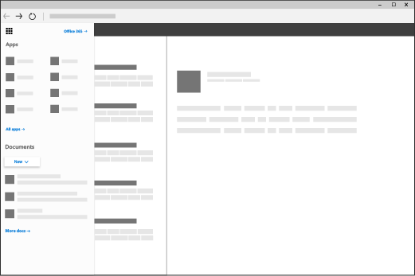

# Add custom tiles to the app launcher

In Microsoft 365, you can quickly and easily get to your email, calendars, documents, and apps using the App launcher ([learn more](https://support.microsoft.com/office/79f12104-6fed-442f-96a0-eb089a3f476a)). These are apps you get with Microsoft 365 as well as custom apps that you add from the [SharePoint Store](https://support.microsoft.com/office/dd98e50e-d3db-4ecb-9bb7-82b189822d43) or [Azure AD](/previous-versions/office/office-365-api/).
  
You can add your own custom tiles to the app launcher that point to SharePoint sites, external sites, legacy apps, and more. The custom tile appears under the app launcher's **All** apps, but you can pin it to the **Home** apps and instruct your users to do the same. This makes it easy to find the relevant sites, apps, and resources to do your job. In the below example, a custom tile called "Contoso Portal" is used to access an organization's SharePoint intranet site. 
  

  
## Add a custom tile to the app launcher

1. Sign in to the admin center as a Global Administrator, go to **Settings** > **Org Settings**, and choose the **Organization profile** tab.
    
2. On the **Organization profile** tab, choose **Custom app launcher tiles**.
  
3. Select **Add a custom tile**. 
  
4. Enter a **Tile name** for the new tile. The name will appear in the tile. 
    
5. Enter a **URL of website** for the tile. This is the location where you want your users to go when they select the tile on the app launcher. Use HTTPS in the URL.

    > [!TIP]
    > If you're creating a tile for a SharePoint site, navigate to that site, copy the URL, and paste it here. The URL of your default team site looks like this: `https://<company_name>.sharepoint.com` 
  
6. Enter an **URL of the image** for the tile. The image appears on the My apps page and app launcher. TIP: The image should be 60x60 pixels and be available to everyone in your organization without requiring authentication.

7. Enter a **Description** for the tile. You see this when you select the tile on the My apps page and select **App details**. 
  
8. Select **Save changes** to create the custom tile. 
    
    Your custom tile now appears in the app launcher on the **All** tab for you and your users. 

    > [!NOTE]
    > If you don't see the custom tile created in the previous steps, make sure you have an Exchange Online mailbox assigned to you and you've signed into your mailbox at least once. These steps are required for custom tiles in Microsoft 365. 
  
## Edit or delete a custom tile

1. In the admin center, go to the **Settings** > **Org Settings** > **Organization profile** tab.
    
2. On the **Organization profile** page, next to   **Add custom tiles for your organization**, select **Edit**.

3. Update the **Tile name**, **URL**, **Description**, or **Image URL** for the custom tile (see [Add a custom tile to the app launcher](#add-a-custom-tile-to-the-app-launcher)).
    
4. Select **Update** \> **Close**. 
    
To delete a custom tile, from the **Custom tiles** window, select the tile, select **Remove tile** > **Delete**. 
  
## What's next?

In addition to adding tiles to the app launcher, you can add app launcher tiles to the navigation bar ([learn more](https://support.microsoft.com/office/eb34a21b-52fa-4fbf-a8d5-146132242985)). To customize the look and feel of Microsoft 365 to match your organization's brand, see [Customize the Microsoft 365 theme](../setup/customize-your-organization-theme.md).
