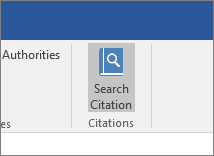
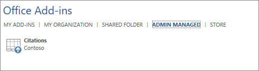
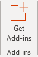

# Manage add-ins in the admin center

Office add-ins help you personalize your documents and streamline the way you access information on the web (see [Start using your Office add-in](https://support.microsoft.com/office/82e665c4-6700-4b56-a3f3-ef5441996862)). 

After an admin deploys add-ins for users in an organization, the admin can turn add-ins off or on, edit, delete, and manage access to the add-ins.

For more information about installing add-ins from the admin center, see [Deploy add-ins in the admin center](./manage-deployment-of-add-ins.md).
  
## Add-in states

An add-in can be in either the **On** or **Off** state.
  
|**State**|**How the state occurs**|**Impact**|
|:-----|:-----|:-----|
|**Active**    |Admin uploaded the add-in and assigned it to users or groups.    |Users and groups assigned to the add-in see it in the relevant clients.    |
|**Turned off**    |Admin turned off the add-in.    |Users and groups assigned to the add-in no longer have access to it.    If the add-in state is changed to Active, the users and groups will have access to it again.    |
|**Deleted**    |Admin deleted the add-in.    |Users and groups assigned the add-in no longer have access to it.    |
   
Consider deleting an add-in if no one is using it anymore. For example, turning off an add-in might make sense if an add-in is used only during specific times of the year.

## Delete an add-in

You can also delete an add-in that was deployed.

1. In the admin center, go to the **Settings** > **Services & add-ins** page.

     > [!NOTE]
    > The admin center is getting updated to deployment experience with Integrated Apps . If you don't see the above steps, go to Centralized Deployment section by going to **Settings** > **Integrated apps**. On the top of the **Integrated apps** page, choose **Add-ins**.

2. Select the deployed add-in.

3. Click on **Delete Add-In**. Remove the Add-in button on the bottom right corner.

4. Validate your selections, and choose **Remove add-in**.

## Edit add-in access

Post deployment, admins can also manage user access to add-ins.

1. In the admin center, go to the **Settings** > **Services & add-ins** page.

     > [!NOTE]
    > The admin center is getting updated to deployment experience with Integrated Apps . If you don't see the above steps, go to Centralized Deployment section by going to **Settings** > **Integrated apps**. On the top of the **Integrated apps** page, choose **Add-ins**.

2. Select the deployed add-in.

3. Click on **Edit** under **Who has Access**.

4. Save the changes.

## Prevent add-in downloads by turning off the Office Store across all clients (Except Outlook)

> [!NOTE]
> Outlook add-in installation is managed by a [different process](/exchange/clients-and-mobile-in-exchange-online/add-ins-for-outlook/specify-who-can-install-and-manage-add-ins).

As an organization you may wish to prevent the download of new Office add-ins from the Office Store. This can be used in conjunction with Centralized Deployment to ensure that only organization-approved add-ins are deployed to users within your organization.
  
**To turn off add-in acquisition**
  
1. In the admin center, go to the **Settings** \> [Services &amp; add-ins](https://go.microsoft.com/fwlink/p/?linkid=2053743) page.

     > [!NOTE]
    > The admin center is getting updated to deployment experience with Integrated Apps . If you don't see the above steps, go to Centralized Deployment section by going to **Settings** > **Integrated apps**. On the top of the **Integrated apps** page, choose **Add-ins**.
    
3. Select **User owned apps and services**.
    
4. Clear the option to let users access the Office store.

This will prevent all users from acquiring the following add-ins from the store.
  
- Add-ins for Word, Excel, and PowerPoint 2016 from:
    
  - Windows
    
  - Mac
    
  - Office
    
    
- Acquisitions starting within **AppSource**
    
- Add-ins within Microsoft 365
    
A user who tries to access the store will see the following message: **Sorry, Microsoft 365 has been configured to prevent individual acquisition of Office Store add-ins.**
  
Support for turning off the Office Store is available in the following versions:
  
- Windows: 16.0.9001 - Currently available.
    
- Mac: 16.10.18011401 - Currently available.
    
- iOS: 2.9.18010804 - Currently available.
    
- The web - Currently available.
    
This does not prevent an administrator from using Centralized Deployment to assign an add-in from the Office Store.
  
To prevent a user from signing in with a Microsoft account, you can restrict logon to use only the organizational account. For more information, see [Identity, authentication, and authorization in Office 2016](/DeployOffice/security/identity-authentication-and-authorization-in-office).  

> [!NOTE] 
> Preventing users from accessing the office store will also prevent them from [Sideloading Office Add-ins for testing from a network share](https://docs.microsoft.com/office/dev/add-ins/testing/create-a-network-shared-folder-catalog-for-task-pane-and-content-add-ins).

## More about the end user experience with add-ins

After you deploy an add-in, your end users can start using it in their Office applications (see [Start using your Office Add-in](https://support.microsoft.com/office/82e665c4-6700-4b56-a3f3-ef5441996862)). The add-in appears on all platforms that the add-in supports.
  
If the add-in supports add-in commands, the commands appear on the Office ribbon. In the following example, the command **Search Citation** appears for the **Citations** add-in. 

  
If the deployed add-in doesn't support add-in commands or if you want to view all deployed add-ins, you can view them via **My Add-ins**. 
  
### In Word 2016, Excel 2016, or PowerPoint 2016

1. Select **Insert \> My Add-ins**. 
    
2. Select the **Admin Managed** tab in the Office Add-ins window. 
    
3. Double-click the add-in you deployed earlier (in this example, **Citations** ).  
  
### In Outlook

1. On the **Home** ribbon, select **Get Add-ins**. 
  
2. Select **Admin-managed** in the left nav. 

## Learn more

[Deploy add-ins in the admin center](./manage-deployment-of-add-ins.md)

Learn more about creating and building [Office Add-ins](/office/dev/add-ins/overview/office-add-ins).
  
[Use Centralized Deployment PowerShell cmdlets to manage add-ins](../../enterprise/use-the-centralized-deployment-powershell-cmdlets-to-manage-add-ins.md).
  
[Troubleshoot: User not seeing add-ins](/office365/troubleshoot/access-management/user-not-seeing-add-ins)

[Minors and acquiring add-ins from the Microsoft Store](./minors-and-acquiring-addins-from-the-store.md)