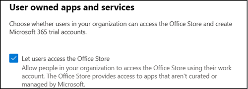
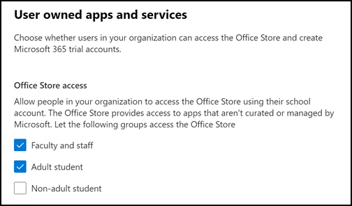
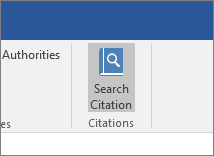

# Manage add-ins in the Microsoft 365 admin center

> [!NOTE]
> The [integrated apps portal](test-and-deploy-microsoft-365-apps.md) is the recommended and most feature-rich way for most customers to centrally deploy Office add-ins to users and groups within your organization.

Office Add-ins help users personalize your documents and streamline the way you access information on the web. See [Start using your Office Add-in](https://support.microsoft.com/office/82e665c4-6700-4b56-a3f3-ef5441996862).

After a Global or Exchange admin deploys add-ins for users in an organization, they can turn add-ins off or on, edit, delete, and manage access to the add-ins.

For more information about installing add-ins from the admin center, see [Deploy add-ins in the admin center](./manage-deployment-of-add-ins.md).
  
## Add-in states

An add-in can be in either the **On** or **Off** state.
  
| State | How the state occurs | Effect |
|:-----|:-----|:-----|
|**Active**    |Admin uploaded the add-in and assigned it to users or groups.    |Users and groups assigned to the add-in see it in the relevant clients.    |
|**Turned off**    |Admin turned off the add-in.    |Users and groups assigned to the add-in no longer have access to it.    If the add-in state is changed to Active, the users and groups will have access to it again.    |
|**Deleted**    |Admin deleted the add-in.    |Users and groups assigned the add-in no longer have access to it.    |

Consider deleting an add-in if no one is using it anymore. For example, turning off an add-in might make sense if an add-in is used only during specific times of the year.

## Delete an add-in

You can also delete an add-in that was deployed.

1. In the admin center, go to the **Settings** > **Integrated apps** page.

2. Select the deployed add-in and then select the **Configuration** tab.

3. In the **Configuration** pane, go to **Advanced Settings** > **Add-ins**.

4. Select the add-in from the list again.

5. Choose **Remove Add-In**. Remove the Add-in button on the bottom right corner.

6. Validate your selections, and choose **Remove**.

## Edit add-in access

Post deployment, admins can also manage user access to add-ins.

1. In the admin center, go to the **Settings** > **Integrated apps** page.

2. Select the deployed add-in.

3. Click on **Edit** under **Who has Access**.

4. Save the changes.

## Manage add-in downloads by turning on/off AppSource across all apps (except Outlook)

> [!IMPORTANT]
> In the UI of the Microsoft 365 Admin Center, AppSource is still sometimes referred to as "Office Store".

> [!NOTE]
> Outlook add-in installation is managed by a [different process](/exchange/clients-and-mobile-in-exchange-online/add-ins-for-outlook/specify-who-can-install-and-manage-add-ins).

As an organization you may wish to manage the download of Office add-ins from AppSource. This could be used to ensure that users within your organization can get the benefits from all the Office add-ins, or only the organization-approved add-ins can be deployed with centralized deployment.
  
**To turn on/off add-in acquisition**
  
1. In the admin center, go to the **Settings** \> [Org settings](https://go.microsoft.com/fwlink/p/?linkid=2053743) page.

2. Select **User owned apps and services**.

3. Check or clear the option to allow or prevent users to access the Office Store (which refers to AppSource).

Options available in non-educational tenants:

   

Options available in educational tenants:

   

The user’s license information is used to define whether a user is a faculty/staff or a student along with the Age Group property to check whether the student is an adult or not. A user who does not have an educational license is included in the **Faculty, staff and other non-student users** user group.  

> [!NOTE]
> For more information see:  
>- [Learn how to review the user's license type and assign or unassign licenses as required](assign-licenses-to-users.md)
>- [Understand how to configure the Age Group property in the Microsoft Encarta admin center](/entra/fundamentals/how-to-manage-user-profile-info)

This will control all users' ability to acquire the following add-ins from AppSource.

- Add-ins for non-subscription Word, Excel, and PowerPoint on Windows and Mac
- Add-ins for subscription Microsoft 365

 When you disable the access to AppSource, a user who tries to access it will see the following message: **Office store not available. Unfortunately, your organization has disabled access to the Office Store. Please contact your administrator to get access to the store.**

> [!NOTE]
> Acquisitions may still be possible from AppSource, but the user will not be able to launch or use the add-in in the client. This does not prevent an administrator from using centralized deployment to assign an add-in from AppSource.
  
Support for turning on/off the AppSource is available in the following versions:
  
- Office on Windows: 16.0.9001 - Currently available.
    
- Office on Mac: 16.10.18011401 - Currently available.
    
- Office on iOS: 2.9.18010804 - Currently available.
    
- Office on the web - Currently available.
    
To prevent a user from signing in with a Microsoft account, you can restrict logon to use only the organizational account. For more information, see [Identity, authentication, and authorization in Office 2016](/DeployOffice/security/identity-authentication-and-authorization-in-office).  

> [!NOTE]
> Preventing users from accessing AppSource will also prevent them from [Sideloading Office Add-ins for testing from a network share](/office/dev/add-ins/testing/create-a-network-shared-folder-catalog-for-task-pane-and-content-add-ins).

## More about the end-user experience with add-ins

After you deploy an add-in, your end users can start using it in their Office applications. The add-in appears on all platforms that the add-in supports. See [Start using your Office Add-in](https://support.microsoft.com/office/82e665c4-6700-4b56-a3f3-ef5441996862). 
  
If the add-in supports add-in commands, the commands appear in the ribbon. In the following example, the command **Search Citation** appears for the **Citations** add-in. 

  
If the deployed add-in doesn't support add-in commands or if a user wants to view all deployed add-ins, the user can view them via **My Add-ins**.
  
### In Word, Excel, or PowerPoint

1. on the **Home** ribbon, select **Add-ins**, and then select **More Add-ins** on the callout.
    
1. On the **Apps** pane, select **Manage your apps** to see a list of all deployed apps, agents, and add-ins.
    
1. Double-click the add-in you deployed earlier (in this example, **Citations**).
 
### In Outlook

1. On the **App Bar** on the left of the window, select the **More Apps** button. Or on the **Home** ribbon, select **All Apps** and then select **Add apps** on the callout.
  
1. On the **Apps** pane, select **Manage your apps** to see a list of all deployed apps, agents, and add-ins.

## Related content

[Minors and acquiring add-ins from the Microsoft Store](./minors-and-acquiring-addins-from-the-store.md)
