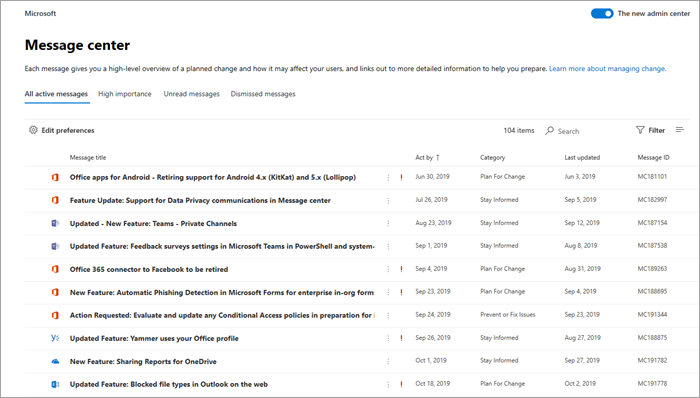

# Message center

To keep track of upcoming changes, including new and changed features, planned maintenance, or other important announcements, go to <a href="https://go.microsoft.com/fwlink/p/?linkid=2070717" target="_blank">Message center</a>.
  
To open Message center:

::: moniker range="o365-worldwide"

- In the admin center, go to **Health** > <a href="https://go.microsoft.com/fwlink/p/?linkid=2070717" target="_blank">Message center</a>.

::: moniker-end

::: moniker range="o365-germany"

- In the <a href="https://go.microsoft.com/fwlink/p/?linkid=848041" target="_blank">admin center</a>, go to **Health** > **Message center**.

::: moniker-end

::: moniker range="o365-21vianet"

- In the <a href="https://go.microsoft.com/fwlink/p/?linkid=850627" target="_blank">admin center</a>, go to **Health** > **Message center**.

::: moniker-end

You can also use the [Microsoft 365 Admin app](https://go.microsoft.com/fwlink/p/?linkid=627216) on your mobile device to view Message center, which is a great way to stay current with push notifications.

To unsubscribe from Message center emails, see [Unsubscribe from Message center emails](#unsubscribe-from-message-center-emails) in this article.

  
## Frequently asked questions

|**Question**|**Answer**|
|:-----|:-----|
|Who can view posts in Message center?    |Most users who have been assigned any admin role in Microsoft 365 can view Message center posts. [Here's a list](#admin-roles-that-dont-have-access-to-the-message-center) of admin roles that don't have access to the Message center. You can also assign the Message center reader role to users who should be able to read and share Message center posts without having any other admin privileges. |
|Is this the only way Microsoft will communicate changes about Microsoft 365?    |No, but Message center is the primary way we communicate the timing of individual changes in Microsoft 365. See [Stay on top of Microsoft 365 changes](stay-on-top-of-updates.md) for information about additional resources.    |
|How can I see posts in my language?    |Message center posts are written in English only, but you can control whether, by default, posts are shown in English or are automatically machine-translated to your preferred language. You can also select to machine-translate posts to any language we support. See [Language translation for Message center posts](language-translation-for-message-center-posts.md) for more details.    |
|Can I preview changes or features before they are rolled-out to my organization?    |Some changes and new features can be previewed by opting in to the Targeted release program. To opt in, in the admin center, go to **Settings** > **Org settings** > **Organization profile** > **Release preferences**. (In the admin center, you may need to select **Show all** at the bottom of the left navigation pane to see **Settings**.) You can choose Targeted release for your entire organization, or just for selected users. See [Standard or Targeted release options in Microsoft 365](release-options-in-office-365.md) for more information about the program.    |
|Can I find out the exact date a change will be available to my organization?    |Unfortunately, we can't tell you the exact date a change will be made to your organization. In our Message center post, we will give as much information as we can on the timing of the release, based on our confidence level. We're working on improvements to get better with that level of detail.    |
|Are these messages specific to my organization?    |We do our best to make sure that you only see Message center posts that affect your organization. The Microsoft 365 Roadmap includes all of the features we are currently working on and rolling out, but not all of these features apply to every organization.   |
|Can I get message center posts emailed instead?    |Yes! You can select to have a weekly digest emailed to you and up to two other email addresses. The emailed weekly digest is turned on by default. If you aren't getting your weekly digests, check your spam folder. See the [Preferences](#preferences) section of this article for more information on how to set up the weekly digest.    |
|How do I stop getting the Message center digest?    |Go to Message center in the admin center and select **Preferences**. In the **Email** tab, turn off the option to **Send me email notifications from message center**.     |
|How can I ensure data privacy notifications are received by the right contacts in my organization?   |As a global admin you will receive data privacy messages for your organization. Additionally, you can assign the Message Center Privacy reader role to people who should see data privacy messages. Other admin roles with access to Message Center cannot view data privacy messages.     For more info, see [Preferences](#preferences) in this article.  |
|Why can’t I see a message that was previously there?   |To manage the number of messages within Message center, each message will expire and be removed after a period of time. Generally, messages expire 30 days post the time period outlined in the message body.   |

## Filter messages

Message center presents a view of all active messages in a table format. By default, it shows the most recent message at the top of the list. You can select **Service** to see messages for various services, such as Microsoft 365 Apps, SharePoint Online, etc.   Under **Tag** you can select **Admin impact**, **Data privacy**, **Feature update**, **Major update**, **New feature**, **Retirement**, or **User impact** messages. Under **Message state** you can select **Favorites**, **Unread**, or **Updated** messages.

The Archive tab shows the messages you have archived. To archive a message, in the message pane, Select **Archive**.

::: moniker range="o365-worldwide"

Use the **Service**, **Tag**, and **Message state**  drop-down menus to select a filtered view of messages. For example, in this diagram the messages are tagged with the **Admin impact** tag.

You can select any column heading, except **Service** and **Tag**,  to sort messages in ascending or descending order.

:::image type="content" source="../../media/message-center-admin-impact1.png" alt-text="Message center view sorted by Admin impact":::

::: moniker-end

::: moniker range="o365-germany"

Use the **Views** drop-down menu to select a filtered view of messages.

You can select any column heading to sort messages in ascending or descending order. For example, in this illustration the messages are sorted on the **Act by** date.

::: moniker-end

::: moniker range="o365-21vianet"

Use the **Service**, **Tag**, and **Message state**  drop-down menus to select a filtered view of messages. For example, in this diagram the messages are tagged with the **Admin impact**.

You can select any column heading, except **Service** and **Tags**,  to sort messages in ascending or descending order.

::: moniker-end

### Major updates

Major updates can be reviewed by selecting the **Major update** from the **Tags** drop-down.

Major updates are communicated at least 30 days in advance when an action is required and might include:
  
- ​Changes to daily productivity such as inbox, meetings, delegations, sharing, and access

- Changes to themes, web parts, and other components that may affect customized features

- Increases or decreases to visible capacity such as storage, number of rules, items, or durations

- Changes to product branding that may:

  - Cause end user confusion,

  - Result in changes to help desk processes and reference material, or

  - Change a URL

- A new service or application

- Changes requiring an admin action (exclusive of prevent or fix issues)

- Changes to where your data is stored
  
### Preferences

If administration is distributed across your organization, you may not want or need to see posts about all Microsoft 365 services. Each admin can:

- Set preferences that control which messages are displayed in Message center.
- Filter messages
- Set email preferences to receive a weekly digest of all messages, emails for major updates only, and emails for data privacy messages.  

::: moniker range="o365-worldwide"

1. Select **Preferences** at the top of Message center.

2. In the **Custom View** tab, make sure that the check box is selected for each service that you want to monitor. Clear the check boxes for the services you want to filter out of your Message center view.

3. Digest emails are turned on by default and are sent to your primary email address. To stop receiving the weekly digest, clear the **Send me email notifications from message center** check box in he **Email tab**. 

   You can also enter up to two email addresses, separated by a semicolon.

   You can also choose the emails you want to get, as well as a weekly digest of services you select.

4. Select **Save** to keep your changes.
  
::: moniker-end

::: moniker range="o365-germany"

1. Select **Edit Message center preferences** at the top of Message center.

2. Make sure that the toggle is set to **On** for each service that you want to monitor. Use the toggle to change the setting to **Off** for the services you want to filter out of your Message center view.

3. Digest emails are turned on by default and are sent to your primary email address. To stop receiving the weekly digest, change the **Send a weekly digest of my messages** setting to **Off**. 

   Email notification for major updates is a separate control. If you want to receive email notices about major updates, verify that **Send me emails for major updates** is **On**. Change the setting to **Off** to stop getting email about major updates. 

   To receive email notices about data privacy messages, verify that **Send me emails for data privacy messages** is **On**. To stop receiving these notices, change the setting to **Off**. (Data privacy messages are not included in the weekly digest.)

   You can select or clear your primary email address, but you can't change it. To specify other email addresses to which the weekly email summary is sent, verify that **Send a weekly digest of my messages** is **On**. Enter the email address for a Microsoft 365 group or a distribution list if more than two people should get the digest email.

4. Select **Save** to keep your changes. 

::: moniker-end

::: moniker range="o365-21vianet"

1. Select **Preferences** at the top of Message center.

2. In the **Custom View** tab, make sure that the check box is selected for each service that you want to monitor. Clear the check boxes for the services you want to filter out of your Message center view.

3. Digest emails are turned on by default and are sent to your primary email address. To stop receiving the weekly digest, clear the **Send me email notifications from message center** check box in he **Email tab**.

   You can also enter up to two email addresses, separated by a semicolon.   You can also choose the emails you want to get, as well as a weekly digest of services you select.

4. Select **Save** to keep your changes. 

::: moniker-end

### Display messages in your preferred language
  
We use machine translation to automatically display messages in your preferred language. Read [Language translation for Message center posts](language-translation-for-message-center-posts.md) for more information on how to set your language.
  
> [!NOTE]
> The weekly digest and any posts that are emailed are sent in English-only. Recipients can use [Translator for Outlook](https://support.microsoft.com/office/3d7e12ed-99d6-406e-a453-b9db0d9653fa) to read the message in their preferred language.

## Choose columns

To choose columns, on the **Message center** page, on the far right, select **Choose columns**, and in the **Choose columns** pane, select the ones you want displayed.

Here's a quick overview of the information you'll see in each column.

### Column information

|**Column**|**Description**|
|:-----|:-----|
|Check mark    |Selecting the check mark in the column heading row will select all messages currently displayed. Selecting the check mark next to one or more messages lets you take action on those messages.    |
|Message title    |Message titles are brief descriptions of upcoming changes. If the full title doesn't display, hover your cursor over it and the entire title will appear in a pop-up box.    |
|Service   |Icons indicate the application to which the message applies.  |
|More options   |More options lets you dismiss a message, mark it as read or unread, or share it with another admin. To restore an archived message, select the **Archive** tab, select the check mark next to the message, and select **Restore**.   |
|Tags   |You can choose tags from the **Tag** drop-down to filter messages. The available tags are: **Admin impact**, **Major update**, **Data Privacy**, **Feature update**, **New feature**, **Retirement**, and **User impact**.   |
|Category    | This is not shown by default, but can be specified in the **Choose columns** panel. Messages are identified by one of the following three categories:    **Prevent or fix issues**: Informs you of known issues affecting your organization and may require that you take action to avoid disruptions in service. Prevent or fix issues are different than Service health messages because they prompt you to be proactive to avoid issues.     **Plan for change**: Informs you of changes to Microsoft 365 that may require you to act to avoid disruptions in service. For example, we'll let you know about changes to system requirements or about features that are being removed. We try to provide at least 30 days' notice of any change that requires an admin to act to keep the service running normally.     **Stay informed**: Tells you about new or updated features we are turning on in your organization. The features are usually announced first in the [Microsoft 365 Roadmap](https://go.microsoft.com/fwlink/?linkid=2070821).   May also let you know about planned maintenance in accordance with our Service Level Agreement. Planned maintenance may result in down time, where you or your users can't access Microsoft 365, a specific feature, or a service such as email or OneDrive for Business.    |
|Act by    |We'll only have dates here if we're making a change that requires you to take an action by a certain deadline. Since we rarely use the **Act by** column, if you see something here, you should pay extra attention to it.    |
|Last updated    |Date that the message was published or last updated.    |
|Message ID    |Microsoft tracks our Message center posts by message ID. You can refer to this ID if you want to give feedback or if you call Support about a particular message.    |

### Admin roles that don't have access to the Message center

- Compliance administrator
- Conditional access administrator
- Customer LockBox access approver
- Device administrators
- Directory readers
- Directory synchronization accounts
- Directory writers
- Intune service administrator
- Privileged role administrator
- Reports reader

## Give feedback on a post

In the Message center, you can select a message to see details.

If you want to provide feedback on the message, in the details pane, select either the **Like** or **Dislike** icon on the bottom of the message details pane, and provide optional feedback in the text box that appears. Do not provide any personal information. You can optionally select **It's OK to contact me about this feedback** and then select **Send**.

## Share a message

See a message that someone else needs to act on? You can share the contents of the message with any user by email:
  
1. Select the message to open it, and then select **Share**.
  
2. To share the message, enter up to two email addresses separated by a colon. You can send to individual and to group email addresses. Optionally, you can choose to receive a copy of the message in email (the message will go to your primary email address) or add a personal message to provide recipients with more context.
  
3. Select **Share** to send the email.

## Get a link

Need to follow up with another admin to make sure they're aware of a change and taking action? You can generate a link to share in email or instant messaging, for example, that will connect the user directly to that message. The person you share the link with has to have access to Message center. See [admin roles that don't have access to the Message center](message-center.md#admin-roles-that-dont-have-access-to-the-message-center) for more information.

1. Select the message to open it.

2. Select **Copy link**.

3. Use Ctrl+V or right-click and select **Paste** to insert the link to whatever document you wish.

## Read and unread states

Any message in Message center that is unread will appear in bold. Opening a message marks it as read. You can mark a message as unread.

- On the main page of the message center, select the **More options** ellipses next to a message, and then select **Mark as unread**.

You can also open a message and mark it as unread in the details panel.
  
## Archive and restore

If you see a message that doesn't pertain to you, or maybe you've already acted on it, you can archive the message to remove it from Inbox. The view that you see in the Message center is specific to your user account, so archiving it from your view doesn't affect other admins. There are two ways to archive a message.

- On the main page of the Message center, select a message, and then select **Archive** above the list of messages.

- Open the message, and then select **Archive** on the top of the message pane.

Need to get an archived message back? No problem.
  
1. Select the **Archive** tab at the top of the Message center. A list of archived messages appears.

2. Select the message, select **Restore**, and the message is restored to Inbox.

## Favorite messages

To mark a message as a favorite, hover over the message title and you will see a **Favorite** :::image type="icon" source="../../media/favorite-star.png" border="false"::: star you can select right after the **More options** ellipses. Once you have marked messages as favorite you can also sort and filter them.

## Scroll messages in the message pane

When you open a message in a reading pane, you can use the **Up** and **Down** :::image type="icon" source="../../media/updownarrows.png" border="false"::: arrows on the top of the pane to move to the next, or the previous message in the list.

## Track your message center tasks in Planner

A lot of actionable information about changes to Microsoft 365 services arrives in the Microsoft 365 message center. It can be difficult to keep track of which changes require tasks to be done, when, and by whom, and to track each task to completion. You also might want to make a note of something and tag it to check on later. You can do all this and more when you sync your messages from the Microsoft 365 admin center to Microsoft Planner. For more information, see [Track your message center tasks in Planner](/office365/planner/track-message-center-tasks-planner).

For an overview of Message center, see [Message center in Microsoft 365](message-center.md). Or, to learn how to set your language preferences to enable machine translation for Message center posts, see [Language translation for Message center posts](language-translation-for-message-center-posts.md). If you'd like to program an alternative way to get real-time service health information and Message Center communications, please reference [Microsoft 365 Service Communications API Overview](/previous-versions/office/developer/o365-enterprise-developers/jj984343(v=office.15)).

## Unsubscribe from Message center emails

1. Digest emails are turned on by default and are sent to your primary email address. To stop receiving the weekly digest, select **Preferences** and then **Email**.
    - De-select the **Send a weekly digest of my messages** checkbox.
    - Email notification for major updates is a separate control. If you don't want to receive email notices about major updates, verify that **Send me emails for major updates** checkbox is not selected.
    -   To stop receiving email notices about data privacy messages, verify that **Send me emails for data privacy messages** checkbox is not selected.  (Data privacy messages are not included in the weekly digest.)

2. Select **Save** to keep your changes. 

## Related content

[Set up the Standard or Targeted release options](../manage/release-options-in-office-365.md) (article)\
[Manage which Office features appear in What's New](../manage/show-hide-new-features.md) (article)\
[Business subscriptions and billing documentation](../../commerce/index.yml) (link page)
