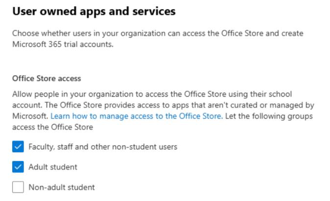

# Deploy and manage Office Add-ins

## What are Office add-ins?

Microsoft has partnered with leading companies to build programs that help you get things done right from your Microsoft applications. These programs are called Office Add-ins and help you personalize your inbox, documents and streamline the way you access information on the web (see [Start using your Office Add-in](https://support.microsoft.com/office/82e665c4-6700-4b56-a3f3-ef5441996862)).

An Office add-in can be used on Word, Excel, PowerPoint, and Outlook. These add-ins are supported in three desktop platforms Windows, Mac, and Online Office apps. It's also supported on iOS and Android (Outlook Mobile Add-ins only).

## Before you begin

Management and deployment via Integrated Apps require that the users are using Microsoft 365 Business licenses (Business Basic, Business Standard, Business Premium), Office 365 Enterprise licenses (E1/E3/E5/F3), or Microsoft 365 Enterprise licenses (E3/E5/F3). The users also need to be signed into Office using their organizational ID and have Exchange Online and active Exchange Online mailboxes. Your subscription directory must either be in or federated to Microsoft Entra ID.

### Office Requirements

For Word, Excel, and PowerPoint add-ins, your users must be using one of the following versions:
- On a Windows device, Version 1704 or later of Microsoft 365 Business licenses (Business Basic, Business Standard, Business Premium), Office 365 Enterprise licenses (E1/E3/E5/F3), or Microsoft 365 Enterprise licenses (E3/E5/F3).
- On a Mac, Version 15.34 or later.

For Outlook, your users must be using one of the following versions:
- Version 1701 or later of Microsoft 365 Business licenses (Business Basic, Business Standard, Business Premium), Office 365 Enterprise licenses (E1/E3/E5/F3), or Microsoft 365 Enterprise licenses (E3/E5/F3).
- Version 1808 or later of Office Professional Plus 2019 or Office Standard 2019.
- Version 16.0.4494.1000 or later of Office Professional Plus 2016 (MSI) or Office Standard 2016 (MSI).
- Version 15.0.4937.1000 or later of Office Professional Plus 2013 (MSI) or Office Standard 2013 (MSI).
- Version 16.0.9318.1000 or later of Office 2016 for Mac.
- Version 2.75.0 or later of Outlook mobile for iOS.
- Version 2.2.145 or later of Outlook mobile for Android.

> [!NOTE]
> MSI versions of Outlook show admin-installed or deployed add-ins in the appropriate Outlook ribbon, not the *My add-ins"* section.

### Exchange Online Requirements

Microsoft Exchange stores the add-in manifests within your organization's tenant. The admin deploying  /pre-installing add-ins and the users receiving those add-ins must be on a version of Exchange Online that supports OAuth authentication.

Check with your organization's Exchange admin to find out which configuration is in use. OAuth connectivity per user can be verified by using the *Test-OAuthConnectivity* PowerShell cmdlet.

Deployment doesn't support the following scenarios:
- Add-ins that target Word, Excel, or PowerPoint in Office 2013
- An on-premises directory service
- Add-in Deployment to an Exchange On-prem Mailbox
- Deployment of Component Object Model (COM) or Visual Studio Tools for Office (VSTO) add-ins.
- Deployments of Microsoft 365 that don't include Exchange Online such as Microsoft 365 Apps for Business and Microsoft 365 Apps for Enterprise.

## Controls for managing Office add-ins

As an admin, you can manage Office add-ins in your organization as follows:
1. Deploy an Office Add-in for users in your organization.
2. Manage how users can install and use Office add-ins.
3. Upload custom Office add-ins for your organization.

### Prepare to deploy and manage Office Add-ins via Integrated Apps

Office Add-ins help you personalize your documents and streamline the way you access information on the web (see Start using your Office Add-in). Add-ins provide the following benefits:

- When the relevant Office application starts, the add-in automatically downloads. If the add-in supports add-in commands, the add-in automatically appears in the ribbon within the Office application.
- Add-ins no longer appear for users if the admin turns off or deletes the add-in. Also if the user is removed from Microsoft Entra ID or from a group that the add-in is assigned to. Learn how to perform these actions in the following section.

Add-ins are supported in three desktop platforms: Windows, Mac, and Online Office apps. It's also supported in iOS and Android (Outlook Mobile Add-ins Only).

It can take up to 24 hours for an add-in to show up for client for all users.

Currently, Exchange admins and Global admins can deploy add-ins from Integrated apps.

## Deploy your Office add-ins

Deploying an add-in means you're pre-installing the add-in for a specific set of users in your organization. All management actions taken on a deployed add-in are fully controlled by the admin. You can find, test, and fully deploy apps published by Microsoft and other leading partners. By purchasing and licensing the apps from the admin center, you can add Microsoft and Microsoft partner apps to your list from a single location.

1. In the admin center, in the left nav, choose **Settings**, and then choose **Integrated apps**.
2. In the Deployed Apps list, select **Get apps** to get a view of the apps.
3. On the **Microsoft 365 Apps published apps** page, select the app you want to deploy by choosing **Get it now**. Accept the permissions and select **Continue**.
4. Select **Deploy** at the top of the page next to the message that refers to waiting to be deployed. If the app selected is linked to a SaaS offer by an ISV, all the other apps that are part of this linked offer appear on the Configuration page. If you choose to deploy all of the apps, select **Next**. Otherwise, select **Edit**, and choose which apps you want to deploy. Some apps require you to add users before you can select **Deploy**.
5. Select **Add users**, choose **Is this a test deployment**, and then select either **Entire organization**, **Specific users/groups**, or **Just me**. Specific users/groups can be a Microsoft 365 group, a security group, or a distributed group. You can also choose **Test deployment** if you prefer to wait to deploy the app to the entire organization.
6. Select **Next** to get to the **Accept permission request** page. The app capabilities and permissions of each of the apps are listed. If the app needs consent, select **Accept permissions**. Only a global administrator can give consent.
7. Select **Next** to review the deployment and choose **Finish deployment**. You can view the deployment from the **Overview** tab by choosing **View this deployment**. In the Microsoft 365 admin center, you can see the status of each deployed app and the date you deployed the app.

It can take up to 24 hours for an add-in to show up for client for all users.

### Considerations when deploying an add-in to users and groups

Admins can deploy an add-in to everyone or to specific users and groups. Each option has implications:

- **Everyone**: This option assigns the add-in to every user in the organization. Use this option sparingly and only for add-ins that are truly universal to your organization.
- **Users**: If you assign an add-in to an individual user, and then deploy the add-in to a new user, you must first add the new user.
- **Groups**: If you assign an add-in to a group, users who are added to the group are automatically assigned the add-in. When a user is removed from a group, the user loses access to the add-in. In either case, no other action is required from the admin.
- **Just me**: If you assign an add-in to just yourself, the add-in is assigned to only your account, which is ideal for testing the add-in.

The right option for your organization depends on your configuration. However, we recommend making assignments by using groups. As an admin, you might find it easier to manage add-ins by using groups and controlling the membership of those groups rather than assigning individual users each time. In some situations, you might want to restrict access to a small set of users by making assignments to specific users by assigning users manually.

### Recommended approach for deploying Office Add-ins

To roll out add-ins by using a phased approach, we recommend the following actions:

1. Roll out the add-in to a small set of business stakeholders and members of the IT department. If the deployment is successful, move to step 2.
2. Roll out the add-in to more individuals within the business. Again, evaluate the results and, if successful, continue with full deployment.
3. Perform a full rollout to all users.

Depending on the size of the target audience, you can add or remove roll-out steps.

### Scenarios where Exchange admin can't deploy an add-in

There are two cases in which an Exchange Admin aren't able to deploy an add-in:

- If an add-in needs permission to MS Graph APIs and needs consent from a global admin.
- If an add-in is linked to two or more add-ins and webapps, and at least one of these add-ins is deployed by another admin (Exchange or global) and the user assignment isn't uniform. We only allow deployment of add-ins when the user assignment is the same for all the already deployed apps.

### Edit users for deployed add-ins

Post deployment, admins can also edit the deployed to add-ins.

1. In the admin center, select **Settings**, then select **Integrated apps**.
2. On the **Integrated apps** page, it displays a list of apps that are either single add-ins or add-ins that have been linked with other apps.
3. Select an app and then scroll down to select **Edit Users** or select the **User** tab in the overview pane.
4. Select the user group you want to deploy the add-in to.
5. Review the app information, and then select **Update**.

> [!NOTE]
> Only the admin who deployed the add-in or a global admin can manage that add-in.

### Update deployed add-ins

Post deployment, admins can also approve updates for the deployed add-ins.

1. In the admin center, select **Settings** then select **Integrated apps**.
2. On the **Integrated apps** page, it displays a list of apps that are either single add-ins or add-ins that have been linked with other apps.
3. Select an app with **Status** of **More apps available** to open the **Manage** pane. The status of **More apps available** lets you know that there are more integrations from the ISVs that aren't yet deployed.
4. On the **Overview** tab, select **Deploy**. Some apps require you to add users before you can select **Deploy**.
5. Select **Users**, select **Is this a test deployment**, and then select either **Entire organization**, **Specific users/groups** or **Just me**. You can also select **Test deployment** if you prefer to wait to deploy the app to the entire organization. Specific users or groups can be a Microsoft 365 group, a security group, or a distribution group.
6. Select **Update** and then select **Done**. You can now select **Deploy** on the **Overview** tab.
7. Review the app information, and then select **Deploy**.
8. Select **Done** on the **Deployment completed** page, and review the details of the test or full deployment on the **Overview** tab.
9. If the app has a status of **Update pending**, you can click on the app to open the **Manage** pane and update the app.
10. To just update users, select the **Users** tab and make the appropriate change. Select **Update** after making your changes.

### Delete a deployed add-in

You can also delete an add-in that was deployed.

1. In the admin center, select **Settings**, then select **Integrated apps**.
2. Select any row to display the management pane.
3. Select the **Configuration** tab.
4. Select the add-in that you want to delete and then select **Remove**.

> [!NOTE]
> If the add-in has been deployed by another admin, then the Remove button will be disabled. Only the admin who has deployed the app or a global admin can delete the add-in.

## Manage how users can install and use Office add-ins

Managing how users can install and use Office add-ins means that you decide who can or can't install and use add-ins in your organization. Unlike deploying an add-in that preinstalls for selected users, managing an add-in allows you to decide which users can self-install Office add-ins from the stores on the Microsoft applications.

**Word, Outlook, and PowerPoint**

1. To manage users’ ability to self-install and use Office add-ins from the Word, Excel and PowerPoint stores, visit the Microsoft 365 Admin Center.
2. Choose **Settings** and the select **Org Settings**.
3. Scroll down and select **User owned apps and services**.
4. Check or clear the option to allow or prevent users to access all Word, Excel, and PowerPoint add-ins.

Options available in non-educational tenants:
    
   
   
Options available in educational tenants:

   

The user’s license information is used to define whether a user is a faculty/staff or a student along with the Age Group property to check whether the student is an adult or not.  

> [!NOTE]
> For more information see:  
>- [Learn how to review the user's license type and assign or unassign licenses as required](assign-licenses-to-users.md)
>- [Understand how to configure the Age Group property in the Microsoft Encarta admin center](/entra/fundamentals/how-to-manage-user-profile-info)

> [!NOTE]
> This setting does not impact any deployed Office add-ins on Word, Excel, and PowerPoint. You can continue to deploy Office add-ins to users in your organization, even if the above setting is turned off.

**Outlook**

1. To manage users’ ability to self-install and use Office add-ins from Outlook store, log in to the classic Exchange admin center as a global administrator.
2. Go to **Permissions** and then select **User Roles**.
3. Select an existing role assignment policy or create a new policy.
4. Type a name for the policy if you're creating a new policy.
5. Select the following roles: **My Custom Apps**, **My MarketPlaceApps**, and **My ReadWriteMailbox Apps**.
6. Select **Save**.
    - Once the policy is created, you can assign it to users in your organization.
    - You can also create multiple policies and assign it to different users within your organization.
7. Activating the checkboxes above turns on access to Outlook add-ins for the users assigned to the policy.
8. Deactivating the checkboxes turns off access to Outlook add-ins for users assigned to the policy.

> [!NOTE]
> This setting does not impact any deployed Office add-ins on Outlook. You can continue to deploy Office add-ins on Outlook to users in your organization, even if the above setting is turned off.

Microsoft is now partnering with leading developers to create unified apps that work across Outlook, Word, Excel, PowerPoint, Teams and the Microsoft 365 App (formerly known as Office.com). Any settings made for Office Add-ins will continue to be honored as long as they stay as add-ins. When Office add-ins upgrade to work across different Microsoft applications, you can learn to manage them from here. For more information, see [Controls for managing Teams apps that work on Outlook and Microsoft 365](/microsoft-365/admin/manage/teams-apps-work-on-outlook-and-m365#controls-for-managing-teams-apps-that-work-on-outlook-and-the-microsoft-365-app).

## Upload Custom Office Add-ins in your organization  

You can also upload custom line of business add-ins and deploy it to users in your organization:

1. In the admin center, in the left nav, choose **Settings** and then **Integrated apps**.
2. Select **Upload custom apps**. Custom line of business add-ins for Word, PowerPoint, Excel, and Outlook are supported.
3. Upload the manifest file from your device or add a URL link. Some apps require you to add users before you can select **Deploy**.
4. Select **Add users**, choose **Is this a test Deployment**, and choose either **Entire organization**, **Specific users/groups**, or **Just me.** Specific users/groups can be a Microsoft 365 group, a security group, or a distributed group. You can also choose **Test deployment** if you want to wait to deploy the app to the entire organization.
5. Select **Next** to view the **Accept permission request** page. The app capabilities and permissions of the apps are listed. If the app needs consent, select **Accept permissions**. Only a global administrator can give consent.
6. Select **Next** to review the deployment and choose **Finish deployment**. You can view the deployment from the Overview tab by choosing **View this deployment**.

> [!NOTE]
> The uploaded manifest size can't exceed 512 KB.

## More about Office Add-ins security

Office Add-ins combine an XML manifest file that contains some metadata about the add-in, but most importantly points to a web application that contains all the code and logic. Add-ins can range in their capabilities. For example, add-ins can:

- Display data.
- Read a user's document to provide contextual services.
- Read and write data to and from a user's document to provide value to that user.

For more information about the types and capabilities of Office Add-ins, see [Office Add-ins platform overview](/office/dev/add-ins/overview/office-add-ins), especially the section *Anatomy of an Office Add-in*.

To interact with the user's document, the add-in needs to declare what permission it needs in the manifest. A five-level JavaScript API access-permissions model provides the basis for privacy and security for users of task pane add-ins. Most of the add-ins in the Office Store are level ReadWriteDocument with almost all add-ins supporting at least the ReadDocument level. For more information about the permission levels, see [Requesting permissions for API use in content and task pane add-ins](/office/dev/add-ins/develop/requesting-permissions-for-api-use-in-content-and-task-pane-add-ins).

When updating a manifest, the typical changes are to an add-in's icon and text. Occasionally, add-in commands change. However, the permissions of the add-in don't change. The web application where all the code and logic for the add-in runs can change at any time, which is the nature of web applications.

Updates for add-ins happen as follows:

- **Line-of-business add-in**: In this case, where an admin explicitly uploaded a manifest, the add-in requires that the admin upload a new manifest file to support metadata changes. The next time the relevant Microsoft 365 productivity apps start, the add-in will update. The web application can change at any time.
- **Office Store add-in**: When an admin selected an add-in from the Office Store, if an add-in updates in the Office Store, the next time the relevant Microsoft 365 productivity apps start, the add-in will update. The web application can change at any time.

> [!NOTE]
> For Word, Excel, and PowerPoint use a [SharePoint App Catalog](/sharepoint/dev/sp-add-ins/publish-sharepoint-add-ins) to deploy add-ins to users in an on-premises environment with no connection to Microsoft 365 and/or support for SharePoint add-ins required. For Outlook use Exchange control panel to deploy in an on-premises environment without a connection to Microsoft 365.
