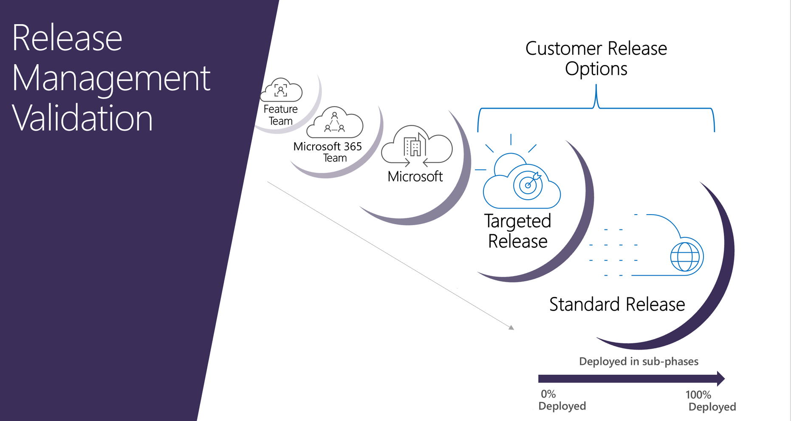

# Set up the Standard or Targeted release options

> [!IMPORTANT]
> The Microsoft 365 updates described in this article apply to OneDrive for Business, SharePoint Online, Microsoft 365 for the web, Microsoft 365 admin center, some components of Exchange Online and Microsoft Teams. These release options are targeted, best effort ways to release changes to Microsoft 365 but can't be guaranteed at all times or for all updates. They don't currently apply to services other than those listed previously. For information about release options for Microsoft 365 Apps, see [Overview of update channels for Microsoft 365 Apps](/deployoffice/overview-update-channels).

With Microsoft 365, you receive new product updates and features as they become available instead of doing costly updates every few years. You can manage how your organization receives these updates. For example, you can sign up for an early release so that your organization receives updates first. You can designate that only certain individuals receive the updates. Or, you can remain on the default release schedule and receive the updates later. This article explains the different release options and how you can use them for your organization.

## How it works - release validation

Any new release is first tested and validated by the feature team, then by the entire Microsoft 365 feature team, followed by all of Microsoft. After internal testing and validation, the next step is a **Targeted release** (formerly known as First release) to customers who opt in. At each release ring, Microsoft collects feedback and further validates quality by monitoring key usage metrics. This series of progressive validation is in place to make sure the worldwide-release is as robust as possible. The releases are pictured in the following figure.

For significant updates, customers are initially notified by the [Microsoft 365 Roadmap](https://products.office.com/business/office-365-roadmap). As an update gets closer to rolling out, it is communicated through your <a href="https://go.microsoft.com/fwlink/p/?linkid=2070717" target="_blank">Microsoft 365 Message center</a>.

> [!NOTE]
> You need a Microsoft 365 or Microsoft Entra account to access your Message center through the [admin center](../admin-overview/admin-center-overview.md). Microsoft 365 home plan users don't have an admin center.

## Standard release

This is the default option where you and your users receive the latest updates when they're released broadly to all customers.
  
A good practice is to leave the majority of users in **Standard release** and IT Pros and power users in **Targeted release** to evaluate new features and prepare teams to support your users.
  
## Targeted release

With this option, you and your users can be the first to see the latest updates and help shape the product by providing early feedback. You can choose to have individuals or the entire organization receive updates early.
  
> [!IMPORTANT]
> Large or complex updates may take longer than others so that no users are adversely affected. There is no guarantee on the exact timeline of a release. Targeted release is now available for customers with either the Office 365 GCC plan or the Office 365 GCC High plan and DoD plan for the following services: OneDrive for Business, SharePoint Online, Microsoft 365 for web, Microsoft 365 admin center, and some components of Exchange Online.

> [!NOTE]
> If you switch from targeted release back to standard release track, your users may lose access to features that haven't reached standard release yet.
  
### Targeted release for entire organization

If you [Set up the release option in the admin center](#set-up-the-release-option-in-the-admin-center) for this option, all your users will get the Targeted release experience. For organizations with more than 300 users, we recommend using a test subscription for this option. For test subscription information, please reach out to your Microsoft contact.
  
### Targeted release for selected users

If you [Set up the release option in the admin center](#set-up-the-release-option-in-the-admin-center) for this option, you can define specific users, usually power users, to receive early access to features and functionality.

It's important to ensure that your HelpDesk is opted in to Targeted release so that they have access to the Targeted release features needed to support your users.

> [!IMPORTANT]
> Some features only roll out on a per-organization basis. This means that the entire organization will receive access to the feature at the same time. For features like this, it’s not possible for selected users in the targeted release program to get the feature early. This means that your organization will not be able to receive these features early if you have configured selected users in targeted release. To make sure that you see all features in targeted release, you will need to configure targeted release for the entire organization or set up a test organization.
  
## Benefits of Targeted release

Targeted release allows admins, change managers, or anyone else responsible for Microsoft 365 updates to prepare for the upcoming changes by letting them:
  
- Test and validate new updates before they are released to all the users in the organization.

- Prepare user notification and documentation before updates are released worldwide.

- Prepare internal help-desk for upcoming changes.

- Go through compliance and security reviews.

- Use feature controls, where applicable, to control the release of updates to end users.

## Set up the release option in the admin center

You can change how your organization receives Microsoft 365 updates by following these steps. You have to be a global admin in Microsoft 365 to opt in.
  
> [!IMPORTANT]
> It can take up to 24 hours for the below changes to take effect in Microsoft 365. If you opt out of targeted release after enabling it, your users may lose access to features that haven't reached the scheduled release yet.
  
1. In the admin center, go to the **Settings** > **Org Setting**, and under the <a href="https://go.microsoft.com/fwlink/p/?linkid=2067339" target="_blank">**Organization profile** tab</a>, choose **Release preferences**.

2. To disable targeted release, select **Standard release**, then select **Save changes**.

3. To enable targeted release for all users in your organization, select **Targeted release for everyone**, then select **Save changes**.

4. To enable targeted release for some people in your organization, select **Targeted release for selected users**, then select **Save**.

5. Choose **Select users** to add users one at a time, or **Upload users** to add them in bulk.

6. When you're done adding users, select **Save**.

:::image type="content" alt-text="Screenshot: Showing the set up release option in the Microsoft 365 admin." source="../../media/release_option_admincenter.png" lightbox="../../media/release_option_admincenter.png":::

## Next steps

Discover how to [manage messages](/office365/admin/manage/message-center) in your <a href="https://go.microsoft.com/fwlink/p/?linkid=2070717" target="_blank">Microsoft 365 Message center</a> to get notifications about upcoming Microsoft 365 updates and releases.

## Related content

[Join the Microsoft 365 Insider Program](https://insider.office.com/join/windows) (article)
