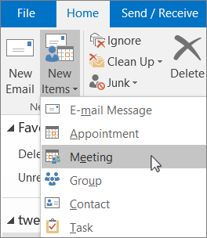
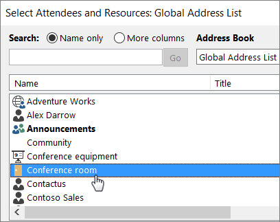
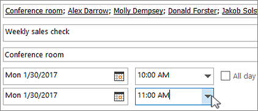
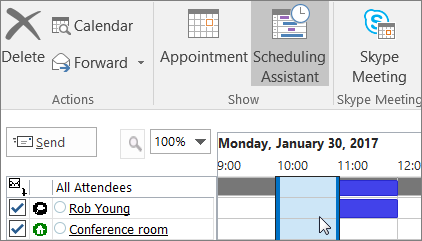
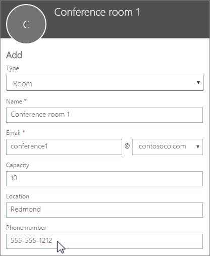

# Create Microsoft 365 room and equipment mailboxes

If you have a conference room, company car, or equipment that everyone needs to use, then you need to come up with a way to make those resources reservable to everyone. The best way to do that is to create a room or equipment mailbox in Microsoft 365 for each resource. You might create one for your first floor conference room, media equipment, or a moving truck.
  
Once you create a room or equipment mailbox, everyone in the company can reserve it for meetings or events using Outlook. Learn **how to use it** and **how to set it up** on the next two tabs. Here are some other common questions about room and equipment mailboxes.
  
## Use room and equipment mailboxes

To use room or equipment mailboxes, open Outlook from your computer or sign in to Outlook on the web. Schedule a new meeting and add the room or equipment to the meeting like you would when inviting other employees or customers. You've now reserved it.
  
1. Open **Outlook** on your computer.

2. On the **Home** tab, choose **New event**.

   

   Or, from your Calendar, just select **New Meeting**.
    
3. In the To field, type the name of the conference room or equipment you want to reserve, in addition to any attendees you'd like to invite.

   Or, select **To** then double-click the conference room or equipment from the list. Then select **OK**.

   
  
4. In the **Subject** line, type the purpose of the reservation or meeting. 
    
5. Change the **Location** value or leave as is. 
    
6. Change the **Start time** and **End time**. Or, select **All day event**. To make the meeting or reservation repeat, select **Recurrence** at the top.
 
   
  
7. Type a message describing the purpose and attach any files if needed.
    
8. To allow others to join online or call in to the meeting, select **Teams Meeting**.
    
9. To make sure the room, equipment, and people you've invited are available, select **Scheduling Assistant** at the top. Then select an available time in the calendar.

   

   > [!TIP]
   > In the scheduling calendar, blue means the room or equipment is reserved, or busy. Select the white, or free, area on the calendar. 
  
10. When finished, select **Send**.
    
## Set up room and equipment mailboxes

To set up a room or equipment mailbox, go to the <a href="https://go.microsoft.com/fwlink/p/?linkid=2024339" target="_blank">Microsoft 365 admin center</a>. (You'll need to have admin permission to do this.) Create the mailbox and let everyone know they can start reserving it for meetings and events.
  
1. In the admin center, go to the **Resources** \> [Rooms &amp; equipment](https://go.microsoft.com/fwlink/p/?linkid=2067334) page.
  
2. Select **+ Add resource**.
    
3. Fill out the room or equipment fields:

   
  
   - **Room** or **Equipment**: the type of mailbox you'd like to create.
    
   - **Name**: a friendly name or even short description.
    
   - **Email**: the email alias of the room or equipment. This is necessary to send a meeting request to the room or equipment.
    
   - **Capacity**: the number of people who can fit in the room or use the equipment at the same time.
    
   - **Location**: the room number or location of the room in a building or region.
    
   - **Phone number**: the number of the room itself. This is different from the meeting phone number generated when using Microsoft Teams.
    
4. Select **Save**.

> [!Note]
> To keep your room and equipment mailboxes secure, block sign-in to these mailboxes. For more information, see [Block sign-in for the shared mailbox account](/office365/admin/email/create-a-shared-mailbox#block-sign-in-for-the-shared-mailbox-account).

## Common questions about room and equipment mailboxes

### How can you tell when the room or equipment is available?

Open Outlook and create a new meeting. Add the room or equipment to the meeting as if it were a person and select **Scheduling Assistant** to see a live calendar view of the room or equipment's availability. If the hour slot is clear, it's available; if it's blue, it's reserved. 
  
### How do you cancel a room or equipment request?

Open the meeting you scheduled in Outlook and then remove the room or equipment from the meeting like you would an attendee. This will free up the room for others to reserve.
  
### Does someone have to accept or decline every room or equipment request?

No, you don't need someone to accept or decline requests. You can decide whether you want to let the room or equipment be automatically booked or managed by someone in your company. 
  
### Does a room mailbox or equipment mailbox need a product license?

No. While most people in your organization need a license to use Microsoft 365, you don't need to assign a license to a room mailbox or equipment mailbox, in case the resource mailbox doesn't need to have a size bigger than 50 GB, or, in case some features aren't needed (Retention policies from Security and Compliance, or, Hold from Exchange Online), or, in case the resource mailbox doesn't need an Online Archive attached to it.
  
### Do I need an owner in charge of booking the rooms or equipment?

 No, you don't need someone in charge of the room mailbox or equipment mailbox.
